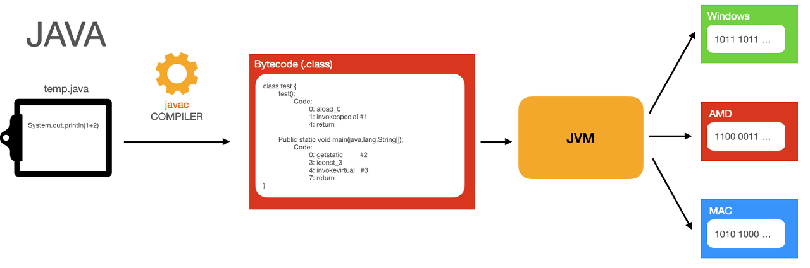

## 컴퓨터는 어떻게 고급 언어를 이해할까?

### 1. 고급 프로그래밍 언어?

고급 프로그래밍 언어는 개발자가 컴퓨터에 명령을 내리기 위해 사용하는 `인간 친화적인` 언어입니다. 이 언어들은 복잡한 알고리즘과 데이터 구조를 쉽게 표현할 수 있으며, 추상화된 명령어와 문법으로 개발자가 코드를 더 쉽게 이해하고 작성할 수 있도록 돕습니다. 이렇게 작성된 코드는 컴퓨터가 이해할 수 있는 기계어로 번역되어 실행됩니다.

고급 프로그래밍 언어는 개발자가 읽고 이해하기 쉽도록 설계 되었으며, 컴퓨터는 이를 기계어로 번역하여 실행합니다.

> **추상화된 명령어**: 이는 프로그램의 복잡한 부분을 숨기고, 사용자에게 간단하게 인터페이스를 제공하는 함수나 메서드를 말합니다. 예를 들어, "print()" 함수는 내부적으로 화면에 텍스트를 출력하는 복잡한 절차를 포함하고 있지만, 사용자는 이 함수를 호출함으로써 간단히 텍스트 출력을 요청할 수 있습니다.
> 
> 
> **추상화된 문법**: 프로그래밍 언어에서는 반복되는 코드를 간소화하는 구문을 제공하여 프로그래머가 더 간결하고 이해하기 쉬운 코드를 작성할 수 있도록 합니다. 예를 들어, 자바 8부터는 스트림 API를 사용하여 컬렉션을 더욱 간결하게 처리할 수 있습니다.
> 

### 2. 컴퓨터가 코드를 이해하는 방법?

컴퓨터는 고급 언어로 작성된 코드를 직접 이해할 수 없습니다. 대신, 작성된 코드는 컴파일러나 인터프리터를 통해 기계어로 변환되어야 합니다. 이 과정을 통해 컴퓨터는 프로그램을 실행할 수 있는 명령어 집합을 얻게 됩니다.

**자바의 컴파일 과정**

1. 개발자가 자바 소스 코드(**`temp.java`**)를 작성합니다.
2. 자바 컴파일러(**`javac`**)가 소스 파일을 바이트코드(**`.class`** 파일)로 컴파일합니다.
3. 자바 가상 머신(JVM)이 바이트코드를 각 운영 체제와 하드웨어에 맞는 기계어로 변환합니다.
4. 변환된 기계어 코드가 각각의 시스템(예: 윈도우, 맥, AMD)에서 실행됩니다.

### 3. 컴파일러와 인터프리터

| 구분 | 컴파일러 사용 언어 예시 | 인터프리터 사용 언어 예시 |
| --- | --- | --- |
| 처리 방식 | 소스 코드 전체를 먼저 기계어로 변환 | 소스 코드를 한 줄씩 읽으며 즉시 기계어로 변환 |
| 실행 속도 | 실행 전에 코드 전체를 컴파일하므로 실행 속도가 빠름 | 실행하면서 코드를 해석하므로 상대적으로 느릴 수 있음 |
| 개발 편의성 | 오류 발견이 컴파일 시에 주로 이루어짐 | 코드를 작성하고 바로 결과를 볼 수 있어 개발 및 디버깅이 편리 |
| 대표적 언어 | Java, C, C++ | JavaScript, Python, Ruby |

# 메모리 관리와 JVM의 방식

## 1. 컴퓨팅에서의 메모리

메모리는 컴퓨터에서 데이터를 임시 저장하는 공간으로, 시스템에 성능에 직접적인 영향을 미칩니다. 메모리 관리는 시스템의 효율성을 유지하기 위해 필수적이며, 이를 위해 가상 메모리, 페이징, 세그멘테이션 등의 기술이 사용됩니다.

## 2. 메모리에 할당해야 하는 용량보다 큰 데이터가 들어왔을때?

- **메모리 오버플로우 (Memory Overflow)**: 할당된 메모리 용량을 초과하여 데이터를 쓰려고 할 때, 다른 메모리 영역을 침범할 수 있습니다. 이때 데이터 손상이나 시스템의 불안정을 초래할 수 있습니다.
- **프로그램 크래시**: 메모리가 충분하지 않을 때, 시스템이나 프로그램이 예상치 못한 방식으로 종료될 수 있습니다.
- **성능 저하**: 메모리가 부족하면 시스템이 스왑 공간(swap space)을 사용하기 시작할 수 있습니다. 스왑은 데이터를 디스크와 메모리 간에 이동시키는 과정으로, 이는 상당히 느린 작업이므로 시스템의 전반적인 성능 저하를 가져올 수 있습니다

> 스왑 공간(swap space)은 컴퓨터 시스템에서 RAM(주 메모리)이 가득 찼을 때 사용되는 추가적인 메모리 공간입니다. 이 공간은 하드 드라이브 또는 SSD와 같은 보조 저장 장치에 설정됩니다. 주 메모리에 비해 접근 속도가 느립니다.
> 

## **3. 메모리 관리**

### **3.1 페이징**

페이징은 컴퓨터의 가상 메모리 시스템에서 사용되는 기술로, 가상 메모리를 동일한 크기의 작은 블록, 즉 '페이지'로 분할합니다. 운영 체제는 필요한 페이지만 물리적 메모리에 로드하고, 사용하지 않는 페이지는 스왑 공간으로 옮깁니다. 이 방법은 메모리 사용을 최적화하고, 프로세스 간 메모리 충돌을 방지하는 데 도움을 줍니다. 페이징은 메모리 관리를 효율적으로 하기 위해 사용되며, 프로세스에 필요한 메모리 일부만 물리적 메모리에 로드함으로써 전체 시스템의 성능을 개선할 수 있습니다.

### **3.2 세그멘테이션**

세그멘테이션은 메모리를 사용하는 또 다른 방법으로, 메모리를 서로 다른 크기의 블록, 즉 '세그먼트'로 나누는 기법입니다. 각 세그먼트는 특정 프로그램의 논리적 구조를 반영하며, 예를 들어 코드, 데이터, 스택 세그먼트로 구분됩니다. 이 방식은 각 세그먼트가 독립적인 주소 공간을 가지기 때문에, 프로그램의 보안과 효율적인 메모리 사용을 증진시킬 수 있습니다. 세그멘테이션은 페이징과 결합되어 사용될 때 효과적인 메모리 관리를 가능하게 합니다.

### **3.3 가상 메모리**

가상 메모리는 실제 메모리의 용량을 초과하는 데이터를 처리할 수 있도록 하는 시스템입니다. 이 기술은 실제 물리적 메모리보다 크게 보이는 메모리 영역을 생성하여, 스왑 공간을 활용합니다. 프로세스는 실제로 사용하는 메모리보다 더 큰 메모리를 사용하는 것처럼 작업할 수 있으며, 이는 멀티태스킹 환경에서 특히 유용합니다. 가상 메모리 시스템은 페이징 또는 세그멘테이션을 통해 데이터를 관리하며, 이는 시스템의 성능을 유지하고 메모리 사용을 최적화하는 데 기여합니다.

## **4. JVM의 메모리 관리**

### 4.1 JVM 메모리 구조

JVM(Java Virtual Machine)은 자바 애플리케이션의 효율적 실행을 위해 메모리를 여러 주요 구역으로 분할합니다. 각 영역은 특정 유형의 데이터를 저장하고 관리하는 데 최적화되어 있습니다.

- **힙(Heap):** 모든 자바 객체와 JRE 클래스의 인스턴스 데이터가 동적으로 할당되는 메모리의 주요 영역입니다. 힙은 더 세분화되어 Young Generation, Old Generation, 그리고 PermGen 또는 Metaspace(Java 8 이상) 영역으로 나뉩니다.
    
    > JRE(Java Runtime Environment) 클래스의 인스턴스 데이터는 자바 프로그램이 실행될 때 생성되는 데이터입니다. 이 데이터는 JRE에 포함된 클래스들의 객체 상태, 즉 필드 값들을 포함하며, 동적으로 힙 메모리에 저장됩니다. 예를 들어, **`String`** 클래스의 인스턴스는 해당 문자열의 실제 내용을 메모리에 저장하는 데이터입니다.
    > 
- **스택(Stack):** 각 스레드에 대해 별도로 할당되며, 스레드의 메소드 호출과 그 메소드 내의 지역 변수들을 저장합니다. 스택은 LIFO(Last In First Out) 방식으로 작동합니다.
- **메소드 영역(Method Area):** 모든 클래스 정보, 상수, 정적 변수, JIT 컴파일러에 의해 컴파일된 코드 등을 저장합니다. 이 영역은 종종 'PermGen' (영구 세대)으로 불리며, Java 8에서는 'Metaspace'로 대체되었습니다.
- **프로그램 카운터(Program Counter):** 현재 실행 중인 스레드의 JVM 명령 주소를 보관합니다. 이는 멀티스레딩 환경에서 각 스레드가 실행 중인 코드의 정확한 위치를 추적하는 데 필수적입니다.

### 4.2 가비지 컬렉션

가비지 컬렉션(Garbage Collection, GC)은 JVM에서 자동으로 메모리 관리를 수행하는 프로세스입니다. 가비지 컬렉터의 주요 목표는 사용되지 않는 객체들을 감지하고, 이를 메모리에서 해제하여 자원을 회수하는 것입니다. 이 과정은 다음과 같이 이루어집니다:

- **객체 할당:** 새 객체는 대부분 Young Generation 영역에 할당됩니다. 이 영역은 비교적 자주 가비지 컬렉션을 수행합니다.
- **객체 승격(Promotion):** Young Generation에서 살아남은 객체들은 Old Generation으로 이동됩니다. Old Generation은 메모리가 가득 찰 때까지 가비지 컬렉션이 덜 빈번하게 발생합니다.
- **가비지 컬렉션 실행:** 가비지 컬렉터는 참조되지 않는 객체들을 확인하고, 이들을 제거하여 메모리를 해제합니다. 주요 가비지 컬렉션 기술로는 Mark-and-Sweep, Generational GC 등이 있습니다.

> **Mark-and-Sweep 가비지 컬렉션**
> 
> 
> Mark-and-Sweep 가비지 컬렉션은 가장 기본적인 형태의 메모리 회수 기법 중 하나입니다. 이 과정은 두 단계로 나뉩니다:
> 
> 1. **Mark(표시) 단계:** 가비지 컬렉터는 모든 루트 집합(root set)에서 접근 가능한 객체를 찾아내어 표시합니다. 루트 집합은 스택, 정적 영역에 있는 객체들과 같이 직접 참조되는 객체들의 집합을 말합니다.
> 2. **Sweep(청소) 단계:** 표시되지 않은 객체들, 즉 접근할 수 없는 객체들을 메모리에서 제거합니다. 이러한 객체들은 더 이상 애플리케이션 코드에서 사용되지 않으므로 안전하게 메모리에서 해제될 수 있습니다.
> 
> 이 방법은 구현이 비교적 단순하지만, 가비지 컬렉션 동안 애플리케이션의 작업이 중단될 수 있는 단점이 있습니다(Stop-the-world).
> 
> **Generational 가비지 컬렉션**
> 
> Generational 가비지 컬렉션은 객체들을 세대별로 분류하여 관리하는 방식입니다. JVM은 객체의 수명 주기에 따라 메모리를 다음 세 가지 주요 영역으로 나눕니다:
> 
> 1. **Young Generation:** 신규로 생성된 객체들이 배치되는 영역입니다. 대부분의 객체는 생성 후 짧은 시간 내에 사용되지 않게 되므로, 이 영역은 자주 가비지 컬렉션을 수행합니다.
> 2. **Old Generation:** Young Generation에서 살아남은 객체들이 이동하는 곳입니다. 이 객체들은 비교적 오래 살아남았기 때문에, 가비지 컬렉션의 대상이 되는 빈도가 낮습니다.
> 3. **Permanent Generation 또는 Metaspace (Java 8 이상):** 클래스와 메소드의 메타 데이터를 저장하는 영역으로, 가비지 컬렉션의 대상이 될 수 있습니다.
> 
> Generational 가비지 컬렉션의 주요 장점은 가장 활발하게 가비지 컬렉션이 필요한 영역만을 대상으로 빈번하게 수행함으로써 전체 성능을 향상시킬 수 있다는 점입니다. 이는 더 효율적인 메모리 관리를 가능하게 하고, 애플리케이션의 반응성을 개선합니다.
> 

## 5. outOfMemory란 무엇일까요?

**`OutOfMemoryError`**는 자바 가상 머신(JVM)이 애플리케이션 실행 중에 필요한 메모리를 더 이상 할당할 수 없을 때 발생하는 오류입니다. 이 오류는 JVM이 운영 체제로부터 추가 메모리를 요청했지만 사용 가능한 메모리가 부족하여 할당받지 못했을 때 발생합니다. **`OutOfMemoryError`**는 주로 메모리 누수, 너무 큰 데이터 처리 요구, 또는 JVM 힙 크기 설정이 너무 작은 경우에 발생하며, 애플리케이션의 안정적인 실행을 방해하고 종종 시스템의 비정상 종료로 이어집니다.
