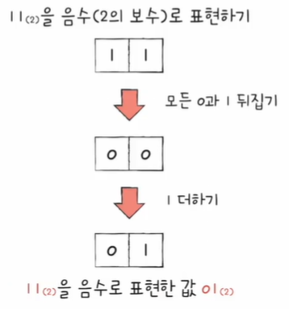
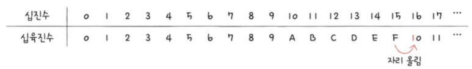
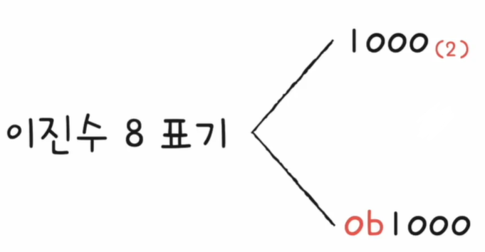
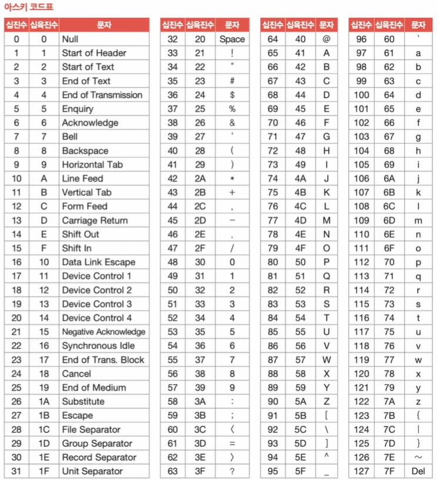

# 컴퓨터가 데이터를 처리하는 방법

인프런 강의 [<혼자 공부하는 컴퓨터 구조 + 운영체제>](https://www.inflearn.com/course/%ED%98%BC%EC%9E%90-%EA%B3%B5%EB%B6%80%ED%95%98%EB%8A%94-%EC%BB%B4%ED%93%A8%ED%84%B0%EA%B5%AC%EC%A1%B0-%EC%9A%B4%EC%98%81%EC%B2%B4%EC%A0%9C/dashboard) 를 바탕으로 정리한 내용입니다.
 
 
 
 
기본적으로 컴퓨터는 0과 1밖에 이해하지 못합니다.  
이러한 컴퓨터가 어떻게 수많은 데이터를 연산할 수 있는지에 대해 정리해 보았습니다.
 
 
 
우선 컴퓨터가 이해하는 0과 1은 비트(bit) 라고 하는 가장 작은 정보 단위입니다.  
즉, 컴퓨터의 프로그램은 수많은 비트로 이루어져 있다고 볼 수 있습니다.
 
 
이렇게 0과 1밖에 모르는 컴퓨터가 어떻게 데이터를 표현하는지에 대해 알아보겠습니다.
 
 
 
## 1. 0과 1로 숫자를 표현하는 방법
수학적으로 0과 1로 수를 표현하는 방법을 이진법(binary) 이라고 합니다.
 
 
이 이진법의 사용에 대해 알아보겠습니다.
 
 
### 1-1. 이진법
이진법이란 0과 1로 수를 표현하는 방법이며, 숫자가 1을 넘어가는 시점에 자리 올림을 합니다.  
이러한 이진법으로 표현한 수를 이진수라 합니다.
 
 
또한, 우리가 일상적으로 사용하는 방법은 숫자가 9를 넘어가는 시점에 자리 올림 하는 십진법(decimal) 입니다.
 
 

위의 그림은 양수를 이진수로 표현하고 있습니다.
 
 
그렇다면 이진수로 음수는 어떻게 표현할까요?  
0과 1로 음수를 표현하는 방법에는 다양한 방법이 있지만, 그중 가장 대표적으로 활용되는 방법이 2의 보수법입니다.
 
 
 
### 1 - 2. 2의 보수법
2의 보수법이란 어떤 수를 그보다 큰 2n 에서 뺀 값입니다.  
이를 쉽게 계산하자면, 모든 0과 1을 뒤집고, 끝에 1을 더하면 음수를 구할 수 있습니다.
 
 
아래의 그림에서는 이진수 11을 음수로 표현하고 있습니다.

 
 
이때 -11 을 표현하기 위한 01과 십진수 1을 표현하기 위한 01이 똑같은데 어떻게 구분할 수 있을까요?  
CPU는 내부에 있는 플래그 레지스터를 통해 이를 구분할 수 있습니다.

플래그에는 해당 숫자가 양수인지 음수인지 표기가 됩니다.  
즉, 모든 숫자는 이 플래그를 달고 다니게 되며, 이를 통해 양수인지 음수인지 구분할 수 있게 됩니다.
 
 
 
지금까지 이진법에 대해 알아보았는데, 이진법으로는 숫자의 길이가 너무 길어지게 됩니다.  
때문에 데이터를 표현할 때는 십육진법도 많이 사용되며, 십육진법에 대해 알아보겠습니다.
 
 
 
### 1 - 3. 16진법
16진법이란 숫자가 15를 넘어가는 시점에 자리 올림을 합니다.
 
 
아래의 그림과 같이 0 ~ 9 까지는 숫자로, 10 ~ 15 까지는 알파벳을 사용합니다.

 
 
이러한 16진법을 사용하는 이유에는 다양한 이유가 있지만, 가장 큰 이점은 2진수와 16진수 간의 변환이 쉬운 것입니다.
 
 
아래의 그림은 16진수를 2진수로 변환하는 그림입니다.

16진수로 표현된 숫자 하나를 2진수로 표현하면 4bit가 나오게 됩니다.  
때문에, 각각의 숫자를 떼어내서 붙여버리면 2진수가 완성됩니다.
 
 
위의 그림으로 예를 들자면, 1을 2진수 4개로 표현하면 0001 이고, A를 2진수 4개로 표현하면 1010 입니다.  
이를 그대로 붙이면 2진수가 되는 것입니다.
 
 
반대로 아래의 그림은 2진수를 16진수로 변환하는 그림입니다.

반대로 2진수 4개가 16진수 하나라고 볼 수 있습니다.
 
 
위의 그림으로 예를 들자면, 1101은 16진수로 D이고, 0101은 16진수로 5입니다.  
이를 그대로 붙이면 16진수가 되는 것입니다.
 
 
 
마무리로 위의 그림들을 보면 알 수 있지만, 2진수와 16진수의 표기법에 대해 알아보겠습니다.
 
 
 
### 1 - 4. 표기법
1000 이라고만 적으면 사실 이게 2진수인지 10진수인지 알기 어렵습니다.  
때문에 아래 첨자로 2나 16을 넣어 이 숫자가 2진수인지 16진수인지 표기할 수 있습니다.

 
 
 

## 2. 0과 1로 문자를 표현하는 방법
컴퓨터가 어떻게 문자를 이해하는지에 대해 알기 앞서, 다음의 용어에 대한 이해가 필요합니다.
 
 
#### * 문자 집합 (character set)
컴퓨터가 이해할 수 있는 문자의 모음입니다.
 
 
#### * 인코딩 (encoding)
문자를 0과 1로 이루어진 문자 코드로 변환하는 과정입니다.  
즉, 코드화하는 과정입니다.
 
 
#### * 디코딩 (decoding)
0과 1로 표현된 문자 코드를 문자로 변환하는 과정입니다.  
즉, 코드를 해석하는 과정입니다.
 
 
위의 용어에 기반하여 조금 더 자세히 알아보도록 하겠습니다.
 
 
### 2 - 1. ASCII 코드
가장 대중적인 문자 집합과 인코딩 방법에는 아스키코드가 있습니다.  
아스키코드는 알파벳, 아라비아 숫자, 일부 특수 문자 및 제어 문자를 표현하고 있는 문자 집합입니다.
 
 
기본적으로 아스키코드로 표현된 문자 하나를 표현하기 위해서는 7bit가 필요합니다.  
실제로는 8bit가 쓰이지만, 8bit 중 1bit는 오류 검출을 위해 사용되는 패리티 비트(parity bit)로 사용됩니다.
 
 
아래의 아스키코드표를 보면 각 문자가 아스키코드로 인코딩된 값을 볼 수 있습니다.

예를 들어, "A" 는 십진수 65로 인코딩된 값입니다.  
즉, 65를 0과 1로 표현된 이진수로 표현하면 컴퓨터가 이해하는 문자 "A" 가 되는 것입니다.
 
 
이렇게 문자에 부여된 값들을 그대로 인코딩 값으로 쓰면 되기 때문에, 인코딩 방식 자체는 아주 간단합니다.  
하지만, 한글을 포함한 다른 언어 문자와 다양한 특수 문자 표현이 불가합니다.
 
 
그 이유는 앞서 봤듯이 아스키코드는 7비트로 하나의 문자를 표현하기에 128개보다 많은 문자를 표현할 수가 없습니다.  
이후 8비트 확장 아스키(extended ASCII)가 등장하였지만, 여전히 모든 문자를 표현하기에는 부족합니다.
 
 
그래서 등장한 것이 언어별 인코딩 방식입니다.
 
 
 
우리는 대한민국 사람이기 때문에 기본적인 한글 인코딩 방식에 대해 알아보겠습니다.
 
 
먼저 한글 인코딩 방식에 대해 알기 전, 한글의 특징에 대해 간단하게 알아보고 가겠습니다.
 
 
한글은 알파벳을 이어쓰면 단어가 되는 영어와 달리 초성, 중성, 종성의 조합으로 이루어져 있습니다.  
때문에 한글 인코딩에는 완성형 인코딩 방식과 조합형 인코딩 방식이 존재합니다.
 
 
아래의 예시를 살펴보면, 이름 그대로 완성된 글자 하나에 코드를 부여하는 완성형 방식과, 자음 모음에 각각 코드를 부여하는 조합형 방식입니다.

 
 

### 2 - 2. EUC-KR
한글 인코딩 방식에는 대표적으로 KS X 1001 KS X 1003 문자 집합 기반의 방식이 있습니다.  
이는 완성형 인코딩 방식이며, 글자 하나에 2byte 크기의 코드를 부여합니다.
 
 
아래의 EUC-KR 표를 보면 각 글자의 인코딩된 값을 볼 수 있습니다.

예를 들어, "가" 는 b0a1 이며, 마찬가지로 "거" 는 b0c5 로 인코딩 된다고 볼 수 있습니다.
 
 
이때 b0a1 로 인코딩된 값을 Hex String 이라 하며, 이를 이진수로 변환(1011000010100001) 하면 컴퓨터가 알아들을 수 있게 되는 것입니다.
 
 
이러한 EUC-KR 은 2,300여 개의 한글 표현이 가능하지만, 여전히 모든 한글을 표현하기에는 부족한 수입니다.  
또한, 쀏, 뙠, 휔 같은 한글을 표현할 수 없습니다.
 
 
또 하나의 문제점은 언어별 인코딩을 국가마다 하게 되면, 다국어를 지원하는 프로그램을 개발할 때엔 모든 언어별 인코딩 방식을 이해해야 합니다.
 
 
이러한 불편함을 해결하고자 나온 것이 유니코드 문자 집합입니다.
 
 
 
### 2 - 3. 유니코드
유니코드란 통일된 문자 집합으로 한글, 영어, 특수 문자 그리고 이모티콘까지 모두 표현할 수 있습니다.
 
 
유니코드에는 아래와 같이 U+와 16진수 값 4개의 형식으로 이루어져 있습니다.

U+ 는 16진수를 나타내기 위함이고, 16진수 값들이 실제 부여된 값이며 이를 유니코드 코드 포인트라 합니다.  
이 코드 포인트를 다양한 방식으로 인코딩하게 되며, 이러한 다양한 인코딩 방식에는 UTF-8, UTF-16, UTF-32 등이 있습니다.
 
 
UTF 뒤의 숫자는 한 문자를 인코딩하는 길이로, UTF-8은 유니코드 문자를 8bit 값으로 인코딩함을 의미합니다.
 
 
이러한 유니코드 인코딩 방식 중에 가장 많이 사용되는 방식은 UTF-8 입니다.
 
 
이 UTF-8 인코딩 방식은 가변 길이 인코딩으로, 인코딩 결과가 1 byte에서 4byte 까지 있습니다.  
이렇게 인코딩 결과가 몇 byte가 될지는 유니코드에 부여된 값에 따라 다릅니다.
