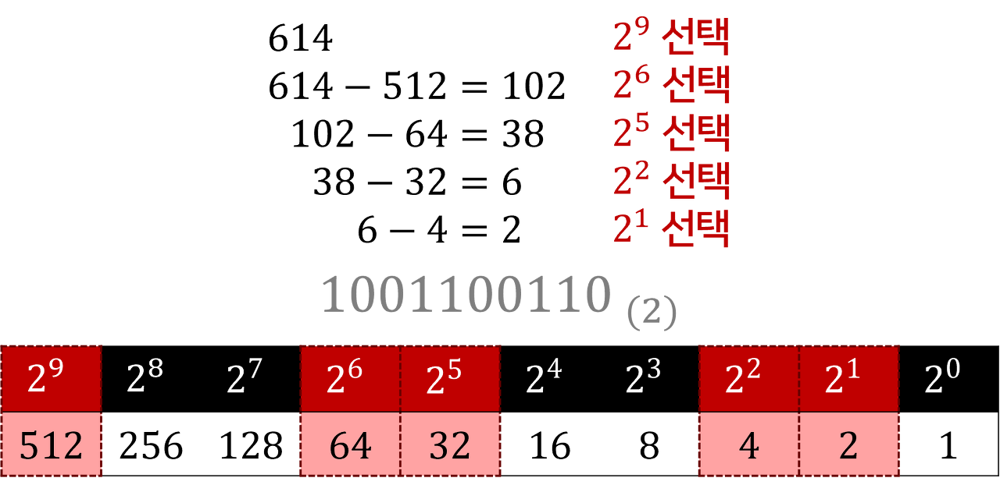
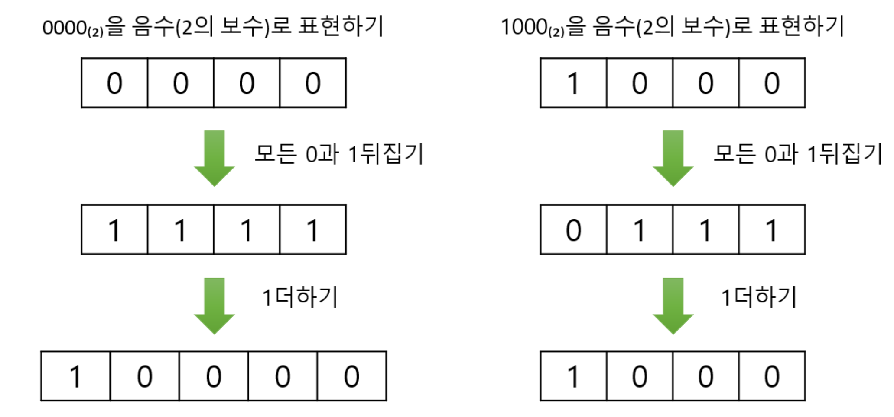

# 0과 1로 숫자를 표현하는 방법

## 1. 왜 컴퓨터는 0과 1만 사용하게 되었을까??

흔히 쓰는 십진법을 컴퓨터에 쓰지 않는 이유는 간단합니다. 인간은 숫자 3과 4를 쉽게 인지하지만, 컴퓨터의 전기장치는 신호의 세기를 구분하는 것을 어려워 하기 때문입니다. 컴퓨터의 연산 속도는 인간 과 비교할 수 없을 정도로 빠르지만, 이 숫자 신호를 판단하는 데 너무 많은 자원을 소모하기 때문에 신호를 `**없음**` 또는 `**있음**` 딱 두 가지로 줄여서 각각 0과 1로 명령을 내리는 편이 컴퓨터에 훨씬 부담이 적고 효율적이기 때문에 컴퓨터는 0과 1만 사용하게 되었습니다.

## 2. 정보의 단위

### **비트 (bit) - 📊**

비트는 디지털 데이터의 가장 기본적이고 작은 단위로, 0 또는 1의 두 가지 상태만을 가집니다. 이는 디지털 세계에서 정보를 표현하는 가장 간단한 형태로, 모든 데이터 처리의 기본이 됩니다.

### **바이트 (byte) - 💾**

바이트는 8개의 비트로 구성되며, 컴퓨터 데이터 저장의 기본 단위입니다. 문자 하나를 표현하는 데 일반적으로 한 바이트가 사용됩니다.

### **킬로바이트 (kilobyte, KB) - 🗂️**

킬로바이트는 약 1,000 바이트로, 작은 텍스트 파일이나 소규모의 웹 페이지를 저장하는 데 충분한 데이터 양입니다. 문서 파일이나 이미지 파일의 크기를 나타낼 때 자주 사용됩니다.

### **메가바이트 (megabyte, MB) - 📀**

메가바이트는 약 1,000 킬로바이트입니다. 디지털 사진, 비디오 파일의 초반 부분, 소프트웨어 설치 패키지 등을 저장하는데 적합한 크기입니다.

### **기가바이트 (gigabyte, GB) - 💽**

기가바이트는 약 1,000 메가바이트입니다. 대용량 소프트웨어, 영화 한 편, 수백 개의 음악 파일을 저장할 수 있는 넉넉한 공간을 제공합니다.

### **테라바이트 (terabyte, TB) - 🖥️**

테라바이트는 약 1,000 기가바이트입니다. 대규모 데이터베이스, 광범위한 멀티미디어 컬렉션, 여러 테라바이트 크기의 영화 라이브러리 저장에 사용됩니다.

### **페타바이트 (petabyte, PB) - 🏢 (큰 데이터 센터를 상징)**

페타바이트는 약 1,000 테라바이트입니다. 대형 데이터 센터에서 운용되는 막대한 양의 정보를 저장하기에 적합하며, 매우 큰 스케일의 데이터 분석과 처리에 사용됩니다.

### **엑사바이트 (exabyte, EB) - 🌐**

엑사바이트는 약 1,000 페타바이트입니다. 인터넷 전체의 데이터 규모와 비슷하며, 전 세계적으로 생성되는 엄청난 양의 데이터를 상징합니다. 대규모 클라우드 스토리지 서비스에서 이 정도 크기의 데이터를 다룹니다. 

## **3. 워드(Word)란?**

워드는 컴퓨터 CPU가 한 번에 처리할 수 있는 데이터의 크기를 의미합니다.

### **워드의 크기**

- **32비트 시스템**: 워드 크기는 32비트, 즉 4바이트입니다.
- **64비트 시스템**: 워드 크기는 64비트, 즉 8바이트입니다.

### **워드 단위의 데이터 처리**

- 프로세서는 워드 단위로 데이터를 처리합니다. 프로그래밍할 때는 이러한 워드의 경계를 고려하여 데이터를 관리해야 할 필요가 있습니다. 예를 들어, 데이터가 워드 크기에 정확히 맞지 않을 경우, 추가적인 메모리 조정(패딩)이 필요할 수 있습니다.

> 메모리 조정(패딩)은 프로그래밍과 데이터 저장에서 중요한 개념으로, 데이터를 특정 크기의 메모리 경계에 맞추기 위해 추가적인 비트나 바이트를 삽입하는 과정을 말합니다. 이 과정은 데이터의 정렬을 최적화하고, 메모리 접근 속도를 향상시키며, 프로세서가 효율적으로 작업을 수행할 수 있도록 돕습니다.
> 

### **워드 관련 용어**

- **하프워드(Halfword)**: 워드의 절반 크기를 의미합니다.
- **풀워드(Fullword)**: 표준 워드 크기를 의미합니다.
- **더블워드(Doubleword)**: 워드의 두 배 크기를 의미합니다.

## 4. 이진법

수학에서 0과 1만으로 숫자를 표현하는 방법입니다. 이진법을 이용하면 1보다 큰 수도 0과 1만으로 표현할 수 있습니다. 각 자릿수는 2의 거듭제곱을 나타내며, 이진수의 가장 오른쪽 자리는 2^0, 그 다음 자리는 2^1과 같이 증가합니다. 

### 이진법을 십진법으로 변환하기

이진법에서 십진법으로 숫자를 변환하는 과정은 각 자릿수의 값(0 또는 1)에 해당 자리의 2의 거듭제곱 값을 곱한 후, 그 결과들을 모두 더하는 것입니다.

### 십진법을 이진법으로 변환하기

십진법에서 이진법으로 숫자를 변환하는 방법은 주어진 십진수를 2로 나누면서 나머지를 기록하는 과정을 반복하는 것입니다. 이 과정은 나눗셈의 결과가 0이 될 때까지 계속됩니다. 마지막에 기록된 나머지를 역순으로 읽으면 그것이 변환된 이진수입니다.

## 5. 이진법의 음수 표현

0과 1로만으로 이루이진 이진법으로 음수를 표현하는 방법 중 가장 널리 사용되는 방법의 2의 보수를 구해 이 값을 음수로 간주하는 방법입니다. 실제로 이진수만 봐서는 음수인지 양수인지 구분하기 어렵기 때문에 플래그를 사용합니다.

### 2의 보수 계산하기

주어진 이진수의 모든 비트를 반대로 뒤집고(즉, 0은 1로, 1은 0으로 바꿈), 그 결과에 1을 더하면 됩니다. 이렇게 해서 얻은 값이 해당 이진수의 2의 보수입니다.

### 2의 보수의 한계

- **자리 올림 발생 시 비트 버림**: 2의 보수에서는 덧셈 연산 중 가장 높은 자리에서 자리올림(carry)이 발생하면 그 비트를 버립니다. 이 자리 올림 비트는 오버플로를 나타내기도 하지만, 계산에서 이 비트를 무시함으로써 잘못된 결과를 초래할 수 있습니다.
- $2^n$ **보수를 취하면 자기 자신이 되는 문제:** 음수의 절대값을 양수로 변환하려 할 때 제대로 된 값을 얻을 수 없습니다.

## **6. 십육진법**

십육진법, 또는 16진수는 숫자를 표현하기 위해 0부터 9까지의 숫자와 A부터 F까지의 문자를 사용하는 체계입니다. 

### 2진수를 더 간결하게 표현할 수 있는 장점

- 10진수 65를 예로 들어보겠습니다.
- 65는 2진수로 변환하면 **`0100 0001`**입니다.
- 이 2진수를 십육진법으로 표현하면 **`0x41`**이 됩니다.
- 코드상에서 16진수임을 표현하기 위해 **`0x`** 를 붙입니다.

### **이진법을 십육진법으로 변환하기**

이진수를 4비트씩 묶어 각 그룹을 해당하는 십육진수 값으로 치환하는 방법을 사용합니다. 이는 각 4비트 그룹이 0부터 15까지의 값을 나타낼 수 있기 때문에 십육진수 한 자리와 직접 대응됩니다.

### 변환 과정:

1. 이진수를 오른쪽에서 왼쪽으로 4비트씩 묶습니다. 만약 이진수의 길이가 4의 배수가 아니라면, 왼쪽에 0을 추가하여 길이를 맞춥니다.
2. 각 4비트 그룹을 해당하는 십육진수 값으로 치환합니다. (예: 0100-> 4, 0001-> 1)
3. 모든 그룹을 치환한 후, 이들을 연결하여 최종 십육진수 값을 얻습니다.

**예시**: 이진수 **`01000001`**을 십육진법으로 변환하면,

- 각 그룹을 십육진수로 변환합니다: 0100 -> 4, 0001 -> 1
- 결과적으로, **`01000001`**의 십육진수 표현은 **`0x41`**입니다.

### **십육진법을 이진법으로 변환하기**

십육진법에서 이진법으로의 변환은 각 16진수 자리수를 해당하는 4비트 이진수로 변환함으로써 이루어집니다. 십육진수의 각 자릿수(0-9 및 A-F)는 고유한 4비트 이진 패턴을 가지고 있습니다.

### 변환 과정:

1. 각 16진수 자릿수를 해당하는 4비트 이진수로 치환합니다.
2. 모든 16진수 자릿수를 변환한 후, 이진수 패턴을 연결합니다.

**예시**: 십육진수 **`0x41`**을 이진법으로 변환하면,

- 4 -> 0100, 1 -> 0001
- 결과적으로, **`0x41`**-> **`0100 0001`**

# 0과 1로 문자를 표현하는 방법

## **1. 문자 집합과 인코딩**

### **문자 집합**

컴퓨터가 인식하고 표현할 수 있는 문자의 모음을 '문자 집합'이라고 합니다. 컴퓨터는 문자 집합에 속한 문자만 이해하며, 이러한 문자들을 0과 1의 이진수로 변환해야만 컴퓨터가 처리할 수 있습니다.

### **문자 인코딩**

문자 인코딩은 컴퓨터가 이해할 수 있도록 문자 집합의 문자를 이진수로 변환시키는 과정입니다. 이 과정을 통해 문자 데이터가 컴퓨터 시스템 내에서 저장, 전송, 처리될 수 있습니다.

### **문자 디코딩**

문자 디코딩은 인코딩된 이진수를 다시 사람이 이해할 수 있는 문자로 변환하는 과정입니다. 이는 인코딩의 반대 과정으로, 컴퓨터에 저장되거나 전송된 데이터를 사람이 읽을 수 있는 형태로 복원합니다.

## **2. 아스키 코드**

아스키 코드는 초창기 문자 집합 중 하나로, 영어 알파벳, 아라비아 숫자, 일부 특수 문자를 포함하여 총 128개의 문자를 표현할 수 있습니다. 문자 하나를 표현하기 위해 8비트를 사용하지만 실제로는 7비트만 사용하며, 남은 1비트는 오류 검출을 위한 패리티 비트로 사용됩니다. 나중에 확장 아스키 코드가 등장하여 256개의 문자를 표현할 수 있게 되었습니다.

## **3. 한글 인코딩**

### **완성형 인코딩**

완성형 인코딩은 초성, 중성, 종성의 조합으로 이루어진 완성된 하나의 글자에 고유한 코드를 부여하는 방식입니다. 이는 각 한글 글자가 독립적인 코드 값을 갖게 됩니다.

### **조합형 인코딩**

조합형 인코딩은 한글을 초성, 중성, 종성 각각을 위한 비트열을 할당하고 이를 조합하여 하나의 글자 코드를 완성하는 방식입니다.

### **EUC-KR**

EUC-KR은 완성형 인코딩 방식을 사용하며, 2바이트 크기의 코드를 부여하여 약 2,350개의 한글 단어를 표현할 수 있습니다. 이 인코딩으로는 모든 한글을 표현할 수 없습니다.

### **CP949**

CP949는 EUC-KR의 확장 버전으로, 더 다양한 문자를 표현할 수 있으나 여전히 한글 전체를 표현하기에는 부족합니다.

## **4. 유니코드와 UTF-8**

### **유니코드**

유니코드는 전 세계의 다양한 문자 집합을 하나로 통합하기 위해 개발된 국제 표준입니다. 대부분의 나라의 문자, 특수 문자, 화살표, 이모티콘까지 수용할 수 있으며, 현대 문자를 표현할 때 가장 많이 사용됩니다. 각 문자에는 고유한 값이 부여되며, 이 값은 다양한 방법으로 인코딩됩니다.

### **UTF-8, UTF-16, UTF-32**

UTF-8, UTF-16, UTF-32는 유니코드 문자를 인코딩하는 데 사용되는 서로 다른 방식입니다. UTF-8은 가장 널리 사용되며, 문자에 따라 1~4바이트의 가변 길이를 사용합니다. UTF-16과 UTF-32는 각각 2바이트 또는 4바이트 고정 길이를 사용하여 문자를 인코딩합니다.

# 출처

- **번외. 10진수와 2진수 간 변환하기 -** https://blog.hexabrain.net/357
- 16진수 - https://june-17.tistory.com/209
