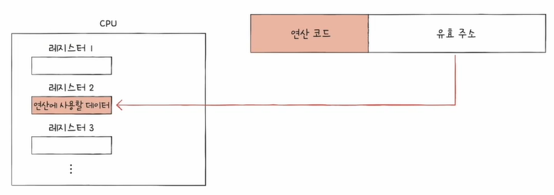

# 명령어의 구조

인프런 강의 [<혼자 공부하는 컴퓨터 구조 + 운영체제>](https://www.inflearn.com/course/%ED%98%BC%EC%9E%90-%EA%B3%B5%EB%B6%80%ED%95%98%EB%8A%94-%EC%BB%B4%ED%93%A8%ED%84%B0%EA%B5%AC%EC%A1%B0-%EC%9A%B4%EC%98%81%EC%B2%B4%EC%A0%9C/dashboard) 를 바탕으로 정리한 내용입니다.
 
 
 
 
****"무엇을 수행하라. 무엇을 대상으로"****  
명령어의 구조는 위와 같은 문장으로 설명할 수 있습니다.
 
 
즉, 수행할 연산과 연산에 사용될 데이터(데이터가 저장된 위치) 로 이루어져 있습니다.
 
 
이를 일반적으로 연산 코드와 오퍼랜드로 표현합니다.
 
 
## 1. 연산 코드
연산 코드는 수행할 연산을 담고 있고, CPU마다 연산 코드의 종류와 생김새가 다른 것이 특징입니다.
 
 
아래는 공통적인 연산 코드입니다. 이러한 유형이 있다 정도로만 보고 넘어가겠습니다.
 
 
### 1 - 1. 데이터 전송
* MOVE: 데이터를 옮겨라  
* STORE: 메모리에 저장하라  
* LOAD(FETCH): 메모리에서 CPU로 데이터를 가져와라  
* PUSH: 스택에 데이터를 저장하라  
* POP: 스택의 최상단 데이터를 가져와라
 

### 1 - 2. 산술/논리 연산
* ADD / SUBTRACT / MULTIPLY / DIVIDE: 덧셈 / 뺄셈 / 곱셈 / 나눗셈  
* INCREMENT / DECREMENT: 오퍼랜드에 1을 더하라 / 오퍼랜드에 1을 빼라  
* AND / OR / NOT: 해당 연산을 수행하라  
* COMPARE: 두 개의 숫자 또는 TRUE / FALSE 값을 비교하라
 

### 1 - 3. 제어 흐름 변경
* JUMP: 특정 메모리 주소로 실행 순서를 옮겨라  
* CONDITIONAL JUMP: 조건에 부합할 때 특정 주소로 실행 순서를 옮겨라  
* HALT: 프로그램의 실행을 멈춰라  
* CALL: 되돌아올 주소를 저장한 채 특정 주소로 실행 순서를 옮겨라  
* RETURN: CALL을 호출할 때 저장했던 주소로 돌아가라
 

### 1 - 4. 입출력 제어
* READ (INPUT): 특정 입출력 장치로부터 데이터를 읽어라  
* WRITE (OUTPUT): 특정 입출력 장치로 데이터를 써라  
* START IO: 입출력 장치를 시작하라  
* TEST IO: 입출력 장치의 상태를 확인하라
 
 

## 2. 오퍼랜드
오퍼랜드는 연산에 사용될 데이터 또는 연산에 사용될 데이터가 저장된 위치를 담고 있습니다.
 
 
또한 오퍼랜드의 개수는 하나도 없을 수도 있고, 여러 개 일 수도 있습니다.  
개수에 따라 0 주소 명령어, 1 주소 명령어 등으로 부릅니다.
 
 
오퍼랜드에는 두 가지가 담긴다고 하였지만, 그중 데이터가 저장된 위치를 더 많이 저장하게 됩니다.  
때문에 오퍼랜드가 담기는 공간, 즉 오퍼랜드 필드를 주소 필드라고 부르기도 합니다.
 
 
데이터가 아닌 데이터가 저장된 위치를 저장하는 이유는, 명령어 내에서 표현할 수 있는 데이터의 크기가 제한되기 때문입니다. 

예를 들어 명령어의 크기가 16bit이고, 연산 코드에 사용되는 비트가 4bit이며, 오퍼랜드가 3개라고 가정을 해보겠습니다.  
이때 각각의 오퍼랜드는 4bit만을 가질 수 있습니다. 즉, 데이터의 크기는 2의 4승입니다.
 
 
이러한 상황에서 데이터가 아닌 데이터의 주소를 입력하게 되면 표현할 수 있는 데이터의 크기가 커지게 됩니다.  

이렇게 연산에 사용될 데이터가 저장된 위치를 유효 주소(effective address)라고 합니다.  
또 연산에 사용될 데이터가 저장된 위치를 찾는 방법을 명령어 주소 지정 방식(addressing modes)이라고 합니다.  
즉, 유효 주소를 찾는 방법이며 여기에는 다양한 방식들이 존재합니다.
 
 
### 2 -1. 명령어 주소 지정 방식
* #### 즉시 주소 지정 방식 (immediate addressing mode)

연산에 사용할 데이터를 오퍼랜드 필드에 명시하는 방식입니다.  
가장 간단한 형태의 주조 지정 방식이며, 연산에 사용될 데이터의 크기가 제한되지만 빠른 것이 특징입니다.
 
 
* #### 직접 주소 지정 방식 (direct addressing mode)

유효 주소를 오퍼랜드 필드에 명시하는 방식입니다.  
이 방식은 유효 주소를 표현할 수 있는 크기가 연산 코드만큼 줄어들 수 있습니다.
 
 
* #### 간접 주소 지정 방식 (indirect addressing mode)

유효 주소의 주소를 오퍼랜드 필드에 명시하는 방식입니다.  
앞선 주소 지정 방식들의 문제점을 해결할 수는 있으나 속도가 느린 것이 단점입니다.
 
 
* #### 레지스터 주소 지정 방식 (register addressing mode)

연산에 사용할 데이터가 저장된 레지스터를 오퍼랜드 필드에 명시하는 방식입니다.  
메모리에 접근하는 속도보다 레지스터에 접근하는 것이 빠르기 때문에 속도 면에서 이점입니다.
 
 
* #### 레지스터 간접 주소 지정 방식 (register indirect addressing mode)

연산에 사용될 데이터를 메모리에 저장하고, 해당 주소를 저장한 레지스터를 오퍼랜드 필드에 명시하는 방식입니다.  
메모리의 어떤 위치에도 접근할 수 있기 때문에 더 유연한 데이터 접근을 가능하게 하지만, 레지스터 주소 지정 방식에 비해 속도가 느린 것이 단점입니다.
 
