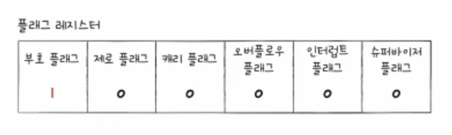
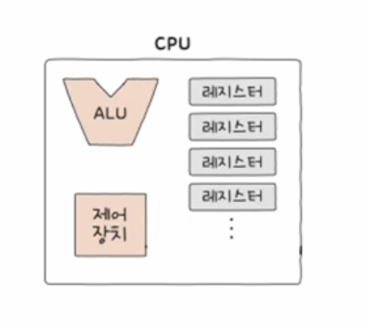

# ALU

- 계산하는 장치, 계산기 같은 회로
- ALU 는 계산에 필요한 것들을 전달 받음
- ALU 가 전달 받는 것 : 피연산자, 제어신호
- ALU 가 전달 하는 것 : (연산 후) 결과 값, 추가적인 정보 ( 플래그, 오버플로우 등)
- 플래그?

  이진수로 음수, 양수 구분 어려움 → 음수와 양수를 구분하기 위해 플래그 사용

- 오버플로우?

  연산 결과가 연산 결과를 담을 레지스터보다 큰 상황

# **정리**

- ALU  는 레지스터와 제어장치로부터 받아들인 피연산자의 제어신호로 산술 연산, 논리 연산 등 다양한 연산을 수행
- 연산 수행한 결과는 메모리에 저장되지 않고 일시적으로 레지스터에 저장

---

# 플래그

- 부호 플래그 : 연산한 결과의 부호를 나타냄 (1 : 음수, 0 : 양수)
- 제로 플래그 : 연산 결과가 0인지 여부를 나타냄 (1 : 연산결과 0, 0: 연산결과 0 아님)
- 캐리 플래그 : 연산 결과 올림수나 빌림수가 발생했는지를 나타냄 (1 : 발생했음, 0 : 발생하지 않음)
- 오버플로우 플래그 : 오버플로우 발생 여부를 나타냄 (1 : 발생했음, 0 : 발생하지 않음)
- 인터럽트 플래그 : 인터럽트가 가능한지를 나타냄 (1 : 인터럽트 가능, 0 : 인터럽트 불가능)
- 슈퍼바이저 플래그 : 커널 모드로 실행 중인지, 사용자 모드로 실행 중인지 나타냄 (1 : 커널 모드, 0 : 사용자 모드)
- 플래그 레지스터에 저장됨

---

# 제어장치

- 제어장치 : 제어신호를 발생시키고 명령어 해석
- 제어신호 : 컴퓨터 부품들을 관리하고 작동시키기 위한 일종의 전기 신호

# 제어장치가 받아들이는 정보

## 1. 클럭 신호
- 클럭 : 컴퓨터의 모든 부품을 일사불란하게 움직일 수 있게 하는 시간 단위
- 주기에 맞춰 레지스터에서 다른 레지스터로 데이터 이동, ALU 에서 연산 수행 등
- 하나의 명령어가 여러 클럭에 걸쳐 실행될 수 있음

## 2. 해석해야 할 명령어
- CPU 가 해석해야 할 명령어는 명령어 레지스터에 저장됨
- 제어장치는 이 명령어 레지스터로부터 해석할 명령어 받고 해석 후 제어신호를 발생시켜 컴퓨터 부품들에 수행할 내용 알려줌
## 3. 플래그 값
- 제어장치는 ALU 연산에 대한 추가적인 상태 정보인 플래그 값을 받아들이고 이를 참고해서 제어신호를 발생시킴
## 4. 제어버스로 전달된 제어신호를 받아들임
- CPU 뿐만 아니라 입출력장치와 같은 CPU 외부 장치도 발생시킬 수 있음
- 제어장치는 제어버스를 통해 외부로부터 전달된 제어신호를 받아들임

# 제어신호가 내보내는 정보

## 1. CPU 외부에 전달하는 제어신호
- 제어버스로 제어신호를 내보내는 것
- 메모리에 전달하는 제어신호, 입출력장치에 전달하는 제어신호 등
- 메모리 전달 제어신호 : 메모리에 저장된 값을 읽거나 새로운 값을 쓰고 싶을 때
- 입출력장치 전달 제어신호 : 입출력장치의 값을 읽거나 새로운 값을 쓰고  싶을 때
## 2. CPU 내부에 전달하는 제어신호
- ALU 에 전달하는 제어 신호, 제어신호와 레지스터에 전달하는 제어신호 등
- ALU 전달 제어신호 : 수행할 연산을 지시 목적 등
- 레지스터 전달 제어신호 : 레지스터에서  레지스터 간에 데이터 이동, 레지스터에 저장된 명령어 해석 목적 등

---

# 레지스터

- 레지스터 : CPU 내부의 작은 임시저장장치
- 프로그램 속 명령어 & 데이터는 실행 전후로 레지스터에 저장됨 → 프로그램 실행 흐름 파악 가능

# 반드시 알아야 하는 레지스터

## 1. 프로그램 카운터
- 메모리에서 가져올 명령어 주소 → 메모리에서 읽어 들일 명령어의 주소 저장
- 명령어 포인터라고 부르는 CPU 도 있음
## 2. 명령어 레지스터
- 해석할 명령어 → 방금 메모리에서 읽어들인 명령어를 저장하는 레지스터
- 명령어 레지스터 속 명령어를 받아들이고 이를 해석한 뒤 제어신호를 내보냄
## 3. 메모리 주소 레지스터
- 메모리의 주소를 저장하는 레지스터
- CPU 가 읽어들이고자 하는 주소 값을 주소 버스로 보낼 때 메모리 주소 레지스터를 거치게 됨
## 4. 메모리 버퍼 레지스터
- 메모리와 주고받을 값(데이터, 명령어) 저장하는 레지스터
- 메모리에 쓰고 싶은 값이나 메모리로부터 전달받은 값은 메모리 버퍼 레지스터를 거쳐감 → 데이터 버스 이용
## 5. 플래그 레지스터
- 연산 결과 또는 CPU 상태에 대한 부가적인 정보를 저장
## 6. 범용 레지스터
- 일반적인 상황에서 자유롭게 사용 가능
- 데이터와 주소를 모두 저장 할 수 있음
## 7. 스택 포인터
- 스택 최상단의 위치 저장
- 설명 : 스택 포인터(Stack Pointer)는 스택의 가장 위쪽 데이터의 위치를 가리키며, 데이터의 삽입 및 삭제는 스택 포인터를 이용하여 수행됩니다.데이터를 삽입할 때는 스택 포인터를 먼저 증가시킨 다음, 그 위치에 데이터를 저장합니다.데이터를 삭제할 때는 스택 포인터를 먼저 감소시킨 다음, 그 위치에 있는 데이터를 반환하거나 삭제합니다.스택의 맨 위에 있는 데이터를 가리키기 때문에, 스택이 비어있을 때는 스택 포인터는 스택의 가장 아래쪽 주소를 가리키고 있습니다.스택 포인터는 일반적으로 하드웨어 레지스터에 저장되며, 프로세서가 스택 연산 명령을 실행할 때마다 스택 포인터가 자동으로 증가하거나 감소합니다.
    

  출처:

  https://futurecatlabs.store/680

  [Future Cat LABs:티스토리]

## 8. 베이스 레지스터
- 메모리 주소를 참조할 때 기준이 되는 주소를 저장하는 역할

---

# 스택 주소 지정 방식

- 스택과 스택 포인터를 이용한 주소 지정 방식
- 스택은 메모리 안에 존재
- 메모리 안에 스택처럼 사용할 영역이 정해져 있고, → 스택영역
- 다른 주소 공간과는 다르게 스택처럼 사용하기로 약속된 영역

# 변위 주소 지정 방식

- 명령어 = 연산 코드 + 오퍼랜드 (오퍼랜드에 주소가 담기기도 …)
- 변위 주소 지정 방식을 사용하는 명령어 = 연산코드 + 레지스터 + 오퍼랜드
- 변위 주소 지정 방식은 오퍼랜드 필드의 주소와 어떤 레지스터를 더하는지에 따라 상대 주소 지정 방식, 베이스 레지스터 주소 지정 방식 등으로 나뉨

# 상대 주소 지정 방식

- 프로그램 카운터 : 컴퓨터의 CPU에 있는 레지스터 중 하나로, 컴퓨터가 다음에 실행할 명령어의 메모리 주소를 가리킴 → 읽어들일 명령어의 주소 저장
- 오퍼랜드와 프로그램 카운터의 값을 더하여 유효 주소를 얻는 방식
- 예시 : 오퍼랜드에 -3이 들어있다면 원래 실행하려는 명령어의 세 칸 이전 번지 명령어 실행 → (실행할 명령어 - 3) 번지

# 베이스 레지스터 주소 지정 방식

- 오퍼랜드와 베이스 레지스터의 값을 더하여 유효 주소를 얻는 방식
- 베이스 레지스터 속 기준 주소로부터 얼마나 떨어져 있는 주소에 접근할 것인지를 연산하여 유효 주소를 얻어내는 방식
- 예시 : 베이스 레지스터에 200, 오퍼랜드에 50 이라면 → 기준 주소 200번지로부터 50만큼 떨어진 250번지로 접근하라는 뜻

---

# 명령어 사이클

- 명령어를 처리하는 정형화된 흐름
- 프로그램 속 각각의 명령어들은 일정한 주기가 반복되며 실행됨 → 이 주기를 명령어  사이클이라고 함
- 첫 번째 명령어 사이클 과정 : 명령어를 메모리에서 CPU 로 가져와야함 (인출 사이클)
- 두 번째 명령어 사이클 과정 : 명령어 실행 (실행 사이클) → 제어장치가 명령어 레지스터에 담긴 값을 해석하고, 제어신호를 발생시키는 단계
- 인출과 실행 사이클 반복하며 실행됨
- 간접 사이클 : 간접 주소 지정 방식처럼, 실행 과정에서 명령어의 주소가 다시 다른 주소를 참조해야할 떄 사용 됨

# 인터럽트

- CPU 는 정해진 흐름에 따라 명령어를 처리하지만, 간혹 CPU의 작업을 방해하는 신호를 받아 흐름이 끊어지는 상황이 발생함
- ‘방해하다’, ‘중단시키다’ 라는 뜻으로 방해하는 신호를 인터럽트라고 함
- 종류 : 동기 인터럽트, 비동기 인터럽트

# 동기 인터럽트

- CPU 에 의해 발생하는 인터럽트
- CPU가 명령어들을 수행하다가 예상치 못한 상황에 마주쳤을 때, CPU 가 실행하는 프로그래밍상의 오류와 같은 예외적인 상황
- 예외라고도 부름.

# 비동기 인터럽트

- 입출력장치에 의해 발생하는 인터럽트
- 세탁기 완료 알림, 전자레인지 조리 완료 알림 등 알림 역할
- 하드웨어 인터럽트라고도 함

# 하드웨어 인터럽트 처리 순서

<용어정리>

- 인터럽트 요청 신호 : 지금 실행을 중지시켜도 되는지 확인, 요청하는 신호
- 인터럽트 플래그 : 인터럽트 요청을 수용하기 위해 플래그레지스터의 인터럽트 플래그가 활성화 되어있어야함. 인터럽드를 받아들일지 무시할지 결정하는 플래그
- 인터럽트 서비스 루틴 : 인터럽트를 처리하기 위한 프로그램 (인터럽트 핸들러라고도 부름) → 어떤 인터럽트가 발생했을 때 해당 인터럽트를 어떻게 처리하고 작동해야 할지에 대한 정보로 이루어진 프로그램
- 인터럽트 벡터 : 인터럽트 서비스 루틴을 식별하기 위한 정보 → 인터럽트 서비스 루틴의 시작주소를 알 수 있기 때문에 서비스 루틴을 처음부터 실행할 수 있음
1. 입출력 장치는 CPU 에 인터럽트 요청 신호를 보냄
2. CPU 는 실행 사이클이 끝나고 명령어를 인출하기 전 항상 인터럽트 여부 확인
3. CPU 는 인터럽트 요청을 확인하고 인터럽트 플래그를 통해 현재 인터럽트를 수용 여부 확인
4. 인터럽드를 받아들일 수 있다면 CPU는 작업 백업
5. CPU는 인터럽트 벡터를 참조하여 인터럽트 서비스 루틴 실행
6. 인터럽트  서비스 루틴 실행 끝나면 4 백업작업 복구하여 실행 재개