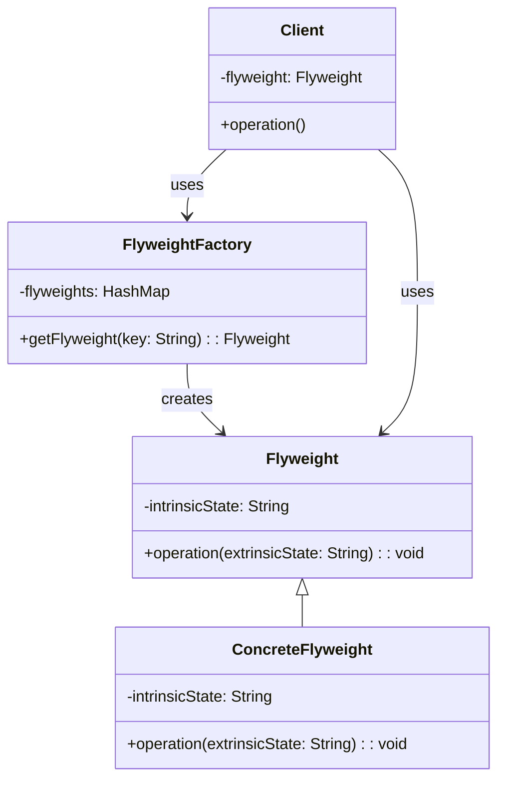

# 플라이웨이트 패턴

플라이웨이트 패턴은 대량의 객체를 효율적으로 관리하고 메모리를 절약하기 위한 디자인 패턴입니다. 이 패턴은 공유를 통해 메모리에 로드되는 객체의 개수를 줄여 성능을 향상시키는 데 중점을 둡니다.

## **적합한 상황**

- 어플리케이션에서 생성되는 객체의 수가 매우 많은 경우.
- 생성된 객체가 메모리에 오래 상주하며 자주 사용되는 경우.
- 객체의 특성을 내적 속성과 외적 속성으로 나누어 관리할 수 있는 경우.

## **내적 속성과 외적 속성**

### **내적 속성 (Intrinsic State)**

내적 속성은 객체의 상태 중에서 모든 객체가 공유할 수 있는 불변(immutable) 상태를 말합니다. 이는 객체의 고유한 특징이며, 여러 객체가 동일한 내적 속성을 가질 수 있습니다. 내적 속성은 객체가 생성될 때 설정되며, 이후에는 변경되지 않습니다. 플라이웨이트 패턴에서 내적 속성은 공유되는 부분이므로 메모리를 절약할 수 있습니다.

### **외적 속성 (Extrinsic State)**

외적 속성은 개별 객체마다 달라질 수 있는 가변 상태를 말합니다. 이는 객체의 사용 상황이나 환경(컨텍스트)에 따라 달라지는 값이며, 객체가 필요할 때 외부에서 제공되며, 객체 자체에는 저장되지 않습니다.

### **컨텍스트 (Context)**

컨텍스트는 객체가 사용되는 상황이나 환경을 의미합니다. 이는 객체가 특정 시점이나 위치에서 어떻게 사용되는지를 나타내며, 주로 외적 속성에 해당합니다.

### **문서 편집기에서 글자 객체 예시**

- **내적 속성**: 각 글자의 글꼴, 크기, 스타일
- **외적 속성**: 글자의 위치(행, 열), 색상, 배경색 등의 글자의 컨텍스트

```java
public class Character {
    // 내적 속성 (Intrinsic State)
    private char character; // 글자 자체는 변하지 않으므로 내적 속성입니다.
    private String font;    // 글꼴도 동일 글자가 공유할 수 있는 속성입니다.
    private int size;       // 글자의 크기도 내적 속성으로 동일 글자가 공유할 수 있습니다.

    public Character(char character, String font, int size) {
        this.character = character;
        this.font = font;
        this.size = size;
    }

    public void display(Position position, String color, String backgroundColor) {
        // 외적 속성 (Extrinsic State)
        // 위치, 색상, 배경색은 글자가 사용되는 컨텍스트에 따라 달라질 수 있으므로 외적 속성입니다.
        System.out.println("Displaying '" + character + "' at " + position + " with color " + color + " and background " + backgroundColor);
    }
}

public class Position {
    // Position 클래스는 위치를 나타내며, 외적 속성으로 사용됩니다.
    private int x;
    private int y;

    public Position(int x, int y) {
        this.x = x;
        this.y = y;
    }

    @Override
    public String toString() {
        return "(" + x + ", " + y + ")";
    }
}
```

## **플라이웨이트 패턴의 구조**

### **다이어그램**



1. **Flyweight 클래스**: 플라이웨이트 객체의 인터페이스를 정의합니다. 여기서 **`operation`** 메서드는 외적 속성(**`extrinsicState`**)을 인자로 받습니다.
2. **ConcreteFlyweight 클래스**: **`Flyweight`** 인터페이스를 구현하는 구체적인 클래스입니다. 내적 속성(**`intrinsicState`**)을 가지고 있습니다.
3. **FlyweightFactory 클래스**: 플라이웨이트 객체를 생성하고 관리합니다. **`getFlyweight`** 메서드는 요청된 키에 해당하는 플라이웨이트 객체를 반환합니다.
4. **Client 클래스**: 플라이웨이트 패턴을 사용하는 클라이언트입니다. 플라이웨이트 객체를 사용하여 작업을 수행합니다.

### **JAVA 코드**

```java
// Flyweight 인터페이스
// 플라이웨이트 객체의 인터페이스를 정의
public interface Flyweight {
    void operation(String extrinsicState);
}

// ConcreteFlyweight 클래스
// Flyweight 인터페이스를 구현하는 구체적인 클래스, 멤버 변수로 내적 속성을 가지고 있다.
public class ConcreteFlyweight implements Flyweight {
    // 내적 속성 (Intrinsic State)
    private final String intrinsicState;

    public ConcreteFlyweight(String intrinsicState) {
        this.intrinsicState = intrinsicState;
    }

    @Override
    public void operation(String extrinsicState) {
        // 외적 속성 (Extrinsic State)
        System.out.println("Intrinsic State: " + intrinsicState + ", Extrinsic State: " + extrinsicState);
    }
}

// FlyweightFactory 클래스
// 플라이웨이트 객체를 생성하고 관리
public class FlyweightFactory {
    private final Map<String, Flyweight> flyweights = new HashMap<>();

    public Flyweight getFlyweight(String key) {
        if (!flyweights.containsKey(key)) {
            flyweights.put(key, new ConcreteFlyweight(key));
        }
        return flyweights.get(key);
    }
}
```

## **글자 객체 플라이웨이트 패턴 예제**

### **Flyweight 인터페이스**

```java
public interface Flyweight {
    void display(Position position, String color, String backgroundColor);
}
```

### **ConcreteFlyweight 클래스**

```java
public class ConcreteFlyweight implements Flyweight {
    // 내적 속성 (Intrinsic State) - 멤버 변수로 저장
    private final char character;
    private final String font;
    private final int size;

    public ConcreteFlyweight(char character, String font, int size) {
        this.character = character;
        this.font = font;
        this.size = size;
    }

    @Override
    public void display(Position position, String color, String backgroundColor) {
        // 외적 속성 (Extrinsic State) - 메서드 인자로 받음
        System.out.println("Displaying '" + character + "' at " + position + " with color " + color + " and background " + backgroundColor);
    }
}
```

### **FlyweightFactory 클래스**

```java
public class FlyweightFactory {
    // 캐시 저장소: 생성된 Flyweight 객체를 저장하여 재사용
    private final Map<String, Flyweight> flyweights = new HashMap<>();

    // 캐시에서 Flyweight 객체를 가져오는 메서드
    public Flyweight getFlyweight(char character, String font, int size) {
        // 키 생성: character, font, size를 조합하여 고유한 키 생성
        String key = character + font + size;

        // 캐시에 키가 없으면 새로운 Flyweight 객체를 생성하고 캐시에 저장
        if (!flyweights.containsKey(key)) {
            flyweights.put(key, new ConcreteFlyweight(character, font, size));
        }

        // 캐시에 키가 있으면 기존 객체를 반환
        return flyweights.get(key);
    }
}
```

### **클라이언트 코드**

```java
// Position 클래스 외적 속성
public class Position {
    private final int x;
    private final int y;

    public Position(int x, int y) {
        this.x = x;
        this.y = y;
    }

    @Override
    public String toString() {
        return "(" + x + ", " + y + ")";
    }
}

public class Client {
    public static void main(String[] args) {
        FlyweightFactory factory = new FlyweightFactory();

        Flyweight flyweight1 = factory.getFlyweight('A', "Arial", 12);
        flyweight1.display(new Position(10, 20), "Black", "White");
        // 결과: Displaying 'A' at (10, 20) with color Black and background White

        Flyweight flyweight2 = factory.getFlyweight('A', "Arial", 12);
        flyweight2.display(new Position(30, 40), "Red", "White");
        // 결과: Displaying 'A' at (30, 40) with color Red and background White

        Flyweight flyweight3 = factory.getFlyweight('B', "Arial", 12);
        flyweight3.display(new Position(50, 60), "Green", "White");
        // 결과: Displaying 'B' at (50, 60) with color Green and background White
    }
}
```

## **플라이웨이트 패턴의 장점과 단점**

### **장점**

1. **메모리 절약**: 동일한 내적 속성을 공유하여 메모리 사용량을 크게 줄일 수 있습니다.
2. **성능 향상**: 객체 생성 비용을 줄여 성능을 최적화할 수 있습니다.
3. **일관성 유지**: 동일한 내적 속성을 가진 객체를 재사용하여 일관성을 유지합니다.

### **단점**

1. **복잡성 증가**: 내적 속성과 외적 속성을 분리하여 관리해야 하므로 코드의 복잡성이 증가할 수 있습니다.
    - **예시**: 내적 속성과 외적 속성을 분리하여 **`Character`** 클래스와 **`Position`** 클래스를 별도로 관리해야 하므로, 코드가 더 복잡해집니다. 이는 객체의 상태를 관리하는 로직이 증가함을 의미합니다.
2. **외적 속성 관리**: 외적 속성을 외부에서 제공해야 하므로 클라이언트 코드가 복잡해질 수 있습니다.
    - **예시**: 클라이언트 코드에서 객체를 사용할 때마다 외적 속성(위치, 색상 등)을 제공해야 하므로, 코드가 길어지고 복잡해질 수 있습니다. 이는 외적 속성을 관리하는 추가적인 작업이 필요함을 의미합니다.
