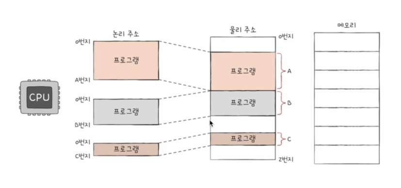

# 메모리와 캐시 메모리

메모리란 실행할 데이터를 저장하는 장치입니다.  
일반적으로 보조 기억 장치에 있는 프로그램을 메인 메모리로 가져와서 실행합니다.  
RAM이 크면 많은 프로그램의 데이터와 명령어를 저장할 수 있습니다.  
하지만 RAM이 크다고 무조건 장점만 있는건 아닙니다.  
RAM이 클수록  데이터를 찾는 시간이 늘어나고 전력 소모량도 늘어납니다.  

## RAM의 종류
### DRAM
DRAM은 Dynamic Random Access Memory의 약자로 동적으로 메모리에 데이터를 저장, 삭제하는 메모리입니다.  
데이터가 휘발성으로 저장되기 때문에 전원이 꺼지면 데이터가 사라집니다.  
DRAM은 저렴하고 용량이 커서 주로 메인 메모리로 사용되며 대용량으로 데이터를 저장할 때 사용됩니다.  
### SRAM
SRAM은 Static Random Access Memory의 약자로 정적으로 메모리에 데이터를 저장하는 메모리입니다.  
DRAM과 달리 저장, 삭제하는 과정이 없기 때문에 빠른 속도로 데이터를 읽고 쓸 수 있습니다. (refresh가 필요없음)  
하지만 DRAM에 비해 비용이 비싸고 용량이 작아서 캐시 메모리로 사용됩니다.  

### SDRAM
SDRAM은 Synchronous Dynamic Random Access Memory의 약자로 동기식 동적 메모리입니다.  
SDRAM은 클럭 신호와 동기화 되어 데이터를 읽고 쓰기 때문에 안정적으로 데이터를 처리할 수 있습니다.  

### DDR SDRAM
DDR SDRAM은 Double Data Rate Synchronous Dynamic Random Access Memory의 약자로 데이터를 읽고 쓰는 속도가 빠릅니다.  
DDR SDRAM은  SDRAM보다 2배 더 큰 대역폭을 가지고 있기 때문에 보조 기억 장치에서 데이터를 가져와 메인 메모리로 저장할 때 빠른 속도로 데이터를 처리할 수 있습니다.  
그리고 DDR2 SDRAM, DDR3 SDRAM, DDR4 SDRAM 등이 있습니다.  

## 캐시 메모리

L3 캐시 메모리는 CPU와 메인 메모리 사이에 위치한 메모리로 CPU가 데이터를 읽고 쓸 때 메인 메모리보다 빠른 속도로 데이터를 처리할 수 있습니다.  
L1, L2 캐시 메모리는 CPU 내부에 위치한 메모리로 L1 캐시 메모리가 L2 캐시 메모리보다 빠른 속도로 데이터를 처리할 수 있습니다.  
L1, L2는 각 코어에 할당 되어 있기 때문에 코어의 수 만큼 L1, L2 캐시 메모리가 존재하고 이를 동기화 하기 위해 추가적인 작업이 필요합니다.  
L3는 공용적으로 사용이 되는 메모리이기 때문에 한개만 존재합니다.  
위 그림을 보면 알 수 있듯이 용량이 작고 비용이 비쌀수록 속도가 빠릅니다.  

### 캐시 히트, 캐시 미스
캐시 히트는 CPU가 데이터를 읽을 때 캐시 메모리에 데이터가 있어서 빠르게 데이터를 읽는 동작을 의미합니다.  
반대로 캐시 미스는 CPU가 데이터를 읽을 때 캐시 메모리에 데이터가 없어서 메인 메모리에서 데이터를 가져오는 동작을 의미합니다.  
캐시 히트가 높을 수록 성능이 좋아지지만 캐시 미스가 높을 수록 성능이 떨어집니다.  
저는 일반적으로 redis를 사용할 때 logger를 통해 캐시 히트, 캐시 미스를 확인합니다. 

## 메모리의 물리 주소와 논리 주소

메모리의 물리 주소는 메모리에 저장된 데이터의 실제 주소를 의미합니다.  
논리 주소는 CPU가 메모리에 접근할 때 사용하는 주소를 의미합니다.  
논리 주소는 무조건 0부터 시작하며 MMU가 베이스 레지스터에 저장된 값을 더해 물리 주소와 매핑합니다.  
이 떄 다른 프로세스의 논리 주소가 같은 물리 주소를 가리키는 것을 방지하기 위해 메모리 보호를 사용합니다.  
메모리 보호를 할 땐 한계 레지스터를 사용해서 프로세스에 할당 된 메모리의 크기를 저장하고 MMU가 논리 주소와 물리 주소를 매핑할 때 한계 레지스터와 비교한 뒤 문제가 된다면 인터럽트를 발생시킵니다.  
