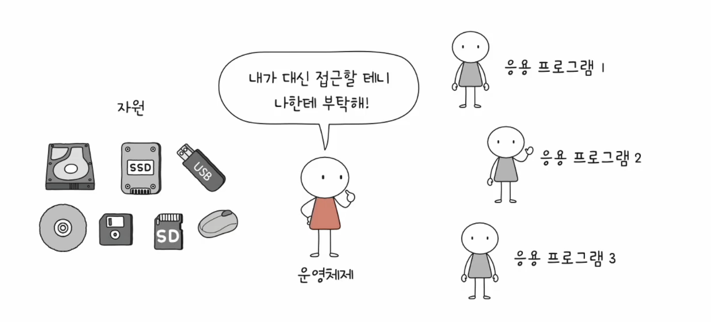
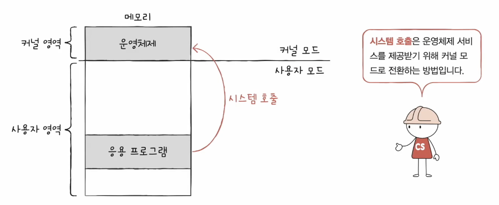

# 운영체제

- 실행할 프로그램에 필요한 자원을 할당하고, 프로그램이 올바르게 실행되도록 돕는 특별한 프로그램
- 프로그램이기 떄문에 운영체제는 메모리에 적재되어 실행됨 (커널 영역에 적재 됨)

### [1] 운영체제의 메모리 관리

- 프로그램이 실행될 때 메모리에 적재시키는 역할 → 운영체제는 메모리의 비어있는 공간에 프로그램을 적재해서 실행하는 역할을 함
- 반대로 사용하지 않는 프로그램은 메모리에서 비워주는 역할도 함

### [2] 운영체제의 CPU 관리

- 실행될 프로그램의 우선순위 관리, 얼만큼 CPU 를 점유하여 사용하게 할 것인지는 운영체제에 의해서 결정됨

### [3] 운영체제의 입출력관리

- 운영체제는 입출력장치와 응용 프로그램 사이의 접근 관리를 함
- 예를 들어서 한 번에 하나의 프로세스만 사용 가능한 프린터가 있을 때,
- 운영체제는 프린터 자원을 요청한 프로세스들을 큐에 넣고, 순차적으로 접근을 허용함

### [4] 운영체제가 없다면…

- 운영체제는 하드웨어와 응용 프로그램 사이에서 연결을 도와주는 프로그램으로도 볼 수 있음
- 하드웨어와 가까운 곳에 위치하여 프로그램들이 요구하는 자원 분배, 올바른 실행을 돕는 등의 역할
- 운영체제가 없다면, 개발자는 하드웨어의 모든 세부 사항을 직접 관리하고 제어해야 함

---

# 커널(Kernel)

- 운영체제의 핵심 서비스 : (1)컴퓨터 자원에 접근 및 조작하는 기능과 (2)프로그램이 올바르고 안전하게 실행되도록 관리해주는 기능
- 커널 : 운영체제의 핵심 부분인 커널(Kernel)은 가장 중요한 서비스를 담당하며, 하드웨어와 소프트웨어 간의 상호작용을 관리하고 시스템 자원을 효율적으로 분배
- 운영체제에는 속하지만, 커널에는 속하지 않는 기능 : 유저 인터페이스(UI) →  사용자와 컴퓨터 간의 통로일 뿐 핵심 기능 X

---

# 이중모드와 시스템 호출

- 사용자가 실행하는 프로그램 (응용 프로그램)은 자원에 직접 접근해서는 안 됨
- CPU 나 자원 간의 충돌이 일어날 수 있기 때문 → 운영체제를 통해서만 접근을 해야 함

### → 이러한 운영체제의 문지기 역할은 ‘이중모드’로 구현이 됨

## 이중모드

- CPU가 명령어를 실행하는 모드는 사용자 모드, 커널 모드로 나눌 수 있음

### 사용자 모드

- 운영체제 서비스를 제공받을 수 없는 실행 모드 (운영체제 도움 없이 실행될 수 있는 모드)
- 커널 영역의 코드를 실행할 수 없는 실행 모드
- 자원 접근 불가

### 커널 모드

- 운영체제의 서비스를 제공받을 수 있는 실행 모드
- 자원 접근을 비롯한 모든 명령어 실행 가능

### 모드 확인 방법

- 슈퍼바이저 플러그를 통해서 커널 모드(1)인지, 사용자 모드(0)인지 판단할 수 있게 해줌

### 모드 변환

- 시스템 호출을 하면 커널모드로 전환됨

- 일종의 소프트웨어 인터럽트
    - 하드웨어 인터럽트 처리 방식과 유사함

---

# 운영체제의 핵심 서비스 - 앞으로…!

## 프로세스 관리

- 프로세스 : 메모리에 적재되어 실행 중인 프로그램 (추가 : 전부 다 메모리에 적재되지는 않는다. → 페이징, 스와핑)
- 동시다발적으로 생성/실행/삭제되는 프로세스들을 관리함

## 자원 접근 및 할당

- CPU : 어떤 프로세스를 먼저? 얼마나 더 오래?
- 메모리에 적재될 때 메모리보다 큰 프로세스도 실행이 됨
- 메모리의 빈 공간을 어떻게 찾아서 할당하는지

## 파일 시스템 관리

- 보조기억장치의 데이터들을 파일이라는 단위로 저장장치에 보관하는데 이러한 파일 시스템을 어떻게 관리하는지