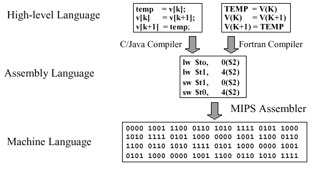
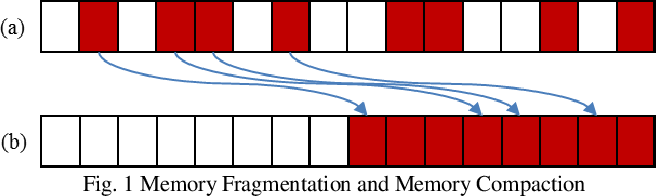

## 1. 고급 언어들을 컴퓨터는 어떻게 이해할까요?

프로그래밍 언어의 구조가 기계어와 유사할수록 저급언어, 사람이 이해하기 쉬운 구조일수록 고급언어라고 해요.

0과 1, 즉 이진수로 이뤄진 언어를 기계어라고 해요.

또 기계어에 가장 가까운 언어는 어셈블리어라고 해요.

우리는 어셈블리어도 기계어도 아닌 java, javascript, kotlin과 같은 사람이 이해하기 좋은 언어를 사용하죠.

과연 어떻게 이런 고급 언어가 기계어로 인코딩 되는걸까요?

java로 예시를 들어볼게요.

자바는 운영체제를 따지지 않고 어디서든 실행되는 것을 목표로 하는 언어에요.

이게 어떻게 가능할까요?

java는 jvm이라는 가상 머신이 존재하고 이 jvm은 .java라는 확장자를 모두 읽어와서 .class 파일로 변환해요.

이 class 파일은 jvm이 이해할 수 있는 바이트 코드의 형태를 띄고 있어요.

그리고 이 바이트 코드들을 jvm 내부의 인터프리터가 읽어와서 기계가 읽을 수 있는 형태로 변환해요.

jit 컴파일러는 이 기계가 읽을 수 있는 형태의 네이티브 코드로의 변환 속도를 빠르게 도와줘요.(캐싱)

그리고 이 네이티브 코드들은 운영체제를 따지지 않고 cpu가 정상적으로 읽고 실행이 됩니다.

## 2. 메모리에 할당 해야하는 용량보다 큰 데이터가 들어오게 될 때

jvm의 gc는 주기적으로 compaction 작업을 해요.

compaction 작업이란 **메모리 할당 공간 사이에 사용하지 않는 빈 공간이 없도록 옮겨서 메모리 단편화를 제거하는 작업이죠.**

쉽게 말해 흩어져 있는 주기적으로 메모리를 사용하는 영역을 한 군대로 몰아 넣어 사용하는 영역과 빈 공간을 분리하는 작업이라고 생각하시면 돼요.

이 작업을 통해 jvm은 큰 데이터를 맞이할 준비를 하게 되는거죠.