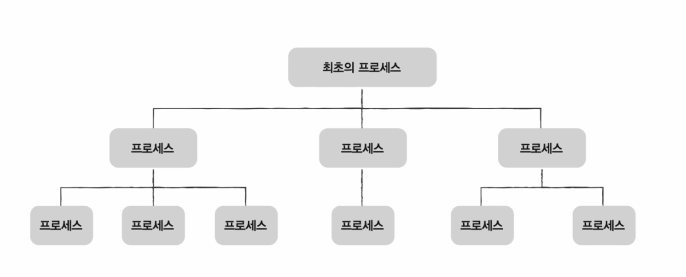
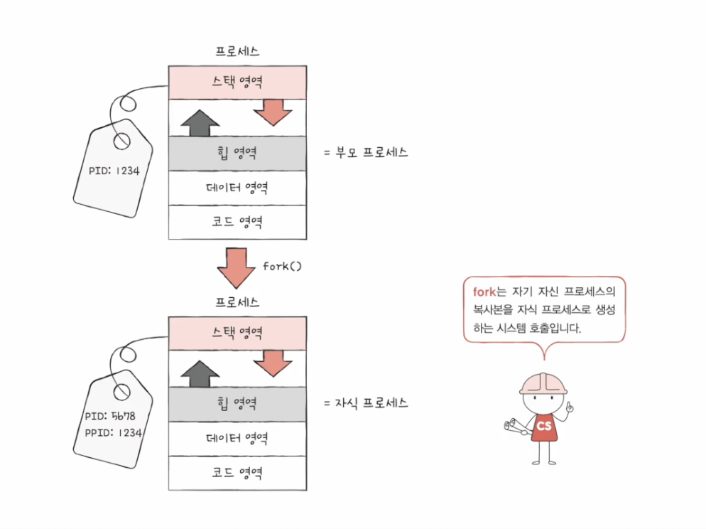
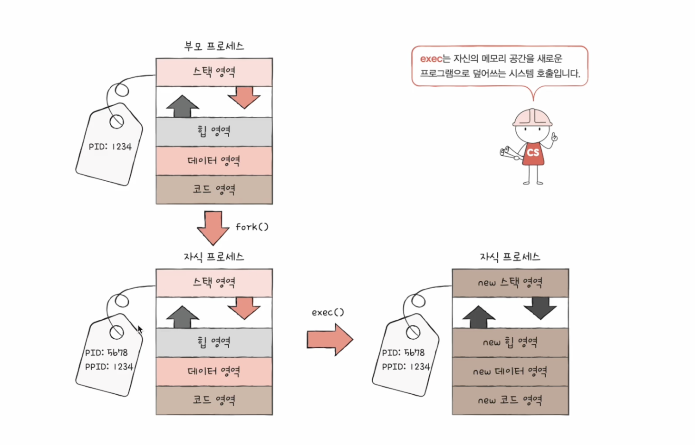
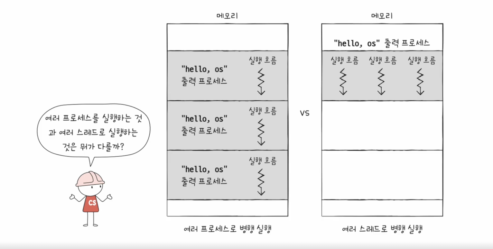

# 프로세스 개요

## 프로세스의 종류

- 포그라운드 프로세스

  →   사용자가 볼 수 있는 공간에서 실행되는 프로세스 (ex. 메모장, 워드 프로세스, 게임 등)

- 백그라운드 프로세스

  →   사용자가 볼 수 없는 공간에서 실행되는 프로세스

    - 사용자와 상호작용이 직접 가능한 백그라운드 프로세스
    - 사용자와 상호작용하지 않고 그저 정해진 일만 수행하는 프로세스 (데몬, 서비스)

## 프로세스 제어 블록(PCB)

- CPU 는 한정적이기 때문에, CPU 를 사용하는 프로세스들의 관리 필요
- 이 관리를 위해 프로세스 제어 블록이 사용됨 (Process Control Block)
    - 프로세스 관련 정보를 저장하는 자료 구조
    - 상품에 달려있는 태그와 같은 역할
    - 프로세스 생성 시 커널 영역에서 생성, 종료 시  폐기
- PCB 에 담기는 정보
    - 프로세스 ID(=PID) : 특정 프로세스를 식별하기 위한 고유한 번호
    - 레지스터 값 : (타이머 인터럽트  발생하여 차례를 양보한 이후) 자신의 실행 차례가 오면 이전까지 사용한 레지스터 중간 값을 모두 복원 → 실행 재개
    - 프로세스 상태 : CPU 를 사용하기 위해 기다리는 상태 등 여러 상태 정보를 담고 있음
    - CPU 스케줄링 정보 : 언제, 어떤 순서로 CPU 를 할당받을지에 대한 정보
    - 메모리 정보 : 프로세스가 어느 주소에 저장되어 있는지 정보, 페이지 테이블 정보
    - 사용한 파일과 입출력장치 정보 : 할당된 입출력 장치, 사용 중인(열린) 파일 정보

## 문맥 교환(Context Switch)

- 프로세스의 실행 순서가 넘어가면 중간 내용의 백업 필요 → 언제든지 해당 프로세스의 실행을 재개하기 위해.
- 중간 내용 : 레지스터 값, 메모리 정보, 열었던 파일, 사용한 입출력 파일 등
- 문맥(Context) : 이러한 중간 내용을 문맥이라고 함 (PCB 에 기록됨)
- 문맥 교환 : 기존 프로세스의 문맥을 PCB 에 백업하고, 새로운 프로세스를 실행하기 위해 문맥을 PCB 로부터 복구하여 새로운 프로세스를 실행하는 것

## 프로세스의 메모리 영역

- 메모리 → 커널 영역, 사용자 영역
- 사용자 영역 → 코드영역, 데이터 영역, 힙 영역, 스택 영역
- 정적 할당 영역 : 크기가 고정된 영역 (코드 영역, 데이터 영역)
- 동적 할당 영역 : 크기가 변할 수 있는 영역(힙 영역, 스택 영역)

### 코드 영역

- 기계어로 이루어진 명령어가 저장되기 때문에 텍스트 영역이라고도 부름
- 데이터가 아닌 CPU가 실행할 명령어가 담겨 있기 때문에 쓰기가 금지되어 있음 (읽기 전용 공간)

### 데이터 영역

- 프로그램이 실행되는 동안 유지할 데이터가 저장되는 공간 (ex. 전역 변수)

### 힙 영역

- 프로그래머가 직접 할당할 수 있는 저장하는 공간
- 프로그래밍 과정에서 할당했던 메모리 공간을 반환하지 않을 경우 메무리 누수 발생

### 스택 영역

- 데이터를 일시적으로 저장하는 공간 (ex. 매개 변수, 지역 변수)

- 힙 영역은 메모리의 낮은 주소에서 높은 주소로 할당
- 스택 영역은 메모리의 높은 주소에서 낮은 주소로 할당

---

# 프로세스 상태와 계층 구조

 

## 프로세스 상태

- 프로세스 상태 : 생성, 준비, 실행, 대기, 종료
- 생성 상태
    - 메모리에 적재되어 PCB 를 할당 받은 상태
    - 준비 완료 시 준비 상태로
- 준비 상태
    - CPU 를 할당받아 실행할 수 있지만 차례를 기다리는 중
    - 차례가 되면 실행 상태로 (= 디스패치)
- 실행 상태
    - CPU 를 할당받아 실행 중인 상태
    - 할당된 시간을 모두 사용할 경우 다시 준비 상태로 돌아감
    - 실행 도중 입출력 장치를 사용하면 입출력 작업이 끝날 때까지 대기 상태로 돌아감
- 대기 상태
    - 프로세스가 실행 도중 입출력장치를 사용하는 경우
    - 입출력 작업이 끝나면 준비 상태로 돌아감
- 종료 상태
    - 프로세스가 종료된 상태

## 프로세스 계층 구조

- 부모 프로세스 : 새 프로세스를 생성한 프로세스
- 자식 프로세스 : 부모 프로세스에 의해 생성된 프로세스

  → 부모 프로세스와 자식 프로세스는 다른 프로세스이므로 PID가 다름

## 프로세스 생성 기법

- 부모 프로세스는 fork 시스템 호출을 통해 자신의 복사본을 자식 프로세스로 생성
- 자식 프로세스는 exec 시스템 호출을 통해 자신의 메모리 공간을 다른 프로그램으로 교체

- fork 시스템 → 복사본(=자식 프로세스) 생성, 부모 프로세스의 자원 상속

- exec 시스템 → 메모리 공간을 새로운 프로그램으로 덮어씀, 코드/ 데이터 영역은 실행할 프로그램 내용으로 바꾸고 나머지 영역은 초기화함

---

# 스레드(thread)

## 스레드

- 스레드 : 프로세스를 구성하는 실행 흐름의 단위
- 스레드의 구성요소 : 스레드 ID, 프로그램 카운터를 비롯한 레지스터 값, 스택 등 실행에 필요한 최소한의 정보

## 멀티 프로세스와 멀티 스레드

- 멀티 프로세스 : 동일한 작업을 수행하는 단일 스레드 프로세스 여러 개 실행
- 멀티 스레드 : 하나의 프로세스를 여러 개의 스레드로 실행

- 프로세스끼리는 서로 자원을 공유하지 않지만, (독립적으로 실행된다)
- 스레드는 같은 프로세스 내의 자원을 공유하면서 실행된다는 차이점이 존재함 (협력과 통신에 유리하다)