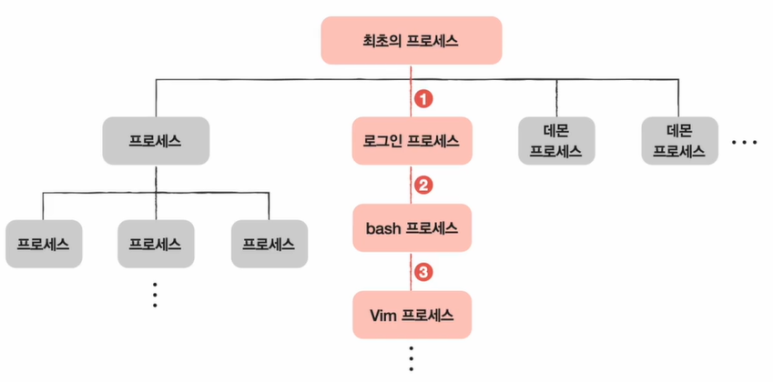

# 프로세스와 스레드

## 프로세스

실행 중인 프로그램

### 포그라운드 프로세스

사용자와 직접 상호작용하며 보이는 곳에서 실행되는 프로세스입니다.

### 백그라운드 프로세스

사용자와 상호작용하지 않고, 보이지 않는 곳에서 정해진 일을 수행하는 프로세스입니다. 리눅스 데몬, 윈도우 서비스가 이에 해당합니다.

## 프로세스 제어 블록(Process Controll Block)

CPU 자원이 한정되어 있기 때문에 운영체제는 프로세스 제어 블록(PCB)을 이용해 빠르게 번갈아 수행되는 프로세스의 실행 순서를 관리하고, 프로세스에 CPU를 비롯한 자원을 배분합니다.

- 프로세스 제어 블록에는 해당 프로세스를 식별하기 위해 꼭 필요한 정보들이 저장됩니다.
- PCB는 커널 영역에 생성됩니다.
- 운영체제는 PCB로 특정 프로세스를 식별하고 해당 프로세스를 처리하는 데 필요한 정보를 판단합니다.
- PCB는 프로세스 생성 시에 만들어지고, 실행이 끝나면 폐기됩니다. 즉, 새로운 프로세스가 생성되었다는 말은 운영체제가 PCB를 생성했다는 말과 같고, 프로세스가 종료되었다는 것은 운영체제가 해당 PCB를 폐기했다는 말과 같습니다.

### PCB에 저장되는 정보

- **프로세스 ID:** 특정 프로세스를 식별하기 위해 부여하는 고유한 번호입니다.
- **레지스터 값:** 프로세스가 사용했던 프로그램 카운터 등 레지스터 값이 저장됩니다.
- **프로세스 상태:** 현재 프로세스가 어떤 상태인지 기록됩니다.
- **CPU 스케줄링 정보:** 프로세스가 언제, 어떤 순서로 CPU를 할당받을지에 대한 정보가 기록됩니다.
- **메모리 관리 정보:** 프로세스마다 메모리에 저장된 위치가 다르기 때문에 PCB에 프로세스가 어느 주소에 저장되어 있는지에 대한 정보가 담깁니다. 또한, 프로세스의 주소를 알기 위한 또 다른 중요한 정보 중 하나인 페이지 테이블 정보도 PCB에 담깁니다.
- **사용한 파일과 입출력 장치 목록:** 프로세스가 실행 과정에서 특정 입출력 장치나 파일을 사용하면 PCB에 해당 내용이 명시됩니다. 즉, 어떤 입출력 장치가 이 프로세스에 할당되었는지, 어떤 파일들을 열었는지에 대한 정보들이 기록됩니다.

## 문맥 교환

하나의 프로세스 수행을 재개하기 위해 기억해야 할 정보를 `문맥`이라고 하며, 하나의 프로세스 문맥은 해당 프로세스의 PCB에 표현되어 있습니다. PCB에 기록되는 정보를 문맥이라 해도 무방하며, 실행 문맥을 잘 기억하고 있다면 언제든 해당 프로세스의 실행을 재개할 수 있기 때문에 CPU를 사용할 수 있는 시간이 다 되거나 예기치 못한 상황이 발생해 인터럽트가 발생될 때 운영체제는 해당 프로세스의 PCB에 문맥을 백업합니다. 그리고 뒤이어 실행할 프로세스의 문맥을 복구합니다. 이렇게 실행되는 프로세스가 바뀌는 것입니다.

- 기존 프로세스의 문맥을 PCB에 백업하고, 새로운 프로세스를 실행하기 위해 문맥을 PCB로부터 복구하여 새로운 프로세스를 실행합니다.
- 문맥 교환은 여러 프로세스가 끊임없이 빠르게 번갈아 가며 실행되는 원리입니다.
- 문맥 교환이 자주 일어나면 프로세스는 그만큼 빨리 번갈아 가며 수행되기 때문에 사용자 입장에서는 프로세스들이 동시에 실행되는 것처럼 보입니다.

## 프로세스의 메모리 영역

프로세스는 사용자 영역에 코드 영역, 데이터 영역, 힙 영역, 스택 영역으로 나뉘어 저장됩니다.

### 정적 할당 영역

크기가 변하지 않고 고정되어 있는 영역입니다.

- **코드 영역:** 텍스트 영역이라고도 부르며 말 그대로 실행할 수 있는 코드, 즉 기계어로 이루어진 명령어가 저장됩니다. 코드 영역에는 데이터가 아닌 CPU가 실행할 명령어가 담겨 있기 때문에 쓰기가 금지되어 있습니다. 읽기 전용 공간입니다.
- **데이터 영역:** 잠깐 썼다가 없앨 데이터가 아닌, 프로그램이 실행되는 동안 유지할 데이터가 저장되는 공간입니다. 전역 변수 등이 이에 해당합니다.

### 동적 할당 영역

실행 과정에서 크기가 변할 수 있는 영역입니다.

- **힙 영역:** 프로그래머가 직접 할당할 수 있는 저장공간입니다. 힙 영역에 메모리 공간을 할당했다면 언젠가는 해당 공간을 반환해야 합니다. 메모리 공간을 반환하지 않으면 해당 공간은 메모리 내에 계속 남아 있어 메모리 누수가 발생합니다.
- **스택 영역:** 데이터를 일시적으로 저장하는 공간으로, 데이터 영역과 달리 잠깐 사용할 값들이 저장되는 공간입니다. 함수의 실행이 끝나면 사라지는 지역 변수, 매개 변수가 대표적입니다.
- 힙 영역은 낮은 주소에서 높은 주소로 할당되고 스택 영역은 높은 주소에서 낮은 주소로 할당되어서 서로 마주칠 일이 없도록 합니다.

# 프로세스 상태와 계층 구조

## 프로세스 상태

프로세스들은 빠르게 번갈아가며 실행되며, 하나의 프로세스는 여러 상태를 거치며 실행됩니다. 운영체제는 프로세스의 상태를 PCB를 통해 인식하고 관리합니다.

- **생성 상태**: 프로세스를 생성 중인 상태입니다. 이제 막 메모리에 적재되어 PCB를 할당받은 상태를 의미합니다. 생성 상태를 거쳐 실행할 준비가 완료된 프로세스는 곧바로 실행되지 않고 준비 상태가 되어 CPU 할당을 기다립니다.
- **준비 상태**: 당장이라도 CPU를 할당받아 실행할 수 있지만, 아직 자신의 차례가 아니기 때문에 기다리고 있는 상태입니다. 준비 상태의 프로세스는 차례가 되면 CPU를 할당받아 실행 상태가 됩니다.
- **실행 상태**: CPU를 할당받아 실행 중인 상태입니다. 실행 상태의 프로세스는 할당된 일정 시간 동안만 CPU를 사용할 수 있습니다. 프로세스가 할당된 시간을 모두 사용하면 (타이머 인터럽트 발생) 다시 준비 상태가 되고, 실행 도중 입출력 장치를 사용하여 입출력 장치의 작업이 끝날 때까지 기다려야 하면 대기 상태가 됩니다.
    - **디스패치**: 준비 상태인 프로세스가 실행 상태로 전환되는 것을 의미합니다.
- **대기 상태**: 입출력 장치의 작업을 기다리는 상태입니다. 입출력 작업이 완료되면 해당 프로세스는 다시 준비 상태로 전환되어 CPU 할당을 기다립니다.
- **종료 상태**: 프로세스가 종료된 상태입니다. 운영체제는 PCB와 프로세스가 사용한 메모리를 정리합니다.

## 프로세스 상태 다이어그램

  
## 프로세스 계층 구조

프로세스는 실행 도중 시스템 호출을 통해 다른 프로세스를 생성할 수 있습니다. 이때 새 프로세스를 생성한 프로세스를 부모 프로세스, 부모 프로세스에 의해 생성된 프로세스를 자식 프로세스라고 합니다. 이는 프로세스가 프로세스를 낳는 계층적인 구조를 형성합니다.

- **PPID**: 부모 프로세스와 자식 프로세스는 각각 다른 PID를 가지며, 일부 운영체제에서는 자식 프로세스에 부모 프로세스의 PID인 PPID를 기록하기도 합니다.

## 프로세스 생성 기법

부모 프로세스를 통해 생성된 자식 프로세스들은 복제와 옷 갈아입기를 통해 실행됩니다.

- **fork**: 자기 자신의 복사본을 자식 프로세스로 생성하는 시스템 호출입니다. 부모 프로세스의 자원들은 자식 프로세스에 상속됩니다.
- **exec**: 자신의 메모리 공간을 새로운 프로그램으로 덮어쓰는 시스템 호출입니다. 새로운 프로그램 내용으로 전환하여 실행하게 됩니다.
- **프로세스 생성 흐름**:
    1. 부모 프로세스 → fork → 자식 프로세스
    2. 자식 프로세스 → exec → 새로운 프로그램

부모와 자식 프로세스가 모두 exec를 호출하지 않는 경우, 같은 코드를 병행하여 실행하는 프로세스가 됩니다.

# 프로세스와 스레드

## 스레드 (Thread)

스레드는 실행의 단위로, 프로세스를 구성하는 실행의 흐름 단위입니다. 하나의 프로세스는 여러 스레드를 가질 수 있으며, 이를 통해 여러 부분을 동시에 실행할 수 있습니다.

### 스레드의 특징

- **스레드 구성 요소**: 각 스레드는 고유한 스레드 ID, 프로그램 카운터 값, 레지스터 값, 스택으로 구성됩니다. 이를 통해 각 스레드는 독립적으로 실행될 수 있습니다.
- **자원 공유**: 스레드는 프로세스의 자원을 공유합니다. 즉, 실행에 필요한 최소한의 정보(레지스터, 스택)만 분리된 채 프로세스 자원을 공유하며 실행됩니다.
- **작업 단위**: 최근 많은 운영체제는 CPU에 처리할 작업 단위를 스레드 단위로 전달합니다.

### 리눅스에서의 프로세스와 스레드

리눅스에서는 프로세스와 스레드를 구분하지 않으며, 둘 모두 실행의 문맥(context of execution) 관점에서 동등하게 간주됩니다. 프로세스와 스레드 대신 태스크(task)라는 이름으로 통일해 명명합니다.

## 멀티프로세스와 멀티스레드

### 개념

- **멀티프로세스 (Multiprocess)**: 여러 프로세스를 동시에 실행하는 것입니다.
- **멀티스레드 (Multithread)**: 여러 스레드를 사용하여 하나의 프로세스를 동시에 실행하는 것입니다.

### 차이

- **프로세스 자원 공유**: 프로세스는 자원을 공유하지 않지만, 스레드는 같은 프로세스 내의 자원을 공유합니다.
- **멀티프로세스**:
    - 동일 작업을 하는 프로세스는 fork를 통해 모든 자원을 복제하여 메모리에 적재합니다. 즉, 동일한 프로세스 두 개가 각각 메모리에 적재됩니다.
- **멀티스레드**:
    - 프로세스가 가진 자원을 공유합니다. 스레드 간 차이는 스레드 ID, 프로그램 카운터를 포함한 레지스터 값, 스택만 다릅니다.

### 장단점

- **멀티프로세스 장점**:
    - 각 프로세스는 독립적이기 때문에 하나의 프로세스에 문제가 생겨도 다른 프로세스에 영향을 주지 않습니다.
- **멀티프로세스 단점**:
    - 동일한 프로그램을 실행하기 위해 메모리에 같은 내용이 중복되게 적재되므로 메모리 낭비가 발생할 수 있습니다.
    - 자원을 공유하지 않기 때문에 프로세스 간 협력과 통신이 어렵습니다.
- **멀티스레드 장점**:
    - 여러 프로세스를 병행 실행하는 것보다 메모리를 효율적으로 사용합니다.
    - 스레드 간 협력과 통신에 유리합니다.
- **멀티스레드 단점**:
    - 스레드 간 같은 자원을 공유하기 때문에 하나의 스레드에서 발생한 문제가 전체 프로세스에 영향을 줄 수 있습니다.

## 프로세스 간 통신 (IPC; Inter-Process Communication)

프로세스 간 자원을 공유하고 데이터를 주고받는 방법입니다.

- **파일을 통한 통신**: 여러 프로세스가 동일 파일에 접근하여 파일 데이터를 통해 통신합니다.
- **공유 메모리 (Shared Memory)**: 프로세스 간에 서로 공유하는 메모리 영역을 사용하여 데이터를 주고받습니다.
- **소켓, 파이프** 등을 통한 통신: 프로세스 간 데이터를 주고받는 다양한 방법이 있습니다. 그러나 스레드에 비해 자원 공유가 까다로울 수 있습니다.
