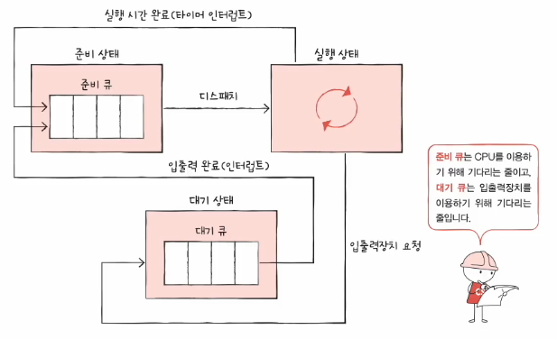

# CPU 스케줄링
CPU 스케줄링이란 운영체제가 프로세스들에게 공정하고 합리적으로 CPU 자원을 배분하는 것입니다.  
CPU 스케줄링은 컴퓨터 전체 성능과도 직결되는 아주 중요한 문제이기 때문에, CPU 자원을 아주 공정하게 배분해야 합니다.
 
 
프로세스의 PCB에는 우선순위라는 것이 있기에, 운영체제는 우선순위에 따라 CPU 자원을 할당하게 됩니다.  
예를 들어, 입출력 작업이 많은 프로세스(입출력 집중 프로세스)의 우선순위는 CPU 작업이 많은 프로세스(CPU 집중 프로세스)의 우선순위보다 높습니다.
 
 
이때 운영체제가 매번 모든 PCB를 확인하여 우선순위를 확인하는 것이 어렵기 때문에, 운영체제는 스케줄링 큐를 사용합니다.
 
 
## 1. 스케줄링 큐
스케줄링 큐는 자원을 이용하고 싶어 하는 프로세스들이 서는 줄이라고 볼 수 있습니다.

 
이 스케줄링 큐에는 대표적으로 준비 큐와 대기 큐가 있습니다.

* #### 준비 큐
  CPU를 이용하고자 하는 프로세스들이 서는 줄을 의미합니다.  
  즉, 준비 상태에 접어든 프로세스들입니다.
* #### 대기 큐
  입출력장치를 이용하고자 하는 프로세스들이 서는 줄을 의미합니다.  
  즉, 대기 상태에 접어든 프로세스들입니다.  
  이때, 같은 장치를 요구한 프로세스들끼리 같은 큐에서 대기합니다.

 
 

## 2. 선점형 스케줄링과 비선점형 스케줄링
프로세스가 CPU를 할당받아 이용하고 있는 실행 상태일 때, 나보다 급한 프로세스가 CPU를 요청하면 두 가지 선택을 할 수 있습니다.
 
 
* #### 선점형 스케줄링 (preemptive scheduling)
  현재 CPU를 사용 중인 프로세스로부터 CPU 자원을 빼앗아, 더 급한 프로세스가 할당받는 방식입니다.  
  이는 어느 한 프로세스의 자원 독점을 막고 프로세스들에 골고루 자원을 배분할 수 있습니다.  
  하지만 그만큼 문맥 교환 과정에서 오버헤드가 발생할 수 있습니다.
* #### 비선점형 스케줄링 (non-preemptive scheduling)
  현재 CPU를 사용 중인 프로세스의 작업이 끝날 때까지 기다리는 방식입니다.  
  이는 비교적 오버헤드가 적게 발생하나, 모든 프로세스가 골고루 자원을 이용하기는 어렵습니다.

 
 
 
 
 

# CPU 스케줄링 알고리즘
## 1. 선입 선처리 스케줄링 (FCFS; First Come First Served)
단순히 준비 큐에 삽입된 순서대로 처리하는 비선점 스케줄링 방식입니다.  
즉, 먼저 CPU를 요청한 프로세스부터 CPU를 할당합니다.
 
 
프로세스들이 기다리는 시간이 매우 길어질 수 있다는 호위 효과가 있습니다.
 
 
 
## 2. 최단 작업 우선 스케줄링 (SJF; Shortest Job First)
CPU 사용이 긴 프로세스는 나중에 실행하고, CPU 사용 시간이 짧은 프로세스를 먼저 실행하는 스케줄링 방식입니다.  
이는 선점형과 비선점형 둘 다 구현될 수 있지만, 기본적으로 비선점형으로 분류됩니다.
 
 
최단 작업 우선 스케줄링은 선입 선처리 스케줄링의 호위 효과를 방지할 수 있는 방법입니다.
 
 
 
## 3. 라운드 로빈 스케줄링 (Round Robin)
정해진 타임 슬라이스만큼의 시간 동안 돌아가며 CPU를 이용하는 선점형 스케줄링 방식입니다.
 
 
타임 슬라이스란 각 프로세스가 CPU를 사용할 수 있는 정해진 시간이며, 쉽게 말해 선입 선처리 스케줄링 방식에 타임 슬라이스 개념이 더해진 방식입니다.
 
 
라운드 로빈 스케줄링은 일단 큐에 삽입된 프로세스들은 순서대로 CPU를 이용하되 정해진 시간만큼만 이용하며, 정해진 시간을 모두 사용하였음에도 아직 프로세스가 완료되지 않았다면 다시 큐의 맨 뒤에 삽입합니다. (문맥 교환)
 
 
이때 타임 슬라이스의 크기가 너무 커져버리면, 선입 선처리 스케줄링과 마찬가지로 호위 효과가 발생할 수 있습니다.  
또한 타임 슬라이스의 크기가 너무 작으면, 문맥 교환에 발생하는 오버헤드 때문에 CPU의 부담이 너무 커지게 됩니다.  
따라서 라운드 로빈 스케줄링 방식에서는 타임 슬라이스가 중요한 역할을 하게 됩니다.
 
 
 
## 4. 최소 잔여 시간 우선 스케줄링 (SRT; Shortest Remaining Time)
정해진 시간만큼 CPU를 이용하되, 다음으로 CPU를 사용할 프로세스로는 남은 작업 시간이 가장 적은 프로세스를 선택하는 방식입니다.  
즉, 최단 작업 우선 스케줄링과 라운드 로빈 스케줄링이 더해진 방식입니다.
 
 
 
## 5. 우선순위 스케줄링
프로세스들에 우선순위를 부여하고, 우선순위가 높은 프로세스부터 실행하는 방식입니다.  
만약 우선순위가 같다면 선입 선처리 스케줄링 방식으로 처리하게 됩니다.
 
 
우선순위 스케줄링은 기아 현상(starvation)이라는 근본적인 문제점을 갖고 있습니다.  
이는 우선순위가 높은 프로세스만 주구장창 실행하기 때문에, 준비 큐에 먼저 삽입되었음에도 불구하고 우선순위가 낮다면 실행이 계속 연기되는 문제점입니다.
 
 
이를 방지하기 위한 방법으로 에이징(aging)이라는 기법이 있습니다.  
이는 오랫동안 대기한 프로세스의 우선순위를 마치 나이를 먹듯이 점차 증가시키는 방법입니다.  
즉, 우선순위가 낮아도 언젠가는 우선순위가 높아져 실행이 되는 기법입니다.
 
 
 
## 6. 다단계 큐 스케줄링 (Multilevel queue)
우선순위 스케줄링의 발전된 형태로, 우선순위별로 준비 큐를 여러 개 사용하는 스케줄링 방식입니다.
 
 
우선순위가 가장 높은 큐에 있는 프로세스를 먼저 처리하고, 우선순위가 가장 높은 큐가 비어 있으면 그다음 우선순위 큐에 있는 프로세스를 처리합니다.
 
 
이는 큐별로 스케줄링을 달리 적용해서 프로세스를 유형별로 구분하는 것이 쉬워집니다.
 
 
단, 프로세스는 큐 간에 이동을 할 수 없기에, 우선순위가 낮은 프로세스는 계속해서 우선순위가 낮은 큐에 머무를 수밖에 없습니다.  
즉, 기아 현상이 발생할 수 있습니다.
 
 
 
## 7. 다단계 피드백 큐 스케줄링 (Multilevel feedback queue)
다단계 큐 스케줄링의 발전된 형태로, 큐 간의 이동이 가능한 다단계 큐 스케줄링 방식입니다.
 
 
새로운 프로세스를 우선순위가 가장 높은 큐에 삽입을 하여 타임 슬라이스만큼 CPU를 할당받아 사용하게 합니다. 이후 만약 실행이 끝나지 않았다면 그다음으로 우선순위가 높은 큐에 삽입을 합니다.
즉, 자연스럽게 CPU 집중 프로세스의 우선순위는 상대적으로 낮아지고, 입출력 집중 프로세스의 우선순위는 상대적으로 높아지게 됩니다.
