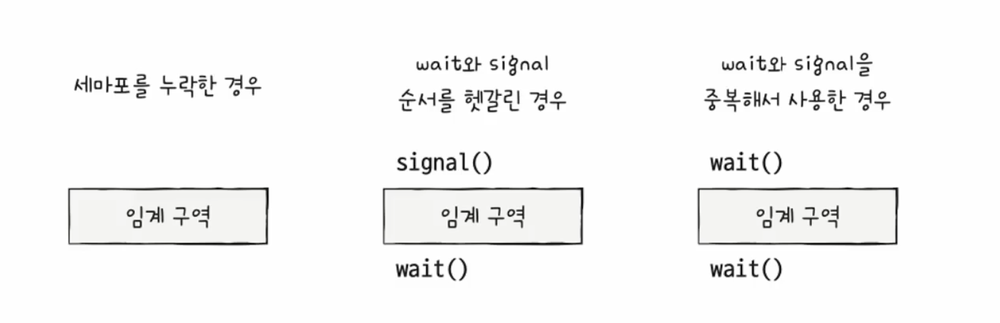
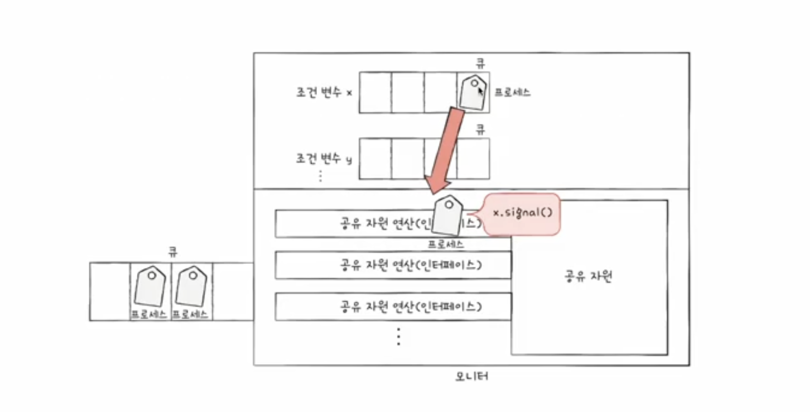

# 동기화

## 동기화의 의미

- 동기화         : 프로세스들의 수행 시기를 맞추는 것
- 동기화 종류 : 실행 순서 제어, 상호 배제

1. 실행 순서 제어 : 프로세스를 올바른 순서대로 실행하기
    - 읽기 프로세스와 쓰기 프로세스가 있을 때 읽기 프로세스는 파일 안에 값이 존재해야만 실행 가능

      → 쓰기 프로세스 실행의 선행 필요

1. 상호 배제 : 동시에 접근해서는 안 되는 자원에 하나의 프로세스만 접근하게 하기
    - 한 번에 하나의 프로세스만 접근해야하는 자원에 동시 접근을 피하기 위한 동기화
    - 공유자원 : 여러 프로세스 혹은 스레드가 공유하는 자원 (전역변수, 입출력장치 등)
    - 임계구역 : 동시에 실행하면 문제가 발생하는 자원에 접근하는 코드 영역

      → 레이스 컨디션 : 임계구역에 동시 접근하여 일관성이 깨지는 것

       

    - 임계구역 문제를 해결하는 세 가지 방법
        1. 상호배제 : 한 프로세스가 임계구역에 들어오면 다른 프로세스는 접근 불가
        2. 진행        : 임계구역에 프로세스가 없으면 진입할 수 있어야함
        3. 유한대기 : 프로세스가 임계구역에 들어오고 싶으면 언제든 들어올 수 있어야함 (무한정 대기 금지)

## 동기화 기법

- 바쁜대기 : 임계구역의 잠금 여부를 무한히 반복하면서 확인하는 것

1. 뮤텍스 락
- 상호 배제를 위한 동기화 도구 (자물쇠 역할)
- 하나의 프로세스나 스레드만 공유 자원에 접근할 수 있도록 함
- 뮤텍스 락을 획득한 스레드만 자원에 접근할 수 있으며, 다른 스레드는 락이 해제될 때까지 대기
- 구현방법 : 전역변수 1(Lock), 함수 2(임계구역 잠금 해제하는 역할, 임계구역 잠금하는 역할)로 구현 가능

1. 세마포
- 일반화된 방식의 동기화 도구, 공유자원이 여러 개 있는 경우에도 적용 가능
- 세마포 종류 : 이진 세마포, 카운팅 세마포 (카운팅 세마포를 기준으로 설명)
- 세마포는 정수 값을 가지며, 이 값으로 자원의 상태를 관리함
- 프로세스나 스레드는 세마포의 값을 통해 자원 접근 가능 여부를 확인하고, 접근할 때는 값을 감소시키고, 자원 사용을 마치면 값을 증가시킴
- 구현방법 : 전역변수1 (임계구역에 진입 가능한 프로세스의 개수), 함수2 (임계구역에 들어가도  좋은지 또는 기다려야하는지를 알려주는 함수 - wait 함수, 진입해도 좋다고 알려주는 함수 - signal 함수)
- 문제 : 바쁜 대기 발생 시 CPU 사이클 발생
- 해결 :
    1. 사용할 수 있는 자원이 없을 때 대기상태로 만듦 (해당 프로세스의 PCB를 대기 큐에 삽입)
    2. 사용할 수 있는 자원이 생겼을 때 프로세스를 준비상태로 만듦 (준비 큐에 삽입)

1. 모니터
- 세마포에서는 임계구역 앞뒤로 wait(), signal() 을 호출하는 것이 불안전함 → 실수할 경우 문제 발생

- 모니터는 내부에 락과 조건 변수를 가지고 있으며, 객체의 메서드가 호출될 때 자동으로 락을 획득하고 메서드 실행이 끝나면 락을 해제함
- 상호배제를 위한 동기화
    1. 공유자원에 접근하고자 하는 프로세스를 큐에 삽입
    2. 큐에 삽입된 순서대로 공유 자원 이용

- 실행순서 제어를 위한 동기화
    1. 조건 변수 이용 (조건 변수 → 프로세스, 스레드의 실행순서를 제어하기 위한 특별한 변수)
    2. 조건변수.wait() → 대기 상태로 변경, 조건 변수에 대한 큐에 삽입
    3. 조건변수.signal() →  wait()으로 대기상태로 접어든 조건변수를 실행 상태로 변경