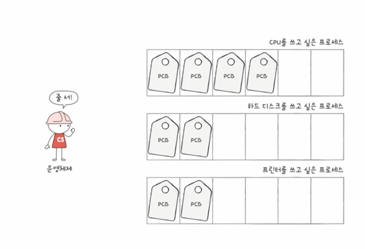
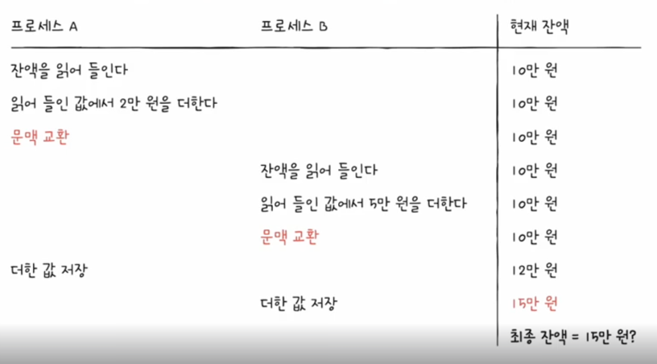

# CPU 스케줄링

## CPU 스케줄링이란?
CPU 스케줄링은 운영체제가 여러 프로세스가 CPU를 사용할 수 있도록 관리하는 것을 말합니다.  

스케줄링을 반영하는 방법 중 하나는 프로세스에 우선 순위를 부여하는 것입니다.  
입출력 작업이 많으면 더 낮은 우선 순위를 부여하고 CPU를 많이 사용하면 더 높은 우선 순위를 부여합니다.  
우선 순위는 PCB에 저장하고 스케줄링 큐에 적재 되어 실행됩니다.  

## 준비 큐와 대기 큐

준비 큐는 CPU를 사용할 수 있는 프로세스들이 대기하는 큐입니다.  
대기 큐는 입출력 작업이 끝나기를 기다리는 프로세스들이 대기하는 큐입니다.  
대기 큐는 입출력 장치마다 하나씩 존재합니다.  

## 프로세스 우선 순위
프로세스 우선 순위는 선점형과 비선점형으로 나뉩니다.   
선점형은 우선 순위가 높은 프로세스가 기존에 실행 중인 프로세스를 중지하고 CPU를 사용할 수 있습니다.   
선점형의 장점은 골고루 CPU를 사용할 수 있게 되고 단점은 context switching으로 인한 오버헤드가 더 발생합니다.  
비선점형은 우선 순위가 높은 프로세스가 기존에 실행 중인 프로세스가 종료되거나 대기 상태로 전환될 때 CPU를 사용할 수 있습니다.  

### 선입 선출 알고리즘
선입 선출 알고리즘은 준비 큐에 도착한 순서대로 CPU를 할당하는 비선점형 알고리즘입니다.
비선점형이기 떄문에 프로세스들의 대기 시간이 길어질 수 있습니다.

### 최단 작업 우선 알고리즘
최단 작업 우선 알고리즘은 준비 큐에 있는 프로세스 중 실행 시간이 가장 짧은 프로세스에 CPU를 할당하는 비선점형 알고리즘입니다.

### 라운드 로빈 알고리즘
라운드 로빈 알고리즘은 선입 선출 알고리즘의 동작 방식과는 유사하지만 선점형 알고리즘입니다.  
프로세스들이 동일한 시간을 할당받고 시간이 지나면 타이머 인터럽트가 발생하고 다음 프로세스에게 CPU를 할당합니다.  
타임 슬라이스가 짧으면 context switching이 자주 발생하고 타임 슬라이스가 길면 프로세스들의 대기 시간이 길어질 수 있습니다.  

### 최소 잔여 시간 우선 알고리즘
최소 잔여 시간 우선 알고리즘은 잔여 시간이 가장 짧은 프로세스에 CPU를 할당하는 선점형 알고리즘입니다.

### 우선 순위 기반 알고리즘
우선 순위 기반 알고리즘은 프로세스에 우선 순위를 부여하고 우선 순위가 높은 프로세스에 CPU를 할당하는 선점형 알고리즘입니다.
우선 순위 기반 알고리즘의 단점은 우선 순위가 낮은 프로세스가 무한정 대기할 수 있습니다.(기아 현상)  
이를 방지하기 위해 우선 순위를 동적으로 변경하는 방법이 있습니다.(에이징 기법)  

### 다단계 큐
다단계 큐는 여러 개의 큐를 사용하는 알고리즘입니다.  
각 큐는 우선 순위가 다르고 각 큐에는 다른 알고리즘을 적용할 수 있습니다.  
프로세스는 준비 큐에 적재되고 우선 순위가 높은 큐부터 CPU를 할당받습니다.  
다단계 큐의 단점은 큐 간의 이동이 불가능하여 에이징 기법을 적용할 수 없습니다.  

### 다단계 피드백 큐
다단계 피드백 큐는 다단계 큐와 유사하지만 큐 간의 이동이 가능합니다.  
다단계 피드백 큐의 장점은 에이징 기법을 적용할 수 있습니다.  
프로세스에서 타이머 인터럽트가 발생하면 낮은 우선 순위의 큐로 이동합니다.  
