# 운영체제의 메모리 관리
## 1. 스와핑
현재 사용되지 않는 프로세스들을 보조기억장치의 일부 영역으로 쫓아내고, 그렇게 생긴 빈 공간에 새 프로세스를 적재하는 것을 스와핑이라 합니다.

스와핑을 이용하면 프로세스들이 요구하는 메모리 주소 공간의 크기가 실제 메모리 보다 큰 경우에도 프로세스들을 동시에 실행할 수 있습니다.

 
 

## 2. 연속 메모리 할당
연속 메모리 할당이란 프로세스들이 메모리 내에서 연속적으로 할당되는 방식입니다.
 
 
프로세스는 메모리의 빈 공간에 할당되어야 하는데 만약 빈 공간이 여러 개 있다면 어떻게 할까요?  
연속 메모리 할당에서는 어떤 빈 공간에 할당할지에 따라 크게 세 가지로 나뉩니다.  
즉, 연속적으로 프로세스를 메모리 내 배치할 때 어떤 빈 공간에 어떻게 적재하는지 세 가지 방법이 있습니다.
 
 

### 2-1. 최초 적합 (First-Fit)
운영체제가 메모리 내의 빈 공간을 순서대로 검색하다 적재할 수 있는 공간을 발견하면 그 공간에 프로세스를 배치하는 방식입니다.  
최초 적합은 검색을 최소화하여 빠르게 할당할 수 있습니다.

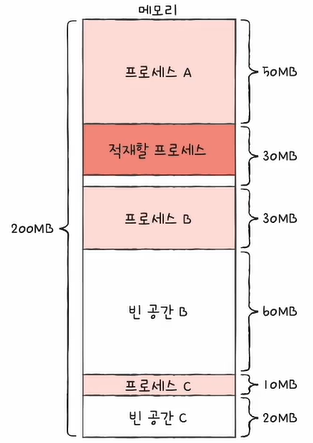

 

### 2-2. 최적 적합 (Best-Fit)
운영체제가 빈 공간을 모두 검색해 본 뒤, 적재 가능한 가장 작은 공간에 할당하는 방식입니다.

 

### 2-3. 최악 적합 (Worst-Fit)
운영체제가 빈 공간을 모두 검색해 본 뒤, 적재 가능한 가장 큰 공간에 할당하는 방식입니다.

 
이와 같이 프로세스를 연속적으로 메모리에 할당하는 방식은 사실 메모리를 효율적으로 사용하는 방법은 아닙니다.  
그 이유는 외부 단편화(External Fragmentation)라는 문제가 발생하기 때문입니다.
 
 
 

## 3. 외부 단편화
프로세스들이 실행되고 종료되길 반복하며 메모리 사이사이에 발생하는 빈 공간을 의미합니다.  
즉, 프로세스를 할당하기 어려울 만큼 작은 메모리 공간들로 인해 메모리가 낭비되는 현상을 일컫습니다.
 
 
이 외부 단편화를 해결하기 위한 대표적인 방법으로 크게 두 가지가 있습니다.
 
 

### 3-1. 메모리 압축 (Compaction)
여기저기 흩어져 있는 빈 공간들을 하나로 모으는 방식입니다.  
즉, 프로세스를 적당히 재배치시켜 흩어져 있는 작은 빈 공간들을 하나의 큰 빈 공간으로 만드는 방법입니다.

하지만 메모리 압축은 프로세스를 재배치하는 과정에서 많은 오버헤드를 야기할 뿐만 아니라 프로세스들은 자기가 해야 할 일을 제대로 하지 못하는 경우도 발생합니다.
 
 
따라서 현대 운영체제에서 외부 단편화를 최소화하기 위해 선택하는 가장 대중적인 방식은 가상 메모리 기법입니다.
 
 

### 3-2. 가상 메모리 기법
가상 메모리는 실행하고자 하는 프로그램을 일부만 메모리에 적재하여, 실제 물리 메모리 크기보다 더 큰 프로세스를 실행할 수 있게 하는 기술입니다.
 
 
가상 메모리 기법에는 페이징과 세그먼테이션 방법이 있고 이 중 페이징에 대하여 자세히 알아보도록 하겠습니다.
 
 
 
 
 
 

# 페이징을 통한 가상 메모리 관리
페이징이란 프로세스의 논리 주소 공간을 페이지라는 일정 단위로 자르고, 메모리의 물리 주소 공간을 프레임이라는 페이지와 동일한 일정한 단위로 자른 뒤, 페이지를 프레임에 할당하는 가상 메모리 기법입니다.
 
 
아래의 외부 단편화의 예시를 보며 이해할 수 있습니다.

위의 그림과 같이 각기 다른 크기의 프로세스가 메모리에 연속적으로 할당되었기 때문에 외부 단편화가 발생하는 것입니다.
 

만약 위의 그림과 같이 메모리에 적재되는 대상이 모두 일정한 크기를 가지고 있다면 외부 단편화는 발생하지 않습니다.  
이와 같이 페이징은 모든 프로세스를 일정한 크기로 자르고, 이를 메모리에 불연속적으로 할당함으로써 외부 단편화를 해결합니다.
 
 

## 1. 페이징에서의 스와핑
프로세스 단위의 스왑 인, 스왑 아웃이 아닌 페이지 단위의 스왑 인(페이지 인), 스왑 아웃(페이지 아웃) 방식으로 스와핑을 할 수 있습니다.
 

메모리에 적재될 필요가 없는 페이지들은 보조기억장치로 페이지 아웃하고, 실행에 필요한 페이지들은 메모리로 페이지 인 합니다.
 
 
페이지 인과 페이지 아웃이라는 기술은 어떤 프로세스를 실행하기 위해 모든 페이지가 메모리에 다 저장되어 있을 필요가 없다는 것을 의미합니다.  
즉, 물리 메모리보다 큰 프로세스도 실행될 수 있습니다.
 
 
반면, CPU 입장에서는 프로세스를 이루는 페이지가 어느 프레임에 적재되어 있는지 일일이 알기가 어렵습니다.  
만약 연속 메모리 할당 방식이었다면 순차적으로 실행하면 되지만, 불연속적으로 배치되어 있다면 순차적으로 실행할 수 없습니다.  
즉, CPU가 다음에 실행할 명령어 위치를 찾기 어려워집니다.
 
 
이를 해결하기 위해 사용되는 개념이 페이지 테이블입니다.
 
 
 

## 2. 페이지 테이블
실제 메모리 내의 주소인 물리 주소에 불연속적으로 배치되더라도, CPU가 바라보는 주소인 논리 주소에는 연속적으로 배치되도록 하는 방법입니다.  
쉽게 말해 페이지 번호와 프레임 번호를 짝지어 주는 일종의 이정표라 할 수 있습니다.
 
 
또한 페이지 테이블은 프로세스마다 존재합니다.
 

위의 그림과 같이 물리적으로 분산되어 저장되어 있더라도, CPU 입장에서 바라본 논리 주소는 연속적으로 보이게 됩니다.  
따라서 CPU는 그저 논리 주소를 순차적으로 실행하면 됩니다.
 
 

### 2-1. 페이지 테이블 엔트리 (PTE; Page Table Entry)
페이지 테이블의 각각의 행을 페이지 테이블 엔트리라 합니다.  
페이지 테이블 엔트리에는 페이지 번호, 프레임 번호뿐만 아니라 다양한 정보가 담겨있습니다.
* #### 유효 비트
  유효 비트는 현재 해당 페이지에 접근 가능한지를 나타냅니다. (1-메모리에 적재, 0-보조기억장치에 적재)  
  즉, 현재 페이지가 스왑 영역으로 쫓겨나 있는지, 메모리에 적재되어 있는지를 나타내는 것입니다.

  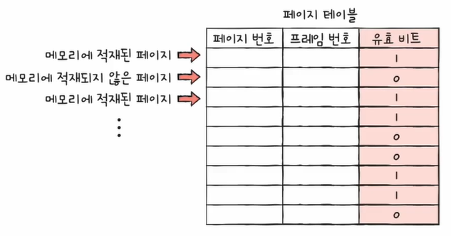

  만약 유효 비트가 9인 페이지에 접근하려고 하면 페이지 폴트라는 인터럽트가 발생합니다.
* #### 보호 비트
  페이지 보호 기능을 위해 존재하는 비트입니다.  
  즉, 페이지에 접근할 권한을 제한하여 페이지를 보호하는 것입니다.

  

* #### 참조 비트
  CPU가 이 페이지에 접근한 적이 있는지를 나타냅니다.  
  한 번이라도 접근한 적이 있다면 1로 표시됩니다.

  

* #### 수정 비트 (dirty bit)
  CPU가 이 페이지에 데이터를 쓴 적이 있는지를 나타냅니다.  
  한 번이라도 수정된 적이 있다면 1로 표시됩니다.

  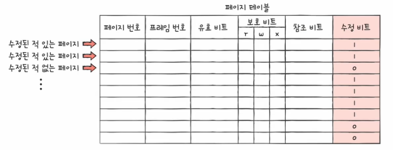

  수정 비트는 페이지가 메모리에서 사라질 때, 보조기억장치의 쓰기 작업을 해야 되는지 판단을 위해 존재합니다.  
  수정된 페이지는 스왑 아웃될 때 보조기억장치에도 쓰기 작업을 거쳐야 합니다.
 
 

## 3. 내부 단편화
페이징은 외부 단편화는 해결할 수 있지만, 내부 단편화를 야기할 수 있습니다.  
내부 단편화란 하나의 페이지 크기보다 작은 크기로 발생하는 메모리 낭비 문제를 의미합니다.
 
 
예를 들어, 페이지의 크기가 10KB이고, 프로세스의 크기가 108KB라면, 마지막 페이지에서는 2KB가 남기 때문에 이때 내부 단편화가 발생하게 됩니다.
 
 
 

## 4. 프로세스 테이블 베이스 레지스터 (PTBR; Process Table Base Register)
프로세스마다 페이지 테이블이 있고, PTBR은 각 프로세스의 페이지 테이블이 적재된 주소를 가리킵니다.

 
그런데 페이지 테이블이 모두 메모리에 저장되어 있는 것은 메모리 접근 시간이 두 배로 늘어나는 단점이 됩니다.  
페이지 테이블을 참조하기 위해 한 번, 페이지를 참조하기 위해 한 번, 총 두 번 접근하게 됩니다.  
때문에 TLB라는 특별한 캐시 메모리를 이용하게 됩니다.
 
 
 

## 5. TLB
CPU 곁에 페이지 테이블의 캐시 메모리입니다. 이는 페이지 테이블의 일부를 가져와 저장합니다.
 

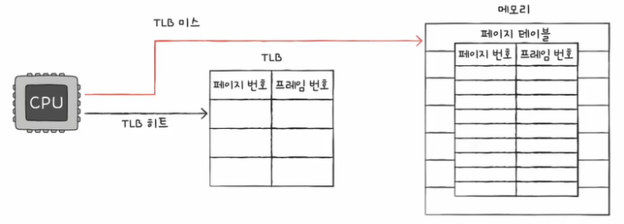

CPU가 접근하려는 논리 주소가 TLB에 있다면 TLB 히트가 되어 메모리에 한 번 접근하게 되고,  
CPU가 접근하려는 논리 주소가 TLB에 없다면 TLB 미스가 되어 메모리에 두 번 접근하게 됩니다.

 
 

## 6. 페이징에서의 주소 변환
페이징을 사용하는 시스템에서 특정 주소에 접근하고자 한다면 어떤 페이지/프레임에 접근하고 싶은지 와 접근하려는 주소가 그 페이지/프레임으로부터 얼마나 떨어져 있는지에 대한 정보가 필요합니다.
 
 
이를 위해 페이징 시스템에서의 논리 주소는 페이지 번호와 변위로 이루어져 있습니다.
 
* 페이지 번호 : 접근하고자 하는 페이지의 번호  
* 변위 : 접근하고자 하는 주소가 페이지에서 얼마큼 떨어져 있는지에 대한 정보

즉, 페이징 시스템에서의 [페이지 번호, 변위]로 이루어진 논리 주소는 페이지 테이블을 통해 [프레임 번화, 변위]로 변환된다는 것입니다.
 
 
 

## 7. 쓰기 시 복사
페이징은 외부 단편화 문제를 해결하는 것 외에도 다양한 이점이 있는데, 그중 대표적으로 프로세스 간의 페이지를 공유할 수 있다는 장점이 있습니다.  
프로세스 간의 페이지를 공유하는 대표적인 예시로 쓰기 시 복사가 있습니다.
 
 
일반적으로 fork() 하게 되면 부모 프로세스가 적재된 별도의 공간에 자식 프로세스가 통째로 복제되어 적재됩니다.  
이는 프로세스 생성 시간이 지연되고, 메모리가 낭비될 수 있다는 단점이 존재합니다.
 
 
이러한 문제를 해결할 수 있는 것이 쓰기 시 복사(copy on write)입니다.
 
 
쓰기 시 복사는 부모 프로세스와 동일한 자식 프로세스가 복제되어 생성되면, 자식 프로세스는 부모 프로세스와 동일한 프레임을 가리킵니다. (쓰기 작업이 없다면 상태 유지)  
즉, 부모 프로세스나 자식 프로세스 둘 중 하나가 페이지에 쓰기 작업을 수행하게 되면, 해당 페이지는 별도의 공간으로 복제되는 것입니다.  
따라서, 프로세스 생성 시간을 절약하고, 메모리를 절약할 수 있게 됩니다.
 
 
 

## 8. 계층적 페이징 (다단계 페이지 테이블)
프로세스 테이블의 크기는 생각보다 작지 않습니다.  
프로세스의 크기가 커지면 프로세스 테이블의 크기도 커질 수 있기 때문에, 프로세스를 이루는 모든 페이지 테이블 엔트리를 메모리에 두는 것은 큰 낭비로 이어질 수 있습니다.
 
 
때문에 프로세스를 이루는 모든 페이지 테이블 엔트리를 항상 메모리에 유지하지 않게 하는 방법이 필요하고, 이를 해결할 수 있는 방법이 계층적 페이징입니다.
 
 
계층적 페이징이란 페이지 테이블을 페이징 하여 여러 단계의 페이지를 두는 방식입니다.

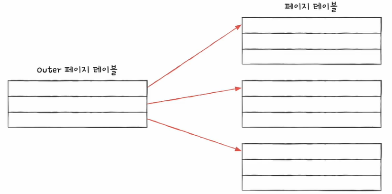

쉽게 말해, 페이지 테이블을 여러 페이지로 쪼개고 이 페이지를 가리키는 페이지 테이블(Outer 페이지 테이블)을 두는 방식입니다.
 
 
이 계층적 페이징을 통해 모든 페이지 테이블을 항상 메모리에 둘 필요가 없어지고, CPU와 가장 가까이 위치한 Outer 페이지 테이블만 항상 메모리에 유지하게 됩니다.
 

### 8-1. 계층적 페이징의 논리 주소
일반적으로 시스템에서 논리 주소는 페이지 번호와 변위로 이루어져 있습니다.

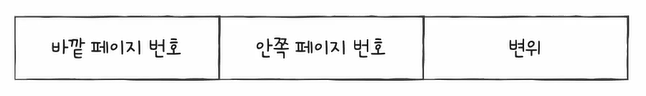

계층적 페이징을 이용하는 시스템에서의 논리 주소는 바깥 페이지 번호와 안쪽 페이지 번호 그리고 변위로 이루어져 있습니다.
 

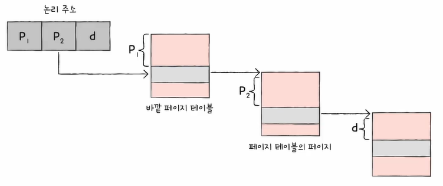

이렇게 바깥 페이지 번호를 통해 페이지 테이블의 페이지를 찾고, 페이지 테이블의 페이지를 통해 프레임 번호를 찾고, 변위를 더함으로써 물리 주소를 얻어냅니다.
 
 
 
 
 
 

# 페이지 교체 알고리즘
처음부터 모든 페이지를 적재하지 않고 필요한 페이지만을 메모리에 적재하는 기법을 요구 페이징이라 합니다.  
즉, 요구되는 페이지만 적재합니다.
 
 
이러한 요구 페이징 시스템이 안정적으로 작동되기 위해서는 페이지 교체와 프레임 할당 문제가 해결되어야 합니다.
 
 
요구 페이징 기법으로 페이지들을 적재하다 보면 언젠간 메모리가 가득 차게 됩니다. 때문에 당장 실행에 필요한 페이지를 적재하려면 적재된 페이지를 보조기억장치로 내보내야 합니다.
 
 
이때 어떤 페이지를 내보내야 하는지를 결정하는 것이 페이지 교체 알고리즘입니다.
 
 
일반적으로 페이지 폴트가 적은 알고리즘을 좋은 알고리즘이라 할 수 있습니다. 페이지 폴트가 발생하면 보조기억장치에 접근해야 해서 성능이 저하되기 때문입니다.
 
 
이때 페이지 폴트의 횟수를 확인하기 위해서 페이지 참조열(Page Reference String)이라는 개념을 사용합니다.  
페이지 참조열이란 CPU가 참조하는 페이지들 중 연속된 페이지를 생략한 페이지열입니다.
 
 

## 1. FIFO 페이지 교체 알고리즘
가장 단순한 방식으로, 메모리에 가장 먼저 올라온 페이지부터 내쫓는 방식입니다.

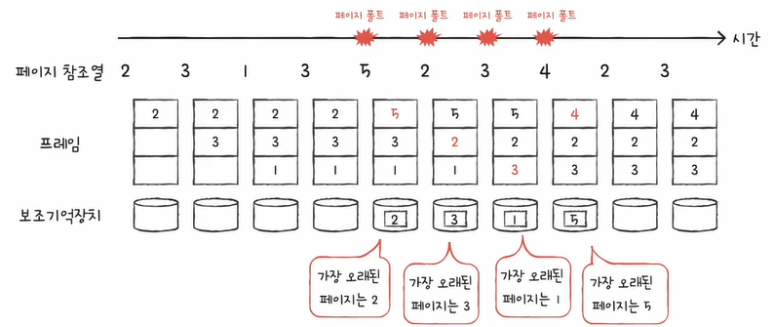

이 방법은 프로그램 실행 내내 사용될 페이지 또한 먼저 적재되었다는 이유로 내쫓아 버릴 수 있어서 성능 면에서 그렇게 좋은 방식은 아닙니다.
 
 
 

## 2. 2차 기회(Second-Chance) 페이지 교체 알고리즘
FIFO 페이지 교체 알고리즘의 부작용을 보완하는 변형 방식입니다.  
이름 그대로 한 번 더 페이지한테 기회를 주는 알고리즘입니다.
 
 
메모리에서 가장 오랫동안 머물렀던 페이지를 내쫓는 것은 같으나, 페이지 참조 비트가 1일 경우 바로 내쫓지 않고 적재된 시간을 현재 시간으로 설정하고 다시 맨 끝으로 보내게 됩니다.
 
 
이때 참조 비트가 1인 것은 CPU가 한 번 참조한 적이 있는 페이지이고, 참조 비트가 0인 것은 CPU가 참조한 적이 없는 페이지를 의미합니다.

위의 그림과 같이 페이지 3은 참조 비트가 1이기에, 바로 내쫓지 않고 참조 비트를 0으로 바꾸고 끝으로 보내게 됩니다.
 
 
 

## 3. 최적 페이지 교체 알고리즘
CPU에 의해 참조되는 횟수를 고려하는 알고리즘입니다.  
메모리에 오래 남아야 할 페이지는 자주 사용될 페이지이고, 메모리에 없어도 될 페이지는 오랫동안 사용되지 않을 페이지입니다.  
즉, 앞으로의 사용 빈도가 가장 낮은 페이지를 교체하는 알고리즘입니다.

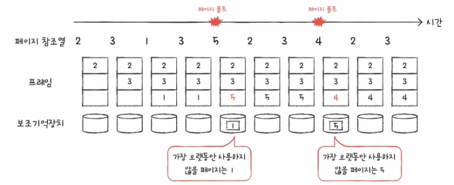

가장 낮은 페이지 폴트율을 보장하는 페이지 교체 알고리즘이지만, 실제 구현이 어렵습니다.  
앞으로 오랫동안 사용되지 않을 페이지를 예측하는 것이 어렵기 때문입니다.  
때문에 다른 페이지 교체 알고리즘 성능을 평가하기 위한 하한선으로만 간주됩니다.
 
 
 

## 4. LRU(Least Recently Used) 페이지 교체 알고리즘
최적 페이지 교체 알고리즘이 가장 오래 사용되지 않을 페이지를 교체하는 방식이라면, LRU 페이지 교체 알고리즘은 가장 오래 사용되지 않은 페이지를 교체하는 방식입니다.

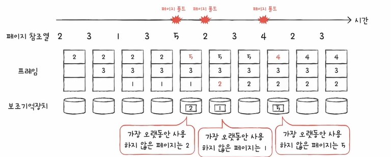

 
 
 
 
 

# 프레임 할당
페이지 폴트가 자주 발생하는 이유에는 나쁜 페이지 교체 알고리즘뿐만 아니라, 하나의 프로세스가 사용할 수 있는 프레임 수 자체가 적어도 발생하게 됩니다.  
즉, 프로세스가 사용할 수 있는 프레임 수가 많으면 페이지 폴트 빈도는 감소하게 됩니다.
 
 
그리고 프로세스가 실행되는 시간보다 페이징에 더 많은 시간을 소요하여 성능이 저해되는 문제를 스래싱이라 합니다.  
즉, 빈번한 페이지 교체로 인해 CPU 이용률이 낮아지는 문제를 뜻합니다.

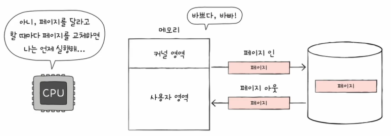

 
스래싱을 그래프로 표현하자면 아래와 같으며, 동시 실행되는 프로세스의 수를 늘린다고 CPU 이용률이 높아지는 것은 아닙니다.

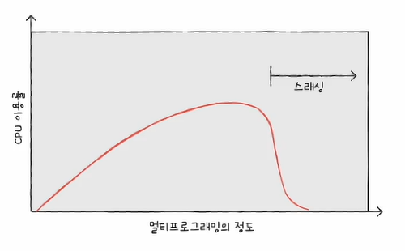

 
이 스래싱이 발생하는 근본적인 이유는 각 프로세스가 필요로 하는 최소한의 프레임 수가 보장되지 않았기 때문입니다.  
즉, 각 프로세스가 필요로 하는 최소한의 프레임 수를 파악하고 프로세스들에게 적절한 프레임을 할당해 주어야 합니다.
 
 

## 1. 균등 할당 (equal allocation)
모든 프로세스들에게 균등하게 프레임을 할당하는 가장 단순한 방식입니다.  
하지만 프로세스들의 크기는 각기 다를 텐데 동일한 프레임의 수를 할당하는 것은 비합리적입니다.
 
 
 

## 2. 비례 할당 (proportional allocation)
프로세스 크기에 비례하여 프레임을 할당하는 방식입니다.  
참고로 균등 할당과 비례 할당은 프로세스의 실행 과정을 고려하지 않고 단순히 프로세스의 크기나 물리 메모리의 크기만을 고려하는 정적할당 방식입니다.
 
 
하지만 프로세스의 크기가 물리적으로 클지라도 막상 실행해 보면 많은 프레임이 필요하지 않은 경우도 있습니다.  
즉, 결국 프로세스가 필요로 하는 프레임 수는 실행을 해봐야 알기 때문에 이 방식 또한 완벽하지 않습니다.
 
 
그렇기 때문에 프로세스를 실행하는 과정에서 프레임을 결정하는 방식이 필요한데, 크게 작업 집합 모델을 활용하는 방식과 페이지 폴트 빈도를 사용하는 방식이 있습니다.
 
 

### 2-1. 작업 집합 모델
작업 집합이란 실행 중인 프로세스가 일정 시간 동안 참조한 페이지의 집합이라고 볼 수 있습니다.  
즉, 프로세스가 실행하는 과정에서 배분할 프레임을 결정하는 방식입니다.
 
 
스레싱이 발생하는 이유는 빈번한 페이지 교체 때문이고, 이를 해결하기 위해서는 CPU가 특정 시간 동안 주로 참조한 페이지 개수만큼만 프레임을 할당하면 됩니다.  
즉, 프로세스가 일정 기간 동안 참조한 페이지 집합을 기억하여 빈번한 페이지 교체를 방지하는 것입니다.
 
 

### 2-2. 페이지 폴트 빈도
프로세스가 실행하는 과정에서 배분할 프레임을 결정하는 방식입니다.  
페이지 폴트율에 상한선과 하한선을 정하고, 그 내부 범위 안에서만 프레임을 할당하는 방식입니다.
 
 
작업 집합 모델 기반의 프레임 할당 방식과 페이지 폴트 빈도 기반의 프레임 할당 방식은 프로세스가 실행하는 과정을 통해서 프레임을 할당하기에 동적 할당 방식입니다.
