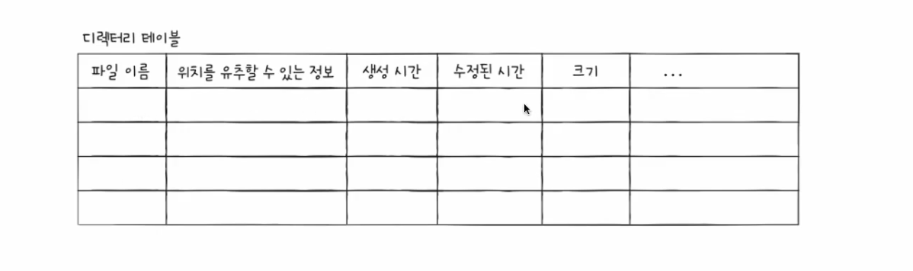

# 교착상태

## 교착상태

- 여러 프로세스가 서로 자원을 기다리며 무한히 대기하는 상태

## 교착상태 해결 방안

1. 교착상태가 발생했을 때의 상황 표현해보기 → 자원 할당 그래프
2. 교착상태가 일어난 근본적인 원인 해결 → 상호배제, 점유와대기, 비선점, 원형대기

### 자원 할당 그래프

- 교착 상태 발생 조건 파악 가능
    - 어떤 프로세스가 자원을 사용 중인지,,,
    - 어떤 프로세스가 자원 사용 대기 중인지,,,

### 교착상태 발생 조건

→ 아래 조건을 모두 해당될 경우 교착상태 발생함

1. 상호배제
- 한 프로세스가 사용하는 자원을 다른 프로세스가 사용할 수 없는 상태
1. 점유와대기
- 자원을 할당받은 상태에서 다른 자원을 할당받기를 기다리는 상태
1. 비선점
- 어떤 프로세스도 다른 프로세스의 자원을 강제로 빼앗지 못하는 상태
1. 원형대기
- 프로세스들이 원의 형태로 자원을 대기하는 상태

## 교착상태 해결 방법

- 예방, 회피, 검출 후 회복

### 예방

→ 교착 상태 발생 조건 중 하나 해결(없애기)

1. 상호배제
- 모든 자원을 공유가능하게 만듦 → 현실적으로 불가능
1. 점유와대기
- 특정 프로세스에 모든 자원 할당, 아예 할당하지 않기 → 자원의 활용률을 낮출 수 있는 방법
1. 비선점
- 선점이 가능한 자원(ex. CPU,,) 에 한해서는 효과적 → 모든 자원이 선점 가능하지는 않음
1. 원형대기
- 자원에 번호를 붙이고 오름차순으로 할당 → 자원에 번호를 붙이는 것이 어렵고, 어떤 자원에 어떤 번호를 부여하는지에 따라 자원 활용률이 달라짐

### 회피

- 배분할 수 있는 자원의 양을 고려하여 교착 상태가 발생하지 않을 만큼만 자원을 배분하는 방법
- 안전 순서열 : 교착 상태 없이 안전하게 프로세스들에 자원을 할당할 수 있는 순서
- 안전 상태 : 교착 상태 없이 모든 프로세스가 자원을 할당 받고 종료될 수 있는 상태
- 불안전 상태 : 교착 상태가 발생할 수도 있는 상태

### 검출 후 회복

- 교착 상태의 발생을 인정하고 사후에 조치하는 방식
- 종류 : 선점을 통한 회복, 프로세스 강제 종료를 통한 회복
- 선점을 통한 회복 :
    - 교착 상태가 해결될 때까지 한 프로세스씩 자원을 몰아주는 방식
- 프로세스 강제 종료를  통한 회복 :
    - 교착 상태에 놓인 프로세스 모두 강제 종료 → 작업 내역을 잃을 수 있음
    - 교착 상태가 해결될 때까지 한 프로세스씩 강제 종료 → 오버헤드