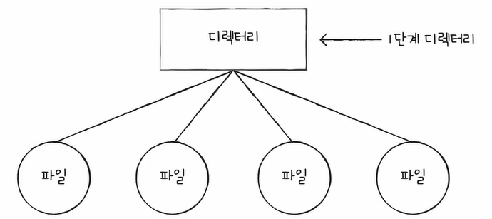
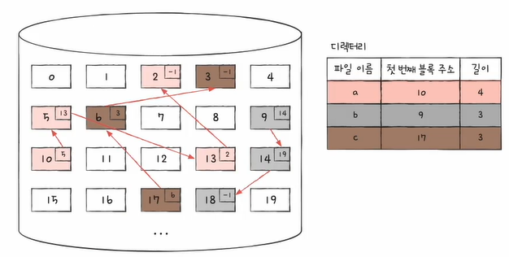
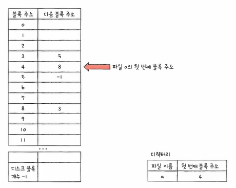
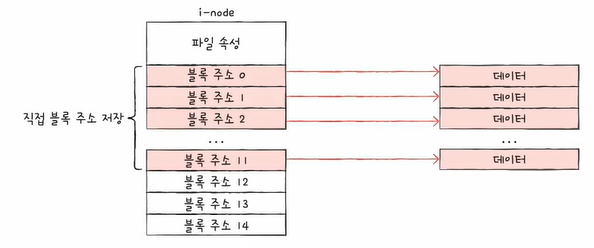
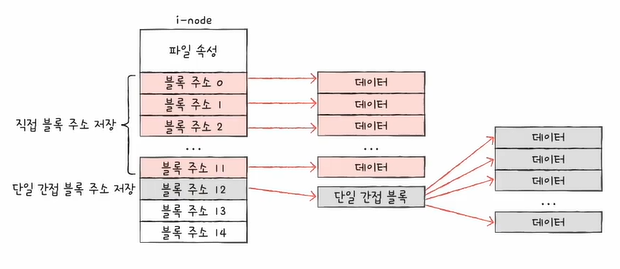
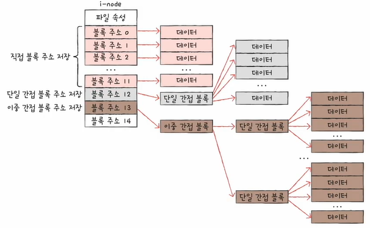
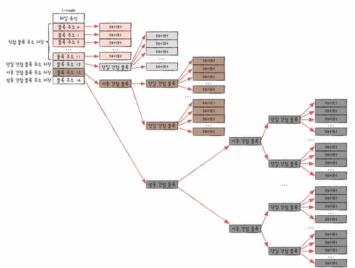

# 파일
보조기억장치에 저장된 관련 정보의 집합입니다.  
즉, 의미 있고 관련 있는 정보를 모은 논리적 단위입니다.
 
 
파일에는 파일을 실행하기 위한 정보와 부가 정보(속성, 메타 데이터)가 있습니다.
 
 
또한 파일을 다루는 모든 작업들은 전부 운영체제에 의해서 이루어집니다.  
즉, 운영체제의 시스템 호출을 통해서 부탁을 해야 합니다.
 
 
때문에 운영체제는 파일 연산을 위한 시스템 호출을 제공합니다. (생성, 삭제, 열기, 닫기, 읽기, 쓰기 등)
 
 
 
 
 
 
# 디렉터리
옛날 운영체제에서는 기본적으로 하나의 디렉터리만 존재하고, 이 아래에 다양한 파일들이 존재하는 구조였습니다.

 
 
요즘은 컴퓨터 용량이 커짐에 따라 저장할 수 있는 파일들이 늘어남으로써, 여러 개의 디렉터리가 계층적으로 구성되어 있습니다.

위와 같이 계층적 구조를 가진 디렉터리를 Tree 구조 디렉터리라고도 부릅니다.
 
 
이와 같이 디렉터리를 계층적으로 관리함에 따라 경로라는 개념이 생겨나게 됩니다.  
경로란 디렉터리를 이용해 파일/디렉터리의 위치 그리고 나아가 이름까지 특정 지을 수 있는 정보입니다.
 
 
경로는 절대 경로와 상대 경로로 나뉩니다.  
절대 경로란 루트 디렉터리에서 자기 자신까지 이르는 고유한 경로를 의미합니다.  
상대 경로란 현재 디렉터리에서 자기 자신까지 이르는 경로를 의미합니다.
 
 
또한 디렉터리도 연산을 위한 시스템 호출을 제공합니다. (생성, 삭제, 열기, 닫기, 읽기 등)
 
 
사실 많은 운영체제에서는 디렉터리를 그저 특별한 형태의 파일로 간주합니다.  
즉, 디렉터리는 그저 포함된 정보가 조금 특별한 파일로 간주합니다.
 
 
예를 들어, 파일의 내부에는 파일과 관련된 정보들이 있다면, 디렉터리의 내부에는 해당 디렉터리에 담겨 있는 대상과 관련된 정보들이 담겨 있습니다.
 
 
디렉터리 내부의 정보들은 보통 테이블(표) 형태로 구성이 됩니다.

각 엔트리(행)에는 디렉터리에 포함된 대상의 이름과 그 대상이 보조기억장치 내에 저장된 위치가 담겨 있습니다.
 
 
 
 
 
 
# 파일 시스템
파일과 디렉터리를 관리하는 운영체제 내의 프로그램입니다.  
즉, 보조기억장치에 저장되어 있는 데이터 덩어리일 뿐인 파일과 디렉터리를 운영체제가 일목요연하게 관리해 주는 것입니다.
 
 
먼저 파일 시스템에 대해 알기 전 파티셔닝과 포매팅의 개념에 대해 이해하고 넘어가겠습니다.
 
 
## 1. 파티셔닝과 포매팅
* #### 파티셔닝
  저장 장치의 논리적인 영역을 구획하는 작업입니다.  
  쉽게 말해, 칸막이로 보조기억장치의 영역을 나누는 것이라고 볼 수 있습니다.
* #### 포매팅
  파일 시스템을 설정하여, 어떤 방식으로 파일을 관리할지 결정하고, 새로운 데이터를 쓸 준비하는 작업입니다.  
  또한 파일 시스템에는 여러 종류가 있고, 파티션마다 다른 파일 시스템을 설정할 수 있습니다.
 
 
새 하드 디스크/SSD는 파티셔닝과 포매팅을 해야 파일 시스템을 통해 파일/디렉터리에 접근할 수 있습니다.
 
 
 

## 2. 파일 할당 방법
운영체제는 파일/디렉터를 블록 단위로 읽고 씁니다.  
즉, 하나의 파일이 보조기억장치에 저장될 때에는 여러 블록에 걸쳐 저장됩니다.
 
 
파일을 할당하는 방법에는 크게 두 가지의 방법이 있습니다.
 
 
### 2-1. 연속 할당
보조기억장치 내 연속적인 블록에 파일을 할당하는 방식입니다.  
즉, 파일이 저장 장치 내에서 연속적인 공간을 차지하도록 블록을 할당하는 방식입니다.

연속된 파일에 접근하기 위해 파일의 첫 번째 블록 주소와 블록 단위의 길이만 알면 됩니다.
 
 
연속 할당은 구현이 단순하지만 외부 단편화를 야기할 수 있는 부작용이 있습니다.

위와 같이 파일이 사용되다가 삭제되면, 해당 블록을 초과하는 파일을 할당할 수 없게 됩니다.  
때문에 최근에는 불연속 할당이 더 많이 사용됩니다.
 
 
### 2-2. 불연속 할당 - 연결 할당
각 블록의 일부에 다음 블록의 주소를 저장하여 각 블록이 다음 블록을 가리키는 형태로 할당하는 방식입니다.  
이는 파일을 이루는 데이터 블록을 연결 리스트로 관리합니다.

불연속 할당은 파일이 여러 블록에 흩어져 저장되어도 무방하다는 장점이 있습니다.
 
 
하지만 반드시 첫 번째 블록부터 하나씩 읽어들여야 하며, 오류 발생 시 해당 블록 이후 블록은 접근이 어렵다는 단점이 있습니다.
 
 
### 2-3. 불연속 할당 - 색인 할당
파일의 모든 블록 주소를 색인 블록이라는 하나의 블록에 모아 관리하는 방식입니다.

파일 내 임의의 위치에 접근하기 용이합니다.
 
 
 
## 3. 파일 시스템
### 3-1. FAT 파일 시스템
연결 할당 기반이며, 각 블록에 포함된 다음 블록 주소를 한데 모아 테이블로 관리하여 연결 할당의 단점을 보완한 파일 시스템입니다.
 
 

위와 같이 모든 블록 안에 다음 번지 블록의 주소를 기록했기 때문에 연결 할당 방식의 단점이 발생합니다.  
이때 각 블록에 포함된 모든 다음 블록의 주소를 하나의 테이블 형태로 관리를 하면 단점을 어느 정도 해소할 수 있습니다.
 
 
이때 사용하는 테이블을 FAT(File AllocationTable)이라 합니다.

 
 
### 3-2. 유닉스 파일 시스템
색인 할당 기반 파일 시스템입니다.
 
 
색인 블록(inode)은 파일의 속성 정보와 15개의 블록 주소를 저장할 수 있습니다.  
즉, inode만 읽어도 파일의 속성이 무엇이지 어디에 저장되어 있는지를 확인할 수 있습니다.

 
 
이 inode는 유닉스 파일 시스템에서 파티션 내에 특정 영역에 모여 저장되어 있습니다.
 
 
만약 하나의 inode 만으로 저장된 위치를 저장하기 어려운 큰 파일들은 다음과 같이 해결합니다.  
#### ① 블록 주소 중 12개에는 직접 블록 주소를 저장합니다.  
직접 블록이란 파일 데이터가 저장된 블록입니다.

 
 
#### ② 1번으로 충분하지 않다면, 13번째 주소에 단일 간접 블록 주소를 저장합니다.  
단일 간접 블록이란 파일 데이터를 저장한 블록 주소가 저장된 블록입니다.  
즉, 데이터의 주소를 저장한 블록의 주소를 저장하는 것입니다.

 
 
#### ③ 2번으로 충분하지 않다면, 14번째 주소에 이중 간접 블록 주소를 저장합니다.  
이중 간접 블록이란 단일 간접 블록들의 주소를 저장하는 블록입니다.  

 
 
#### ④ 3번으로 충분하지 않다면, 15번째 주소에 삼중 간접 블록 주소를 저장합니다.  
삼중 간접 블록이란 이중 간접 블록들의 주소를 저장하는 블록입니다.  

