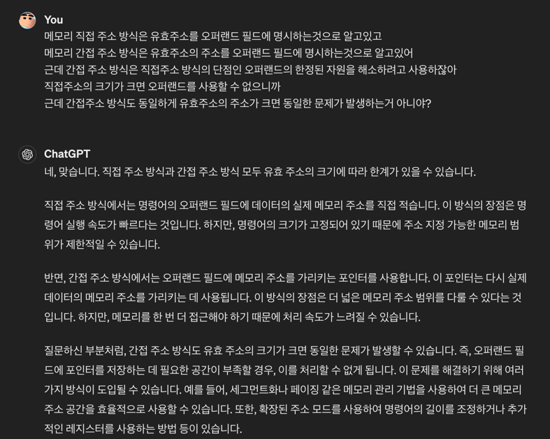

## 1. 명령어의 구조

### 1-1 연산 코드

연산 코드란 ALU(산술 논리 장치)에서 수행할 연산을 나타내며 연산 코드에 따라 명령어가 수행됩니다.

#### 데이터 전송 명령어
1. MOVE : 데이터를 전송하는 명령어
2. PUSH : 스택에 데이터를 저장하는 명령어
3. POP : 스택에서 데이터를 꺼내는 명령어
4. STORE : 메모리에 데이터를 저장하는 명령어
5. LOAD : 메모리에서 데이터를 읽어오는 명령어

#### 산술/논리 연산 명령어
1. ADD : 덧셈 연산을 수행하는 명령어
2. SUBTRACT : 뺄셈 연산을 수행하는 명령어
3. MULTIPLY : 곱셈 연산을 수행하는 명령어
4. DIVIDE : 나눗셈 연산을 수행하는 명령어
5. INCREMENT : 증가 연산을 수행하는 명령어
6. DECREMENT : 감소 연산을 수행하는 명령어
7. AND : 논리곱 연산을 수행하는 명령어
8. OR : 논리합 연산을 수행하는 명령어
9. XOR : 배타적 논리합 연산을 수행하는 명령어
10. NOT : 부정 연산을 수행하는 명령어
11. COMPARE : 비교 연산을 수행하는 명령어

#### 제어 흐름 변경 명령어
1. JUMP : 프로그램의 실행 위치를 변경하는 명령어
2. CONDITIONAL JUMP : 조건에 따라 프로그램의 실행 위치를 변경하는 명령어
3. CALL : 서브루틴을 호출하는 명령어
4. RETURN : 서브루틴에서 복귀하는 명령어
5. HALT : 프로그램을 종료하는 명령어

CALL과 RETURN 같은 경우에 함수형 프로그래밍에서 사용되는 함수 호출과 반환과 같은 역할을 수행합니다.  
CALL 명령어가 실행되면 현재의 프로그램 카운터 값을 스택에 저장하고 메모리에 있는 명령어를 모두 실행한 뒤 RETRUN가 실행되며 이때 함수의 시작 주소로 이동합니다.  

#### 입출력 제어 명령어
1. READ : 데이터를 입력받는 명령어
2. WRITE : 데이터를 출력하는 명령어

### 1-2 오퍼랜드

오퍼랜드란 연산 코드가 처리할 데이터의 '주소나 값' 입니다.  
값의 크기가 작을 경우 직접적으로 오퍼랜드로 사용되기도 하지만 일반적으로 오퍼랜드는 레지스터나 메모리에 저장된 데이터를 가리키는 주소를 나타냅니다.  
명령어는 여러개의 오퍼랜드를 가질 수 있지만 CPU마다 명령어는 한정된 크기를 가지고 있기 때문에 오퍼랜드의 크기도 제한됩니다.  
오퍼랜드는 크게 레지스터 오퍼랜드와 메모리 오퍼랜드로 나눌 수 있습니다.  

#### 메모리 오퍼랜드
메모리 오퍼랜드란 메모리에 저장된 데이터를 가리키는 주소를 나타내는 오퍼랜드입니다.
cpu가 메모리에 자주 접근하는 것은 성능과 직결될 정도로 중요한 작업이기 때문에 메모리 오퍼랜드를 사용하는 명령어는 성능이 떨어질 수 있습니다.

#### 레지스터 오퍼랜드
레지스터 오퍼랜드란 레지스터에 저장된 데이터를 가리키는 주소를 나타내는 오퍼랜드입니다.
메모리에 접근하는 것보다 레지스터에 접근하는 것이 빠르기 때문에 레지스터 오퍼랜드를 사용하는 명령어가 성능이 더 좋습니다.

## 2. 주소 지정 방식

### 유효 주소
유효 주소란 명령어가 실행할 대상(데이터)의 실제 주소를 나타냅니다.  
이 유효 주소를 통해 cpu가 명령어 실행에 필요한 데이터를 찾아올 수 있습니다.  

### 즉시 주소 방식
즉시 주소 방식은 명령어에 직접적으로 데이터를 포함하는 방식입니다.  
위에 오퍼랜드를 설명할 때 말했듯이 명령어는 한정된 크기를 가지고 있기 때문에 즉시 주소 방식은 데이터의 크기가 작을 때 사용됩니다.  

### 직접 주소 방식
직접 주소 방식은 명령어가 실행할 대상의 유효 주소를 직접 나타내는 방식입니다.  
메모리 주소의 크기가 오퍼랜드의 크기보다 클 때 사용됩니다.  

### 간접 주소 방식
간접 주소 방식은 명령어가 실행할 대상의 주소를 가리키는 유효 주소를 나타내는 방식입니다.
유효 주소의 크기가 오퍼랜드의 크기보다 클 때 사용됩니다.
간접 주소 방식을 사용하면 다른 주소 지정 방식보다 더 많이 메모리를 탐색을 해야하기 때문에 성능적으로 떨어집니다.

