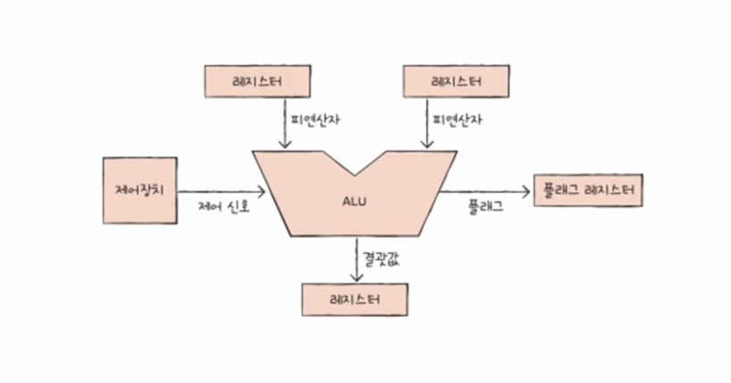
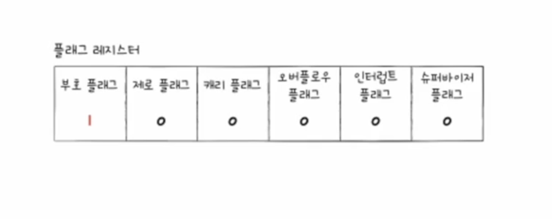
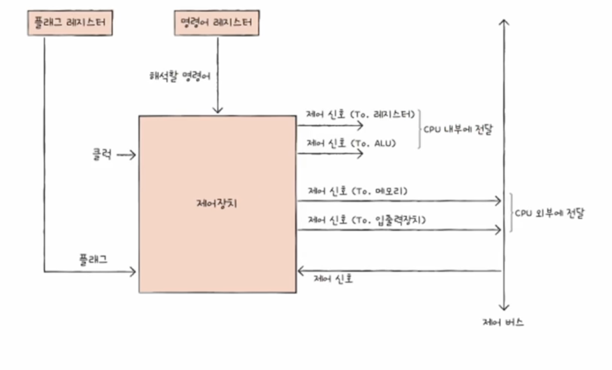
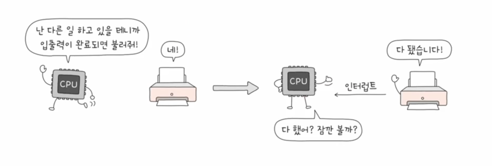

## ALU

ALU는 산술 논리 장치로 CPU의 레지스터에 저장된 데이터를 가져와서 연산을 수행하고 결과를 레지스터에 저장합니다.  
이때 플래그 레지스터에는 연산 결과에 대한 부가 정보가 저장됩니다.  

플래그 레지스터에는 연산 결과가 0인지, 음수인지, 오버플로우가 발생했는지 등의 정보가 저장됩니다.

## 제어 장치

제어 장치는 명령어를 해석하고 실행하는데 필요한 신호를 발생시키는 장치입니다.  
제가 첫 챕터 질문 때 승현 주임님한테 했던 질문중 하나인 cpu는 어느 부품에서 명령어를 해석하는지 질문이 있었는데 이 부분이 제어 장치입니다.  
여기서 저번에 잠깐 언급했던 클럭이라는 개념이 나오는데 클럭은 cpu가 명령어를 실행하는 속도를 조절하는 신호입니다.  
cpu는 클럭 신호가 한 번 발생할 때마다 한 번의 명령어를 실행합니다.  
이때 클럭의 속도를 클럭 주파수라고 하는데 클럭 주파수가 높을수록 cpu의 성능이 좋다고 할 수 있습니다.  
또한 제어 장치는 제어 신호를 내보내기만 하지 않고 외부의 제어 신호를 받아들이기도 합니다.  

## 레지스터
우리가 첫 챕터때 cpu는 시스템 버스를 통해 메모리에 접근한다 배웠습니다.  
cpu는 연산을 할 때 메모리보다 레지스터를 사용하는 이유는 레지스터가 메모리보다 빠르기 때문이라고 알고 있지만 얼마나 유의미하게 속도에 영향을 주는지 파악할 수 없었죠.    
그래서 레디스 관련 아티클을 읽을 때 봤던 지표를 준비해봤습니다.  

### 레지스터의 종류
레지스터의 종류는 cpu마다 다르기 때문에 대부분의 cpu가 공통적으로 가지고 있는 레지스터만 나열하겠습니다.

- 프로그램 카운터
  - 다음에 실행할 명령어의 주소를 저장하는 레지스터입니다.
- 명령어 레지스터
  - 메모리에서 읽어들인 명령어를 저장하는 레지스터입니다.
- 메모리 주소 레지스터
  - 메모리 주소를 저장하는 레지스터입니다.
- 메모리 버퍼 레지스터
  - 메모리에서 읽어들인 데이터를 저장하는 레지스터입니다.
- 플래그 레지스터
  - 위에서 설명했던 연산 결과에 대한 부가 정보를 저장하는 레지스터입니다.
- 범용 레지스터
  - 다른 레지스터들처럼 특정한 역할을 하는 레지스터가 아니라 다양한 용도로 사용할 수 있는 레지스터입니다.
  - 그렇기에 범용 레지스터는 여러 개가 존재합니다.
- 스택 포인터
  - 스택의 가장 위쪽 주소를 저장하는 레지스터입니다.
- 베이스 레지스터
  - 메모리 주소의 기준이 되는 레지스터입니다.

## 명령어 사이클

일반적으로 명령어는 인출 사이클 -> 실행 사이클 로 실행 됩니다.  
하지만 메모리에 접근이 더 필요한 경우에는 인출 사이클 -> 간접 사이클 -> 실행 사이클로 실행됩니다.

## 인터럽트

인터럽트란 cpu가 프로그램을 실행하는 도중에 예외 상황이 발생했을 때 cpu가 현재 실행중인 프로그램을 중단하고 다른 프로그램을 실행하는 것을 말합니다.  
인터럽트는 동기 인터럽트와 비동기 인터럽트(하드웨어 인터럽트)로 나뉩니다.  
현재 챕터에서 공부한건 하드웨어 인터럽트입니다.  
하드웨어 인터럽트란 외부 장치에서 cpu에게 신호를 보내어 cpu가 현재 실행중인 프로그램을 중단하고 다른 프로그램을 실행하는 것을 말합니다.  

만약 하드웨어 인터럽트가 존재하지 않는다면 위처럼 cpu는 계속 해서 외부 장치의 신호를 보내 확인해야 합니다.  

### 인터럽트 실행 계획
1. 입출력장치는 CPU에 인터럽트 요청 신호를 보냅니다.
2. CPU는 실행 사이클이 끝나고 명령어를 인출하기 전 항상 인터럽트 여부를 확인합니다.
3. CPU는 인터럽트 요청을 확인하고 인터럽트 플래그를 통해 현재 인터럽트를 받아들일 수 있는지 여부를 확인합니다.
4. 인터럽트를 받아들일 수 있다면 CPU는 지금까지의 작업을 스택 메모리 영역에 백업합니다.
5. CPU는 인터럽트 벡터를 참조하여 인터럽트 서비스 루틴을 실행합니다.
6. 인터럽트 서비스 루틴 실행이 끝나면 백업해 둔 작업을 복구하여 실행을 재개합니다.

## 궁금했던 점
저는 함수가 호출이 된다면 프로그램 카운터의 실행계획이 변경되는데 이게 성능의 얼마나 안좋은지 궁금해서 gpt한테 물어봤습니다.

