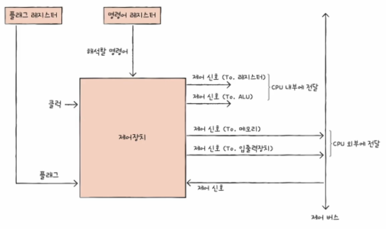
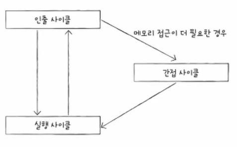

# CPU 작동 원리

인프런 강의 [<혼자 공부하는 컴퓨터 구조 + 운영체제>](https://www.inflearn.com/course/%ED%98%BC%EC%9E%90-%EA%B3%B5%EB%B6%80%ED%95%98%EB%8A%94-%EC%BB%B4%ED%93%A8%ED%84%B0%EA%B5%AC%EC%A1%B0-%EC%9A%B4%EC%98%81%EC%B2%B4%EC%A0%9C/dashboard) 를 바탕으로 정리한 내용입니다.
 
 
 
 
# CPU 구성 요소

## 1. 산술 논리 연산장치 (ALU; Arithmetic Logic Unit)
데이터들 간의 비교, 판단, 연산을 수행하는 계산기 역할입니다.

ALU는 계산에 필요한 정보인 피연산자와 제어 신호를 레지스터와 제어장치로부터 받아들입니다.  
이후 결괏값과 플래그를 레지스터와 플래그 레지스터에 담습니다.
 
 
 
## 2. 제어장치
제어 신호를 내보내고 명령어를 해석하는 장치입니다.

제어장치는 연산 결과의 부가적인 정보가 담긴 플래그와 명령어 레지스터에 저장된 명령어를 해석하여 제어신호를 내보냅니다.  
또한, 제어 신호를 발생시키는 부품은 CPU뿐만 아니라 입출력장치를 비롯한 주변장치들도 제어신호를 발생시키므로 제어 신호도 받아들입니다.
 
 
내보내는 제어 신호에는 CPU 내부에 전달하는 제어 신호가 있고, CPU 외부에 전달하는 제어 신호가 있습니다.
 
 
 
## 3. 레지스터
레지스터는 CPU 내부에 있는 작은 임시저장 장치입니다.  
이 레지스터에 프로그램 속 명령어와 데이터가 실행 전후로 저장됩니다.
 
 
레지스터는 CPU 종류마다 다르지만, 그중 공통적인 레지스터는 다음과 같습니다.

* #### 프로그램 카운터
  메모리에서 가져올/읽어들일 명령어의 주소를 저장합니다.

* #### 명령어 레지스터
  해석할 명령어를 저장합니다.  
  이 명령어 레지스터를 제어장치가 받아들여 해석하고 제어신호를 내보냅니다.

* #### 메모리 주소 레지스터
  메모리의 주소를 저장합니다.  
  CPU가 읽어 들이고자 하는 주소를 주소 버스로 보낼 때 거치는 레지스터입니다.

* #### 메모리 버퍼 레지스터
  메모리와 주고받을 값을 저장합니다.  
  CPU가 정보를 데이터 버스로 주고받을 때 거치는 레지스터입니다.

* #### 플래그 레지스터
  연산 결과 또는 CPU 상태에 대한 부가적인 정보를 저장합니다.

* #### 범용 레지스터
  다양하고 일반적인 상황에서 자유롭게 사용할 수 있는 레지스터입니다.

* #### 스택 포인터
  스택의 꼭대기를 저장합니다. 즉, 스택이 어디까지 차 있는지에 대한 표시입니다.  
  이는 스택과 스택 포인터를 이용한 스택 주소 지정 방식에 사용됩니다.

* #### 베이스 레지스터
  기준 주소를 저장합니다.  
  이는 오퍼랜드 필드의 값과 특정 레지스터의 값을 더하여 유효 주소를 얻는 변위 주소 지정 방식에 사용됩니다.
 
 
 

# 명령어 사이클과 인터럽트
CPU는 메모리에 저장되어 있는 프로그램을 정해진 흐름대로 처리하게 되는데, 이 흐름을 명령어 사이클이라고 부릅니다.  
또한 정해진 흐름을 끊는 신호를 인터럽트라고 부릅니다.
 
 
## 1. 명령어 사이클
일반적으로 CPU는 인출과 실행이 반복됩니다.  
그러나 CPU로 명령어를 가지고 와도 바로 실행이 불가능한 경우도 존재합니다.
 
 
예를 들어 간접 주소 지정 방식은 추가적으로 메모리에도 접근해야 합니다.  
이러한 경우를 위해 간접 사이클이 추가될 수도 있습니다.

* #### 인출 사이클
  CPU가 메모리에 저장된 값을 읽어오는 과정입니다.
* #### 실행 사이클
  CPU가 인출된 명령어를 해석하고 실행하는 과정입니다.
* #### 간접 사이클
  명령어가 포인터를 통해 최종 메모리 주소를 간접적으로 참조하여 데이터를 얻는 추가적인 메모리 접근 과정입니다.

 

## 2. 인터럽트
CPU가 꼭 처리하고 넘어가야 할 작업이 생겼을 때 발생합니다.
 
 
인터럽트는 동기 인터럽트(예외)와 비동기 인터럽트(하드웨어 인터럽트)로 구분됩니다.
 
 
### 2 - 1. 동기 인터럽트
CPU가 예기치 못한 상황을 접했을 때 발생합니다.
 
 
이 동기 인터럽트는 다음과 같이 네 가지 유형으로 분류됩니다.

* #### 폴트
  프로그램의 실행 중 발생한 오류로 인해 실행을 중단하고, 오류를 처리할 수 있는 기회를 제공합니다.
* #### 트랩
  프로그램이 의도적으로 생성하는 인터럽트로, 주로 디버깅 목적으로 사용되거나 시스템 호출을 처리하기 위해 사용됩니다.
* #### 중단
  심각한 오류 발생 시 복구할 수 없는 상태로 인해 발생하는 인터럽트입니다.
* #### 소프트웨어 인터럽트
  프로그램이 명시적으로 인터럽트를 발생시켜 커널의 주목을 끌기 위해 사용합니다.
 

### 2 - 2. 비동기 인터럽트
알림과 같은 역할을 하며, 주로 입출력장치에 의해 발생됩니다.
 
 
이 비동기 인터럽트는 입출력 작업 도중에도 효율적으로 명령어를 처리하기 위해 사용됩니다.  
입출력장치는 CPU에 비해 느리기 때문에, 인터럽트가 없다면 CPU는 프린트 완료 여부를 확인하기 위해 주기적으로 확인해야 합니다.
 
 

### 2 - 3. 인터럽트의 처리 순서
① 입출력장치는 CPU에 인터럽트 요청 신호를 보냅니다.  
② CPU는 실행 사이클이 끝나고 명령어를 인출하기 전 항상 인터럽트 여부를 확인합니다.  
③ CPU는 인터럽트 요청을 확인하고 인터럽트 플래그를 통해 현재 인터럽트를 받아들일 수 있는지를 확인합니다.  
④ 인터럽트를 받아들일 수 있다면 CPU는 지금까지의 작업을 백업합니다.  
⑤ CPU는 인터럽트 벡터를 참조하여 인터럽트 서비스 루틴을 실행합니다.  
⑥ 인터럽트 서비스 루틴 실행이 끝나면 ④에서 백업해 둔 작업을 복구하여 실행을 재개합니다.
 
 
** 인터럽트 요청 신호: CPU의 작업을 방해하는 인터럽트에 대한 요청입니다.  
** 인터럽트 플래그: 인터럽트 요청 신호를 받아들일지 무시할지를 결정하는 비트입니다.  
** 인터럽트 벡터: 각각의 인터럽트를 구분하기 위한 정보입니다. 즉, 인터럽트의 시작 주소를 알 수 있습니다.  
** 인터럽트 서비스 루틴: 인터럽트가 발생했을 때 해당 인터럽트를 어떻게 처리하는지 적힌 프로그램입니다.  
 
 
 
인터럽트가 발생하여 인터럽트 사이클이 발생한 명령어 사이클은 다음과 같습니다.

즉, 명령어 사이클은 인출, 실행, 간접, 인터럽트 사이클로 구성되어 있고, CPU는 이러한 흐름에 따라 처리하게 됩니다.

