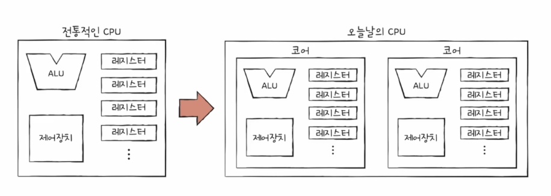
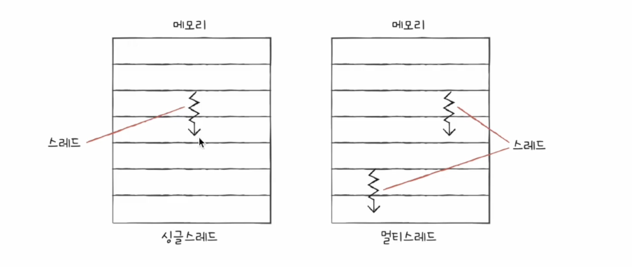
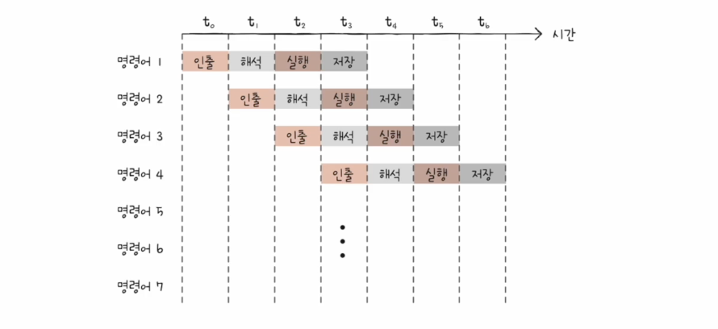
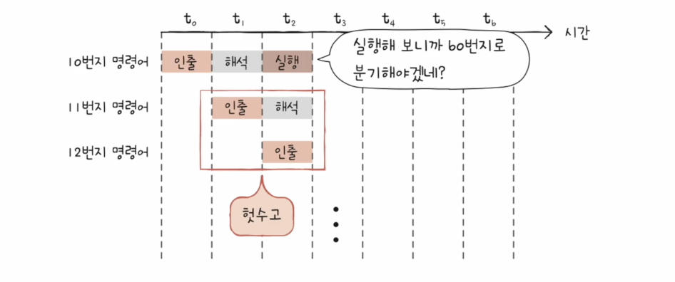
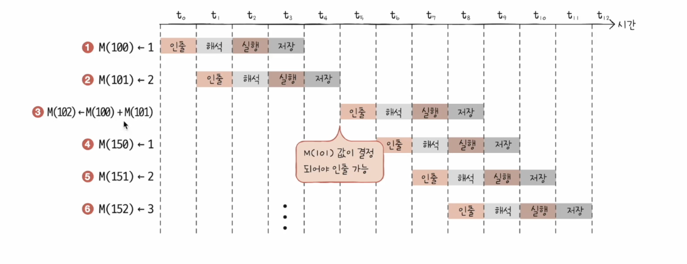
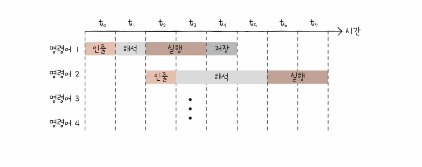
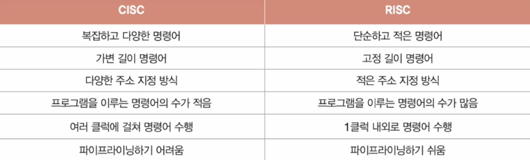

# 클럭

- 컴퓨터의 모든 부품들을 움직일 수 있게 하는 시간 단위
- 클럭속도가 높을수록 CPU 성능이 좋은 것은 맞음 → 클럭 속도를 무작정 높이는 것은 좋지 않음(발열문제)
- 클럭속도 : 헤르츠(Hz) 단위로 측정함 → 1초에 반복되는 횟수
- 기본 클럭속도 & 최대 클럭속도 존재
- 오버클럭킹 : 최대 클럭속도를 강제로 더 끌어올릴 수 있는 기법

⇒ 클럭 속도만으로 CPU 성능을 올리는 것에는 한계가 있음

---

# 코어와 멀티코어

- 코어 : 명령어를 실행하는 부품(을 여러 개 포함하는 부품)
- 멀티코어CPU or 멀티코어 프로세서 : 코어를 여러 개 포함하고 있는 CPU
- CPU 성능을 높이는 다른 방법 → CPU 코어와 스레드 수 늘리기
- 코어 수와 연산 속도의 증가는 비례하지 않을 수 있음 → 코어마다 처리할 연산이 적절히 분배되지 않을 수 있기 때문

---

# 스레드와 멀티스레드

- 스레드 : 실행 흐름의 단위
- 하드웨어적 스레드, 소프트웨어적 스레드

## 소프트웨어적 스레드

- 소프트웨어적으로 정의한 스레드 : 하나의 프로그램에서 독립적으로 실행되는 단위
- 즉, 한 번에 하나씩 명령어를 처리하는 1코어 1스레드 CPU 도 소프트웨어적 스레드를 수십 개 실행하는 것이 가능

## 하드웨어적 스레드

- 하드웨어적으로 정의한 스레드 : 하나의 코어가 동시에 처리하는 명령어 단위
- 멀티스레드 프로세서(멀티스레드 CPU) : 하나의 코어로 여러 명령어를 동시에 처리하는 CPU
- 하이퍼스레딩 : 인텔의 멀티스레드 기술을 의미 (인텔이 자신들의 멀티스레드 기술에 하이퍼스레딩이라는 명칭을 부여한 것)
- 논리 프로세서 : 실제로는 하나의 프로세서 내에서 동작하면서 리소스를 공유하지만, 외부에서 보면 각각 하나의 독립된 프로세서인 것처럼 동작하기 때문에 → 스레드들은 독립된 논리적인 실행단위로 간주되어 논리 프로세서라고도 불림

---

# 명령어 병렬 처리 기법

- CPU 의 속도 높이기 : 높은 클럭속도, 멀티코어, 멀티스레드 등등 → CPU가 놀지 않고 시간을 알뜰하게 쓰며 작동하게 만드는 것도 중요
- 명령어 병렬 처리 기법 : 명령어를 동시에 처리하여 CPU 의 성능을 향상시키는 기술
- 방법 : 명령어 파이프라인, 슈퍼스칼라, 비순차적 명령어 처리 등

---

# 명령어 파이프라인

- 명령어 파이프라인 : CPU 에서 명령어 처리 과정을 단계적으로 나누고, 각 단계를 병렬로 처리해서 성능 향상시키는 방법
- 같은 단계가 겹치지만 않는다면 각 단계를 동시에 실행할 수 있음
- 파이프라인 위험 : 명령어 파이프라인에서 발생하는 문제 (높은 성능을 가지고 있으나, 몇가지 문제 발생시키기도 함), 구조적 위험, 데이터 위험, 제어 위험

## 데이터 위험

- 데이터 의존성에 의해서 발생함
- 어떤 명령어는 이전 명령어를 끝까지 실행해야한 비로소 실행할 수 있는 경우가 있음
- 예 : 이전 명령어의 결과가 다음 명령어의 입력으로 사용될 때
- 데이터 종속성을 해결하기 위해 일부 명령어의 실행이 지연되거나, 무작정 동시에 실행하려고 하면 파이프라인이 제대로 작동하지 않음

## 제어 위험

- 분기 명령어(조건 분기, 점프 등) 에 의해 발생하는 문제
- 분기 명령어의 조건을 판별한 후에 다음 실행될 명령어를 알 수 있기 때문에, 프로그램 카운터 값에 갑작스러운 변화가 생긴다면 → 명령어 파이프라인에 미리 가지고 와서 처리 중이던 명령어들은 쓸모가 없어짐
- 분기 예측 : 프로그램이 어디로 분기할지 미리 예측한 후 그 주소를 인출하는 기술

## 구조적 위험

- 하드웨어 자원이 충돌하여 발생하는 문제
- 서로 다른 명령어가 동시에 ALU, 레지스터 등과 같은 CPU 부품을 사용하려고 할 때 발생
- 자원위험이라고도 부름

---

# 슈퍼스칼라

- 슈퍼스칼라 : CPU 내부에 여러 개의 명령어 파이프라인을 포함한 구조
- 슈퍼스칼라 프로세서(슈퍼스칼라 CPU) : 슈퍼스칼라 구조로 명령어 처리가 가능한 CPU
- 이론적으로 파이프라인 개수에 비례하여 프로그램 처리 속도가 빨라짐
- 실제로는 파이프라인 위험 등의 예상 못한 문제가 발생할 수 있어 비례하여 빨라지진 않음

---

# 비순차적 명령어 처리

- 비순차적 명령어 처리 : 파이프라인의 중단을 방지하기 위해 명령어를 순차적으로 실행하지 않는 기법
- 사진으로 대체하자

---

# ISA(명령어 집합, 명령어 집합 구조)

- Instruction Set Architecture
- CPU가 이해할 수 있는 명령어들의 모음, CPU 마다 ISA가 다를 수 있음
- ISA 는 CPU의 언어로 볼 수 있는데, CPU는 언어를 통해서 명령어를 이해하고 수행
- **CISC, RISC ,,,,**

---

# **CISC**

- **Complex Instruction Set Computing, 복잡한 명령어 집합을 활용하는 컴퓨터**
- 다양한 명령어들을 활용하는 CPU 설계 방식
- 명령어의 형태와 크기가 다양한 가변 길이 명령어를 활용
- 상대적으로 적은 수의 명령어로도 많은 작업을 처리할 수 있음 → 프로그램이 짧고 간단해질 수 있음
- 메모리를 아끼며 개발해야했던 시절 인기 → 명령어 파이프라이닝이 불리하다는 단점
- 복잡하고 다양한 기능을 제공하는 탓 → 여러 클럭주기 필요

---

# **RISC**

- **Reduced Instruction Set Computing,**
- 단순하고 적은 수의 고정 길이 명령어 집합을 활용
- 메모리 접근 최소화, 레지스터 십분 활용
- 명령어의 종류가 적고, 짧고 규격화된 명령어 사용
- 짧고 규격화된 명령어를 활용하기에 명령어 파이프라이닝에 유리

---

# 비교

