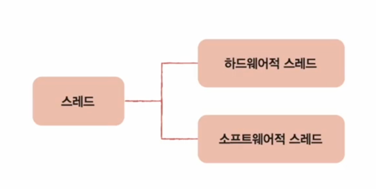
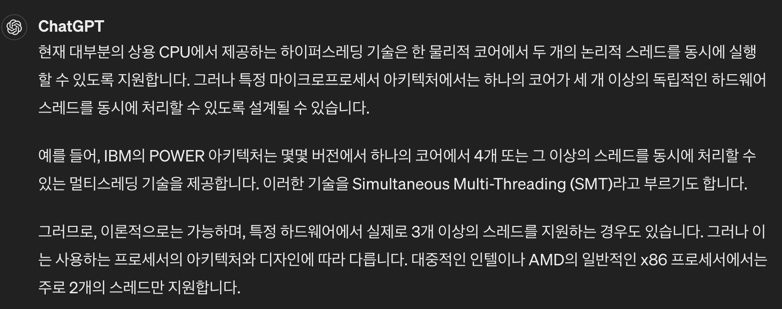
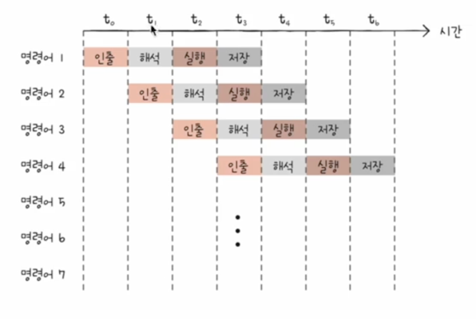
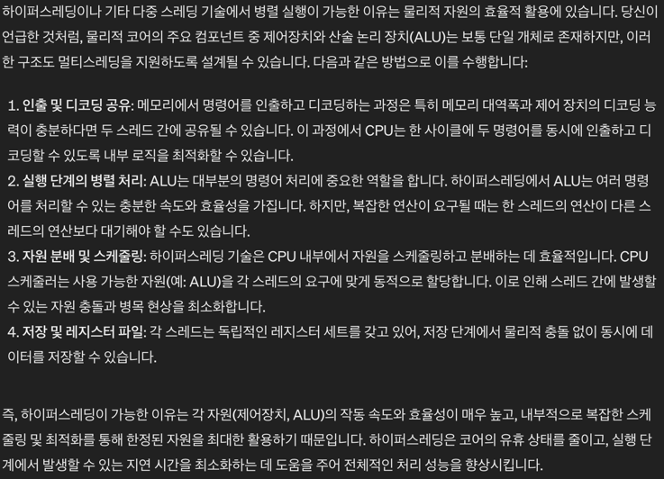
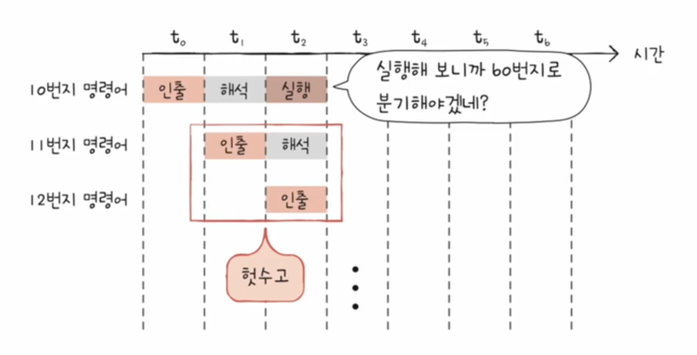
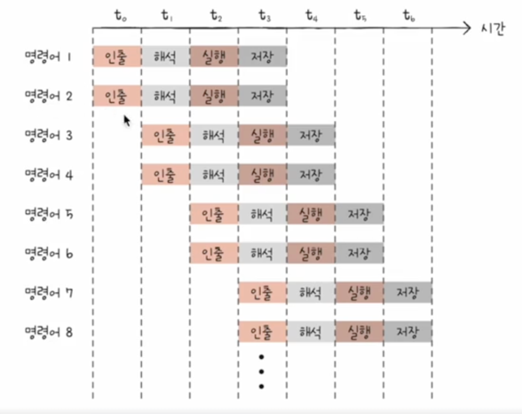
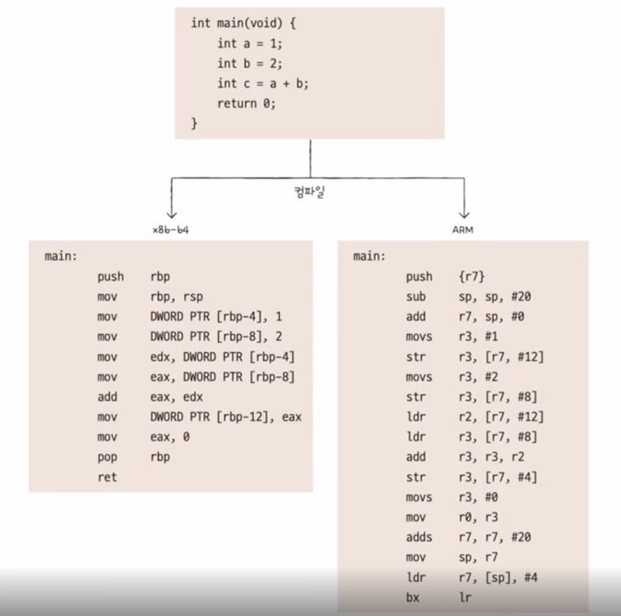

# CPU의 성능 향상 기법

## 클럭
클럭은 cpu가 명령어를 실행할때 속도를 조절하는 신호입니다.  
cpu는 클럭 신호의 일정한 사이클에 맞춰 명령어를 실행합니다.  

1초에 클럭 신호가 1번 발생한다면 1Hz라고 하며 1초에 클럭 신호가 1,000,000,000번 발생한다면 1GHz라고 합니다.  
저번 스터디에서 말했듯이 **일반적으로** 클럭 주파수가 높을수록 cpu의 성능이 좋다고 할 수 있습니다.  
하지만 클럭 주파수가 높을수록 발열이 심하다는 단점이 있습니다.  

위 사진을 보면 일반적으로는 2.5GHz를 처리하고 max로는 4.9GHz를 처리한다고 합니다.  
엄청난 속도를 보여주지만 꼭 높은 클럭 주파수가 좋은 성능을 보장하는 것은 아닙니다.  
그 이유는 명령어 파이프라인 때문이며 이는 아래에서 설명하겠습니다.  

## 코어
코어란 cpu의 핵심 부분으로 명령어를 실행하는 역할을 합니다.  
옛날에는 싱글 코어 cpu가 주를 이뤘지만 요즘에는 멀티 코어 cpu가 주를 이루고 있습니다.  

위에 올린 사진을 보면 코어가 8개가 있다고 합니다.  
그러면 8개의 명령어를 동시에 실행할 수 있을까요?  
답은 아닙니다.  
이 부분은 스레드와 연관이 되어있기 때문인데요 이는 아래에서 설명하겠습니다.  

## 스레드
우리는 프로그래밍을 하면서 스레드라는 키워드를 정말 많이 접하는데요.  
하지만 Cpu의 스레드와 프로그래밍의 스레드는 다릅니다.  

위 그림을 보면 알 수 있듯이 스레드는 하드웨어적 스레드와 소프트웨어적 스레드로 나뉩니다.  
아까 말했듯이 코어의 개수가 명령어를 동시에 처리할 수 있는게 아니라 하드웨어적 스레드의 수 만큼 명령어를 동시에 처리할 수 있습니다.  
일반적으로는 하드웨어적 스레드의 수가 코어의 수와 같지만 하이퍼스레딩이라는 기술로 하드웨어적 스레드의 수를 늘릴 수 있습니다.  
여기서 하이퍼 스레딩이란 하나의 물리적 코어가 두 개의 논리적 코어로 인식되어 동시에 두 개의 스레드를 처리하는 기술입니다.  

위 그림을 보면 이해가 잘 가실텐데요.  
코어 하나에 두개의 레지스터 세트가 들어간다면 하이퍼 스레드가 적용되었다라고 할 수 있습니다.  

저는 하나의 코어가 더 많은 하이퍼 스레드를 가질 수 있는지 궁금해서 GPT한테 물어봤습니다.  

## 명령어 파이프라인

명령어 파이프라인은 일반적으로 명령어를 인출 -> 디코딩 -> 실행 -> 저장 순으로 실행됩니다.  
명령어 사이클은 단계가 곂치지만 않는다면 병렬로 실행될 수 있습니다.   
그 이유는 각 단계마다 담당하는 장치가 다르기 때문입니다.  
인출은 메모리, 디코딩은 제어 장치, 실행은 산술 논리 장치, 저장은 레지스터가 담당합니다.  

하지만 하이퍼스레딩 같은 경우 레지스터는 여러개지만 제어장치, 산술 논리장치가 하나인데 어떻게 병렬로 실행이 가능하지?  
그만큼 제어장치, 산술 논리장치의 연산이 빠르다는건가?  
라는 궁금증이 생겨서 또 GPT한테 물어봤습니다...ㅋㅋ  

그러면 명령어 파이프라인을 병렬로 실행하면 항상 성능이 좋을까요?  
물론 그러면 좋겠지만 파이프라인 위험 요소 때문에 항상 성능이 좋지는 않습니다.  

1. 데이터 위험
2. 제어 위험
3. 구조적 위험

### 데이터 위험

데이터 위험 같은 경우 병렬로 실행하지 못하게 이전 명령어가 다음 명령어에 영향을 미치는 경우입니다.

### 제어 위험

제어 위험 같은 경우 프로그램 카운터에 갑작스러운 변화 때문에 파이프라인이 꼬이는 경우입니다.  
함수의 호출이나 jump와 같은 명령어가 제어 위험 요소입니다.  
하지만 요즘 나오는 cpu는 분기 예측을 통해 어느 정도는 위험을 줄일 수 있습니다.  

### 구조적 위험

구조적 위험은 서로 다른 명령어가 같은 하드웨어를 사용할 때 발생하는 위험입니다.

### 슈퍼스칼라

슈퍼스칼라는 단계가 곂치더라도 명령어를 병렬로 실행할 수 있는 기술입니다.  
하지만 이 방법도 파이프라인 위험도의 증가로 인해 무조건 빨라지지는 않습니다.  

### 비순차적 명령어 처리

비순차적 명령어 처리는 명령어를 순차적으로 처리하지 않고 참조되지 않는 명령어를 먼저 처리하는 기술입니다.  

## 명령어 집합의 구조

명령어는 어떻게 생겨야 성능이 좋을까요?  
이 궁금증을 해결하려면 명령어 집합의 구조를 알아야 합니다.  
왜냐하면 cpu마다 명령어의 연산, 주소 지정 방식이 다르기 때문입니다.  
이를 명령어의 구조가 다르다고 합니다.  

위 그림을 보면 알 수 있듯이 x86-64와 ARM의 명령어의 스타일이 완전히 다른걸 확인할 수 있습니다.

### CISC
CISC는 명령어의 길이가 가변적이고 복잡한 명령어의 집합을 가지고 있는 cpu를 말합니다.  
CISC는 복잡한 명령어를 처리하기 때문에 명령어의 양이 적어지고 메모리를 절약할 수 있습니다.  
하지만 현대 컴퓨터들은 대부분 RISC를 사용하기 때문에 CISC는 거의 사용되지 않습니다.  
이유는 CISC가 처리하는 복잡한 명령어를 일반적으로 사용하지 않고 대부분 간단한 명령어를 사용하기 때문입니다.  
또 명령어의 길이가 가변적이기 때문에 명령어를 처리하는 속도가 느리고 명령어 파이프라인이 매우 매우 매우 불리하다는 단점이 크게 작용하기 때문입니다.

### RISC

RISC는 명령어의 길이가 고정적이고 간단한 명령어의 집합을 가지고 있는 cpu를 말합니다.    
대부분의 명령어들이 간단하고 명령어의 길이가 고정적이기 때문에 명령어 파이프라인이 빠르게 처리됩니다.  
하지만 명령어의 양이 많아지고 메모리를 많이 사용하게 됩니다.  