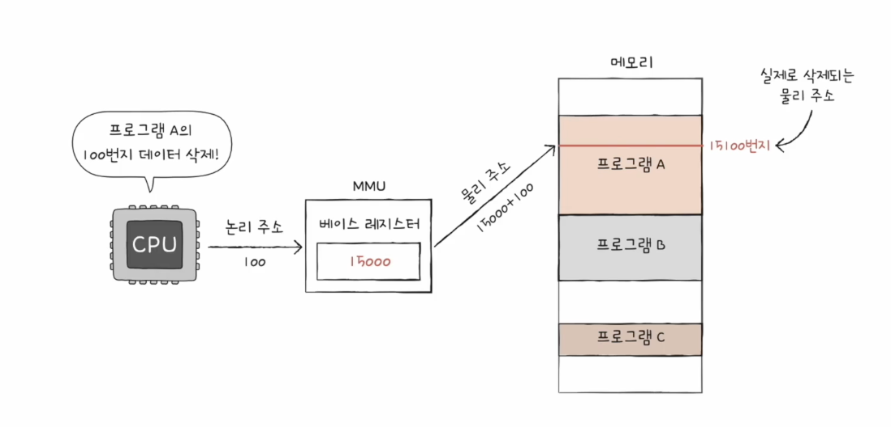
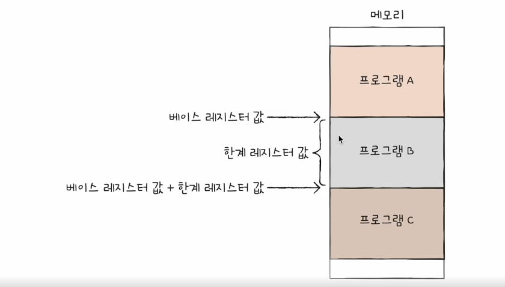
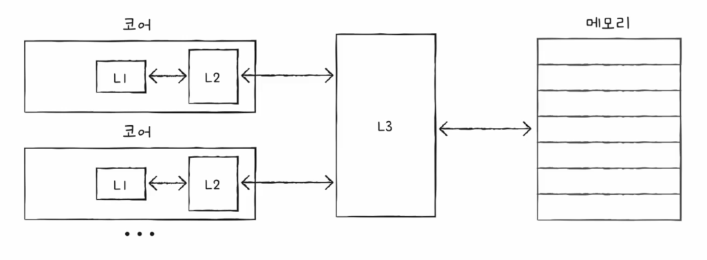
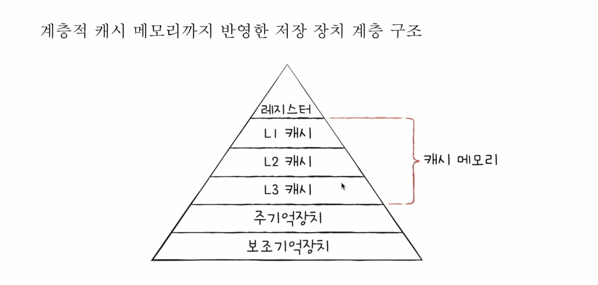

# RAM 의 특징

- 휘발성 저장 장치
- 보조 기억 장치에는 ‘보관할 대상’을 저장, RAM 에는 ‘실행할 대상’ 을 저장
- CPU 가 실행하고 싶은 프로그램이 보조기억장치에 있다면 이를 RAM 에 복사하여 저장한 뒤 실행

# RAM 의 용량과 성능

- RAM의 용량이 충분히 크다면 보조기억장치에서 많은 데이터를 가져와 미리 RAM에 저장할 수 있음
- 보조기억장치에서 가져오는 횟수를 줄일 수 있음
- RAM 용량이 커지면 프로그램 실행 속도가 증가하는 것은 맞으나, 용량이 필요 이상으로 커졌을 때는 비례하며 증가하지는 않음

# RAM 의 종류

### DRAM

- 저장된 데이터가 동적으로 변하는 RAM
- 시간이 지나면 저장된 데이터가 점차 사라짐
- 데이터의 소멸을 막기 위해 일정 주기로 데이터를 다시 저장해야함
- 일반적으로 메모리로써 사용하는 RAM은 DRAM
- 위와 같은 단점이 있음에도 사용하는 이유
    - 소비 전력이 비교적 낮고 저렴함
    - 집적도가 높음 (더 작고 빽빽하게 만들 수 있음)

### SRAM

- 저장된 데이터가 변하지 않는 RAM
- DRAM 보다 속도가 빠름에도 불구하고 메모리로 사용되는 RAM은 일반적으로 SRAM이 아닌 DRAM이 사용 됨
- 이유 : 집적도가 낮고, 소비 전력도 크며, 가격도 비싸기 때문
- 사용되는 곳 : 대용량으로 만들어질 필요는 없지만, 속도가 빨라야하는 장치 / 캐시 메모리

### SDRAM

- 클럭신호와 동기화된, 발전된 형태의 DRAM
- 클럭신호와 동기화되었다 → 클럭 타이밍에 맞춰 CPU와 정보를 주고받을 수 있다는 것을 의미

### DDR SDRAM

- 대역폭(데이터를 주고 받는 길의 너비)을 넓혀 속도를 빠르게 만든 SDRAM
- DDR2 SDRAM 은 DDR SDRAM 보다 대역폭이 두 배 넓은 SDRAM
- DDR3 SDRAM 은 DDR2 SDRAM 대역폭의 두 배


# 물리 주소와 논리 주소

- 같은 프로그램을 실행하더라도 실행될 떄마다 적제되는 주소는 변동될 수 있음 → 때문에 CPU와 실행 중인 프로그램은 메모리 몇 번지에 저장되어 있는지 다 알지 못함
- 물리 주소 : 정보가 실제로 저장된 하드웨어상의 주소를 의미
- 논리 주소 : CPU 와 실행 중인 프로그램이 사용하는 주소
- 메모리가 사용하는 주소는 물리주소, CPU와 실행중인 프로그램이 사용하는 주소는 논리 주소

# 논리 주소, 물리 주소의 변환



- 메모리 관리 장치(MMU) : CPU 와 주소 버스 사이에 위치하여 논리 주소와 물리 주소 간의 변환을 수행
- CPU 가 발생시킨 논리 주소에 베이스 레지스터 값을 더하여 논리 주소를 물리 주소로 변환
- 예) 베이스 레지스터에 15000, 논리주소는 100번지 → 물리주소 15100이 됨
- 베이스 레지스터는 프로그램의 첫 물리 주소를 저장, 논리 주소는 프로그램의 시작점으로부터 떨어진 거리.

# 메모리 보호 기법

- 다른 프로그램의 영역을 침범할 수 있는 명령어는 위험하기 때문에 논리 주소 범위를 벗어나는 명령어 실행을 방지하고 다른 프로그램의 영향을 받지 않도록 보호할 방법이 필요함



- 한계 레지스터 : 논리 주소의 최대 크기를 저장
- 프로그램의 물리 주소 범위는 베이스 레지스터 값 이상, 베이스 레지스터 값 + 한계 레지스터 값 미만이 됨


- CPU 는 메모리에 접근 전, 접근하고자 하는 논리 주소가 한계 레지스터보다 작은지를 항상 검사함 → 범위 밖의 논리 주소에 접근하려고 할 경우 인터럽트 발생시켜 실행 중단

# 저장 장치 계층 구조

- 저장 장치 계층 구조 : 컴퓨터가 사용하는 저장 장치들은 ‘CPU에 얼마나 가까운가’ 를 기준으로 계층적으로 나타낼 수 있음
- CPU  와 가까운 장치일수록 빠르고, 용량이 작고, 비싸지만 멀수록 용량이 크고, 느린 저장 장치

# 캐시 메모리


- 캐시 메모리 : CPU 와 메모리 사이에 위치, 레지스터보다 용량이 크고 메모리보다 빠른 SRAM 기반의 저장 장치
- CPU 가 매번 메모리에 왔다 갔다 하는 것은 시간 소요가 많아져 차이를 조금이나마 줄이기 위해 캐시 메모리가 탄생했음
- 메모리에서 CPU가 사용할 일부 데이터를 미리 캐시 메모리로 가져와서 활용하는 것



- 코어와 가까운 순서대로  → (가까움) L1캐시(내부),  L2캐시(내부),  L3캐시(외부)



- 용량          : L1 > L2 > L3
- 속도, 가격  :  L1 < L2 < L3
- L1, L2 는 코어마다 고유한 캐시 메모리로 할당되고, L3 는 여러 코어가 공유하는 형태로 사용

# 참조 지역성 원리

- 보조기억장치는 전원이 꺼져도 기억할 대상을 저장하고, 메모리는 실행 중인 대상을 저장한다면 캐시 메모리는 CPU 가 사용할 법한 대상을  예측하여 저장
- 캐시 히트 : 자주 사용될 것으로 예측한 데이터가 실제로 들어맞아 캐시 메모리 내 데이터가 CPU 에서 활용되는 경우
- 캐시 미스 : 캐시 히트의 반대상황, 예측 실패한 경우
- 캐시 적중률 : 캐시가 히트되는 비율

```````
캐시 히트 횟수 / (캐시 히트 횟수 + 캐시 미스 횟수)
```````

- 우리가 사용하는 컴퓨터의 캐시 적중률 : 대략 85 ~ 95% 이상
- 캐시 메모리는 한 가지 원칙에 따라 메모리로부터 가져올 데이터를 결정
- 참조 지역성의 원리 : CPU 가 메모리에 접근할 때의 주된 경향을 바탕으로 만들어진 원리

### 1. CPU 는 최근에 접근했던 메모리 공간에 다시 접근하려는 경향에 대해서

- 변수에 저장된 값은 일반적으로 한 번만 사용되지 않고 프로그램이 실행되는 동안 여러 번 사용됨
- CPU 는 최근에 접근했던 (변수가 저장된) 메모리 공간에 여러 번 다시 접근할 수 있음
- 이처럼 ‘최근에 접근했던 메모리 공간에 다시 접근하려는 경향’을 시간 지역성이라고 함

### 2. 접근한 메모리 공간 근처를 접근하려는 경향에 대해서


- CPU 가 실행하려는 프로그램은 관련 데이터들끼리 한데 모여 있음
- 예 ) CPU 가 워드 프로세서 프로그램을 실행할 적에는 워드 프로세서 프로그램이 모여 있는 공간 근처를 집중적으로 접근하고, 사용자가 입력을 할 적에는 입력 기능이 모여 있는 공간 근처를 집중적으로 접근
- 이처럼 ‘접근한 메모리 공간 근처를 접근하려는 경향’ 을 공간 지역성이라고 함