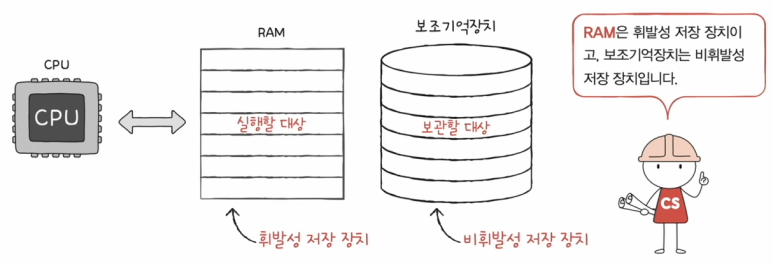
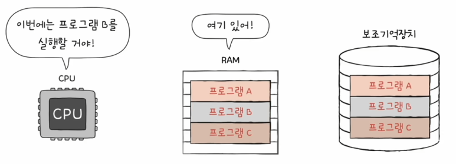
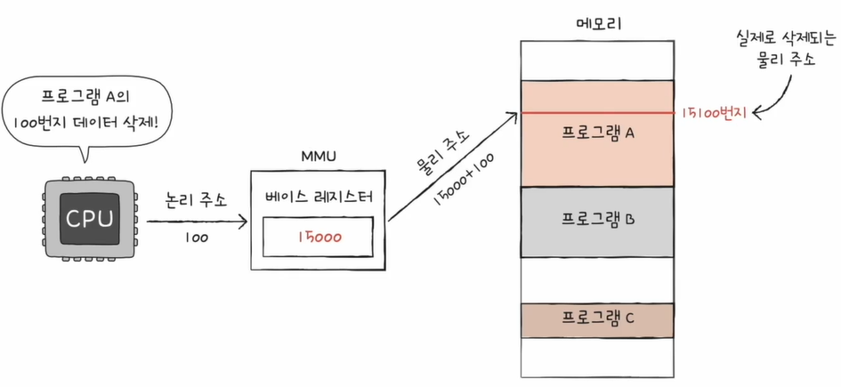
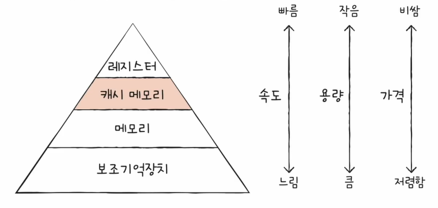
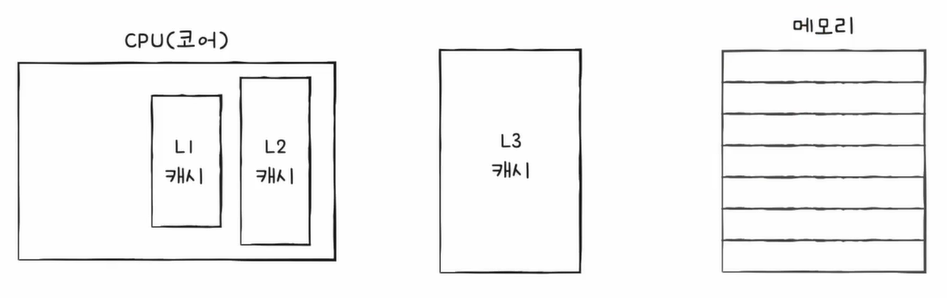
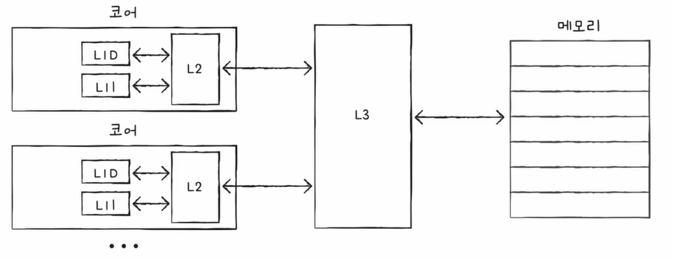

# RAM

CPU는 RAM으로부터 명령어와 데이터들을 가지고와서 실행하고, RAM은 실행할 대상을 저장합니다.  
이때 RAM은 전원이 꺼지면 저장된 내용이 사라지는 휘발성이기 때문에, 저장된 내용을 기억할 수 있는 대용량 저장장치인 보조기억장치가 필요하게 됩니다.
 
 
  

이러한 RAM은 위의 그림과 같이 크기가 클수록 많은 프로그램들을 동시에 실행하는 데 유리합니다.
 
 
또한 RAM의 종류에는 크게 4가지가 있습니다.
 
 
### 1. DRAM (Dynamic RAM)
저장된 데이터가 동적으로 사라지는 RAM입니다.  
즉, 전원에 연결되어 있어도 데이터가 점점 사라지는 것을 의미합니다.
 
 
이러한 데이터의 소멸을 막기 위해 주기적으로 재활성화 해야 합니다.
 
 
DRAM은 상대적으로 소비전력이 낮고, 가격이 저렴하고, 집적도가 높아 대용량으로 설계하기 용이하기 때문에, 일반적으로 사용되는 메모리입니다.
 
 
 
### 2. SRAM (Static RAM)
저장된 데이터가 정적인 (사라지지 않는) RAM입니다.
 
 
전원에 연결되어 있어도 데이터가 사라지는 DRAM과 반대되는 개념이긴하나, 전원을 빼면 데이터가 사라지는 것은 마찬가지입니다.
 
 
SRAM은 상대적으로 소비전력이 높고, 가격이 비싸고, 집적도가 낮고, DRAM보다 입출력 속도가 빠르기 때문에, 대용량으로 설계할 필요는 없으나 빨라야 하는 장치, 즉 캐시 메모리에서 사용됩니다.

 
 

### 3. SDRAM (Synchronous DRAM)
클럭 신호와 동기화된 DRAM입니다.  
즉, 클럭 신호에 맞춰서 한 번에 하나씩 데이터를 주고받을 수 있는 DRAM입니다.
 
 
 
### 4. DDR SDRAM (Double Data Rate SDRAM)
대역폭을 넓혀 속도를 빠르게 만든 SDRAM입니다.  
즉, SDRAM에서 더 발전된 형태의 메모리이며, 최근 가장 대중적으로 사용하는 RAM입니다.  

대역폭은 데이터를 주고받는 길의 너비를 의미하며, DDR SDRAM은 SDRAM 대역폭보다 두 배 넓습니다.
 
 
이외에도 DDR2, DDR3, DDR4도 있습니다.
 
 
 
 
 
 
# 메모리의 주소 공간

메모리 내 주소체계에는 크게 논리 주소와 물리 주소가 있습니다.
 
 
### 1. 물리 주소
메모리 입장에서 바라본 주소입니다.  
즉, 정보가 실제로 저장된 하드웨어상의 주소입니다.
 
 
 
### 2. 논리 주소
CPU와 실행 중인 프로그램 입장에서 바라본 주소입니다.  
즉, 실행 중인 프로그램 각각에게 부여된 0번지부터 시작하는 주소입니다.
 
 
 
 
## 물리 주소와 논리 주소의 변환
물리 주소와 논리 주소는 MMU(메모리 관리 장치)라는 하드웨어에 의해 변환됩니다.

이 MMU는 논리 주소와 베이스 레지스터(프로그램의 기준주소) 값을 더하여 논리 주소를 물리 주소로 변환할 수 있습니다.
 
 
위의 그림으로 예를 들어보면, 논리 주소상에서 프로그램 A의 100번지를 삭제하라는 명령은 베이스 레지스터의 15000의 기준으로부터 100번지인 15100번지를 삭제하라는 의미입니다.
 
 
이때 명령어가 다른 프로그램의 영역을 침범하지 않도록 메모리를 보호해야 하는데, 한계 레지스터라는 방법으로 보호할 수 있습니다.
 
 
### * 한계 레지스터
프로그램의 영역을 침범할 수 있는 명령어의 실행을 막습니다.
 
 
베이스 레지스터가 실행 중인 프로그램의 가장 작은 물리 주소를 저장한다면, 한계 레지스터는 논리 주소의 최대 크기를 저장함으로써 침범을 막아줍니다.

즉, 베이스 레지스터 값 <= 프로그램의 물리 주소 범위 <= 베이스 레지스터 값 + 한계 레지스터 값 이 됩니다.

위의 그림처럼 CPU는 메모리에 접근하기 전, 접근하고자 하는 논리 주소가 한계 레지스터보다 작은지 항상 검사합니다.  
이로써 실행 중인 프로그램의 독립적인 실행 공간을 확보하고, 하나의 프로그램이 다른 프로그램을 침범하지 못하도록 메모리를 보호할 수 있습니다.
 
 
 
 
 
 
# 캐시 메모리
캐시 메모리란 CPU와 메모리 사이에 위치한 레지스터보다 용량이 크고 메모리보다 빠른 SRAM 기반의 저장 장치입니다.  
CPU의 연산 속도와 메모리 접근 속도의 차이를 조금이나마 줄이기 위해 탄생하였습니다.

위의 그림은 저장 장치 계층 구조를 나타낸 그림입니다.  
CPU와 가까운 저장 장치는 빠르고 멀리 있는 저장 장치는 느리며, 속도가 빠른 저장 장치는 저장 용량이 작고 가격이 비쌉니다.
 
 
또한 캐시 메모리는 하나가 아니라 계층적으로 구성할 수 있습니다.
 
 
### 1. 계층적 캐시 메모리 (L1-L2-L3 캐시)
캐시 메모리는 CPU 내부에 위치해 있을 수도 있고 CPU 외부에 위치해 있을 수도 있습니다.  
일반적으로 L1 캐시와 L2 캐시는 코어 내부에, L3 캐시는 코어 외부에 위치해 있습니다.

* #### L1 캐시
  레지스터보다 용량이 크고 L2 캐시보다는 작으며, 가장 속도가 빠릅니다.
 

* #### L2 캐시
  L1 캐시보다 용량이 크고 L3 캐시보다는 작으며, L3 보다는 조금 더 빠르게 접근 할 수 있습니다.
 

* #### L3 캐시
  L1이나 L2보다 용량이 크고 메모리보다는 작으며, 메모리에 비해 접근 속도가 빠릅니다.
 
 

### 2. 멀티코어 프로세서의 캐시 메모리

멀티코어 프로세서의 캐시 메모리는 각각의 코어에 L1과 L2가 있고, L3를 공유하는 형태로 사용되기도 합니다.
 
 
 
### 3. 분리형 캐시

가장 속도가 빠른 L1 캐시를 조금이라도 더 빨리 만들기 위해, 데이터만을 담기 위한 L1D 캐시, 명령어만을 담기 위한 L1I 캐시 형태로 관리하기도 합니다.
 
 
 
캐시 메모리는 메모리보다 용량이 작기 때문에, 메모리의 모든 내용을 저장할 수 없습니다.  
때문에 CPU가 자주 사용할 법한 내용을 예측하여 저장해야 합니다.
 
 
이렇게 CPU가 사용할 법한 데이터를 예측하는 방법을 참조 지역성의 원리라고 합니다.
 
 
 
## 참조 지역성의 원리
CPU가 메모리에 접근할 때의 주된 경향을 바탕으로 만들어진 원리입니다.
 
 
CPU는 최근에 접근했던 메모리 공간에 다시 접근하려는 경향과, 접근한 메모리 공간 근처를 접근하려는 경향이 있습니다.  
이러한 경향을 바탕으로 만들어진 원리가 참조 지역성의 원리입니다.
 

* #### 캐시 히트
예측이 들어맞을 경우, 즉 CPU가 캐시 메모리에 저장된 값을 활용할 경우 캐시 히트라 합니다.
 

* #### 캐시 미스
예측이 틀렸을 경우, 즉 CPU가 메모리에 접근해야 하는 경우 캐시 미스라 합니다.
 

* #### 캐시 적중률
캐시 히트 횟수 / (캐시 히트 횟수 + 캐시 미스 횟수)  
캐시 적중률이 높을수록 성능이 높습니다.
