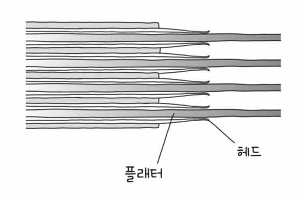
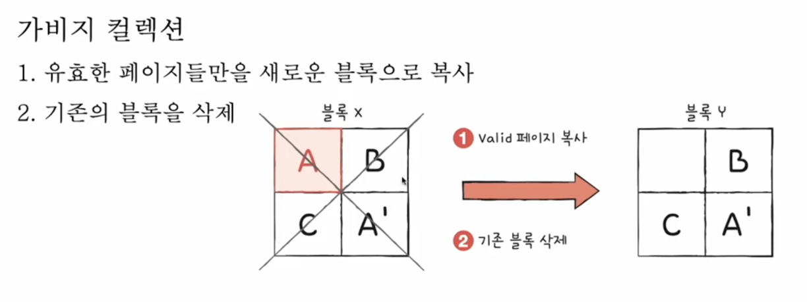
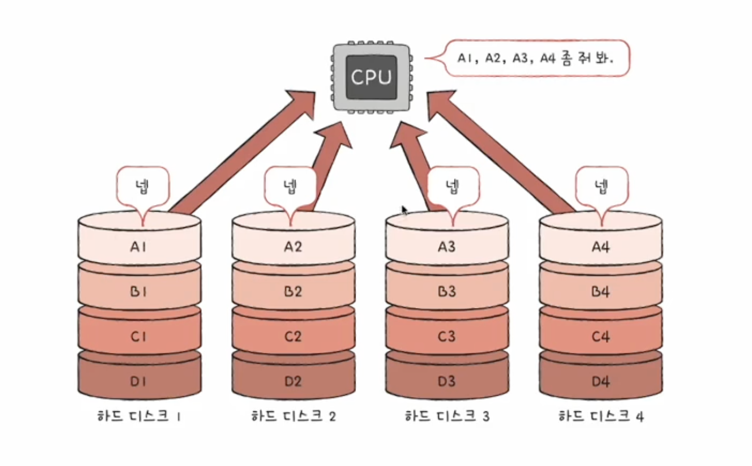
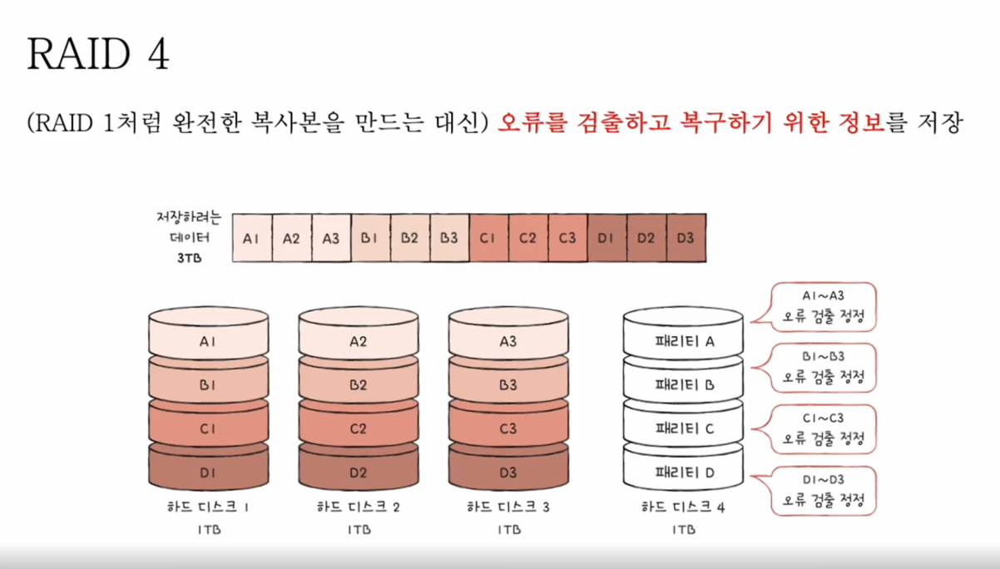

## 하드 디스크

하드 디스크는 데이터를 읽고 쓰는 속도가 느리지만, 데이터를 영구적으로 저장할 수 있습니다.  
하드 디스크는 플래터라는 원판 위에 여러 곂으로 구성되어 있고 헤드가 데이터를 기록하고 읽어옵니다.  
데이터를 읽어 올 때 헤드가 플래터를 돌면서 데이터를 읽어옵니다.  

플레터는 트랙과 섹터로 구성이 되어있으며 트랙은 원판의 한 바퀴를 의미하고 섹터는 트랙을 여러 부분으로 나눈 데이터의 저장 단위입니다.  

하드 디스크는 연관성 있는 데이터를 쌓을 때 각 플레터 동일한 블록에 저장합니다.  

하드 디스크는 데이터에 접근 하는 시간을 3개로 나뉩니다.
- 탐색 시간: 헤드가 트랙으로 이동하는 시간
- 회전 지연 시간: 플레터가 회전하는 시간
- 전송 시간: 데이터를 읽어오는 시간

위와 같은 이유로 디스크는 데이터를 읽어올 때 다른 부품들에 비해 매우 느리게 데이터를 읽어옵니다.  

## 플래시 메모리

플래시 메모리는 전기적으로 데이터를 저장하는 메모리로 하드 디스크보다 빠르게 데이터를 읽고 쓸 수 있습니다.  
플래시 메모리는 전원이 꺼져도 데이터가 사라지지 않는 특징이 있어 주로 ROM도 플래시 메모리를 사용합니다.  

### NAND 플래시 메모리
NAND Gate를 사용해서 데이터를 저장하는 메모리로 데이터를 읽고 쓰는 속도가 빠르고 용량이 크기 때문에 주로 SSD에 사용됩니다.  
 
### cell
플래시 메모리는 cell이라는 단위로 데이터를 저장합니다.  
cell은 1bit, 2bit, 3bit, 4bit로 나뉘며 cell이 높을 수록 데이터를 저장하는 속도가 느려지고 용량이 커집니다.  
이 cell의 용량 단위를 SLC(Single Level Cell), MLC(Multi Level Cell), TLC(Triple Level Cell), QLC(Quad Level Cell)라고 부릅니다.  

- SLC
  - 1bit로 데이터를 저장하는 메모리로 데이터를 읽고 쓰는 속도가 빠르지만 용량이 작습니다.
  - 동일한 용량일 땐 SLC가 가장 비싸고 빠르며 수명도 가장 깁니다.

- MLC
  - 2bit로 데이터를 저장하는 메모리로 SLC에 비해 용량이 크고 가격이 저렵습니다.
  - SLC에 비해 데이터를 읽고 쓰는 속도가 느리고 수명도 짧습니다.

- TLC
  - 3bit로 데이터를 저장하는 메모리로 MLC에 비해 용량이 크고 가격이 저렵습니다.
  - MLC에 비해 데이터를 읽고 쓰는 속도가 느리고 수명도 짧습니다.

여기서 알아야 할 부분은 수명입니다.  
플래시 메모리나 디스크는 데이터를 읽고 쓰는 횟수가 많아지면 수명이 줄어듭니다.  
그런데 왜 cell에 저장 단위에 따라 수명이 다를까요?  

동일한 용량을 가정했을 때 SLC같은 경우에는 1bit로 데이터를 저장하기 때문에 데이터를 읽고 쓰는 횟수가 적습니다.  
반대로 QLC같은 경우에는 한 cell에 4bit로 데이터를 저장하기 때문에 4비트의 데이터 중 하나라도 바뀌면 cell 전체 데이터가 바뀌는것이기 때문에 데이터를 읽고 쓰는 횟수가 많아지기 때문입니다.

#### 저장 단위
 - page: cell이 모여서 데이터를 저장하는 단위입니다.
 - block: page가 모여서 데이터를 저장하는 단위입니다.
 - plane: block이 모여서 데이터를 저장하는 단위입니다.
 - die: plane이 모여서 데이터를 저장하는 단위입니다.

page의 상태는 free, valid, invalid로 나뉩니다.
- free: 데이터가 저장되지 않은 상태
- valid: 데이터가 저장된 상태
- invalid: 데이터가 유효하지 않은(삭제된) 상태

page가 free 상태일 때 데이터를 저장하면 valid 상태로 변경되고 데이터를 삭제하면 invalid 상태로 변경됩니다.
page가 변경될 때마다 block의 상태도 아래 그림처럼 변경됩니다.

기존의 값이 변경이 되면 기존의 page를 담아뒀던 블록이 삭제되고 새로운 블록에 데이터를 저장합니다.
이때 GC가 발생하는데 변경되기 전 블록의 데이터(invalide)를 삭제합니다.

## RAID

RAID(Redundant Array of Independent Disks)는 여러 개의 하드 디스크를 하나로 묶어서 데이터를 저장하는 방식입니다.
하나의 큰 하드 디스크를 사용하는 것보다 여러 개의 작은 하드 디스크를 사용하는 것이 더 안정적이고 빠릅니다.
RAID는 데이터를 저장하는 방식에 따라 여러 종류로 나뉩니다.

### RAID 0

RAID 0은 데이터를 여러 디스크에 나눠 저장하는 방식입니다.  
데이터를 나눠 저장하기 때문에 데이터를 읽고 쓰는 속도가 빨라집니다.  
하지만 하나의 디스크가 고장나면 모든 데이터가 손실됩니다.

### RAID 1

RAID 1은 데이터를 여러 디스크에 같은 데이터를 저장하는 방식입니다.  
데이터를 같은 디스크에 저장하기 때문에 데이터를 읽고 쓰는 속도는 느려집니다.  
하지만 하나의 디스크가 고장나도 다른 디스크에 데이터가 있기 때문에 데이터가 손실되지 않습니다.

### RAID 4

RAID 4는 데이터를 여러 디스크에 나눠 저장하고 패리티 비트를 따로 저장하는 방식입니다.  
패리티 비트는 데이터를 저장할 때 오류가 발생하면 어떤 데이터가 잘못되었는지 알려주는 비트입니다.  
패리티 비트를 따로 저장하기 때문에 패리티 비트를 저장한 디스크가 병목 지점이 될 수 있습니다.

### RAID 5

RAID 5는 데이터를 여러 디스크에 나눠 패리티 비트와 함께 저장하는 방식입니다.  
패리티 비트를 따로 저장하지 않고 데이터와 패리티 비트를 번갈아가며 저장하기 때문에 병목 지점이 없습니다.

### RAID 6

RAID 6은 RAID 5와 같이 데이터를 나눠 저장하고 패리티 비트를 저장하는 방식입니다.  
하지만 RAID 6은 RAID 5보다 패리티 비트를 하나 더 저장하기 때문에 더 안전하다고 할 수 있습니다.