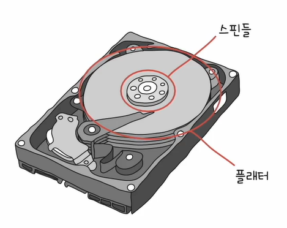
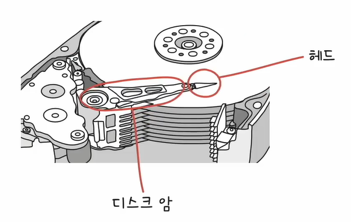
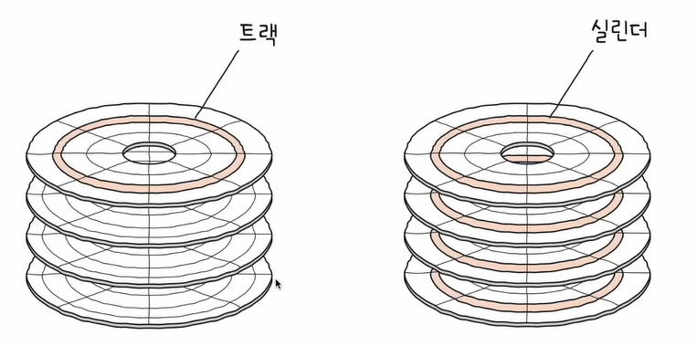
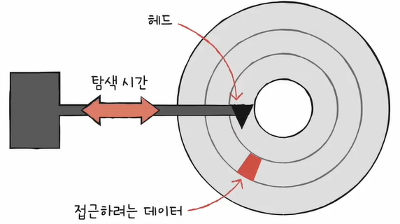
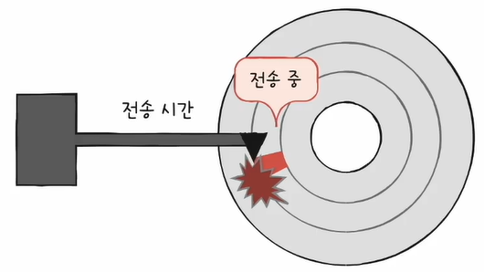
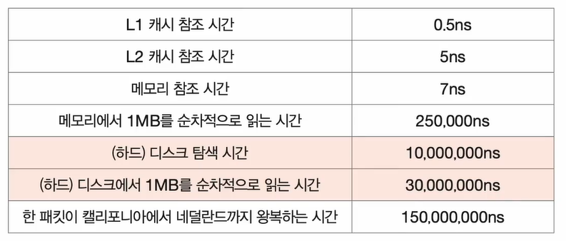
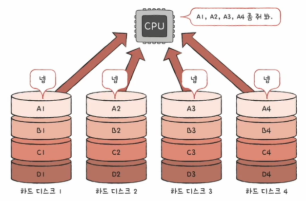
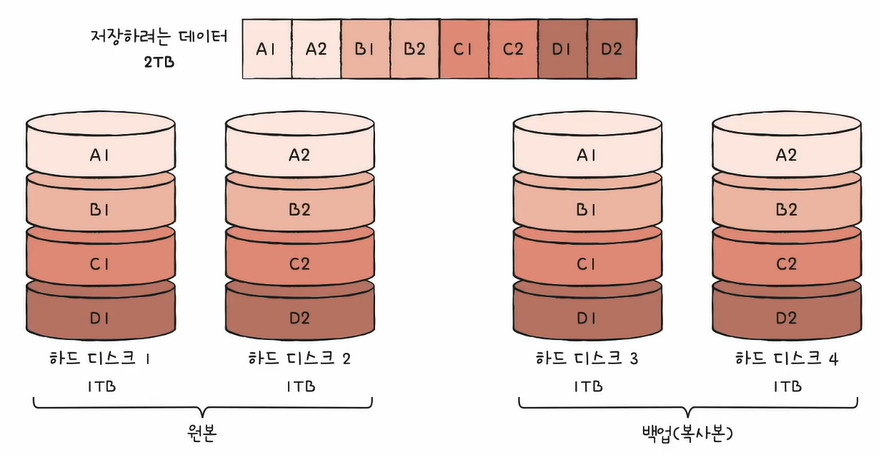
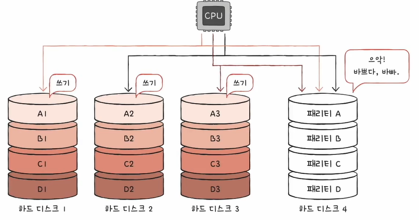

# 하드디스크
자기적인 방식으로 데이터를 저장하는 보조기억장치입니다.
 
 
## 1. 구성

* #### 플래터
  수많은 N 극과 S 극으로 데이터들이 저장되며, 양면으로 사용되고 여러 개를 사용할 수 있습니다.
 

* #### 스핀들
  플래터를 회전시키며, 회전의 단위는 RPM입니다.  
  RPM(Revolution Per Minute)은 분당 회전수로, 스핀들이 돌리는 속도를 가늠할 수 있습니다.
 
 

* #### 헤드
  자기적인 물질로 덮여있는 플래터를 읽고 쓸 수 있는 수단입니다.  
  여러 플래터의 면마다 헤드가 존재합니다.
 

* #### 디스크 암
  헤드를 움직여주는 구성 요소입니다.  
  모든 헤드들은 따로 움직이는 것이 아닌, 디스크 암에 한 번에 부착되어 한 번에 움직이게 됩니다.
 
 

## 2. 저장 단위
플래터는 트랙(track)과 섹터(sector)로 나뉘며, 같은 트랙이 모여 실린더를 이루게 됩니다.
 

* #### 트랙
  플래터를 이루고 있는 동심원을 그리는 저장 단위입니다.
 

* #### 섹터
  나누어진 트랙 하나의 조각 단위입니다.  
  하나 이상의 섹터를 묶어 블록(block)이라고 표현하기도 합니다.
 
 

* #### 실린더
  여러 겹의 플래터 상에서 같은 트랙이 위치한 곳을 모아 연결한 논리적 단위입니다.  
  보통 연속된 정보는 한 실린더에 기록되는데, 그 이유는 헤드를 움직이지 않고도 곧바로 읽을 수 있기 때문입니다.
 
 

## 3. 데이터 접근 과정
하드디스크가 저장된 데이터에 접근하는 시간의 종류는 크게 3가지로 나뉘게 됩니다.
 
 
* #### 탐색 시간 (seek time)

  

  접근하려는 데이터가 저장된 트랙까지 헤드를 이동시키는 시간입니다.
 

* #### 회전 지연 (rotational latency)

  

  헤드가 있는 곳으로 플래터를 회전시키는 시간입니다.
 

* #### 전송 시간 (transfer time)

  

  접근하려는 데이터가 저장된 트랙까지 헤드를 이동시키는 시간입니다.
 

* #### Numbers Every Programmer Should Know

  

 
 
 

# 플래시 메모리
전기적으로 데이터를 읽고 쓰는 반도체 기반의 저장 장치입니다.  
SSD, SD 카드, USB 메모리가 이에 속하며, 범용성이 넓기에 보조기억장치에만 속한다고 보기는 어렵습니다.
 
 
## 1. 종류
* #### NAND 플래시 메모리
  NAND 연산을 수행하는 회로, 즉 NAND 게이트라고 합니다.
 

* #### NOR 플래시 메모리
  NOR 연산을 수행하는 회로, 즉 NOR 게이트라고 합니다.
 
 
오늘날의 대용량 저장 장치로 많이 사용되는 플래시는 NAND 플래시 메모리이므로, 이에 대해 학습해 보도록 하겠습니다.
 
 
 

## 2. 단위
### 2-1. 셀 (cell)
플래시 메모리에서 데이터를 저장하는 가장 작은 단위입니다.  
이 셀이 모여서 MB, GB, TB 저장 장치가 됩니다.
 
 
또한, 한 셀에 저장할 수 있는 비트 수에 따라 종류가 나뉘게 됩니다.
 
 
* #### SLC
  1비트를 저장할 수 있는 플래시 메모리입니다.  
  즉, 한 셀로 두 개의 정보를 표현할 수 있습니다.

  비트의 빠른 입출력과 긴 수명이 장점이며, 용량 대비 가격이 비싼 것이 단점입니다.
 

* #### MLC
  2비트를 저장할 수 있는 플래시 메모리입니다.  
  즉, 한 셀로 네 개의 정보를 표현할 수 있습니다. 이는 대용량화에 유리합니다.

  SLC 보다 느린 입출력과 짧은 수명을 가졌지만, SLC 보다 저렴하며 시중에서 많이 사용됩니다.
 

* #### TLC
  3비트를 저장할 수 있는 플래시 메모리입니다.  
  즉, 한 셀로 여덟 개의 정보를 표현할 수 있습니다. 마찬가지로 대용량화에 유리합니다.

  MLC 보다 느린 입출력과 짧은 수명을 가졌지만, MLC 보다 저렴하며 시중에서 많이 사용됩니다.
 

* #### QLC
  4비트를 저장할 수 있는 플래시 메모리입니다.  
  즉, 한 셀로 열여섯 개의 정보를 표현할 수 있습니다.
 
 

### 2-2. 페이지

플래시 메모리는 읽기/쓰기의 단위와 삭제의 단위가 다릅니다.  
읽기/쓰기는 페이지 단위로 이루어져 있으며, 삭제는 블록 단위로 이루어져 있습니다.
 
 
또한 페이지는 상태를 가질 수 있습니다.
 
 
* #### Free 상태
  어떠한 데이터도 저장하고 있지 않아 새로운 데이터를 저장할 수 있는 상태입니다.
 

* #### Valid 상태
  이미 유효한 데이터를 저장하고 있는 상태입니다.
 

* #### Invalid 상태
  유효하지 않은 데이터(쓰레기 값)를 저장하고 있는 상태입니다. (하드디스크와 달리 덮어쓰기가 불가능)
 
 

## 3. 가비지 컬렉션
위의 유효한 페이지들만 새로운 블록으로 복사한 후 기존 블록을 삭제하여 공간을 정리하는 기능입니다.

즉, Valid 페이지만을 복사하여 저장 공간을 관리하는 기법입니다.
 
 
 
 
 
 
# RAID
RAID(Redundant Array of Independent Disks)는 하드디스크와 SSD로 사용하는 기술로, 데이터의 안전성 혹은 높은 성능을 위해 여러 물리적 보조기억장치를 마치 하나의 논리적 보조기억장치처럼 사용하는 기술입니다.
 
 
쉽게 말해, 하드디스크나 SSD 같은 저장 장치를 효율적으로 사용할 수 있는 방법입니다.  
예를 들어, 1TB 하드디스크 네 개로 RAID를 구성하면, 4TB 하드디스크 한 개의 성능과 안전성을 능가할 수 있습니다.
 
 
RAID의 종류(레벨)에는 RAID 0, RAID 1, RAID 2, RAID 3, RAID 4, RAID 5, RAID 6 그리고 그로부터 파생된 RAID 1-0, RAID 5-0 등이 있습니다.
 
 
## 1. RAID 0

각 하드디스크는 번갈아 가며 데이터를 나누어 저장합니다.  
즉, 저장되는 데이터가 하드디스크 개수만큼 나뉘어 저장됩니다.
 
 
이렇게 분산하여 저장하는 것을 스트라이핑(striping) 이라 하며, 마치 줄무늬처럼 분산되어 저장된 데이터를 스트라입(stripe) 이라 합니다.
 

RAID 0은 번갈아가며 저장하므로, 입출력 속도를 향상시킬 수 있습니다.
 

단, 하드디스크 하나가 고장 나버리면 사용할 수 없기 때문에 저장된 정보가 안전하지 않다는 단점이 존재합니다.
 
 
 
## 2. RAID 1

데이터를 원본과 복사본 두 군데에 저장합니다.  
이렇게 복사본을 만드는 방식을 미러링(mirroring)이라 합니다.
 
 
RAID 1은 하나가 고장 나도 상관없으므로 백업과 복구에 유리합니다.
 
 
단, 두 군데에 데이터를 써야 하므로 입출력 속도는 느릴 수 있으며, 하드디스크 개수가 한정되었을 때 사용 가능한 용량이 적어집니다.  
즉, 복사본이 만들어지는 용량만큼 사용할 수 없기 때문에 많은 양의 하드디스크가 필요하게 되므로 비용이 증가하게 됩니다.
 
 
 
## 3. RAID 4

RAID 1처럼 완전한 복사본을 만드는 대신, 오류를 검출하고 복구하기 위한 정보를 저장합니다.  
이때 오류를 검출하고 복구하기 위한 정보를 패리티 비트라 합니다.
 
 
즉, 패리티를 저장한 장치를 이용해 다른 장치들의 오류를 검출하고 오류가 있다면 복구하는 방식입니다.
 

하지만 이 패리티 정보를 담은 디스크에 병목현상이 생길 수 있는 단점이 존재합니다.  
쉽게 말해, 데이터를 새롭게 쓸 때마다 반드시 패리티 디스크에도 저장해야 하므로, 이 디스크가 바빠질 수밖에 없습니다.
 
 
 
## 4. RAID 5

RAID 4의 병목현상을 해결하기 위해, 패리티 정보를 분산하여 저장하는 방식입니다.
 
 
 
## 5. RAID 6

두 종류의 패리티를 사용하는 방식입니다.  
RAID 5 보다 안전하지만, 쓰기에는 느릴 수밖에 없습니다.
