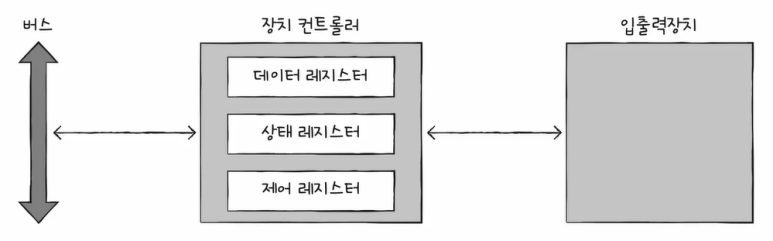
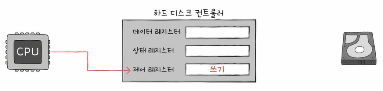
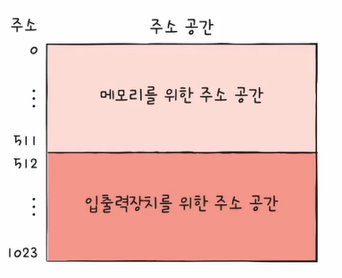
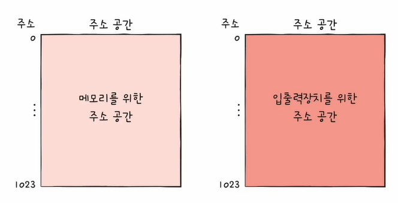
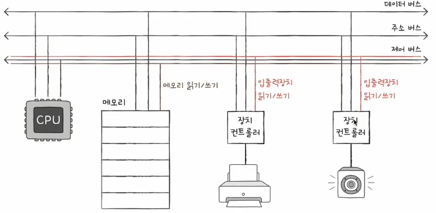
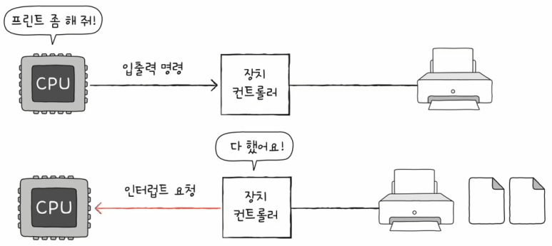
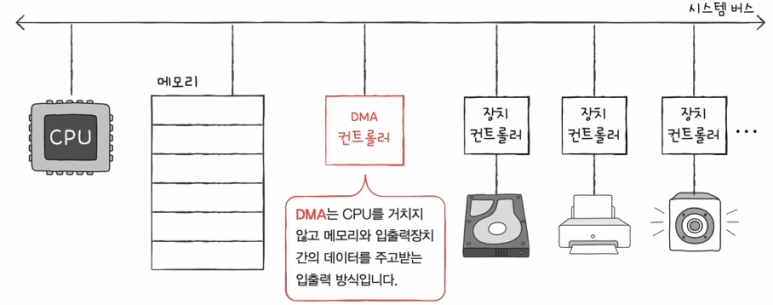
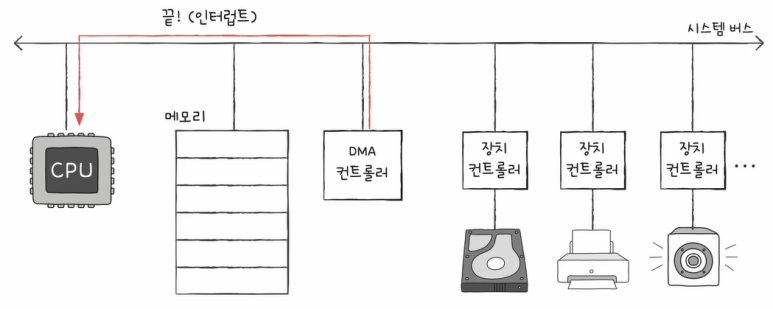
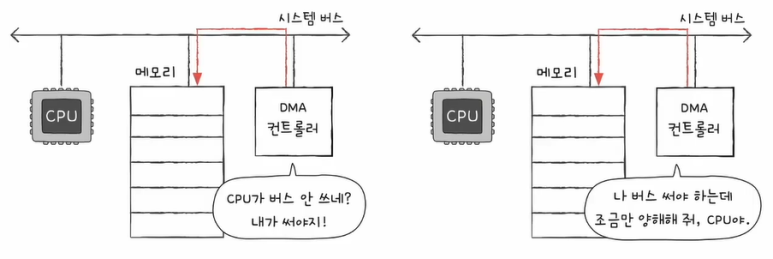

# 입출력장치
입출력장치란 컴퓨터와 정보를 주고받을 수 있는 장치이며, 이 입출력장치는 CPU나 메모리보다 다루기가 까다롭습니다.
 
 
그 이유는 입출력장치에는 종류가 너무 많기 때문입니다. 장치가 다양하면 장치마다 속도, 데이터 전송 형식 등도 다양하기 때문에, 다양한 입출력장치와 정보를 주고받은 방식을 규격화하기 어렵습니다.
 
 
또한, 일반적으로 CPU와 메모리의 데이터 전송률을 높지만 입출력장치의 데이터 전송률은 낮기 때문입니다. 여기서 전송률이란 데이터를 얼마나 빨리 교환할 수 있는지를 나타내는 지표입니다.
 
 
이러한 이유들 때문에 입출력장치는 장치 컨트롤러를 통해 컴퓨터 내부와 정보를 주고받습니다.
 
 
 
## 1. 장치 컨트롤러

장치 컨트롤러는 입출력 제어기(I/O Controller) 또는 입출력 모듈(I/O Module)이라고도 부르며, 하드웨어입니다.
 
 
모든 입출력장치는 하나 이상의 장치 컨트롤러와 연결되어 있으며, 장치 컨트롤러 하나에는 여러 개의 입출력장치가 연결되어 있을 수 있습니다.
 
 
### 1-1. 역할
* #### CPU와 입출력장치 간의 통신 중개
  일종의 번역가 역할을 수행합니다.  
  즉, 다양한 입출력장치들로부터 오는 정보를 규격화하기 어렵다는 문제를 어느 정도 해결해 줍니다.
   
* #### 오류 검출
  장치 컨트롤러에 연결된 입출력장치에 문제가 있는지 오류를 검출합니다.
   
* #### 데이터 버퍼링
  버퍼링이란 전송률이 높은 장치와 낮은 장치 사이에 주고받는 데이터를 버퍼라는 임시 저장 공간에 저장하여 전송률을 비슷하게 맞추는 방법입니다.
   
   
   
### 1-2. 구조

장치 컨트롤러는 입출력 버스와 연결되며, 데이터 레지스터, 상태 레지스터, 제어 레지스터를 주고받게 됩니다.  
이때, 상태 레지스터와 제어 레지스터는 하나의 레지스터로 사용되기도 합니다.
 
 
* #### 데이터 레지스터
  CPU와 입출력장치 사이에 주고받을 데이터가 저장되는 레지스터입니다. 즉, 버퍼의 역할을 합니다.  
  주고받을 데이터가 너무 많아지면 RAM을 사용하기도 합니다.
   
* #### 상태 레지스터
  입출력장치가 입출력 작업을 할 준비가 되었는지, 입출력 작업이 완료되었는지, 입출력장치에 오류는 없는지 등의 상태 정보를 저장합니다.
   
* #### 제어 레지스터
  입출력장치가 수행할 내용에 대한 제어 정보가 저장됩니다.
   
   
   
## 2. 장치 드라이버

장치 컨트롤러의 동작을 감지하고 제어하는 프로그램입니다.
 
 
장치 컨트롤러가 입출력장치를 연결하기 위한 하드웨어적인 통로라면, 장치 드라이버는 입출력장치를 연결하기 위한 소프트웨어적인 통로입니다.
 
 
운영체제가 연결된 장치의 드라이버를 인식하고 실행할 수 있다면, 컴퓨터 내부와 정보를 주고받을 수 있습니다.  
반대로 운영체제가 장치 드라이버를 인식하거나 실행할 수 없다면, 그 장치는 컴퓨터 내부와 정보를 주고받을 수 없습니다.
 
 
 
 
 
 
# 다양한 입출력 방법
## 1. 프로그램 입출력
프로그램 속 명령어로 입출력장치에 연결된 장치 컨트롤러를 제어하는 방법입니다.  
즉, 입출력 명령어로써 장치 컨트롤러와 상호작용하는 방법입니다.
 
 
이해를 위해 메모리에 저장된 정보를 하드디스크에 백업하는 과정에 대해 알아보겠습니다. 이는 메모리에 저장된 정보를 하드디스크에 쓰기 하는 작업입니다.
 
 
① 먼저 CPU는 하드디스크 컨트롤러의 제어 레지스터에 쓰기 명령을 내보냅니다.

 
 
② 하드디스크 컨트롤러는 하드디스크 상태를 확인하고, 상태 레지스터에 준비 완료 표시를 합니다.

 
 
③ CPU는 상태 레지스터를 주기적으로 읽어보며 하드디스크의 준비 여부를 확인하고, 하드디스크가 준비되었다면 백업할 메모리의 정보를 데이터 레지스터에 쓰기 합니다.

 
 
④ 백업 작업이 끝나지 않았다면 1번부터 계속 반복하게 됩니다.
 
 
이렇듯 프로그램 입출력 방식은 CPU가 장치 컨트롤러의 레지스터 값을 읽고 씀으로써 이루어지게 됩니다.  
이때 CPU가 장치 컨트롤러의 레지스터 값을 알기 위한 방법으로 크게 두 가지가 있습니다.
 
 
### 1-1. 메모리 맵 입출력
메모리와 입출력장치가 같은 주소 공간을 사용하는 방법이며, 이는 메모리 주소 공간이 축소됩니다.

메모리 접근 명령어와 입출력장치 접근 명령어가 동일하기 때문에, 별도의 입출력 명령어가 필요하지 않습니다.
 
 
 
### 1-2. 고립형 입출력
메모리와 입출력장치가 분리된 주소 공간을 사용하는 방법이며, 이는 메모리 주소 공간이 축소되지 않습니다.

 
 
따라서 입출력 읽기/쓰기 선을 활성화시키는 입출력 전용 명령어를 사용합니다.

 
 
 
## 2. 인터럽트 기반 입출력
### 2-1. 하드웨어 인터럽트
하드웨어 인터럽트는 장치 컨트롤러에 의해 발생하게 됩니다.  
즉, CPU가 장치 컨트롤러의 입출력 명령을 하게 되고, 장치 컨트롤러가 CPU에게 인터럽트 요청 신호를 보내는 것입니다.
 
 
이를 통해 CPU 사이클을 효율적으로 관리할 수 있게 됩니다.

 
 
또한 플래그 레지스터 속 인터럽트 비트를 비활성화한 채 인터럽트를 처리하게 되면, 동시다발적인 인터럽트가 발생했을 때 순차적으로 처리하게 됩니다.
 
 
반면 빨리 처리해야 하는 중요도가 높은 인터럽트는 순차적으로 처리가 불가능하며, 이를 NMI(Non-Maskable Interrupt)라 합니다.
 
 
이렇듯 인터럽트 중에서도 우선순위가 있는데, 이를 처리하는 가장 대중적인 방식에는 PIC라고 하는 작은 하드웨어를 사용하는 방식이 있습니다.
 
 
* #### PIC (Programmable Interrupt Controller)

  

  여러 장치 컨트롤러에 연결되어 장치 컨트롤러의 하드웨어 인터럽트의 우선순위를 판단한 뒤, CPU에게 지금 처리해야 하는 인터럽트가 무엇인지 판단해 주는 하드웨어입니다.  
  단, NMI의 우선순위까지 판단하지는 않으며, 이는 별도의 핀이 존재합니다.
 
프로그램 입출력 방식과 인터럽트 기반 입출력 방식은 입출력장치와 메모리 간의 데이터 이동은 CPU가 주도하고, 이동하는 데이터도 CPU를 거쳐야 합니다.
 
 
이렇듯 바쁜 CPU는 입출력장치를 위한 연산 때문에 또 시간을 소모해야 합니다.  
이러한 문제를 해결하기 위해 등장한 것이 DMA라고 하는 기능입니다.
 
 

## 3. DMA (Direct Memory Access) 입출력
CPU를 거치지 않고 입출력장치가 메모리에 직접적으로 접근하는 기능입니다.

 
 
DMA 입출력 과정은 다음과 같습니다.
 
 
① CPU는 DMA 컨트롤러에 입출력 작업을 명령합니다.

 
 
② DMA 컨트롤러는 CPU 대신 장치 컨트롤러와 상호작용하며 입출력 작업을 수행합니다. 이때 필요한 경우 메모리에 직접 접근하기도 합니다.

 
 
③ 입출력 작업이 끝나면 DMA 컨트롤러는 인터럽트를 통해 CPU에 작업이 끝났음을 알립니다.

결과적으로 CPU는 입출력 작업의 시작과 끝만 관여하면 됩니다.
 
 
그런데 DMA 과정에서 사용한 시스템 버스는 공용 자원이기 때문에 동시 사용이 불가능합니다.  
따라서 CPU가 시스템 버스를 사용할 때 DMA 컨트롤러는 시스템 버스를 사용할 수 없고, DMA 컨트롤러가 시스템 버스를 사용할 때는 CPU가 시스템 버스를 사용할 수 없습니다.
 
 
때문에 DMA 컨트롤러는 크게 두 가지 방법으로 시스템 버스를 이용하며, 이를 Cycle Stealing이라고 합니다.

왼쪽 그림과 같이, DMA 컨트롤러는 CPU가 시스템 버스를 이용하지 않을 때마다 조금씩 시스템 버스를 이용합니다.  
오른쪽 그림과 같이, CPU가 일시적으로 시스템 버스를 이용하지 않도록 허락을 구하고 시스템 버스를 이용합니다.
 
 
그런데 만약 장치 컨트롤러가 시스템 버스에 직접적으로 연결되면, DMA를 하는 과정에서 DMA 컨트롤은 시스템 버스를 불필요하게 두 번 이용하게 됩니다.  
따라서 이러한 문제를 방지하기 위해 장치 컨트롤러는 입출력 버스라고 하는 입출력 전용 버스에 연결됩니다.
 
 
### 3-1. 입출력 버스

장치 컨트롤러가 입출력 버스에 연결이 된다면 DMA 컨트롤러는 두 번씩 시스템 버스를 이용할 필요가 없게 됩니다.
