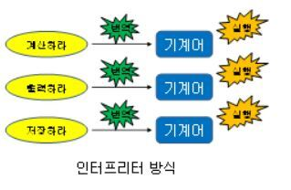

# 컴퓨터가 고급 언어를 이해하는 방법

컴퓨터는 기본적으로 0과 1로 이루어진 이진 데이터만을 이해합니다.  
이러한 컴퓨터가 어떻게 프로그래밍 언어로 작성된 소스코드를 이해하고 실행시킬 수 있는지에 대해 알아보았습니다.
 
 
 
먼저 프로그래밍 언어는 고급 언어와 저급 언어로 구분됩니다.
 
 
## 1. 저급 언어
기계 중심의 언어로 컴퓨터가 이해하기 쉬운 이진법으로 이루어진 언어입니다.  
이는 컴퓨터가 바로 실행할 수 있어 실행 속도가 빠르지만 가독성 및 생산성이 낮습니다.
 
 
저급 언의 종류에는 기계어, 어셈블리어 등이 있습니다.
 
 
#### * 기계어
CPU가 직접 해독하고 실행할 수 있는, 즉 0과 1의 bit 단위로 쓰인 언어입니다.  
기계어는 이름 그대로 기계를 위해 만들어진 언어이기 때문에 사람이 이해하기 어렵습니다.
 
 
#### * 어셈블리어
기계어를 사람이 이해하기 쉬운 형태로 번역한 것이 어셈블리어입니다.  
어셈블리어는 0과 1로 이루어진 기계어를 조금 더 읽기 편하게 만든 저급 언어입니다.
 
 
 
## 2. 고급 언어
고급 언어는 일상적인 언어와 기호를 그대로 이용하는 사람 중심의 언어로, 하드웨어에 대한 지식 없이도 프로그래밍을 작성할 수 있고 생산성이 높습니다.
 
 
이러한 고급 언어로 작성된 소스 코드를 실행하기 위해서는 컴퓨터가 이해할 수 있는 기계어로 변환되어야 하는데, 크게 컴파일과 인터프리터 방식이 있습니다.
 
 
 
## 3. 컴파일

컴파일러에 의해 소스코드가 모두 기계어로 변환된 후 실행되는 방식입니다.
 
 
이때 컴파일러란 컴파일을 수행해 주는 도구이며, 소스코드 내에 오류가 하나라도 발견된다면 컴파일 에러를 발생시킵니다.
 
 
또한 컴파일이 성공적으로 수행되어 기계어로 변환된 코드/파일을 목적 코드/파일이라 합니다.  
컴파일 방식에서는 이러한 목적 파일이 실행 파일이 될 수 있도록 빌드 과정을 거치게 됩니다.
 
 
따라서 소스코드를 실행 가능한 파일로 만들어주는 빌드 과정을 거치기 때문에, 런타임 전까지의 속도가 조금 소요되는 편입니다.  
하지만 런타임에서는 이미 모든 소스코드가 변환되었기 때문에 빠르게 실행이 가능합니다.
 
 
이러한 컴파일 방식을 사용하는 언어를 컴파일 언어라 하며 C, C++, Java 등이 있습니다.
 
 
 
## 4. 인터프리터

인터프리터에 의해 소스코드가 한 줄씩 변환되어 실행되는 방식입니다.
 
따라서 소스코드 전체를 기계어로 변환하는 시간을 기다릴 필요 없으며, 소스코드 내에 오류가 있더라도 오류가 발생하기 전 라인까지는 정상적으로 수행이 됩니다.
 
이러한 인터프리터 방식을 사용하는 언어를 인터프리터 언어라 하며 Python, PHP, JS 등이 있습니다.
 
또한 인터프리터 언어가 컴파일 언어보다 빠르다고 생각할 수도 있지만, 일반적으로 인터프리터 언어는 컴파일 언어보다 느립니다.  
컴파일을 통해 나온 결과물, 즉 목적 코드는 컴퓨터가 이해하고 실행할 수 있는 저급 언어인 반면, 인터프리터 언어는 소스 코드 마지막에 이를 때까지 한 줄 한 줄씩 저급언어로 해석하며 실행해야 하기 때문입니다.
 
 
 
컴파일 언어와 인터프리터 언어를 쉽게 비교하자면 아래의 표와 같습니다.
 
 
|컴파일 언어|인터프리터 언어|
|---|---|
|코드가 실행되기 전 단계인 컴파일 타임에 소스코드 전체를 한 번에 머신 코드로 변환한 후 실행한다.|코드가 실행되는 단계인 런타임에 문 단위로 한 줄씩 중간 코드인 바이트 코드로 변환한 후 실행한다.|
|실행 파일을 생성한다.|실행 파일을 생성하지 않는다.|
|컴파일 단계와 실행 단계가 분리되어 있다. 명시적인 컴파일 단계를 거치고, 명시적으로 실행 파일을 실행한다.|인터프리트 단계와 실행 단계가 분리되어 있지 않다. 인터프리터는 한 줄씩 바이트코드로 변환하고 즉시 실행한다.|
|실행에 앞서 컴파일은 단 한 번 수행된다.|코드가 실행될 때마다 인터프리트 과정이 반복 수행된다.|
|컴파일과 실행 단계가 분리되어 있으므로, 코드 실행 속도가 빠르다.|인터프리트 단계와 실행 단계가 분리되어 있지 않고 반복 수행되므로, 코드 실행 속도가 비교적 느리다.|
 
 
이처럼 컴파일 언어와 인터프리터 언어를 구분하였지만 이 둘의 경계가 뚜렷하다고 보기는 힘듭니다.  
C, C++는 명확하게 컴파일 언어로 구분되지만, 많은 프로그래밍 언어는 컴파일 언어와 인터프리터 언어 간의 경계가 모호한 경우가 많습니다.
 
 
따라서 고급 언어가 저급 언어로 변환되는 대표적인 방법에는 컴파일 방식과 인터프리트 방식이 있다. 정도로만 이해하는 것이 좋습니다.
 
 
 
 
 
 

[참고1](https://louis-j.tistory.com/entry/%EC%9D%B8%ED%84%B0%ED%94%84%EB%A6%AC%ED%84%B0-%EC%96%B8%EC%96%B4-vs-%EC%BB%B4%ED%8C%8C%EC%9D%BC-%EC%96%B8%EC%96%B4%EA%B3%A0%EA%B8%89%EC%96%B8%EC%96%B4)
[참고2](https://rebugs.tistory.com/187)
