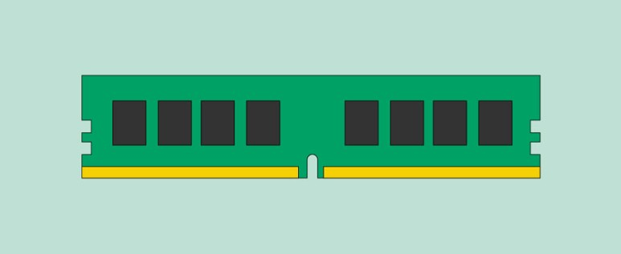
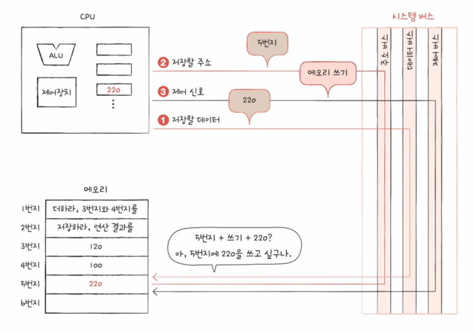
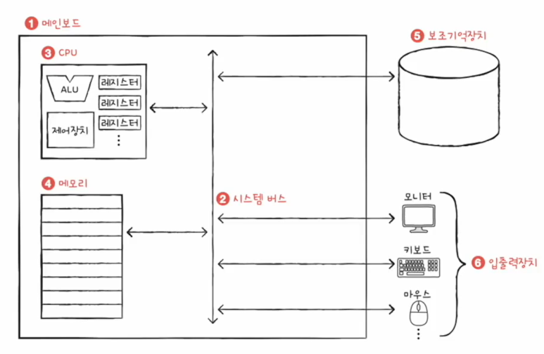

# 컴퓨터 구성 요소

인프런 강의 [<혼자 공부하는 컴퓨터 구조 + 운영체제>](https://www.inflearn.com/course/%ED%98%BC%EC%9E%90-%EA%B3%B5%EB%B6%80%ED%95%98%EB%8A%94-%EC%BB%B4%ED%93%A8%ED%84%B0%EA%B5%AC%EC%A1%B0-%EC%9A%B4%EC%98%81%EC%B2%B4%EC%A0%9C/dashboard) 를 바탕으로 정리한 내용입니다.
 
 
 
컴퓨터에는 CPU, 메모리, 보조기억장치, 입출력장치 이렇게 네 가지 핵심 부품이 있습니다.
 
 
각 부품에 대해 자세하게 학습하기 앞서 간단하게 컴퓨터의 구성 요소를 살펴볼 수 있도록 정리했습니다.
 
 
 
## 1. 메인보드 == 마더보드

메인보드란 컴퓨터의 메인 회로 기판으로 CPU, 메모리, 하드 드라이브 등 기본적인 부품을 탑재한 얇은 판입니다.  
즉, 컴퓨터의 모든 부분에 직/간접적으로 연결된다고 볼 수 있습니다.
 
 
 
## 2. 메모리 == 주기억장치
메모리란 CPU가 처리할 명령어와 데이터를 저장하기 위한 하드웨어 장치입니다.  
쉽게 말해 프로그램이 실행되기 위해서는 메모리에 저장되어 있어야 합니다.
 
 
이러한 메모리에는 저장할 수 있는 데이터와 명령의 종류가 많기 때문에, 원하는 데이터를 찾기 위해 주소라는 개념이 있습니다.

위의 사진과 같이 메모리에는 주소라는 개념이 있기 때문에 명령어 또는 데이터가 어디에 저장되어 있는지 알 수 있는 것입니다.
 
 
또한, 메모리는 크게 RAM과 ROM으로 구분할 수 있으며, 일반적으로 메모리라 함은 RAM을 지칭합니다.
 
 
#### * RAM (Random Access Memory)

컴퓨터가 계산을 수행하면 필요할 때까지만 데이터를 임시로 저장하는, 시스템의 단기 메모리입니다.  
즉, RAM은 전원 공급이 중단되면 기록된 정보가 사라지는 휘발성 메모리입니다.
 
 
이러한 RAM이 많을수록 동시에 할 수 있는 일이 많아집니다.
 
 
#### * ROM (Read Only Memory)
쓰기가 가능한 RAM과 달리 읽기 전용 메모리입니다.
 
 
또한, 전원 공급이 중단되어도 기록된 정보가 사라지지 않는 비휘발성 메모리입니다.  
때문에 컴퓨터를 처음 켰을 때 구동하기 위한 BIOS와 같은 프로그램이 적재됩니다.
 
 
 
## 3. 시스템 버스

버스란 메인보드에 부착된 부품들이 서로 연결되어 정보를 주고받을 수 있도록 하는 통로입니다.  
다양한 종류의 버스가 있으며, 컴퓨터의 핵심 부품을 연결하는 버스가 시스템 버스입니다.
 
 
시스템 버스는 주소 버스, 데이터 버스, 제어 버스라고 하는 내부 구성을 가지고 있습니다.
 
 
#### * 주소 버스
주소를 주고받는 통로입니다.
 
 
#### * 데이터 버스
명령어와 데이터를 주고받는 통로입니다.
 
 
#### * 제어 버스
제어 신호를 주고받는 통로입니다.
 
 
위의 그림은 메모리에 값을 저장하는 과정입니다.  
메모리의 값을 쓰기 위해서는 저장할 데이터, 저장할 주소, 제어 신호 와 같은 3가지 정보가 필요하게 됩니다.  
각각 저장할 데이터는 데이터 버스로 통하고, 저장할 주소는 주소 버스로 통하고, 제어 신호는 제어 버스를 통하게 됩니다.
 
 
 
## 4. CPU (Central Processing Unit) == 중앙 처리 장치 == 프로세서

CPU란 메모리에 저장된 값을 읽어 들이고, 해석하고, 실행하는 컴퓨터 시스템의 핵심적인 장치입니다.  
쉽게 말해 명령을 실행하는 장치로, 키를 누르거나 응용 프로그램을 시작할 때마다 CPU에 명령을 보내는 것입니다.
 
 
이러한 CPU는 기억, 연산, 해석, 제어와 같은 4대 기능을 담당하며, 레지스터, 연산장치, 제어장치로 구성됩니다.
 
 
#### * 레지스터 (Register)
CPU 내부의 작은 저장 장치로, CPU가 연산을 처리하기 위한 임시 저장소 역할을 합니다.
 
 
#### * 산술 논리 연산장치 (ALU; Arithmetic Logic Unit)
데이터들 간의 비교, 판단, 연산을 수행합니다.  
즉, 계산기 역할을 하고 있습니다.
 
 
#### * 제어장치 (Control Unit)
제어 신호를 내보내고 명령어를 해석하는 장치입니다.
 
 
이때 제어 신호란, 컴퓨터 부품들을 관리하고 작동시키기 위한 전기 신호입니다.  
크게 메모리 읽기와 메모리 쓰기라는 제어 신호를 보냅니다.
 
 
풀어 얘기하자면, 명령어를 해석하고 해석한 명령을 연산 잔치 등으로 보내고 주소를 디코드 하여 레지스터에 데이터를 저장하는 역할을 합니다.
 
 
 
## 5. 보조 기억장치

현재 실행되는 프로그램이 저장되는 곳이 메모리라면, 실행되고 있지 않은 프로그램들이 저장되는 곳이 보조기억장치입니다.  
즉, 메모리는 실행할 정보를 저장하고, 보조기억장치는 보관할 정보를 저장한다고 볼 수 있습니다.
 
 
예를 들어, 운영체제 및 사용자 프로그램도 보조기억장치에 저장되어 있다가 시스템 구동 시 주기억장치로 적재되는 것입니다.
 
 
이러한 기억저장장치 역할을 하는 보조기억장치는 크게 HDD와 SSD로 구분할 수 있습니다.  
일반적으로 SSD를 주요 저장 공간으로 사용하고 HDD를 보조 저장 장치로 많이 사용합니다.
 
 
#### * SSD (Solid State Drive)
반도체를 이용하여 정보를 저장하며, 하드디스크의 대안으로 속도가 빠르고 발열/소음도 적으며 소형화/경량화할 수 있습니다.
 
 
#### * HDD (Hard Disk Drive)
자기력을 이용하여 정보를 저장하며, 가격 대비 넓은 용량으로 많은 데이터 저장이 가능합니다.
 
 
 
## 6. 입출력장치
컴퓨터와 정보를 주고받을 수 있는 장치입니다.
 
 
입력장치에는 키보드, 스캐너, 터치패드 등이 있고, 출력장치에는 모니터, 프린터 등이 있습니다.
 
 
 
간단하게 정리하자면 아래의 그림과 같습니다.

 
 
 
 
 
 

[참고](https://edu.gcfglobal.org/en/computerbasics/)
