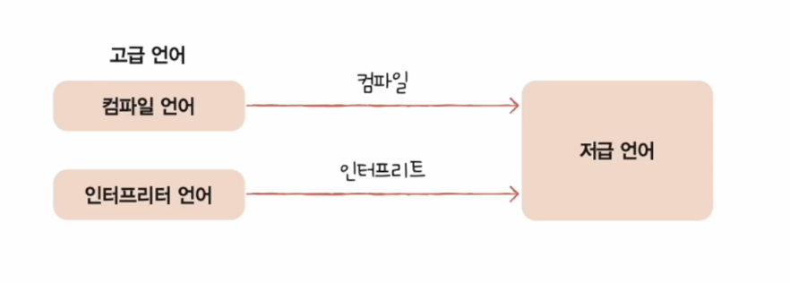

# Chapter 3. 명령어

## 1️⃣ 소스코드와 명령어

### 고급언어와 저급언어

- **고급언어**: 개발자가 읽고 쓰기 편하게 만들어진 언어
- **저급언어**: 컴퓨터가 이해하고 실행하기 위해 만들어진 언어
    - 저급언어 == 명령어

### 저급언어

- **종류**: 기계어, 어셈블리어

- **기계어**: 0과 1로 이루어진 명령어
- **어셈블리어**: 0과 1로 이루어진 기계어를 읽기 편한 형태로 번역한 명령어

### 컴파일 언어와 인터프리트 언어

- 고급언어를 컴퓨터가 이해하기 위해서는 저급언어로 변환하는 과정 필요
- 대표적인 변환방법: 컴파일, 인터프리트

- **컴파일**:
    - 컴파일 언어로 작성된 소스코드는 컴파일러에 의해 컴파일됨
    - 컴파일 결과로 저급언어인 목적코드가 생성됨

- **인터프리트 언어**:
    - 인터프리터에 의해 한 줄씩 실행
    - 소스 코드 전체가 저급 언어로 변환되기까지 기다릴 필요 없음

## 2️⃣ 소스코드와 명령어

### 명령어 구조

- 수행할 연산, 무엇을 대상으로 하는지 (예: 더하라, 메모리 32번지 안의 값과, 메모리 33번지 안의 값을)
- 대상 → 연산에 사용될 데이터 혹은 연산에 사용될 데이터가 저장된 위치 (주소필드)
- 명령어의 구조: 연산코드, 오퍼랜드

### 오퍼랜드

- 연산을 수행하는 데 필요한 데이터

### 연산코드

- 연산코드의 종류나 생김새는 CPU마다 다름
- 특징:
    - 데이터 전송
    - 산술/논리 연산
    - 제어 흐름 변경
    - 입출력 제어

### 명령어 주소 지정 방식

- **정의**: CPU가 명령어를 통해 데이터에 접근하는 방식
- **문제**: 오퍼랜드 하나에 데이터를 전부 다 명시하면 더 심플하고 보기 좋은데 왜 여러 오퍼랜드로 나누어서 저장을 할까?
- **이유**: 명령어 내에서 표현할 수 있는 데이터의 크기가 제한되어 있기 때문
- **방법**: 오퍼랜드에 레지스터 또는 메모리 주소를 입력

- **유효 주소**: 연산에 사용할 데이터가 저장된 위치

### 즉시 주소 지정 방식

- **예시**: `MOV AX, 5` - 레지스터에 5라는 값을 즉시 로드

### 직접 주소 지정 방식

- **예시**: `MOV AX, [1234H]` - 메모리 주소 1234H에 있는 값을 AX 레지스터로 로드

### 간접 주소 지정 방식

- **예시**: `MOV AX, [BX]` - BX 레지스터에 저장된 메모리 주소에서 데이터를 AX 레지스터로 로드

### 레지스터 주소 지정 방식

- **예시**: `MOV AX, BX` - BX 레지스터의 값을 AX 레지스터로 이동
