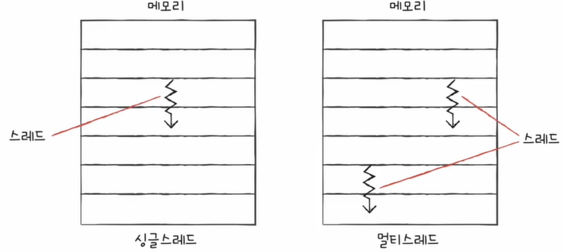
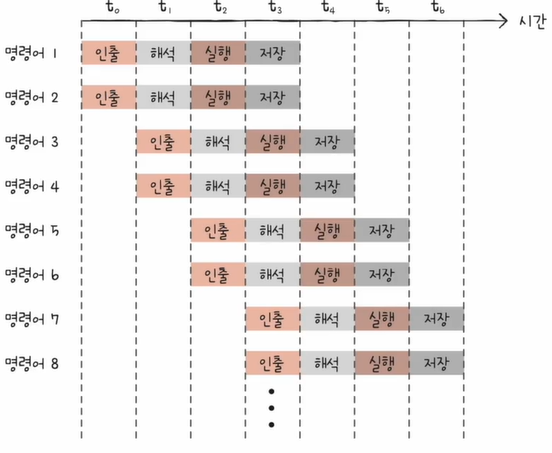

# CPU 성능 향상 기법
 

## 1. 빠른 CPU를 위한 설계 기법
### 1-1. 클럭
일반적으로 클럭 신호가 빠르게 반복되면 CPU를 비롯한 컴퓨터 부품들은 그만큼 빠른 박자에 맞춰 움직이게 됩니다.
 
 
클럭 속도는 헤르츠(Hz) 단위로 측정되며, 헤르츠(Hz)는 1초에 클럭이 반복되는 횟수입니다.  
즉, 클럭이 1초에 한 번 반복되면 1Hz입니다.
 
 
### 1-2. 코어와 멀티 코어
코어란 CPU 내에서 명령어를 실행하는 부품으로 여러 개 있을 수 있습니다.  
이렇게 여러 개의 코어를 포함하고 있는 CPU를 멀티 코어라 합니다.
 
 
### 1-3. 스레드와 멀티 스레드
스레드에는 하드웨어적 스레드와 소프트웨어적 스레드가 있습니다.
 
 
* #### 소프트웨어 스레드
하나의 프로그램에서 독립적으로 실행되는 단위입니다.

위와 같이 하나의 스레드로 실행하는 것은 한 프로그램이 순차적으로 실행되는 구조를 의미하고, 두 개 이상의 스레드로 실행하는 것은 한 프로그램이 병렬적으로 동시에 실행되는 구조를 의미합니다.
 
 
* #### 하드웨어 스레드
하나의 코어가 동시에 처리하는 명령어 단위입니다.

 
 
하나의 코어가 여러 개의 명령어를 동시에 처리할 수 있는 프로세서를 멀티 스레드 프로세서라 합니다.

 
 
1코어 1스레드 CPU(하드웨어 스레드)도 여러 소프트웨어적 스레드를 만들 수 있습니다.  
즉, 하드웨어적인 스레드가 하나여도 소프트웨어적인 스레드를 여러 개 만들 수 있습니다.
 
 
 

## 2. 명령어 병렬 처리 기법
CPU를 빠르게 처리할 수 있도록 설계를 하는 것도 중요하지만, CPU가 시간 낭비 없이 시간을 알뜰히 쓰며 메모리에 있는 명령어들을 빠르게 실행하는 것도 중요합니다.
 
 
이와 관련해서 명령어 병렬 처리 기법에 대해 알아보겠습니다.
 
 
### 2-1. 명령어 파이프라인
명령어 파이프라이닝은 동시에 여러 개의 명령어를 겹처 실행하는 기법입니다.
 
 
명령어가 처리되는 과정을 비슷한 시간 간격으로 나누면 다음과 같습니다.  
① 명령어 인출 (Instruction Fetch)  
② 명령어 해석 (Instruction Decode)  
③ 명령어 실행 (Execute Instruction)  
④ 결과 저장 (Write Back)
 
 
이 단계가 겹치지만 않는다면 CPU는 각 단계를 동시에 실행할 수 있습니다.

 
 
하지만 때로는 명령어 파이프라인이 이러한 성능 향상에 실패하는 경우도 있습니다. 이를 파이프라인 위험이라 부릅니다.
 

### 2-1-1. 파이프라인 위험
#### * 데이터 위험
명령어 간의 의존성에 의해 생겨나는 위험입니다.  
즉, 명령어 간에 의존성이 있어서 명령어를 단순하게 병렬로 처리할 수 없는 상황입니다.
 
 
#### * 제어 위험
프로그램 카운터의 갑작스러운 변화에 의해 생겨나는 위험입니다.  
즉, 프로그램 카운터의 메모리 주소가 바뀌게 되는 상황입니다.
 
 
#### * 구조적 위험
서로 다른 명령어가 같은 CPU 부품(ALU, 레지스터)를 쓰려고 할 때 생겨나는 위험입니다.
 
 
### 2-2. 슈퍼스칼라
CPU 내부에 여러 개의 명령어 파이프라인을 포함한 구조를 말합니다.  
즉, 멀티스레드 프로세서를 의미합니다.

 
 
이론적으로는 파이프라인 개수에 비례하여 처리 속도가 증가되지만, 현실적으로는 파이프라인 위험도의 증가로 인해 파이프라인 개수에 비례하여 처리 속도가 증가되진 않습니다.
 

### 2-3. 비순차적 명령어 처리
파이프라인의 중단을 방지하기 위해 명령어를 순차적으로 처리하지 않는 명령어 병렬 처리 기법입니다.  
이때 명령어가 비순차적으로 실행되더라도, 최종 결과는 순차적 실행과 동일하게 유지되어야 합니다.
 
 
 
## 3. 명령어 집합 구조
명령어 파이프라이닝에 유리하게 생긴 명령어가 있고, 불리하게 생긴 명령어가 있습니다.  
이에 대해 알아보기 앞서 명령어 집합에 대해 먼저 알아보겠습니다.
 
 
명령어 집합(구조)이란 CPU가 이해할 수 있는 명령어들의 모음입니다.  
CPU 마다 이해할 수 있는 명령어 집합은 모두 다르며 이때문에 명령어 해석 방식, 레지스터의 종류와 개수, 파이프라이닝의 용이성 등이 달라질 수 있습니다.
 
 
다시 말해 명령어의 집합이 달라지면 명령어를 조금 더 효율적으로 실행할 수 있는 하드웨어 구조도 달라지기 때문에, 명령어 집합 구조는 하드웨어가 소프트웨어를 어떻게 이해해야 될지에 대한 약속이기도 합니다.
 
 
이러한 명령어 집합의 대표적인 종류에는 CISC와 RISC가 있습니다.
 
 
### 3-1. CISC (Complex Instruction Set Computer)
CISC는 복잡하고 다양한 수의 가변 길이 명령어 집합을 활용합니다.

 
 
이렇게 다양하고 강력한 명령어를 활용하기 때문에, 상대적으로 적은 수의 명령어로도 프로그램을 실행할 수 있습니다.
 
 
CISC는 메모리를 최대한 아끼며 개발해야 했던 시절에는 인기가 높았으나, 명령어 파이프라이닝이 불리하다는 치명적인 단점이 있습니다.  
명령어가 복잡하고 다양한 기능을 제공하는 탓에 명령어의 크기와 실행되기까지의 시간이 일정하지 않습니다.  
또한 복잡한 명령어 때문에 명령어 하나를 실행하는 데에 여러 클럭 주기가 필요하게 됩니다.
 
 

## 3-2. RISC (Reduced Instruction Set Computer)
RISC는 단순하고 적은 수의 고정 길이 명령어 집합을 활용합니다.

CISC와 달리 명령어의 종류가 적고, 짧고 규격화된 명령어를 사용함으로써 CISC의 단점을 해소할 수 있게 됩니다.
 
 
RISC는 일반적으로 메모리 접근 방식을 최소화하고 레지스터를 십분 활용하는 경향이 있습니다.  
때문에 CISC에 비해 범용 레지스터의 종류가 더 많은 경우가 많습니다.
 
 
다만 명령어 종류가 CISC보다 적기 때문에 더 많은 명령어로 프로그램을 동작시키게 됩니다.
 
 
* #### 정리

 
