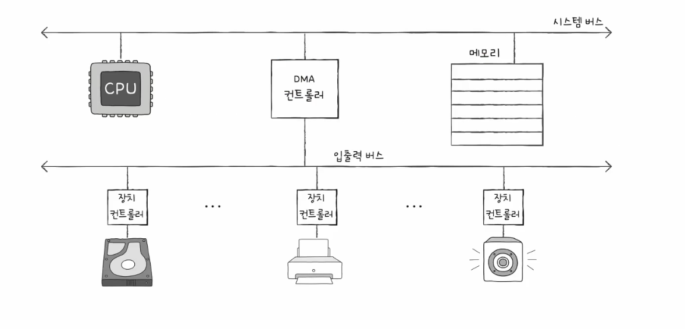

# [ 입출력장치 ]

- 입출력장치의 종류가 많음 → 정보를 주고받는 방식을 규격화하기 힘듦
- 전송률 : 데이터를 얼마나 빨리 교환할 수 있는지를 나타내는 지표
- (일반적으로 CPU 와 메모리 사이의 데이터 전송률은 높지만) 입출력장치의 데이터 전송률은 낮음
- 입출력장치는 컴퓨터에 직접 연결되지 않고 **장치 컨트롤러**라는 하드웨어를 통해 연결됨

---

# [ 장치 컨트롤러 ]

- 입출력 제어기, 입출력 모듈 등으로 불리기도 함
- 장치 컨르롤러의 역할 : CPU 와 입출력장치 간의 통신 중개, 오류 검출, 데이터 버퍼링 등

### 1. 데이터 버퍼링?

- 버퍼링 : 전송률이 높은 장치와 낮은 장치 사이에 주고 받는 데이터를 버퍼(임시 저장 공간)에 저장하여 전송률을 비슷하게 맞추는 방법
- 버퍼에 데이터를 조금씩 모았다가 한꺼번에 내보내거나 데이터를 한 번에 많이 받아 조금씩 내보내는 방법
- 결론 : 장치 컨트롤러는 일반적으로 전송률이 높은 CPU 와 일반적으로 전송률이 낮은 입출력장치와의 전송률 차이를 데이터 버퍼링으로 완화함

### 2. 장치 컨트롤러의 내부 구조

- 데이터 레지스터, 상태 레지스터, 제어 레지스터

- 상태, 제어 레지스터는 하나의 레지스터로 범용되어 사용되기도 하지만, 이해를 위해 분리하여 표현
- 데이터 레지스터
    - CPU 와 입출력장치 사이에 주고 받을 데이터가 담기는 레지스터
    - 데이터 버퍼링 할 때 사용하는 버퍼 역할
- 상태 레지스터
    - 입출력장치의 입출력 작업 준비 상태, 준비 완료 상태, 오류 여부 등의 상태 정보가 저장됨
- 제어 레지스터
    - 입출력장치가 수행할 내용에 대한 제어 정보와 명령 저장

---

# [ 장치 드라이버 ]

- 장치 컨트롤러의 동작을 감지하고 제어하여 장치 컨트롤러가 컴퓨터 내부와 정보를 주고 받을 수 있게 하는 프로그램
- 실행 과정들은 메모리에 저장됨

⇒ 장치 컨트롤러는 입출력장치가 연결되기 위한 하드웨어적인 통로, 장치 드라이버는 소프트웨어적인 통로

---

# [ 다양한 입출력 방법 ]

- 입출력 작업을 수행하려면 CPU 와 장치 컨틀롤러의 정보 교환이 있어야함
- 방법 : 프로그램 입출력, 인터럽트 기반 입출력, DMA 입출력

---

# [ 프로그램 입출력 ]

- 프로그램 속 명령어로 입출력장치를 제어하는 방법

### CPU 의 입출력 작업

1. CPU 는 하드 디스크 컨트롤러의 제어 레지스터에 쓰기 명령 전달
2. 하드 디스크 컨트롤러는 하드 디스크 상태 확인 (준비 여부)
3. 준비가 되었을 경우 → 데이터 레지스터에 데이터 작성

⇒ CPU 는 장치 컨트롤러의 레지스터들을 어떻게 알고 접근할까?

### 1. 메모리 맵 입출력

- 메모리에 접근하기 위한 주소 공간과 입출력장치에 접근하기 위한 주소공간을 하나의 주소공간으로 간주하는 방법
- 특정 주소가 RAM을 가리킬 수도 있고, 입출력 장치의 레지스터를 가리킬 수도 있음
- 예)  **`load 517`** 명령어가 있을 때, 517번지가 메모리 주소라면 메모리에서 데이터를 읽고, 517번지가 입출력 장치의 레지스터 주소라면 해당 장치의 상태나 데이터를 읽음

### 2. 고립형 입출력

- 메모리를 위한 주소 공간과 입출력장치를 위한 주소 공간을 분리하는 방법
- 메모리 읽기/ 쓰기 와 입출력장치 읽기/쓰기 가 따로 있을 때

### 3. 비교

---

# [ 인터럽트 기반 입출력 ]

- ‘입출력장치가 CPU 에게 인터럽트 요청 신호를 보내면 CPU는 하던 일을 잠시 멈추고 해당 인터럽트를 처리하는 프로그램인 인터럽트 서비스 루틴을 실행한 뒤 다시 하던일로 되돌아온다.’
- 입출력장치에 의한 하드웨어 인터럽트는 입출력장치가 아닌 장치 컨트롤러에 의해 발생함

### 만약 입출력장치 인터럽트가 동시에 발생한 경우?

- 순서대로 처리하는 방법
- 우선순위대로 처리하는 방법
- NMI : 컴퓨터 시스템에서 매우 중요한 상황이 발생했을 때 CPU에게 즉시 알리는 하드웨어 인터럽트, 즉시 처리되어야하는 긴급 상황
- 우선순위를 반영하여 다중 인터럽트를 처리하는 방법에는 PIC 라는 하드웨어를 사용하는 것이 있음

### 프로그래머블 인터럽트 컨트롤러 (PIC)

- 여러 장치 컨트롤러에 연결되어 장치 컨트롤러에서 보낸 하드웨어 인터럽트 요청들의 우선순위를 판별한 뒤 CPU 에 먼저 처리해야 할 하드웨어 인터럽트가 무엇인지 알려주는 장치

### 과정

1. PIC가 장치 컨트롤러에서 인터럽트 요청 신호를 받아 들임
2. PIC는 우선순위를 판단한 후 → CPU 에 요청 신호 전송
3. CPU는 PIC에 인터럽트 확인 신호 전송
4. PIC는 데이터 버스를 통해 CPU에 인터럽트 벡터 전송
5. CPU 는 인터럽트 벡터를 통해 인터럽트 요청의 주체를 알고, 해당 장치의 인터럽트 서비스 루틴 실행

---

# [ DMA(Direct Memory Access) 입출력 ]

- 입출력장치와 메모리가 CPU를 거치지 않고 상호작용할 수 있는 입출력방식 (직접 메모리에 접근)
- 시스템 버스에 연결된 DMA 컨트롤럴라는 하드웨어가 필요

### 과정

1. CPU는 DMA 컨트롤러에 입출력장치의 주소, 수행할 연산, 메모리 주소 등과 같은 정보로 입출력 작업을 명령
2. DMA 컨트롤러는 CPU 대신 장치 컨트롤러와 상호작용하며 입출력작업 수행
3. 입출력작업이 끝나면 DMA 컨트롤러는 CPU에 인터럽트를 보내 작업이 끝났음을 알림

### 사이클 스틸링

- CPU는 입출력작업의 시작과 끝만 관여 → DMA 컨트롤러의 시스템 버스 이용이 필요함
- 시스템 버스는 동시 사용이 불가능함 → CPU와 DMA 컨트롤러가 동시에 사용할 수 없음
- 따라서 DMA 컨트롤러가 시스템 버스를 이용할 때 → (1) CPU가 사용하지 않을 때 사용하거나, (2) CPU의 허락을 받고 이용

### 입출력 버스

- 입출력장치를 컴퓨터 내부와 연결 짓는 통로
- DMA의 시스템  버스  이용으로 인해 CPU가 시스템 버스를 이용하지 못하는 문제를 해결해줌 → 시스템 버스 사용 빈도를 줄일 수 있음
- 입출력 버스의 종류 : PCI 버스, PCI Express(PCIe) 버스
- PCIe 슬롯 : 입출력장치들을 PCIe 버스와 연결해주는 통로