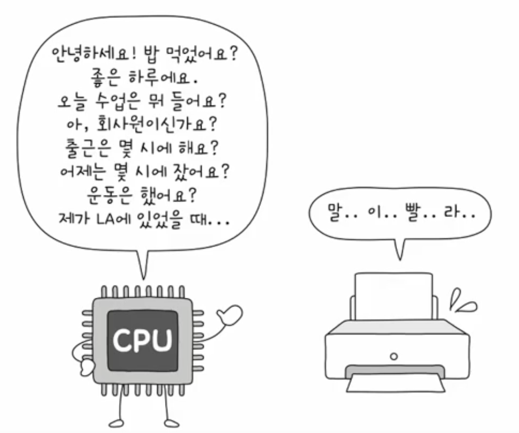
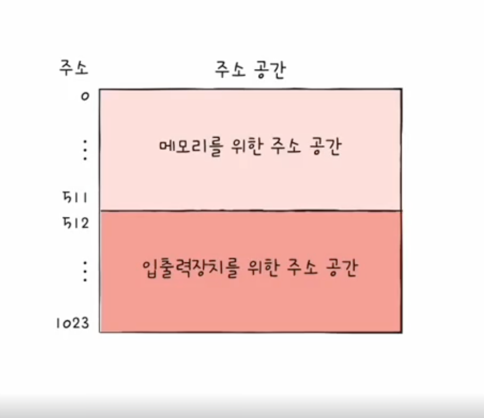
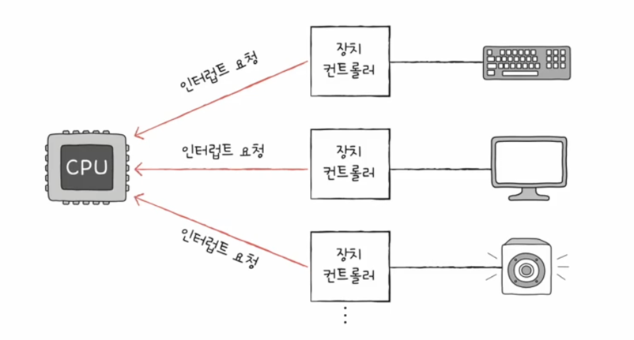
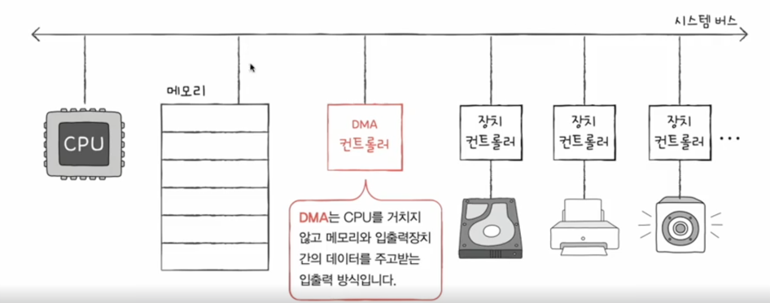

# 입출력 장치

입출력 장치는 종류가 많기 때문에 규격화 하기 정말 어렵습니다.  
또한 cpu보다 느리기 때문에 cpu가 입출력 장치의 작업을 기다리는 시간이 많아집니다.  
그래서 운영체제는 입출력 장치를 장치 컨트롤러, 장치 드라이버로 추상화하여 관리합니다.  

## 장치 컨트롤러

장치 컨트롤러는 입출력 장치를 제어하는 하드웨어입니다.  
cpu와 입출력 장치 사이에 위치하며 cpu가 입출력 장치에 데이터를 보내면 장치 컨트롤러가 데이터를 받아서 입출력 장치에 전달합니다.  
이 때 발생하는 오류에 대한 처리도 장치 컨트롤러가 담당합니다.  
또 cpu의 빠른 속도를 맞추기 위해 입출력 장치는 버퍼를 사용합니다.  
cpu가 데이터를 보내면 장치 컨트롤러가 버퍼에 데이터를 저장하고 입출력 장치가 데이터를 처리하면 장치 컨트롤러가 버퍼에서 데이터를 가져와 cpu에 전달합니다.  

### 장치 컨트롤러의 구조

장치 컨트롤러는 데이터 레지스터, 상태 레지스터, 제어 레지스터로 구성되어 있습니다.

- 데이터 레지스터
  - CPU와 입출력장치 사이에 주고받을 데이터가 담기는 레지스터 (버퍼)
  - RAM을 사용하기도

- 상태 레지스터
  - 상태 정보 저장
  - 입출력장치가 입출력 작업을 할 준비가 되었는지,
  - 입출력 작업이 완료되었는지,
  - 입출력장치에 오류는 없는지 등의 상태 정보

- 제어 레지스터
  - 입출력장치가 수행할 내용에 대한 제어 정보

## 장치 드라이버
장치 컨틀롤러가 하드웨어이면 장치 드라이버는 소프트웨어입니다.  
운영체제와 입출력 장치 사이에 위치하며 장치 컨트롤러를 제어합니다.  
장치 드라이버는 입출력 장치의 제어 정보를 장치 컨트롤러에 전달하고 장치 컨트롤러의 상태 정보를 운영체제에 전달합니다.  
만약 입출력 장치에 장치 드라이버가 없다면 운영체제는 입출력 장치를 제어할 수 없어 입출력 장치를 사용할 수 없습니다.  

## 프로그램 입출력 방식

### 메모리 맵 입출력

메모리 맵 입출력은 입출력 장치를 메모리에 맵핑하여 입출력 장치를 메모리처럼 사용하는 방식입니다.  
메모리와 같은 주소 공간을 사용하기 떄문에 메모리를 제어하는 명령어로 입출력 장치를 제어 할 수 있습니다.   
하지만 메모리의 주소 공간이 축소 되기 때문에 메모리 맵 입출력은 입출력 장치의 주소 공간이 작은 경우에 사용합니다.  

### 고립형 입출력

고립형 입출력 방식은 입출력 장치를 별도의 주소 공간, 별도의 명령어로 제어하는 방식입니다.  
메모리 주소 공간과 입출력 장치 주소 공간이 분리되어 있기 때문에 메모리를 제어하는 명령어로 입출력 장치를 제어할 수 없습니다.  
하지만 입출력 장치의 주소 공간이 크고 복잡한 경우에 사용합니다.  

### 인터럽트 기반 입출력

인터럽트 기반 입출력은 입출력 장치가 인터럽트를 발생시켜 cpu에게 입출력 작업이 완료되었음을 알리는 방식입니다.  
flag register의 인터럽트 비트를 비활성화 하면 인터럽트가 동시에 여러번 발생했을 때 운영체제가 인터럽트를 관리하고 입출력 작업을 처리합니다.
이때 PIC라는 칩을 사용하여 인터럽트를 관리합니다.
NMI(Non-Maskable Interrupt)는 인터럽트의 우선 순위가 가장 높아서 cpu가 NMI를 처리하면 다른 인터럽트를 무시합니다.

### DMA(Direct Memory Access)

입출력 작업을 처리할 때 cpu가 직접 입출력 작업을 처리하는 것이 아니라 메모리에 저장된 데이터를 입출력 장치로 전달하는 방식입니다.  
매 입출력 작업이 cpu를 통해서 처리되면 cpu가 입출력 작업을 처리하는 시간이 많이 소요되기 때문에 입출력 작업을 처리할 때 DMA를 사용합니다.  
이제 cpu는 입출력 작업 때 시작과 종료만 알려주면 되고 나머지는 DMA가 처리합니다.  

### 입출력 버스

시스템 버스는 cpu나 DMA가 동시에 사용할 수 없습니다.  
그래서 DMA는 cpu가 사용하지 않을 때, cpu에게 사용 권한을 요쳥해서 허용 되었을 때만 사용할 수 있습니다.  
그리고 DMA는 한번에 입출력 때 시스템 버스를 두번 사용하게 되면서 cpu의 대기 시간이 증가됩니다.

이런 작업을 처리하기 위해 입출력 버스를 사용합니다.  
입출력 버스를 사용하면 DMA가 시스템 버스를 두 번 사용하지 않고 한번에 입출력 작업을 처리할 수 있습니다.  