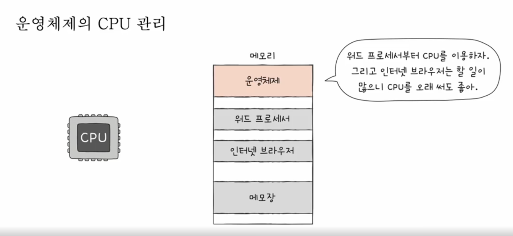
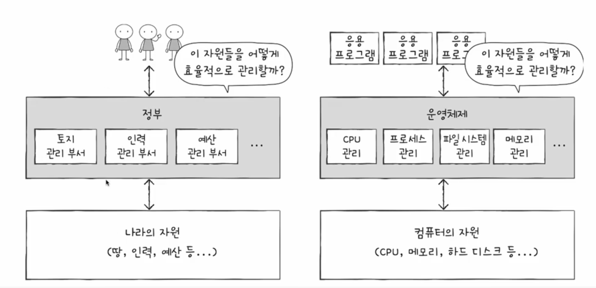

# 운영 체제

## 운영 체제란?

운영 체제란 사용자가 하드웨어에 접근할 수 있도록 도와주는 소프트웨어입니다.    
일반적으로 사용자는 운영 체제를 통해 하드웨어를 제어하고 하드웨어는 운영 체제를 통해 사용자에게 데이터를 전달합니다.    
  
사용자가 메모장과 같은 프로그램을 실행하면 운영 체제는 프로그램을 메모리에 로드하고 프로그램이 실행되는 동안 사용자의 입력을 받아 프로그램에 전달합니다.  

위 그림을 보면 운영 체제가 메모리의 주소 공간을 자동으로 관리해주는 것을 볼 수 있습니다.  

운영 체제는 당연하게도 메모리만 관리해주는건 아니고 cpu, 입출력 장치, 보조 기억 장치를 관리해줍니다.  

위 그림을 보면 알 수 있듯이 운영체제는 software(응용 프로그램)와 hardware 사이에 위치하고 있습니다.  

운영 체제는 중간에서 하드웨어를 효율적으로 관리해주고 사용자에게 편리한 환경을 제공해줍니다.  
하지만 운영 체제는 사용자를 위한 프로그램이라고 생각하기보다 프로그램을 위한 프로그램이라고 생각하는 것이 더 적합합니다.  
왜냐하면 프로그램이 실행 될 때 하드웨어를 효율적으로 관리하고 하드웨어끼리 통신을 할 때도 운영 체제가 중간에서 관리해주기 때문입니다.  
위에 cpu 관리 그림을 보면 알 수 있죠.  
그렇기 때문에 프로그램을 만드는 개발자는 운영 체제가 어떻게 동작하는지 알아야 합니다.  
가장 중요한건 에러 메시지에 대한 깊은 이해입니다.   

## 이중 모드와 시스템 호출
운영 체제는 사용자 모드와 커널 모드로 나뉩니다.
이중 모드는 사용자 모드와 커널 모드를 번갈아가며 사용하는 것을 의미합니다.
예전에 cpu 레지스터에서 배웠던 슈퍼바이저 플래그로 사용자 모드와 커널 모드를 구분합니다.

### 커널
운영 체제의 핵심 부분을 커널이라고 합니다.  
다른 종류의 운영 체제여도 일반적으로 핵심의 기능은 비슷합니다.  
예를 들어 입출력, 메모리 관리, 파일 시스템, 네트워크 관리, 프로세스 관리 등이 있습니다.  
커널은 이러한 기능을 제공해주는 소프트웨어입니다.  

- 커널 모드 특징
  - 운영체제의 서비스를 제공받을 수 있는 실행 모드
  - 자원 접근을 비롯한 모든 명렁어 실행 가능

### 사용자 모드

일반적으로 사용자는 하드웨어에 바로 접근 할 수 없다고 위에서도 언급을 했습니다.   
자원에 직접 접근하는 것은 위험하기 때문에 운영 체제가 사용자 모드와 커널 모드로 나누어 놓았습니다.  
그래서 사용자는 **운영체제를 통해서만** 하드웨어에 접근할 수 있습니다.  

- 사용자 모드 특징
  - 운영체제 서비스를 제공받을 수 없는 실행 모드
  - 커널 영역의 코드를 실행할 수 없는 실행 모드
  - 자원 접근 불가

### 시스템 호출

시스템 호출은 사용자 모드에서 커널 모드로 전환하는 일종의 소프트웨어 인터럽트입니다.  
특정 프로그램의 실행 중에 운영 체제의 서비스를 받아야 할 때 사용합니다.  
소프트웨어가 보조 기억 장치에 접근하거나 네트워크에 접근하거나 하드웨어를 제어할 때 사용합니다.  
동작하는 방식은 하드웨어 인터럽트와 매우 유사하며 시스템 호출이 발생하면 운영 체제는 사용자 모드에서 커널 모드로 전환한 뒤에 요청된 서비스를 처리합니다.  

## 운영 체제의 핵심 기능
### 프로세스 관리
운영 체제는 동시에 실행되는 여러 프로그램을 관리합니다.  
이때 race condition이 발생하지 않도록 프로세스를 관리합니다.  
race condition은 두 개 이상의 프로세스가 공유 자원에 접근할 때 발생하는 문제입니다.  

### 자원 접근 제어 및 할당
#### cpu 스케줄링 
운영 체제는 cpu 스케줄링을 통해 cpu를 효율적으로 사용하고 입출력 장치를 효율적으로 사용합니다.  
여기서 cpu 스케줄링은 cpu가 여러 프로세스를 동시에 실행할 때 어떤 프로세스를 먼저 실행할지 결정하는 것을 의미합니다.  

#### 메모리 스와핑, 페이징
운영 체제는 메모리 스와핑, 페이징을 통해 메모리를 효율적으로 사용합니다.  
앞전에서 배웠듯이 메모리에 프로그램을 로드하고 프로그램이 실행되는 동안 메모리를 관리합니다.  
그리고 메모리의 크기보다 큰 데이터가 있을 때 메모리 스와핑을 통해 메모리를 관리하며 이를 스왑 메모리라고 합니다.  

### 파일 시스템
운영 체제는 파일 시스템을 통해 파일을 관리합니다.
관련된 데이터를 파일이라는 단위로 저장하고 관리합니다.
파일을 묶은 폴더 단위로 보관합니다.