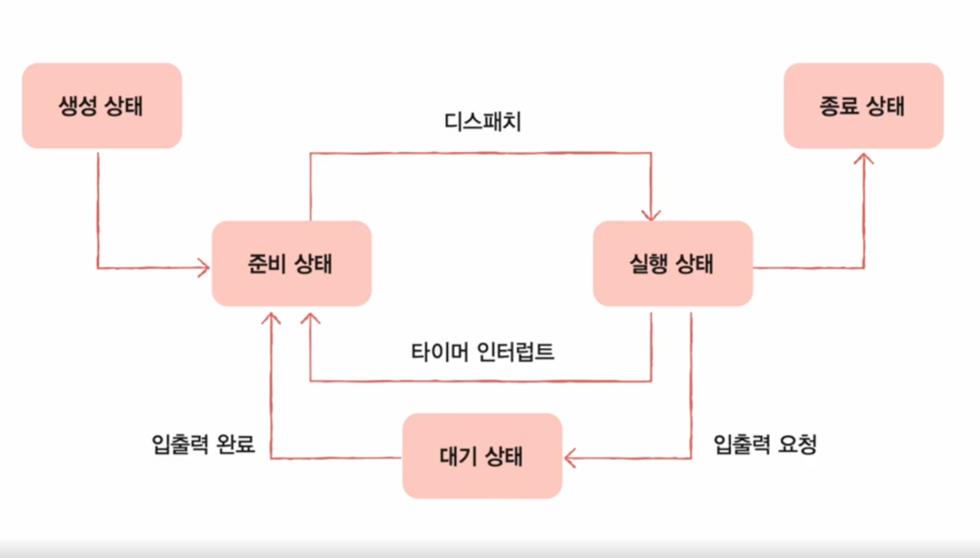
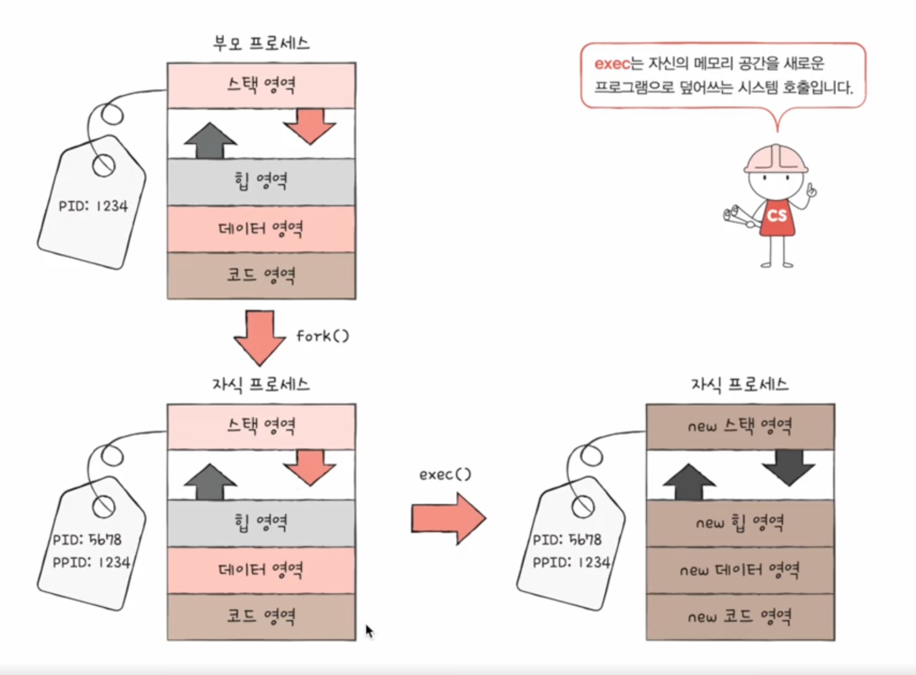

# 프로세스와 스레드

## 프로세스 
프로세스는 실행 중인 프로그램입니다.  
프로그램은 여러개의 프로세스로 이루어질 수 있습니다.  
크롬이라는 웹 브라우저를 예를 들면 크롬은 프로그램이고 탭은 프로세스입니다.  
프로세스는 각각 독립적으로 실행되며 각각의 프로세스는 독립된 메모리 영역을 가지고 있습니다.  

프로세스는 포그라운드 프로세스와 백그라운드 프로세스로 나뉩니다.  
포그라운드 프로세스는 사용자가 확인 가능한 프로세스이고 백그라운드 프로세스는 demon, service라고 불리며 사용자가 볼 수 없는 프로세스입니다.  

## 프로세스 제어 블록

프로세스들은 차례를 기다리며 cpu를 사용합니다.  
그리고 타이머 인터럽트가 발생하면 현재 실행중인 프로세스를 중지하고 다음 프로세스를 실행합니다.  
프로세스 제어 블록은 프로세스에 대한 정보를 저장하는 자료구조입니다.  
프로세스 id, 프로세스의 상태, 프로그램 카운터, 레지스터, 스케줄링 정보, 메모리 관리 정보, 입출력 상태 정보 등을 가지고 있습니다.  

## Context Switching


위에서 타이머 인터럽트가 발생하면 현재 실행중인 프로세스를 중지하고 다음 프로세스를 실행한다고 설명했습니다.  
조금 더 디테일하게 본다면 현재 실행중인 프로세스의 상태를 PCB에 저장하고 다음 프로세스의 상태를 PCB에서 불러와서 실행합니다.  
이 과정을 Context Switching이라고 합니다.  

위 그림을 보면 알겠지만 context switching은 오버헤드가 발생합니다.  
많다면 20ms 정도 소요되는데 요청마다 context switching이 일어나면 성능이 떨어질 수 있습니다.  

## 프로세스 메모리 영역

프로세스는 독립된 메모리 영역을 가지고 있습니다.  
크게 코드 영역, 데이터 영역, 스택 영역, 힙 영역으로 나뉩니다.  
코드 영역은 기계어로 이루어진 쓰기가 불가능한 영역입니다.  
데이터 영역은 전역 변수, 정적 변수, 상수가 저장되는 영역입니다.  
스택 영역은 지역 변수, 매개변수, 리턴 값이 저장되는 영역입니다.  
힙 영역은 동적 할당된 메모리가 저장되는 영역입니다.  

## 프로세스의 상태


프로세스는 생성 상태, 준비 상태, 실행 상태, 대기 상태, 종료 상태로 나뉩니다.  
생성 상태는 프로세스가 생성되었지만 아직 실행되지 않은 상태입니다.  
준비 상태는 프로세스가 cpu를 사용하기 위해 준비된 상태입니다.  
실해 상태는 cpu를 사용하고 있는 상태입니다.  
대기 상태는 외부 입출력이나 이벤트를 기다리는 상태입니다.  
종료 상태는 프로세스가 종료된 상태입니다.  

## 프로세스 계층 구조
윈도우 os를 제외한다면 대부분의 운영체제의 프로세스는 계층 구조로 이루어져 있습니다.  
부모 프로세스가 자식 프로세스를 생성하고 자식 프로세스는 또 다른 자식 프로세스를 생성할 수 있습니다.  
이렇게 생성된 프로세스들은 각자 다른 PID를 가지고 있습니다.  



부모 프로세스가 자식 프로세스를 생성할 때는 fork()와 exec() 함수를 사용합니다.  
fork() 함수는 부모 프로세스를 복사해서 자식 프로세스를 생성합니다.  
exec() 함수는 복사된 자식 프로세스를 새로운 프로그램으로 덮어씌웁니다.  

## 스레드
스레드는 프로세스 내에서 실행되는 흐름의 단위입니다.  
하나의 프로세스는 여러개의 스레드를 가질 수 있습니다.  
위에서 말했듯이 스레드는 실행의 단위이기 때문에 멀티 스레드 환경에서는 명령어를 동시에 실행할 수 있습니다.  
스레드는 프로세스 내의 메모리를 공유하기 때문에 프로세스 내의 데이터를 공유할 수 있습니다.  

### 스레드의 구성 요소


스레드는 thread id, 프로그램 카운터, 레지스터 집합, 스택으로 구성되어 있습니다.  

## 멀티 스레드와 멀티 프로세스
멀티 스레드는 멀티 프로세스보다 효율적입니다.  
왜냐하면 멀티 스레드는 프로세스 내의 데이터를 공유하기 때문에 데이터를 공유하는데 드는 비용이 적습니다.  
하지만 멀티 프로세스는 일반적으로 프로세스 간의 데이터를 공유할 수 없기 때문에 데이터를 공유하는데 비용이 많이 듭니다.  


하지만 스레드는 프로세스의 공유 자원을 공유하기 때문에 스레드 간의 데이터를 공유할 때는 문제가 발생할 수 있습니다.  

## 개인적으로 궁금한 부분 정리
fork와 exec 부분이 왜 효율적인지 궁금해서 GPT에게 질문을 했습니다.
```
Q. 아예 새로운 프로그램을 만들어주는게 효율적인거 아니야?
   복사하고 덮어씌우면 자원을 생성하는 비용이 줄어서 그런건가?
   그리고 자식 프로세스가 부모 프로세스보다 더 큰 용량을 필요로 하면 문제가 발생할거같은데?

A. fork()와 exec()를 조합하여 프로세스를 생성하는 것은 여러 가지 이유와 이점이 있습니다.

1. 유연성 및 간단한 인터페이스
fork()와 exec()를 사용하면 매우 유연한 방식으로 새로운 프로세스를 생성할 수 있습니다. fork() 함수는 현재의 프로세스를 복사하여 새로운 프로세스를 만들고, exec() 함수는 새로운 프로그램으로 이 프로세스를 덮어씌웁니다. 이렇게 두 단계를 분리함으로써, 개발자는 자식 프로세스를 생성한 후에 추가적인 설정을 수행할 수 있습니다.

2. 환경 설정
fork()와 exec()를 분리하여 사용하면 자식 프로세스를 생성한 후, 새로운 프로그램을 실행하기 전에 환경 변수를 설정하거나 파일 디스크립터를 재설정하는 등의 작업을 수행할 수 있습니다. 이는 특히 초기화나 설정이 필요한 데몬 프로세스를 시작할 때 매우 유용합니다.

3. 자원 절약
fork() 함수는 프로세스를 복사할 때 페이지 테이블을 공유하는 방식으로 작동합니다. 즉, 실제 메모리 페이지는 처음에는 공유되고, 부모나 자식 프로세스 중 하나가 데이터를 수정할 때만 복사됩니다(Copy-On-Write). 따라서 자원을 효율적으로 사용할 수 있습니다.

아예 새로운 프로그램을 만들어주는 것이 왜 비효율적인가?
1. 자원 관리의 어려움
단일 함수 호출로 새로운 프로그램을 생성하고 실행하려면, 프로세스 생성과 환경 설정을 동시에 처리해야 합니다. 이는 복잡성을 증가시키고, 프로세스 생성에 대한 유연성을 감소시킵니다. fork()와 exec()는 이러한 복잡성을 줄이고, 프로세스 생성과 실행을 더 단순하고 직관적으로 만듭니다.

2. 운영체제의 역사적 설계
유닉스 시스템은 처음부터 프로세스 제어를 fork()와 exec()를 통해 설계했습니다. 이는 운영체제의 디자인 패턴으로 자리 잡았고, 수십 년 동안 안정적이고 신뢰할 수 있는 방식으로 사용되었습니다.

자식 프로세스가 부모 프로세스보다 더 큰 용량을 필요로 하는 경우
fork() 함수는 부모 프로세스의 모든 메모리 공간을 복사하지 않고, 페이지 테이블을 공유하는 방식으로 작동합니다. 자식 프로세스가 더 많은 메모리가 필요할 경우, 추가적인 메모리를 운영체제에서 할당받을 수 있습니다. 이는 운영체제의 메모리 관리 시스템이 처리하는 부분이며, 다음과 같은 방식으로 해결됩니다.

1. 메모리 할당
자식 프로세스가 더 많은 메모리가 필요할 경우, malloc() 등의 메모리 할당 함수를 통해 추가 메모리를 요청할 수 있습니다. 운영체제는 이러한 요청을 처리하여 필요한 메모리를 할당해줍니다.

2. 가상 메모리
운영체제는 가상 메모리 시스템을 통해 물리적인 메모리보다 더 큰 주소 공간을 사용할 수 있게 합니다. 자식 프로세스가 더 많은 메모리를 필요로 할 경우, 가상 메모리 시스템을 통해 이러한 요구를 충족할 수 있습니다.

3. 메모리 페이지의 동적 할당
운영체제는 필요할 때마다 메모리 페이지를 동적으로 할당합니다. fork() 호출 이후 자식 프로세스가 새로운 메모리 페이지를 요청하면, 운영체제는 이를 할당하고 실제 물리적 메모리에 매핑합니다.

결론
fork()와 exec()의 조합은 유연하고 효율적인 프로세스 생성 방법입니다. 이를 통해 자식 프로세스를 생성한 후, 프로세스 환경을 설정하고 새로운 프로그램을 실행할 수 있습니다. 또한, 자식 프로세스가 부모 프로세스보다 더 많은 메모리를 필요로 할 경우에도 운영체제의 메모리 관리 시스템이 이를 효과적으로 처리할 수 있습니다.
```