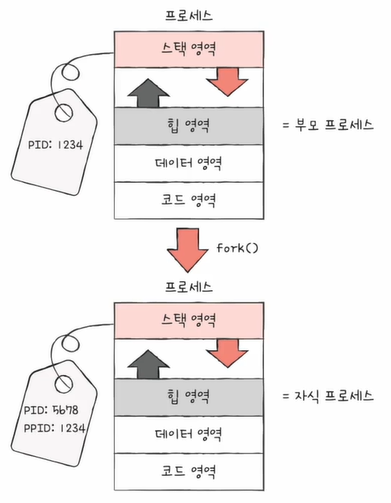
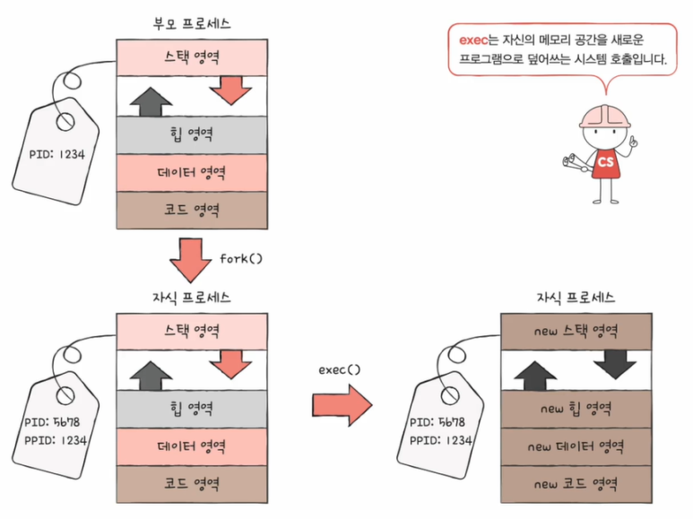
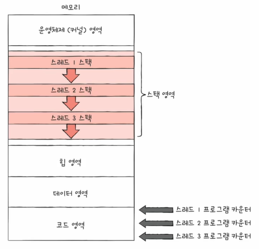
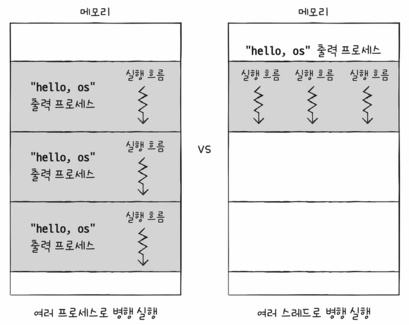

# 프로세스

## 1. 프로세스 종류
프로세스는 크게 두 가지의 종류가 있습니다.
 
 
* #### 포그라운드 프로세스
  사용자가 볼 수 있는 공간에서 실행되는 프로세스입니다.
* #### 백그라운드 프로세스
  사용자와 직접 상호작용이 가능한 프로세스입니다.  
  백그라운드 프로세스는 크게 사용자와 직접 상호작용이 가능한 프로세스와, 사용자와 상호작용하지 않고 정해진 일만 수행하는 프로세스인 데몬(서비스)이 있습니다.
 
 
모든 프로세스는 실행을 위해 CPU가 필요한데 CPU 자원은 한정되어 있으므로, 프로세스들은 돌아가며 한정된 시간만큼만 CPU를 이용하게 됩니다.  
즉, 자신의 차례에 정해진 시간만큼 CPU를 이용하고, 타이머 인터럽트가 발생하면 차례를 넘깁니다.
 
 
이렇게 빠르게 번갈아 수행되는 프로세스들을 관리하기 위해 사용하는 자료구조를 PCB(프로세스 제어 블록)라 합니다.
 
 
 

## 2. 프로세스 제어 블록
PCB는 프로세스 관련 정보를 저장하는 자료 구조입니다.  
쉽게 말해 상품에 달린 태그와 같은 정보라고 볼 수 있습니다.
 
 
이 PCB는 프로세스 생성 시 커널 영역에 생성되며, 종료 시 폐기됩니다.
 
 
또한 운영체제는 커널 영역에 적재된 PCB를 보고 프로세스를 관리하게 됩니다.

위와 같이 PCB에는 다양한 정보가 담겨있습니다.
 

* #### PID
  특정 프로세스를 식별하기 위해 부여하는 고유한 번호입니다.
* #### 레지스터 값
  프로세스는 자신의 실행 차례가 오면 이전까지 사용한 레지스터 중간 값을 모두 복원하고 실행을 재개합니다.
* #### 프로세스 상태
  대기 상태, 준비 상태, 실행 상태 등 다양한 상태 값들이 담깁니다.
* #### CPU 스케줄링 정보
  프로세스가 언제, 어떤 순서로 CPU를 할당받을지에 대한 정보가 담깁니다.
* #### 메모리 관리 정보
  프로세스가 어느 주소에 저장되어 있는지에 대한 정보와 페이지 테이블 정보(메모리의 현재 주소 정보)가 담깁니다.
* #### 사용한 파일과 입출력장치
  할당된 입출력장치와 사용 중인 파일 정보가 담깁니다.
 
 

## 3. 문맥 교환 (context switch)
한 프로세스에서 다른 프로세스로 실행 순서가 넘어가면, 기존에 실행되던 프로세스는 지금까지의 중간 정보를 백업해야 합니다.  
이때 중간 정보를 문맥이라 하며, 다음 차례가 왔을 때 실행을 재개하기 위한 정보라 할 수 있습니다.  
즉, 실행 문맥을 백업해두면 언제든 해당 프로세스의 실행을 재개할 수 있습니다.
 
 
이처럼 기존의 실행 중인 프로세스 문맥을 백업하고, 새로운 프로세스 실행을 위해 문맥을 복구하는 과정을 문맥 교환이라 합니다.

 
 

## 4. 프로세스의 메모리 영역
사용자 영역은 크게 코드 영역, 데이터 영역, 힙 영역, 스택 영역으로 구분됩니다.

* #### 코드 영역 (텍스트 영역)
  실행할 수 있는 코드, 기계어로 이루어진 명령어가 저장됩니다.  
  데이터가 아닌 CPU가 실행할 명령어가 담기기에 쓰기가 금지된 영역입니다. (read-only)
* #### 데이터 영역
  잠깐 썼다가 없앨 데이터가 아닌 프로그램이 실행되는 동안 유지할 데이터가 저장됩니다. (ex, 전역 변수)
* #### 힙 영역
  프로그램을 만드는 사용자, 즉 프로그래머가 직접 할당할 수 있는 저장 공간입니다.  
  힙 영역에 할당한 메모리 공간은 나중에 반환해야 하며, 이를 자동으로 해주는 것이 가비지 컬렉 입니다.
* #### 스택 영역
  데이터가 일시적으로 저장되는 공간입니다.  
  즉, 데이터 영역과 달리 잠깐 쓰다 말 값들이 저장됩니다. (ex. 매개 변수, 지역 변수)
 
힙 영역과 스택 영역은 정적 할당 영역이므로, 프로그램이 실행되는 과정에서 동적으로 크기가 변할 수 있습니다.  
즉, 힙 영역과 스택 영역의 크기는 가변적입니다.
 
 
또한 일반적으로 힙 영역은 낮은 주소에서 높은 주소로 할당되고, 스택 영역은 높은 주소에서 낮은 주소로 할당됩니다.

이렇듯 크기가 가변적으로 변하더라도 주소가 겹칠 일은 잘 발생하지 않습니다.
 
 
 

## 5. 프로세스 상태

* #### 생성 상태
  막 메모리에 적재되어 PCB를 할당받은 상태입니다.  
  준비가 완료되었다면 준비 상태로 변하게 됩니다.
* #### 준비 상태
  언제든지 CPU를 할당받아 실행할 수 있지만, 자신의 차례가 아니기에 기다리는 상태입니다.  
  자신의 차례가 된다면 실행 상태로 변하게 되며, 이를 디스패치라 합니다.
* #### 실행 상태
  CPU를 할당받아 실행 중인 상태입니다.  
  할당된 시간 모두 사용 시(타이머 인터럽트 발생 시), 준비 상태로 되돌아갑니다.  
  실행 도중 입출력장치를 사용하면 입출력 작업이 끝날 때까지 대기 상태가 됩니다.
* #### 대기 상태
  프로세스가 실행 도중 입출력장치를 사용하는 경우, 입출력 작업은 CPU에 비해 느리기에 대기 상태로 접어들게 됩니다.  
  입출력 작업이 끝나면(입출력 완료 인터럽트를 받으면) 준비 상태로 변하게 됩니다.
* #### 종료 상태
  프로세스가 종료된 상태입니다.  
  PCB, 프로세스의 메모리 영역을 정리하게 됩니다.
 
 

## 6. 프로세스 계층 구조
운영체제는 프로세스를 계층적으로 관리합니다.  
단, 윈도우 운영체제는 프로세스를 계층적으로 관리하지 않습니다.
 
 
프로세스 계층 구조를 알기 앞서, 부모 프로세스와 자식 프로세스에 대한 이해가 필요합니다.
 
 
프로세스는 실행이 되는 도중에 시스템 호출을 통해 다른 프로세스를 생성할 수 있습니다.  
이때 새로운 프로세스를 생성한 프로세스를 부모 프로세스, 새로 생성된 프로세스를 자식 프로세스라 합니다.

 
 

## 7. 프로세스 생성 기법
부모 프로세스는 자식 프로세스를 어떻게 만들어 내고, 자식 프로세스는 어떻게 자신만의 코드를 실행할 수 있을까요?
 
 
바로 복제와 옷 갈아입기라고 하는 과정을 거쳐 프로세스가 생성되고 실행될 수 있습니다.
 
 
먼저, 부모 프로세스는 fork 시스템 호출을 통해 자신의 복사본을 자식 프로세스로 생성합니다.  
그리고, 자식 프로세스는 exec 시스템 호출을 통해 자신의 메모리 공간을 다른 프로그램으로 교체합니다.
 

* #### fork 시스템 호출
  자기 자신 프로세스의 복사본을 자식 프로세스로 생성하는 시스템 호출입니다.
  자식 프로세스는 부모 프로세스의 자원을 상속받습니다.
  
  
  
* #### exec 시스템 호출
  자신의 메모리 공간을 새로운 프로그램으로 덮어쓰는 시스템 호출입니다.
  코드/데이터 영역은 실행할 프로그램 내용으로 바뀌고, 나머지 영역은 초기화됩니다.
  
  

 
 
 
 
 

# 스레드
스레드는 프로세스를 구성하는 실행 흐름의 단위입니다.
 
 
* #### 단일 스레드 프로세스
실행 흐름이 하나인 프로세스입니다.

* #### 멀티 스레드 프로세스
실행 흐름이 여러 개인 프로세스입니다.  
프로세스를 이루는 여러 명령어를 동시에 실행할 수 있습니다.

 

## 1. 스레드의 구성 요소

스레드들은 스레드 ID, 프로그램 카운터를 비롯한 레지스터 값, 스택 등 실행에 필요한 최소한의 정보를 유지한 채 실행됩니다.  
이때 프로세스를 이루는 스레드들은 프로세스의 자원을 공유하면서 실행이 됩니다.
 
 
 

## 2. 멀티 프로세스와 멀티 스레드
* #### 멀티 프로세스
  동일한 작업을 수행하는 단일 스레드 프로세스를 여러 개 실행합니다.
* #### 멀티 스레드
  하나의 프로세스를 여러 스레드로 실행합니다.
 

위의 그림에서 두 방법 모두 hello, os를 3번 출력하지만 그 내부 동작은 서로 다릅니다.
 
 
먼저 멀티 프로세스를 살펴보면, 프로세스를 fork 하면 코드/데이터/힙 영역 등 모든 자원이 복제되어 저장됩니다.  
즉, 자원을 공유하지 않는 복제본이 통째로 메모리에 적재되는 것입니다.
 
 
반면 멀티 스레드는 프로세스의 자원을 공유하며, 이는 협력과 통신에 유리합니다.  
하지만 하나의 스레드에 문제가 생기면 전체 프로세스에 문제가 발생한다는 문제가 존재할 수 있습니다.
 
 
또한, 여기서 프로세스끼리는 자원을 공유하지 않는다 하였지만, 스레드만큼 유리하지 않을 뿐 프로세스 간에도 자원을 주고받을 수 있습니다.  
이를 프로세스 간 통신(IPC; Inter Process Communication)이라 하며, 파일을 통한 프로세스 간 통신, 공유 메모리를 통한 프로세스 간 통신 등이 있습니다.
