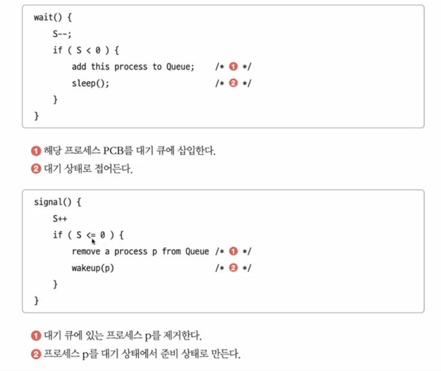

# 동기화
동기화는 프로세스들 간에 실행 순서를 맞추는 것을 의미합니다.  
일반적으로 프로세스간의 순서 보장, 공유 자원에 대한 접근 제어를 위해 동기화를 사용합니다.  

## Read-Write Problem
공유 자원에 읽기와 쓰기 연산을 동시에 수행할 수 없도록 제어하는 방식입니다.  
쓰기 작업이 끝나지 않은 상태에서 읽기 작업이 발생하면 데이터의 불일치가 발생할 수 있기 때문에 프로세스간 순서를 일치시키기 위해 사용합니다.  

## Bank-Account Problem

동시에 여러 프로세스가 동일한 공유 자원을 읽고 읽은 값을 변경한 뒤 저장하는 경우에 발생하는 문제입니다.   

위와 같이 다른 프로세스가 동일한 자원에 접근 할 때 다른 프로세스는 접근하지 못하도록 제어해야 합니다. (상호배제)  

## Producer-Consumer Problem
생성자와 소비자가 동시에 실행되는 경우 발생하는 문제입니다.  
일반적으로 공유 자원에서 데이터를 생성하는 프로세스와 데이터를 소비하는 프로세스가 동시에 실행되면 데이터의 불일치가 발생할 수 있기 때문에 프로세스간 순서를 일치시키기 위해 사용합니다.  

## 임계구역
임계구역은 공유 자원에 서로 다른 프로세스가 접근했을 때 데이터의 불일치가 발생할 수 있는 코드 영역을 의미합니다.  
만약 임계구역에 동시에 접근하여 데이터의 일관성이 깨지는 것을 `race condition`이라고 합니다.  

### 임계구역 3가지 원칙
1. 상호배제(Mutual Exclusion) - 임계구역에는 한 번에 하나의 프로세스만 들어갈 수 있어야 합니다.
2. 진행(Progress) - 임계구역에 들어가려는 프로세스가 없으면 바로 들어갈 수 있어야 합니다.
3. 유한대기(Bounded Waiting) - 프로세스가 임계구역에 진입하기 위해 대기하는 시간은 무한정해서는 안됩니다.

## 뮤텍스 락
뮤텍스 락은 상호배제를 위한 동기화 기법 중 하나입니다.  
lock이라는 전역 변수를 사용하여 임계구역에 진입하는 프로세스를 제어합니다.  
acquire() 함수로 lock을 획득하고 release() 함수로 lock을 반환합니다.  

## 세마포어
세마포어도 뮤텍스 락과 마찬가지로 상호배제를 위한 동기화 기법 중 하나입니다.  
하지만 뮤텍스 락과 달리 여러 프로세스가 동시에 임계구역에 진입할 수 있습니다.  
왜냐면 세마포어는 정수형 변수를 사용하여 임계구역에 진입하는 프로세스를 제어하기 때문에 허용된 프로세스의 수를 제어할 수 있기 때문입니다.  
일단 세마 포어도 뮤텍스와 비슷하게 wait() 함수로 세마포어를 획득하고 signal() 함수로 세마포어를 반환합니다.  
일단 임계구역에 들어왔다면 wait() 함수를 호출하여 세마포어를 획득하고 임계구역을 빠져나올 때 signal() 함수를 호출하여 세마포어를 반환합니다.  

busy waiting을 해결하기 위해서 세마포어는 위 그림처럼 queue를 사용하여 대기하는 프로세스를 관리합니다.  

또한 세마포어는 프로세스간 순서를 보장하기 위해서 무조건 먼저 실행되어야하는 함수는 wait() 함수를 실행하지 않고 signal() 함수를 실행합니다.  
이렇게 되면 먼저 실행되어야하는 프로세스가 실행되고 다음 프로세스는 wait() 함수를 실행하여 signal() 함수가 실행될 때까지 대기합니다.  

## 모니터
모니터는 뮤축스와 세마포어의 개념을 통합한 동기화 기법입니다.  
일단 모니터는 공유 자원에 접근 해야하는 프로세스들을 queue로 관리합니다.  
queue에 있는 프로세스들만 모니터 내부에 있는 함수를 실행할 수 있습니다.  
모니터는 실행 순서를 보장하기 위해 조건 변수(condition variable)를 사용합니다.  

먼저 실행되어야 하는 프로세스는 조건 변수 y에 담기고 조건 변수 x에 담긴 프로세스는 대기합니다.  
y가 실행되면 x가 실행될 수 있도록 signal() 함수를 호출하여 x를 깨웁니다.