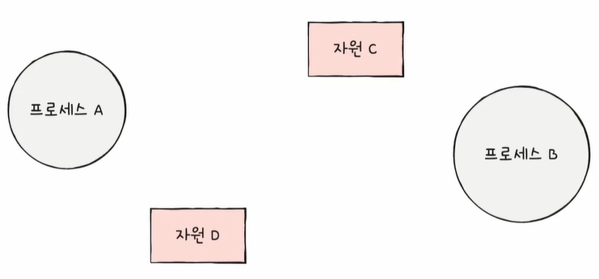
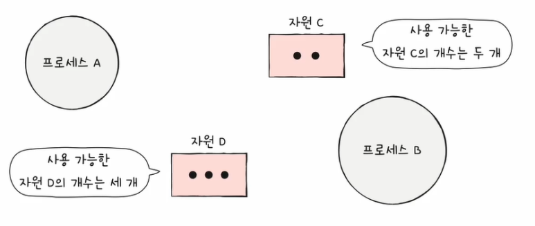
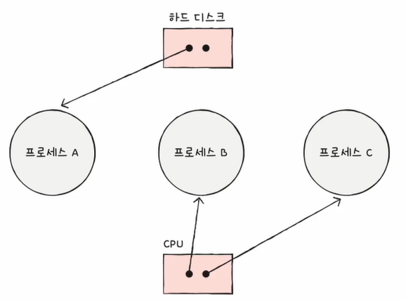
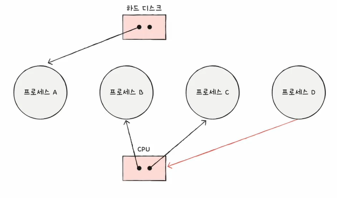

# 교착상태
교착 상태란 일어나지 않을 사건을 기다리며 진행이 멈춰 버리는 현상을 의미합니다.
 
 
이러한 교착 상태를 해결하기 위해서는 교착 상태가 발생했을 때의 상황을 정확히 표현해 보거나, 교착 상태가 일어나는 근본적인 이유를 이해해야 합니다.
 
 
## 1. 교착 상태가 발생했을 때의 상황 표현하기
교착 상태가 발생했을 때의 상황을 표현하기 위한 그래프를 자원 할당 그래프라 합니다.  
즉, 자원 할당 그래프는 교착 상태가 발생하는 조건을 파악할 수 있습니다.
 
 
자원 할당 그래프를 통해 어떤 프로세스가 어떤 자원을 할당받아 사용 중인지 확인이 가능하며, 어떤 프로세스가 어떤 자원을 기다리고 있는지 확인이 가능합니다.
 
 
### 1-1. 자원 할당 그래프 그리는 법
#### ① 프로세스는 원으로, 자원으로 종류는 사각형으로 표현합니다.

 
 
#### ② 사용할 수 있는 자원의 개수는 자원 사각형 내에 점으로 표현합니다.

 
 
#### ③ 프로세스가 어떤 자원을 할당받아 사용 중이라면 자원에서 프로세스를 향해 화살표를 표시합니다.

 
 
#### ④ 프로세스가 어떤 자원을 기다리고 있다면 프로세스에서 자원으로 화살표를 표시합니다.

 
 
 
이 자원 할당 그래프를 이용하면 교착 상태가 어떤 식으로 발생하는지 대략적으로 판단할 수 있습니다.  
아래는 교착 상태가 발생한 자원 할당 그래프입니다.

위의 그림을 보면 알 수 있듯이, 교착 상태가 일어난 그래프는 원의 형태를 띠고 있습니다.
 
 
 
## 2. 교착 상태가 일어나는 근본적인 이유
교착 상태가 발생하는 조건은 4가지입니다.  
4가지를 모두 만족하면 교착 상태가 발생할 수 있고, 하나라도 만족하지 않으면 교착 상태가 발생하지 않습니다.
 
 
* 상호 배제 : 한 프로세스가 사용하는 자원을 다른 프로세스가 사용할 수 없는 상태입니다.  
* 점유와 대기 : 자원을 할당받은 상태에서 다른 자원을 할당받기를 기다리는 상태입니다.  
* 비선점 : 어떤 프로세스도 다른 프로세스의 자원을 강제로 빼앗지 못하는 상태입니다.  
* 원형 대기 : 프로세스들이 원의 형태로 자원을 대기하는 상태입니다.
 
 
 
 
 

# 교착 상태 해결 방법
교착 상태를 해결하기 위해서는 예방을 하거나, 회피하거나, 검출 후 회복을 하는 방법이 있습니다.
 
 
## 1. 교착 상태 예방
애초에 교착 상태가 발생하지 않도록 예방하는 방법이며, 교착 상태 발생 조건 중 하나를 없애버리면 됩니다.
 
 
이는 교착 상태가 발생하지 않음은 보장할 수 있으나, 부작용이 따르는 방식입니다.
 
 
### 1-1. 상호 배제 없애기
모든 자원을 공유하게 만드는 방법입니다.  
이는 이론적으로는 가능하나 현실적으로는 불가능한 방법입니다.
 
 
### 1-2. 점유와 대기 없애기
특정 프로세스에 자원을 모두 할당하거나, 아예 할당하지 않는 방식으로 배분하는 방법입니다.  
이는 이론적으로 결착 상태를 아예 발생시키지 않을 수 있으나, 자원의 활용도가 너무 떨어지는 부작용이 있습니다.
 
 
### 1-3. 비선점 조건 없애기
한 프로세스가 다른 프로세스의 자원을 뺏을 수 있게끔 만드는 방법입니다.  
이는 선점이 가능한 자원에 한해서는 효과적인 방법이나, 모든 자원이 선점 가능한 것은 아닙니다.
 
 
### 1-4. 원형 대기 조건 없애기
모든 자원에 번호를 붙이고 오름차순으로 할당하여, 원형 대기가 발생하지 않도록 하는 방법입니다.  
하지만 자원에 번호를 붙이는 것은 어려운 작업이고, 어떤 자원에 어떤 번호를 붙이느냐에 따라 활용률이 달라집니다.  
그러나 다른 조건에 비해서는 가장 현실적이고 실용적인 방법입니다.
 
 
 
## 2. 교착 상태 회피
교착 상태를 무분별한 자원 할당으로 인해 발생했다고 간주하고, 교착 상태가 발생하지 않을 만큼 조심히 할당하고, 배분할 수 있는 자원의 양을 고려하여 교착 상태가 발생하지 않을 만큼만 자원을 배분하는 방법입니다.
 
 
* 안전 순서열 : 교착 상태 없이 안전하게 프로세스들에 자원을 할당할 수 있는 순서입니다.  
* 안전 상태 : 교착 상태 없이 모든 프로세스가 자원을 할당받고 종료될 수 있는 상태입니다. (안전 순서열이 있는 상태)  
* 불안전 상태 : 교착 상태가 발생할 수도 있는 상태입니다. (안전 순서열이 없는 상태)

 
 
즉, 교착 상태 회피는 항상 안전 상태만을 유지하게끔 자원을 할당하는 방식이라고 볼 수 있습니다.
 
 
 

## 3. 교착 상태 검출 후 회복
교착 상태의 발생을 인정하고 사후에 조치하는 방법입니다.  
즉, 프로세스가 자원을 요구하면 일단 할당하고 교착 상태가 검출되면 회복합니다.
 
 
회복에는 선점을 통한 회복과 프로세스 강제 종료를 통한 회복이 있습니다.
 
 
### 3-1. 선점을 통한 회복
교착 상태가 해결될 때까지 한 프로세스씩 자원을 몰아주는 방식입니다.
 
 
### 3-2. 프로세스 강제 종료를 통한 회복
* 교착 상태에 놓인 프로세스를 모두 강제 종료하는 방법  
확실하게 교착 상태를 없앨 수 있으나, 작업 내역을 잃을 위험이 있습니다.
 

* 교착 상태가 해결될 때까지 한 프로세스씩 강제 종료하는 방법  
오버헤드가 발생할 수는 있으나, 작업 내역을 잃을 위험이 최소화됩니다.
