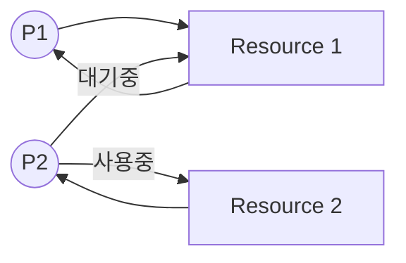

# 교착상태 (Deadlock)

## 교착 상태란?

교착상태란 프로세스를 실행하기 위해 자원이 필요한데 두 개 이상의 프로세스가 각자 가지고 있는 자원을 무작정 기다린다면 그 어떤 프로세스도 더이상 진행할 수 없는 상태가 되는 것입니다. 이는 컴퓨터 시스템에서 자원의 비효율적인 사용과 시스템의 멈춤을 초래할 수 있습니다.

## 식사하는 철학자 문제

식사하는 철학자 문제는 교착상태를 설명하는 대표적인 예시 중 하나입니다. 이 문제는 다섯 명의 철학자가 둥근 테이블에 앉아 있으며, 각각의 철학자는 생각하거나 식사할 수 있습니다. 식사를 하기 위해서는 두 개의 포크가 필요하지만, 각 철학자 사이에는 하나의 포크만 놓여있습니다. 철학자들은 양쪽 포크를 모두 사용할 수 있을 때만 식사를 시작할 수 있으며, 그렇지 않으면 포크를 내려놓고 다시 생각에 잠깁니다. 이때 모든 철학자가 동시에 오른쪽 포크를 집으려고 하면 교착상태가 발생하게 됩니다.

## 자원 할당 그래프

자원 할당 그래프는 어떤 프로세스가 어떤 자원을 사용하고 있는지, 어떤 프로세스가 어떤 자원을 기다리고 있는지 표현하는 간단한 그래프로 교착 상태를 시각적으로 이해하는데 유용합니다.

- **프로세스**는 원으로, **자원의 종류**는 사각형으로 표시됩니다.
- 사용할 수 있는 자원의 개수는 자원 사각형 내에 점으로 표현됩니다.
- 프로세스가 어떤 자원을 할당받아 사용 중이라면 자원에서 프로세스를 향해 화살표를 표시합니다.
- 프로세스가 어떤 자원을 기다리고 있다면 프로세스에서 자원으로 화살표를 표시합니다.

## 교착 상태 발생 조건

교착상태가 발생하기 위해서는 다음 네 가지 조건이 모두 만족해야 합니다:

### 상호 배제

상호 배제는 한 프로세스가 사용하는 자원을 다른 프로세스가 사용할 수 없을 때 발생합니다. 즉, 자원은 한 번에 하나의 프로세스만 사용할 수 있습니다.

### 점유와 대기

점유와 대기는 프로세스가 하나 이상의 자원을 점유하고 있으며, 추가적인 자원을 기다리는 상황을 말합니다. 프로세스는 자신이 할당받은 자원을 유지하면서 다른 자원을 기다립니다.

### 비선점

비선점은 프로세스가 자원을 사용 중인 경우, 그 자원을 다른 프로세스가 강제로 빼앗을 수 없다는 조건입니다. 자원은 사용 중인 프로세스가 작업을 완료하고 자원을 반환할 때까지 기다려야 합니다.

### 원형 대기

원형 대기는 프로세스들과 프로세스가 요청 및 할당받은 자원이 원형을 이루며 대기하는 상황을 말합니다. 예를 들어, P1이 R1을 점유하고 R2를 기다리며, P2가 R2를 점유하고 R3를 기다리며, 이런 식으로 마지막 프로세스가 첫 번째 프로세스가 점유한 자원을 기다리는 형태가 되면 원형 대기가 발생합니다.

## 교착 상태 해결 방법

### 교착 상태 예방

교착 상태 예방은 교착 상태 발생 조건을 하나라도 만족 시키지 않는다면 교착 상태는 발생하지 않는다. 하지만 교착 상태의 발생 조건은 제거하여 교착 상태를 사전에 방지하는 예방 방식은 교착 상태가 발생하지 않음을 보장하지만 여러 가지 부작용이 따릅니다.

- **상호 배제:** 모든 자원을 공유 상태로 만들어야 합니다. 다만 이 방법은 현실적으로 무리가 있습니다.
- **점유와 대기:** 특정 프로세스에 자원을 모두 할당하거나, 아예 할당하지 않는 방식으로 배분합니다. 하지만 자원의 활용률이 낮아질 수 있는 단점이 있습니다. 또한 많은 자원을 사용하는 프로세스는 동시에 그 자원을 사용할 타이밍을 확보하기가 어려워져 기아 현상을 유발할 수 있습니다.
- **비선점:** 비선점 조건을 없애 자원을 이용 중인 프로세스로부터 해당 자원을 빼앗을 수 있게 합니다. CPU처럼 선점하여 사용할 수 있는 대표적인 자원을 제외한 프로세스의 작업이 종료되어야만 하는 자원, 즉 프린터 같은 자원을 빼앗아 사용하는 것은 어렵기 때문에 다소 범용성이 떨어지는 방법입니다.
- **원형 대기 조건:** 모든 자원에 번호를 붙이고 오름차순으로 자원을 할당하면 원형 대기는 발생하지 않습니다. 다른 방식에 비해 현실적이고 실용적이지만 컴퓨터 시스템의 모든 자원에 번호를 붙이는 일은 그리 간단하지 않은 작업이고, 각 자원에 어떤 번호를 붙이는지에 따라 특정 자원의 활용률이 떨어질 수 있습니다.

### 교착 상태 회피

교착 상태 회피는 교착 상태가 발생하지 않을 정도로만 자원을 할당하는 방식입니다. 교착 상태 회피 방식에서는 교착 상태를 한정된 자원의 무분별한 할당으로 발생한다고 간주합니다. 그렇기 때문에 프로세스들에 배분할 수 있는 자원의 양을 고려하여 교착 상태가 발생하지 않을 정도의 양만큼만 자원을 배분하는 방법입니다. 즉, 항상 안전 상태를 유지하도록 자원을 할당하는 방식입니다.

### 안전 순서열

안전 순서열은 교착 상태 없이 안전하게 프로세스들에 자원을 할당할 수 있는 순서를 의미합니다.

- **안전 상태:** 교착 상태가 발생하지 않고 모든 프로세스가 정상적으로 자원을 할당받고 종료될 수 있는 상태입니다. 안전 순서열대로 프로세스들에 자원을 배분하여 교착 상태가 발생하지 않는 상태를 의미합니다.
- **불안전 상태:** 교착 상태가 발생할 수도 있는 상황입니다. 안전 순서열이 없는 상황을 말합니다.

### 교착 상태 검출 후 회복

교착 상태 검출 후 회복은 교착 상태의 발생을 인정하고 사후에 조치하는 방식입니다. 프로세스들이 자원을 요구할 때마다 그때그때 모두 할당하며, 교착 상태 발생 여부를 주기적으로 검사합니다.

- **선점을 통한 회복:** 교착 상태가 해결될 때까지 한 프로세스씩 자원을 몰아주는 방식입니다.
- **프로세스 강제 종료를 통한 회복:** 가장 단순하며 확실한 방법으로 운영체제가 교착 상태에 놓인 프로세스를 모두 강제 종료하거나, 교착 상태가 없어질 때까지 한 프로세스씩 강제 종료할 수 있습니다. 하지만 전자는 많은 프로세스 작업 내역을 잃을 가능성이 있고, 후자는 작업 내역을 잃는 프로세스를 줄일 수 있지만 교착 상태가 없어졌는지 여부를 확인하는 과정에서 오버헤드가 발생합니다.
