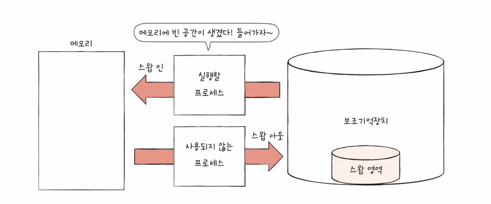
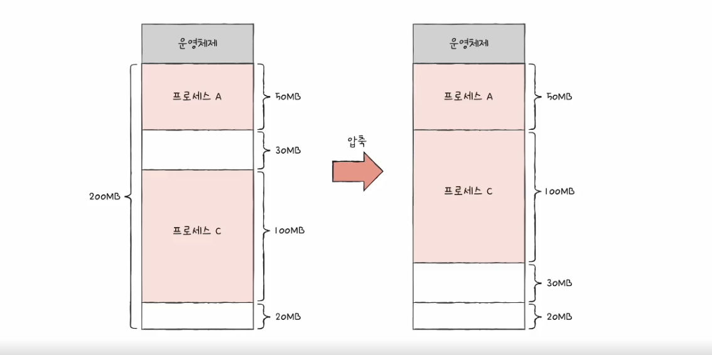
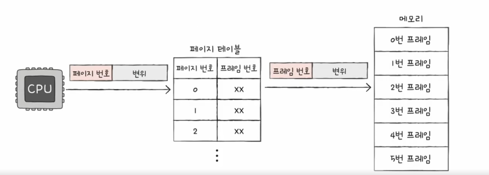
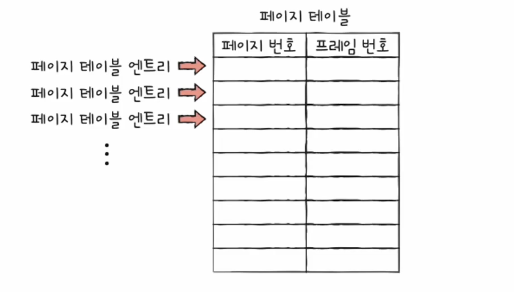
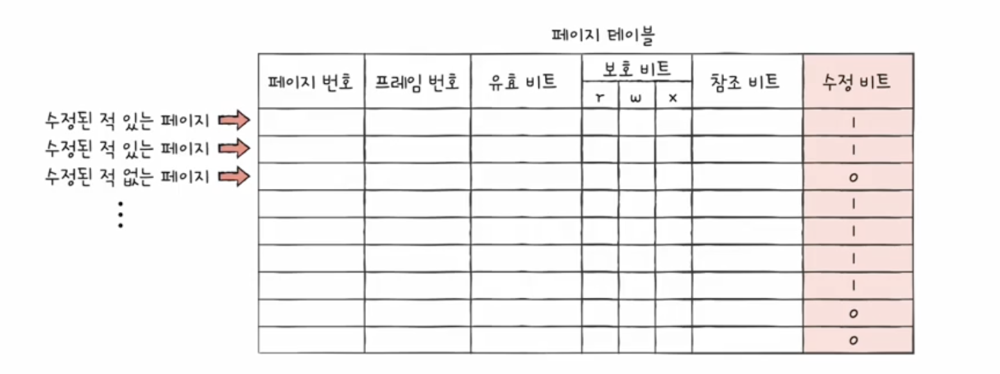
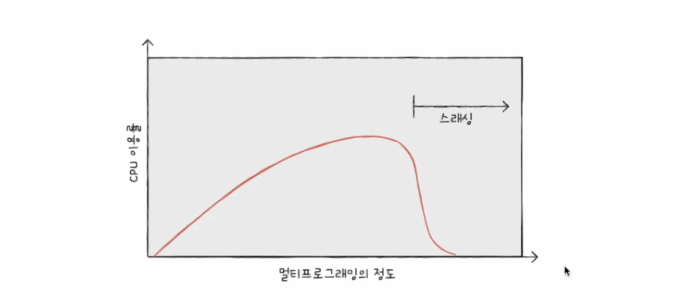

# <연속 메모리 할당>

- 연속 메모리 할당 : 프로세스에 연속적인 메모리 공간을 할당하는 방식

## 1. 스와핑

- 스와핑 : 현재 사용하지 않는 프로세스들을 보조기억장치의 일부 영역(스왑 영역)으로 옮기고 그 빈공간에 새 프로세스를 적재하는 실행 방식

## 2. 메모리 할당

- 프로세스는 메모리의 빈 공간에 할당이 되어야 할 때, 빈 공간이 여러 개 있을 때 어디에 해야하는지
- 최초적합, 최적적합, 최악적합

### 최초적합

- 최초로 발견한 적재 가능한 빈 공간에 프로세스를 배치하는 방식
- 검색 최소화, 빠른 할당

### 최적적합

- 프로세스가 적재될 수 있는 가장 작은 공간에 프로세스를 배치하는 방식

### 최악적합

- 프로세스가 적재될 수 있는 가장 큰 공간에 프로세스를 배치하는 방식

## 3. 외부 단편화

- 외부 단편화 : 프로세스를 할당하기 어려울 만큼 작은 메모리 공간들로 인해 메모리가 낭비되는 현상

### 해결방안

- (1) 메모리 압축 : 프로세스를 재배치하여 빈 공간을 하나로 모으는 것
- (2) 페이징

---

# <페이징>

- 가상 메모리 : 실행하고자 하는 프로그램 일부만 메모리에 적재하여 실제 물리 메모리 크기보다 더 큰 프로세스를 실행할 수 있게 하는 기술
- 페이징 :
    - 프로세스의 논리 주소 공간을 페이지라는 일정 단위로 자르고
    - 메모리의 물리 주소 공간을 프레임이라는 페이지와 동일한 단위로 자른 뒤
    - 페이지를 프레임에 할당하는 가상 메모리 관리 기법
- 페이지 테이블 :

  

    - (실제 메모리 내의 주소인) 물리 주소에 불연속적으로 배치되더라도
    - (CPU가 바라보는 주소인) 논리 주소에는 연속적으로 배치되도록 하는 방법
    - 페이지 번호와 프레임 번호를 짝지어 주는 일종의 이정표
    - 물리적으로 분산되어 저장되더라도 CPU 입장에서는 논리 주소를 순차적으로 실행해도 됨
    - 단점 : 내부 단편화 발생 가능성
- 내부 단편화
    - 하나의 페이지 크기보다 작은 크기로 발생

## PTBR

- 각 프로세스의 페이지 테이블이 적재된 주소를 가리킴

## TLB

- 페이지 테이블의 일부를 가져와 저장

## 페이징에서의 주소 변환

- 페이징에서의 논리 주소 : 페이지 번호, 변위로 이루어짐
- 이 논리주소는 페이지 테이블을 통해서 프레임 번호, 변위로 변환됨

## 페이지 테이블 엔트리

- 페이지 테이블의 각각의 행 → 페이지 테이블 엔트리

- 유효 비트 : 현재 해당 페이지의 접근 여부를 나타냄
    - 유효 비트가 0 일 때 접근하면 → 페이지 폴트 발생
- 보호 비트 : 페이지에 접근할 권한을 제한하여 페이지 보호하는 역할을 함
- 참조 비트 : CPU가 해당 페이지에 접근 여부를 나타냄
- 수정 비트 : CPU가 해당 페이지에 데이터 작성 여부를 나타냄

---

# <페이지 교체와 프레임 할당>

## 요구 페이징

- 필요한 페이지만 메모리에 적재하는 기법
- 이 기법으로 페이지들을 메모리에 적재하게 되면 언젠간 메모리가 가득 차게 됨

## 페이지 교체 알고리즘

- 페이지 교체 필요
- 이때 페이지 폴트가 적은 알고리즘이 좋은 알고리즘(보조기억장치에 접근해서 성능저하를 유발하는 횟수가 적어짐)

## 페이지 참조열

- CPU 가 참조하는 페이지들 중 연속된 페이지를 생략한 페이지열

## FIFO 페이지 교체 알고리즘

- 메모리에 가장 먼저 적재된 페이지부터 내쫓는 방식
- 그러나, 프로그램 실행 내내 적재가 되어야하는 프로세스는 내쫓기면 안됨

## 2차 기회 페이지 교체 알고리즘

- FIFO 페이지 교체 알고리즘 보완책
- 참조 비트가 1일 경우 바로 내쫓지 않음 (한 번 더 기회를 줌 → 참조 비트를 0으로 초기화)

## 최적 페이지 교체 알고리즘

- 사용빈도가 낮은 페이지를 교체하는 알고리즘
- 페이지 폴트가 가장 낮은 알고리즘 → 그러나, 구현이 어려움

## LRU 페이지 교체 알고리즘

- 가장 오랫동안 사용하지 않은 페이지는 앞으로도 사용하지 않을 거라고 예상하여 해당 페이지를 교체하는 알고리즘

## 스래싱

- 프로세스가 실행되는 시간보다 페이징에 더 많은 시간을 소요하여 성능이 저하되는 문제
- 동시 실행 프로세스가 많아지면 어느정도까지는 CPU 이용률이 올라가지만,
- 어느 순간 이용률이 낮아짐 → CPU 이용률이 현저하게 떨어지는 지점 ⇒ 스래싱 발생한 지점

## 스래싱 방지

- 각 프로세스가 필요로 하는 최소한의 프레임 수를 파악하고,
- 프로세스들에게 적절한 프레임을 할당해주어야 함
- 프레임 할당 방법?

## 프레임 할당 방법

### 1. 균등 할당

- 모든 프로세스들에게 균등하게 프레임을 할당하는 방식

### 2. 비례 할당

- 프로세스 크기에 비례하여 프레임 할당

### 3. 작업 집합 모델

- 스래싱 발생 이유 : 빈번한 페이지 교체 때문
    - CPU 가 특정 시간 동안 주로 참조한 페이지 개수만큼 프레임을 할당하면 됨
- 프로세스가 일정 기간 동안 참조한 페이지 집합을 기억하여 빈번한 페이지 교체를 방지
    - 작업 집합이란 실행 중인 프로세스가 일정 시간 동안 참조한 페이지의 집합
- 작업 집합을 구하려면
    - 프로세스가 참조한 페이지, 시간 간격 필요함

### 4. 페이지 폴트 빈도

- 프로세스가 실행하는 과정에서 배분할 프레임 결정
- 페이지 폴트율에 상한선과 하한선을 정하여 그 범위 안에서 프레임을 할당하는 방식