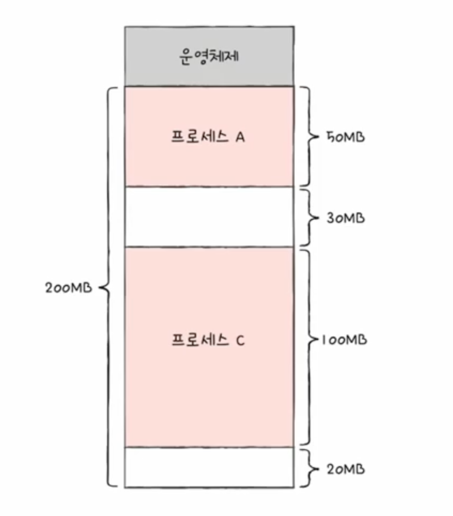
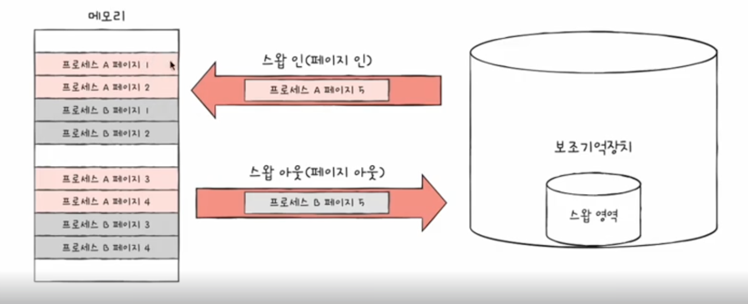
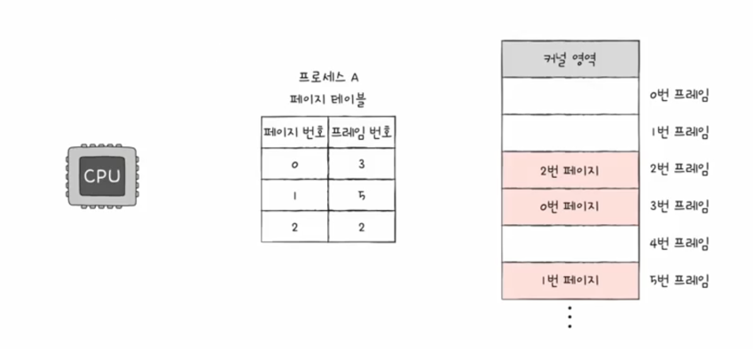
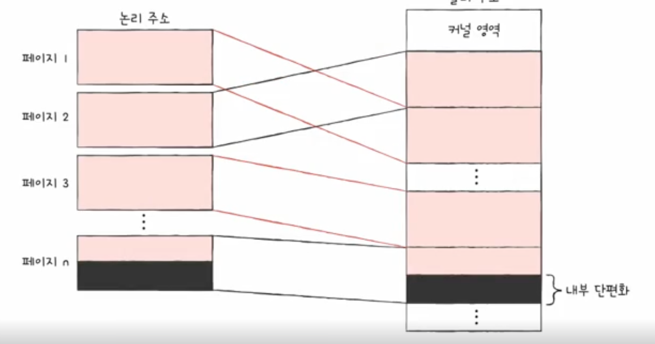
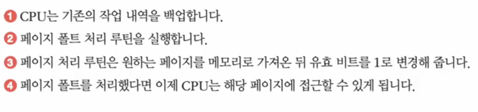
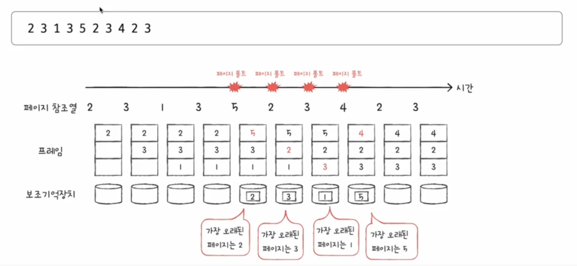
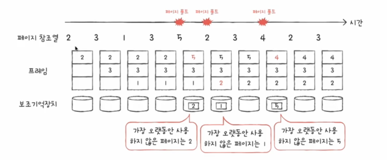

# 가상 메모리

## 연속 메모리 할당
프로세스를 메모리에 적재할 때 프로세스의 크기가 메모리의 크기보다 작은 경우에는 프로세스를 연속적인 메모리 공간에 할당할 수 있습니다.  

## 스와핑 

연속 메모리 할당을 할 때 남은 메모리의 용량보다 프로세스의 크기가 더 큰 경우에는 스와핑 기법을 사용해서 프로세스를 메모리에 적재할 수 있습니다.  
스와핑이란 메모리에 적재된 프로세스 중 일부를 디스크로 내보내어 메모리 공간을 확보하는 기법입니다.  

### 최초 적합(First Fit)
운영체제가 프로세스를 적재할 때 메모리의 시작 부분부터 탐색하여 가장 먼저 발견한 곳에 프로세스를 적재하는 방식입니다.  
검색이 빠르며 빠르게 할당할 수 있지만 메모리의 남은 공간이 작아질 수 있습니다.  

### 최적 적합(Best Fit)
운영체제가 메모리를 전부 탐색하고 가장 작은 공간에 프로세스를 적재하는 방식입니다.  
메모리의 남은 공간을 최대한 활용할 수 있지만 검색 시간이 오래 걸릴 수 있습니다.  

### 최악 적합(Worst Fit)
운영체제가 메모리를 전부 탐색하고 가장 큰 공간에 프로세스를 적재하는 방식입니다.

## 외부 단편화
외부 단편화는 메모리에 할당된 프로세스들 사이에 남은 메모리 공간이 존재하는 현상입니다.  
예시를 들면 아래와 같습니다.

   

이처럼 프로세스가 실행되고 종료될 때마다 메모리에 남는 공간이 발생하게 되면 외부 단편화가 발생합니다.  
이런 외부 단편화를 해결하기 위해 compaction 기법을 사용할 수 있습니다.  
compaction 기법 : [정철희-chapter1-mission.MD](..%2F..%2Fchapter01%2Fmission%2F%EC%A0%95%EC%B2%A0%ED%9D%AC-chapter1-mission.MD)  
또 다른 해결법으로는 페이징 기법을 사용할 수 있습니다.  

## 페이징

연속 메모리 할당의 문제는 외부 단편화와 물리 메모리보다 큰 프로세스를 적재할 수 없다는 것입니다.  
이런 문제를 해결하기 위해 페이징 기법을 사용할 수 있습니다.  
페이징 기법은 프로세스를 일정한 크기로 나누어서 메모리에 적재하는 기법입니다.  
이때 나누어진 작은 크기의 메모리를 페이지라고 하고 물리 메모리를 프레임이라고 합니다.  

위에서 봤던 스왑 메모리 할당과 달리 페이징 기법은 프로세스를 나누어서 메모리에 적재하기 때문에 외부 단편화가 발생하지 않습니다.  
또한 프로세스를 나누어서 적재하기 때문에 물리 메모리보다 큰 프로세스도 적재할 수 있습니다.  
그리고 페이징된 프로세스를 불연속적으로 할당 할 수도 있습니다.  
그런데 이 방법은 cpu 입장에서 다음 페이지를 찾아야 하는데 어려움이 생깁니다.  
이 문제를 해결하기 위해서 페이지 테이블을 사용합니다.  

### 페이지 테이블

페이지 테이블은 페이지 번호와 프레임 번호를 매핑하는 테이블입니다.  
데이터베이스의 인덱스와 비슷한 역할을 합니다.  

하지만 페이지 테이블은 내부 단편화가 발생할 수 있습니다.  
내부 단편화란 페이지의 크기가 프레임의 크기보다 작아서 발생하는 남은 공간을 의미합니다.  

#### Page Table Base Register(PTBR)
PTBR은 페이지 테이블의 시작 주소를 가리키는 레지스터입니다.  
페이지 테이블의 시작 주소를 알고 있으면 페이지 테이블을 참조할 수 있습니다.  

하지만 PTBR이 메모리에 존재한다면 메모리에 2번 접근해야하기 때문에 접근 시간이 느려질 수 있습니다.  
이를 방지하기 위해 TLB를 사용합니다.  
TLB는 캐시 메모리로 페이지 테이블의 일부를 저장합니다.  

#### 주소 변환

페이징에서 주소 변환은 논리 주소를 물리 주소로 변환하는 과정을 의미합니다.  
논리 주소는 페이지 번호와 페이지 오프셋으로 이루어져 있습니다.  

##### 유요 비트
그리고 유효 비트를 사용하여 페이지에 접근할 수 있는지 확인합니다.  
만약 유효 비트가 0이라면 페이지 테이블에 접근할 수 없습니다.  
접근을 하려면 페이지 폴트 인터럽트가 발생하여 페이지 테이블에 접근해야 합니다.  

##### 보호 비트 
보호 비트는 페이지에 대한 접근 권한을 설정하는 비트입니다.   
읽기, 쓰기, 실행 권한을 설정할 수 있습니다.   

##### 참조 비트
참조 비트는 CPU가 페이지에 접근했었는지 확인하는 비트입니다.  

##### 수정 비트
수정 비트는 페이지에 쓰기 작업을 했었는지 확인하는 비트입니다.  
수정 비트가 1이라면 다시 페이지를 디스크에 저장해야 합니다.  

## 계층적 페이징

계층적 페이징은 페이지 테이블을 여러 개의 테이블로 나누어서 관리하는 기법입니다.  
이 기법을 사용하면 메모리에 올라가야하는 페이지 테이블의 크기를 줄일 수 있습니다.

### 쓰기시 복사 
fork() 함수를 사용하면 페이지 테이블만 복사하면 되기 때문에 메모리를 효율적으로 사용할 수 있습니다.    
메모리에 값이 달라진다면 추가적으로 프레임을 할당해야 합니다.  

## 요구 페이징
요구 페이징은 프로세스를 메모리에 적재할 때 페이지를 미리 적재하지 않고 필요한 페이지만 적재하는 기법입니다.  

## 페이지 교체 알고리즘
페이지 교체가 일어날 때 어떤 페이지를 교체해서 보조 기억 창치로 내보낼지 결정하는 알고리즘입니다.  
또한 페이지 폴트가 적은 알고리즘이 좋은 알고리즘이라고 할 수 있습니다.  

### FIFO

FIFO 알고리즘은 가장 먼저 들어온 페이지를 교체하는 알고리즘입니다.  
하지만 FIFO 알고리즘은 페이지 교체가 자주 일어나는 경우 페이지 폴트가 많이 발생할 수 있습니다.  
이를 보완하기 위해 2차 기회라는 알고리즘을 사용할 수 있습니다.  
2차 기회는 CPU가 참조한적이 있는지 확인하는 비트를 사용하여 페이지를 교체하는 알고리즘입니다.  

### 최적 페이지 교체 알고리즘

앞으로의 사용 빈도가 가장 적은 페이지를 교체하는 알고리즘입니다.  
하지만 이 알고리즘은 미래의 사용 빈도를 예측해야하기 때문에 구현이 어렵습니다.  

### LRU

LRU 알고리즘은 가장 오랫동안 사용하지 않은 페이지를 교체하는 알고리즘입니다.  

## 스래싱
스래싱은 페이지 교체율이 높아져서 CPU 사용률과 시스템 성능이 저하되는 현상입니다.  
스래싱을 해결 하는 방법은 각각의 프로세스가 필요로하는 프레임의 수를 조절해서 할당해 줘야합니다.  
할당 방법으로는 균등 할당, 프로세스 크기 비례 할당이 있습니다.  
