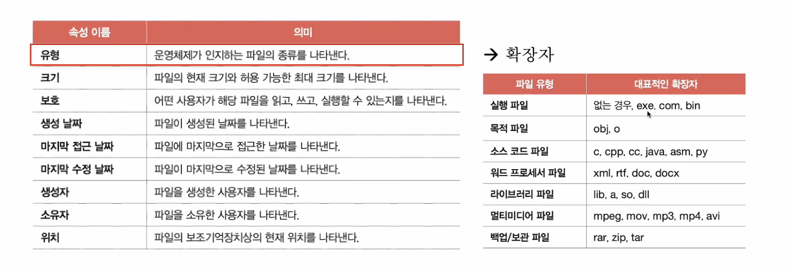
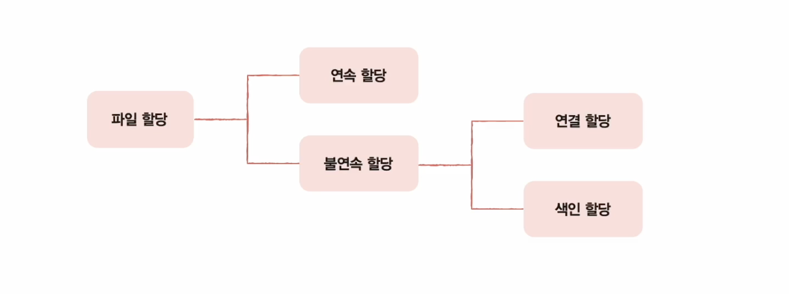
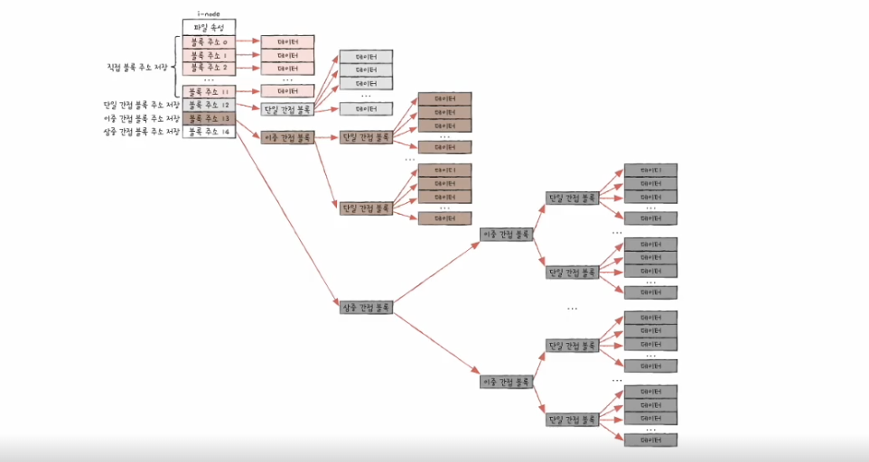

# 파일과 디렉터리

## 파일 시스템

- 파일과 디렉터리를 관리하는 운영체제 내의 프로그램
- 파일과 디렉터리를 다루어주는 프로그램

## 파일

- 보조기억장치에 저장된 관련 정보의 집합
- 의미있고 관련 있는 정보를 모은 논리적 단위
- 파일 = 실행하기 위한 정보 + 부가 정보 (속성, 메타 데이터)
- 파일의 속성

## 디렉터리

- 여러 계층으로 파일 및 폴더를 관리하는 트리 구조 디렉터리
- 최상위 디렉터리(루트 디렉터리, /), 서브 디렉터리
- 경로
  - 디렉터리를 이용해 파일/디렉터리의 위치, 나아가 이름까지  특정 지을 수 있는 정보
  - 절대 경로와 상대 경로
  - 절대 경로 : 루트 디렉터리에서 자기 자신까지 이르는 고유한 경로 (시작점 : 루트 디렉터리)
    - /home/minchul/a.sh
  - 상대 경로 : 현재 디렉터리에서 자기 자신까지 이르는 경로 (시작점 : 현재 디렉터리)
    - (현재 디렉터리 경로가 /home 일 경우) guest/d.jpg

## 디렉터리 엔트리

- 운영체제에서는 디렉터리를 특별한 형태의 파일 취급을 함 ⇒ 파일과 디렉터리를 크게 구분하지는 않음
- 파일의 내부에는 파일과 관련된 정보들이 있다면, 디렉터리의 내부에는 해당 디렉터리에 담겨 있는 대상과 관련된 정보들이 담겨 있음 → 이 정보는 테이블 형태로 구성
- 보조기억장치 내에 저장된 위치를 유추할 수 있는 정보를 담고 있음

## 파티셔닝

- 저장장치의 논리적인 영역을 구획하는 작업

## 포매팅

- 파일 시스템을 설정
- 파티션에 파일 시스템을 만드는 과정
- 파일 시스템은 데이터를 저장하고 관리하는 방식을 정의
- 파티션마다 다른 파일 시스템 설정 가능

---

# 파일 할당 방법

- 운영체제는 파일/디렉터리를 블록 단위로 읽고 씀
  - → 하나의 파일이 보조기억장치에 저장 될 때에는 여러 블록에 걸쳐 저장됨
- 할당 방법에는 연속 할당과 불연속 할당이 있음

## 연속 할당

- 구현하기는 쉽지만 외부 단편화를 야기할 수 있어서 최근에는 잘 사용되지 않고 있음

## 불연속 할당 - 연결 할당

- 각 블록의 일부에 다음 블록의 주소를 저장하여 다음 블록을 가리키는 형태로 할당
- 파일을 이루는 데이터 블록을 연결 리스트로 관리
- 불연속 할당의 일종 : 파일이 여러 블록에 흩어져 저장되어도 무방
- 단점
  - 반드시 첫 번째 블록부터 읽어야한다는 점
  - 오류 발생 이후 블록은 접근이 어렵다는 점

## 불연속 할당 - 색인 할당

- 파일의 모든 블록 주소를 색인 블록이라는 하나의 블록에 모아 관리하는 방식
- 파일 내 임의의 위치에 접근하기 용이

---

# 파일 시스템

## FAT 파일 시스템

- 연결 할당 기반 파일 시스템 → 연결 할당의 단점을 보완
- 각 블록에 포함된 다음 블록 주소를 한 곳에 모아 테이블로 관리함
- FAT 가 메모리에 캐시 될 경우 접근 속도 개선 가능

## 유닉스 파일 시스템

- 색인 할당 기반
- 파일의 속성 정보와 15개의 블록 주소 저장 가능

- 15개의 블록으로 저장이 불가능하다면 간접 블록을 통해서 극복 가능