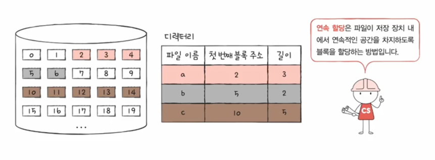
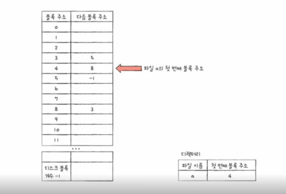
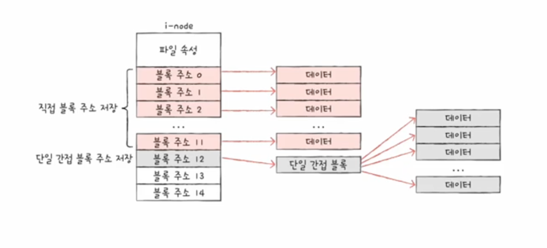

# 파일 시스템
운영체제가 파일과 디렉터리를 효율적으로 관리하기 위한 프로그램입니다.  

## 파일
파일은 데이터를 저장하는 논리적인 단위입니다. 
파일은 파일 이름, 파일 확장자, 파일 속성 등등 메타 데이터로 구성되어 있습니다.  

## 디렉터리
디렉터리는 파일을 저장하는 물리적인 단위입니다.  
일반적으로 트리 구조로 되어있습니다.  
절대 경로와 상대 경로로 파일을 찾을 수 있습니다.  

### 디렉터리 엔트리
디렉터리 엔트리는 디렉터리 안에 있는 파일이나 디렉터리의 위치와 같은 정보를 가지고 있습니다.  

## 파티셔닝
파티셔닝은 하나의 디스크를 여러 개의 논리적인 파티션으로 나누는 것입니다.  

## 포매팅 
포매팅은 파일 시스템을 설정하는 것입니다.  
파일 시스템마다 다르게 포매팅을 설정할 수 있습니다.  

## 파일 할당 방법
파일을 보조 기억 장치에 저장할 때 사용하는 방법입니다.  

### 연속 할당 방법

보조 기억 장치 내부에 파일을 연속적으로 저장하는 방법입니다.  
파일의 첫번째 주소와 블록 크기 단위만 알면 파일을 찾을 수 있습니다.  
하지만 파일을 삭제하면 빈 공간이 생기고 이는 외부 단편화를 일으킵니다.

### 연결 할당 방법
연결 할당은 파일을 여러 개의 블록에 불연속적으로 나누어 저장하는 방법입니다.  
그리고 이 블록들을 Linked List로 연결합니다.  
파일을 찾을 때 처음부터 끝까지 찾아야하기 때문에 속도가 느립니다.  
그리고 중간에 만약 블록이 손상되면 파일을 찾을 수 없습니다.  

### 색인 할당 방법
색인 할당은 연결 할당 방법과 동일하게 블록을 불연속적으로 나누어 저장합니다.  
하지만 이 블록들을 Linked List로 연결하는 것이 아니라 색인 블록을 만들어서 연결합니다.  
색인 블록은 파일 블록들의 주소를 모두 가지고 있습니다.  

## FAT

FAT는 파일 할당 테이블로 파일 시스템의 일종입니다.  
일반적으로 USB에 사용되는 파일 시스템입니다.  
파일의 다음 블록 주소들을 가지고 있으며 연결 할당 파일의 단점을 보완하기 위해 만들어졌습니다.  

## 유닉스 파일 시스템
유닉스 파일 시스템은 리눅스나 맥 OS에서 사용되는 파일 시스템입니다.  
유닉스 파일 시스템은 inode 방식을 사용합니다.  
inode는 파일의 파일 속성 정보와 블록 주소 같은 메타 데이터를 가지고 있습니다.  

이 블록 주소들은 11개까지 직접적으로 가지고 있습니다.  
하지만 12번째 블록부터는 단일 간접 블록과 같은 방식으로 데이터의 주소값을 가지고 있는 블록을 가지고 있습니다.  
이럼에도 부족하다면 이중 간접 블록, 삼중 간접 블록을 사용하여 데이터를 저장합니다.  

- 이중 간접 블록 : 단일 간접 블록의 주소값을 가지고 있는 블록

- 삼중 간접 블록 : 이중 간접 블록의 주소값을 가지고 있는 블록

