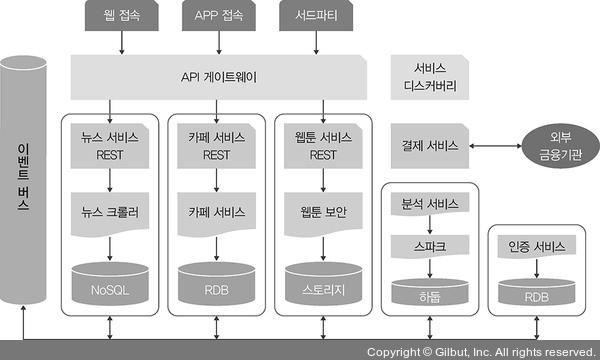

# 컨테이너 인프라 환경
컨테이너 인프라 환경이란 컨테이너를 중심으로 구성된 인프라 환경입니다.
 
컨테이너는 하나의 운영 체제 커널에서 다른 프로세스에 영향을 받지 않고 독립적으로 실해되는 프로세스 상태를 의미하며, 가상화 상태에서 동작하는 프로세스보다 가볍고 빠르게 동작하는 것이 특징입니다.
 
 
 
## 1. 아키텍처
우선 컨테이너 인프라 환경의 장점을 이해하기 위해 인프라를 이용해 개발하는 서비스의 설계에 대한 이해가 필요합니다.
 
 
### 1-1. 모놀리식 아키텍처 (Monolithic Architecture)
모놀리식 아키텍처는 하나의 큰 목적이 있는 서비스 또는 애플리케이션에 여러 기능이 통합돼 있는 구조를 의미합니다.  

소프트웨어가 하나의 결합된 코드로 구성되기 때문에 초기 단계에서 설계하기 용이하며, 개발이 좀 더 단순하고 코드 관리가 간편합니다.
 
 
단, 서비스를 운영하는 과정에서 구정이 많을 경우, 연관된 다른 서비스에 영향을 미칠 가능성이 커지게 됩니다.  
또한 기능이 추가될수록 처음에는 단순했던 서비스 간의 관계가 매우 복잡해질 수 있습니다.
 
 
### 1-2. 마이크로서비스 아키텍처 (Microservices Architecture)
모놀리식 아키텍처와 같이 시스템 전체가 하나의 목적을 지향하며, 개별 기능을 하는 작은 서비스를 각각 개발해 연결하는 것이 특징입니다.  

개발된 서비스를 재사용하기 쉽고, 서비스가 변경되어도 다른 서비스에 여향을 미칠 가능성이 줄어들며 사용량의 변화에 따라 특정 서비스만 확장할 수 있습니다.
 
 
단, 모놀리식 아키텍처보다 복잡도가 높으며 각 서비스가 서로 유기적으로 통신하는 구조로 설계되기 때문에 네트워크를 통한 호출 횟수가 증가해 성능에 영향을 줄 수 있습니다.
 
 
우리가 공부하게 될 컨테이너 인프라 환경은 특히 마이크로서비스 아키텍처로 구현하기에 적합합니다.  
컨테이너 인프라 환경에서는 컨테이너를 서비스 단위로 포장해 손쉽게 배포하고 확장할 수 있습니다.  
또한 컨테이너는 마이크로서비스 아키텍처의 서비스와 1:1로 완벽하게 대응하며, 이후 소개할 도구들을 이용하면 도입, 설계, 운용 비용이 감소하고 생산성이 향상됩니다.
 
 
 
## 2. 컨테이너 인프라 환경을 지원하는 도구
컨테이너 인프라 환경은 크게 컨테이너, 컨테이너 관리, 개발 환경 구성 및 배포 자동화, 모니터링으로 구성됩니다.
 
 
이를 지원하는 대표적인 도구들은 다음과 같습니다.
 
 
### 2-1. 도커 (Docker)
도커는 컨테이너 환경에서 독립적으로 애플리케이션을 실행할 수 있도록 컨테이너를 만들고 관리하는 것을 도와주는 컨테이너 도구입니다.
 
 
도커로 애플리케이션을 실행하면 운영 체제 환경에 관계없이 독립적인 환경에서 일관된 결과를 보장합니다.
 
 
### 2-2. 쿠버네티스 (Kubernetes)
쿠버네티스는 다수의 컨테이너(도커 등)를 관리하는 데 사용합니다.  
컨테이너의 자동 배포와 배포된 컨테이너에 대한 동작 보증, 부하에 따른 동적 확장 등의 기능을 제공합니다.
 
 
또한 컨테이너 인프라를 기반으로 API 게이트웨이, 서비스 디스커버리, 이벤트 버스, 이증 및 결제 등의 다양한 서비스를 효율적으로 관리할 수 있는 환경을 제공하고 이를 내외부와 유연하게 연결해 줍니다.
 
 
### 2-3. 젠킨스 (Jenkins)
젠킨스는 지속적 통합(CI; Continuous Integration)과 지속적 배포(CD; Continuous Depolyment)를 지원합니다.
 
 
지속적 통합과 지속적 배포는 개발한 프로그램의 빌드, 테스트, 패키지화, 배포 단계를 모두 자동화해 개발 단계를 표준화합니다.
 
 
### 2-4. 프로메테우스와 그라파나 (Prometheus and Grafana)
프로메테우스와 그라파나는 모니터링을 위한 도구입니다.
 
 
프로메테우스는 상태 데이터를 수집하고, 그라파나는 프로메테우스로 수집한 데이터를 관리자가 보기 좋게 시각화합니다.  
이는 컨테이너로 패키징 되어 동작하며, 최소한의 자원으로 쿠버네티스 클러슽처의 상태를 시각적으로 표현합니다.

컨테이너 인프라 환경에서는 많은 종류의 소규모 기능이 각각 나누어 개발되기 때문에 중앙 모니터링이 필요하며, 프로메테우스와 그라파나의 조합이 효율적인 모니터링 방법입니다.
 

출처 : https://thebook.io/080241/
