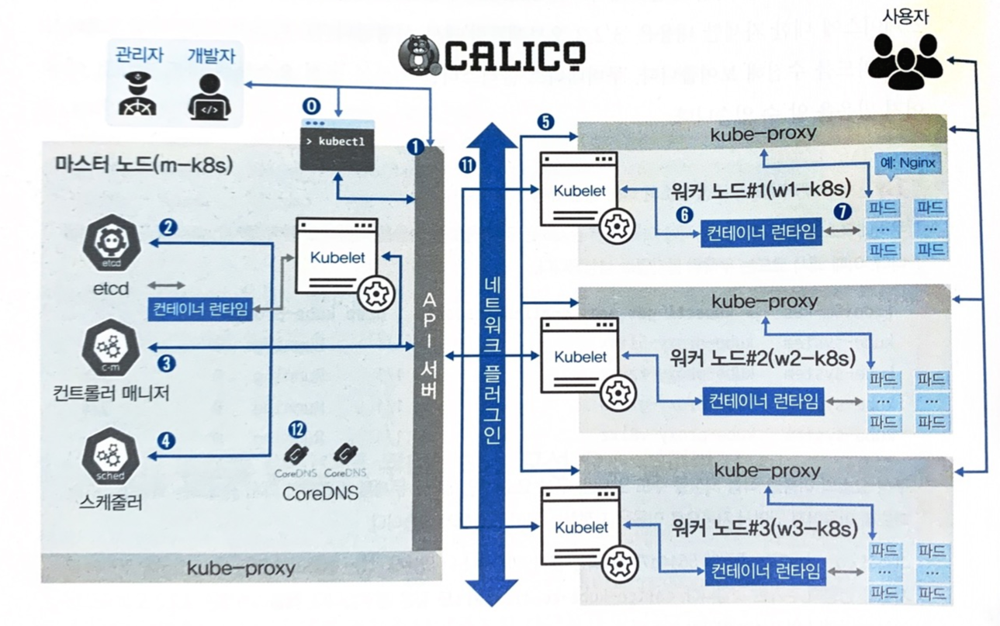

## 쿠버네티스 이해하기

쿠버네티스는 컨테이너 오케스트레이션 도구입니다.  
컨테이너를 클러스터로 관리하고 배포, 확장, 로드밸런싱, 스케일링, 모니터링 등을 자동화합니다.

### 왜 쿠버네티스일까?
쿠버네티스 외에도 도커 스웤, 메소스, 노매드와 같은 컨테이너 오케스트레이션 도구들이 존재합니다.  
그럼에도 쿠버네티스를 사용하는 이유는 쿠버를 쉽게 사용할 수 있게 도와주는 도구들이 지속적으로 개발되고 있기 때문입니다.  
또 컨테이너 오케스트레이션을 넘어 IT 인프라 전반을 관리할 수 있는 도구로 발전하고 있습니다.  

### 쿠버네티스 구성 방법
쿠버네티스를 구성하는 방법은 EKS, AKS, GKS 처럼 클라우드 서비스를 이용하는 방법과 kubeadm과 같이 자동으로 쿠버를 구성해주는 솔루션을 이용하는 방법이 있습니다.  

### 쿠버네티스 구성하기
우리 스터디는 이미 모든 것이 구성 되어 있는 클라우드 서비스는 이용하지 않을것이며 kubeadm으로 직접 쿠버를 구성할겁니다.  

### 파드 배포를 중심으로 쿠버네티스 구성요소 살펴보기
쿠버네티스는 다양한 구성요소로 이루어져 있습니다.  
kubectl, kubelet, kube-proxy, kube-api-server, kube-controller-manager, kube-scheduler, etcd, pod 등등이 있습니다.  

위 그림을 보면 관리자와 개발자에 파드를 생성하는 요청이 어떻게 흘러가는지 알 수 있습니다.  

#### kubectl
kubectl은 쿠버네티스 클러스터와 통신하기 위한 커맨드 라인 도구입니다.  
cli기 때문에 클러스터에 명령을 내리는 역할을 합니다.  
다른 구성 요소들과 다르게 바이너리 형태로 바로 실행되기 때문에 마스터 노드에 있을 필요가 없습니다.  
일반적으로는 kubectl은 api 서버와 주로 통신합니다.  

#### kube-api-server
api 서버는 쿠버네티스 클러스터의 중심이 되는 구성 요소입니다.  
주로 쿠버네티스의 상태 값을 저장하는 etcd와 통신하며 클러스터의 상태를 변경하기 때문에 역할이 매우 중요합니다.  

#### etcd
etcd는 쿠버네티스 클러스터의 상태를 저장하는 key value store 입니다.  
상태 요청에 대한 모든 정보를 저장하고 있기 때문에 etcd가 죽으면 클러스터가 죽게 됩니다.  
그렇기 때문에 etcd는 클러스터에서 가장 중요한 구성 요소이며 분산 저장을 지원합니다.  

#### kube-controller-manager
kube-controller-manager는 클러스터의 `object`를 관리하는 구성 요소입니다.  
`object`는 pod, service, replicaset controller 등이 있습니다.  
`object`에 통신이 되지 않는 경우 상태 체크와 복구는 kube-controller-manager가 담당합니다.  
이후 챕터 다룰 내용이지만 replicaset controller는 pod의 개수를 유지하도록 생성, 관리합니다.  

#### kube-scheduler
kube-scheduler는 새로운 파드가 생성될 때 어떤 노드에 생성 할 것인지 선택하는 역할을 합니다.  

### worker node

#### kubelet
kubelet은 위에서 생성된 파드의 구성 내용을 받아서 container runtime에 전달하고 모니터링 합니다.  

#### container runtime
container runtime은 파드를 이루는 컨테이너의 실행을 담당합니다.  
파드는 내부에 다양한 종류의 컨테이너가 문제 없이 돌아갈 수 있게 만드는 표준 인터페이스입니다.  

#### pod
파드는 쿠버네티스에서 가장 작은 배포 단위입니다.  
파드는 하나 이상의 컨테이너로 구성되어 있지만 일반적으로 하나의 컨테이너로 구성하는 것을 권장합니다.  
파드는 언제든 죽을 수 있는 존재로 디자인 되었습니다.  

#### network plugin
쿠버네티스 클러스터의 통신을 위해서는 네트워크 플러그인이 필요합니다.  
일반적으로 CNI로 불리는 컨테이너 네트워킹 인터페이스를 사용합니다.  
이 책에서는 캘리코를 사용할 예정입니다.  

#### CoreDNS
CoreDNS는 쿠버네티스 클러스터 내부에서 DNS 서버 역할을 합니다.  
ip 주소보다는 도메인 이름으로 편리하게 통신하기 위해서 사용합니다.  

#### kube-proxy
쿠버네티스 클러스터는 파드가 위치한 노드에 접속하기 위해서 kube-proxy를 사용하여 네트워크를 설정합니다.  
kube-proxy는 일반적으로 br_netfilter와 iptables를 사용하여 네트워크를 설정합니다.  

### 파드의 생명주기로 쿠버네티스 구성 요소 살펴보기

위 그림을 보면 파드의 생명주기를 알 수 있습니다.

1. 사용자가 kubectl을 통해 api-server에 파드를 생성 요청을 합니다.  
2. api-server는 etcd에 파드 생성 요청을 저장합니다.
3. kube-controller-manager는 etcd에 저장된 파드 생성 요청을 확인하고 파드를 생성합니다.
4. kube-scheduler는 파드가 생성될 노드를 선택합니다.
5. kubelet은 파드를 생성하고 container runtime에 전달합니다.
6. container runtime은 파드를 생성하고 kubelet에게 알립니다.
7. 파드가 사용 가능한 상태가 되고 kubelet은 파드의 상태를 모니터링하고 api-server에 전달합니다.

작업이 순차적으로 흘러가지 않고 한 개의 작업이 끝나면 현재 상태를 확인하고 다음 작업을 진행하는 것을 확인 할 수 있습니다.
이렇기에 쿠버네티스 클러스터가 더욱 안정적으로 동작할 수 있습니다.  