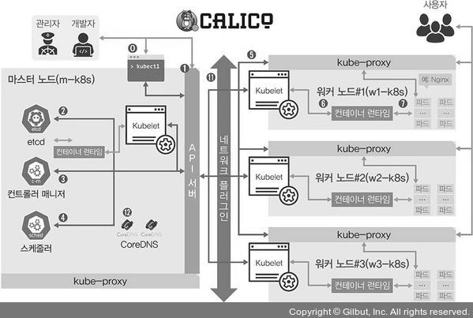
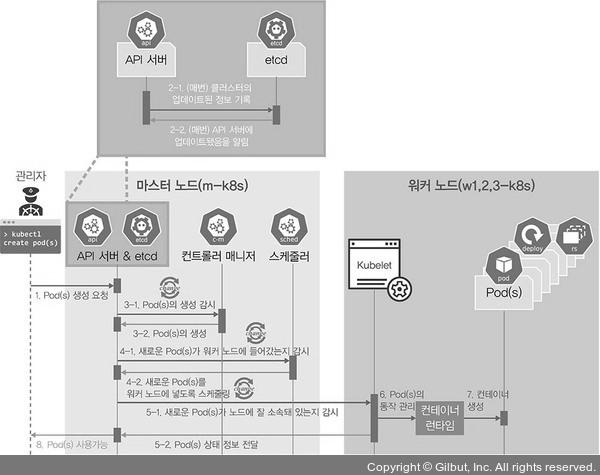
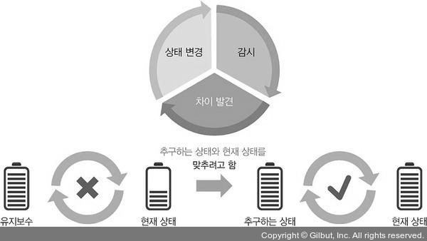

### 왜 쿠버네티스일까?

쿠버네티스는 컨테이너 오케스트레이션을 위한 솔루션입니다. 오케스트레이션이란 복잡한 단계를 관리하고 요소들의 유기적인 관계를 미리 정의해 손쉽게 사용하도록 서비스를 제공하는 것을 의미합니다. 다른 오케스트레이션 솔루션에 비해 시작에는 어려움이 있지만, 쉽게 사용할 수 있도록 도와주는 도구들이 있어 설치가 쉬워지는 추세입니다. 거의 모든 벤더와 오픈 소스 진영에서 쿠버네티스를 지원하고 그에 맞게 통합 개발하고 있습니다. 다양한 세부 설정을 지원하며 안정적이고 확장성이 있으며, 쿠버네티스에 대한 정보가 많이 존재합니다.

### 쿠버네티스 구성 방법

### 관리형 쿠버네티스를 사용합니다

퍼블릭 클라우드 업체에서 제공하는 관리형 쿠버네티스인 EKS, AKS, GKE 등을 사용합니다. 구성이 이미 다 갖춰져 있고 마스터 노드를 클라우드 업체에서 관리합니다.

### 플랫폼에서 제공하는 설치형 쿠버네티스를 사용합니다

수세의 Rancher, 레드햇의 OpenShift와 같은 플랫폼에서 제공하는 설치형 쿠버네티스를 사용합니다. 유료라 쉽게 접근하기 어렵습니다.

### 사용하는 시스템에 쿠버네티스 클러스터를 자동으로 구성해주는 솔루션을 사용합니다

주요 솔루션으로는 kubeadm, kops, KRIB, kubespray가 있습니다. kubeadm이 가장 널리 알려져 있으며 사용자가 변경하기 수월하고, 온프레미스와 클라우드를 모두 지원하며 배우기도 쉽습니다.

### 쿠버네티스 구성하기

- 실습 시간에 진행

## 파드 배포 중심의 쿠버네티스 구성 요소

### 관리자나 개발자가 파드를 배포할 때

### 마스터 노드

### kubectl

쿠버네티스 클러스터에 명령을 내리는 역할을 합니다. 다른 구성 요소와 다르게 바로 실행되는 바이너리로 배포됩니다. 마스터 노드에 있을 필요는 없으나 통상적으로 API 서버와 주로 통신하므로 마스터 노드에 구성될 수 있습니다.

### API 서버

쿠버네티스 클러스터의 중심 역할을 하는 통로입니다. 주로 상태 값을 저장하는 etcd와 통신하지만, 그 밖의 요소들 또한 API 서버를 중심에 두고 통신하므로 API 서버의 역할이 매우 중요합니다.

### etcd

구성 요소들의 값이 모두 저장되는 곳입니다. etcd 외 다른 구성 요소는 상태 값을 관리하지 않습니다. etcd만 백업돼 있다면 긴급한 장애 상황에서도 쿠버네티스 클러스터를 복구할 수 있습니다. etcd는 분산 저장이 가능한 key-value 저장소이므로, 복제해 여러 곳에 저장해 두어 장애 시 시스템 가용성을 확보할 수 있습니다.

### 컨트롤러 매니저

쿠버네티스 클러스터의 오브젝트 상태를 관리합니다.

예시:

- 워커 노드에서 통신이 되지 않는 경우, 상태 체크와 복구는 컨트롤러 매니저에 속한 노드 컨트롤러에서 이루어집니다.
- 레플리카셋 컨트롤러는 레플리카셋에 요청받은 파드 개수대로 파드를 생성합니다.
- 서비스와 파드를 연결하는 역할을 하는 엔드포인트 컨트롤러 또한 컨트롤러 매니저입니다.

### 스케줄러

노드의 상태와 자원, 레이블, 요구 조건 등을 고려해 파드를 어떤 워커 노드에 생성할 것인지를 결정하고 할당합니다. 파드를 조건에 맞는 워커 노드에 지정하고, 파드가 워커 노드에 할당되는 일정을 관리하는 역할을 합니다.

### 워커 노드

### kubelet

파드의 구성 내용(PodSpec)을 받아서 컨테이너 런타임으로 전달하고, 파드 안의 컨테이너들이 정상적으로 구동하는지 모니터링합니다.

### 컨테이너 런타임(CRI, Container Runtime Interface)

파드를 이루는 컨테이너의 실행을 담당합니다. 파드 안에서 다양한 종류의 컨테이너가 문제 없이 작동하게 만드는 표준 인터페이스입니다.

### 파드(Pod)

한 개 이상의 컨테이너로 단일 목적의 일을 하기 위해서 모인 단위입니다. 파드는 언제라도 죽을 수 있는 존재입니다.

### 선택 가능한 구성 요소

### 네트워크 플러그인

쿠버네티스 클러스터의 통신을 위해서 네트워크 플러그인을 선택하고 구성해야 합니다. 일반적으로 CNI로 구성하는데, 주로 사용하는 CNI는 캘리코(Calico), 플래널(Flannel), 실리움(Cilium), 큐브라우터(kube-router), 로마나(Romana), 위브넷(WeaveNet), 캔널(Canal)이 있습니다.

### CoreDNS

클라우드 네이티브 컴퓨팅 재단에서 보증하는 프로젝트로, 빠르고 유연한 DNS 서버입니다. 쿠버네티스 클러스터에서 도메인 이름을 이용해 통신하는 데 사용합니다. 사용자가 배포된 파드에 접속할 때

### kube-proxy

쿠버네티스 클러스터는 파드가 위치한 노드에 kube-proxy를 통해 파드가 통신할 수 있는 네트워크를 설정합니다. 실제 통신은 br_netfilter와 iptables로 관리합니다.

### 파드

이미 배포된 파드에 접속하고 필요한 내용을 전달받습니다.

### 파드의 생명주기로 쿠버네티스 구성 요소 살펴보기

쿠버네티스의 가장 큰 장점은 각 구성 요소가 명확하게 구분돼 각자의 역할만 충실하게 수행하면 클러스터 시스템이 안정적으로 운영된다는 점입니다.

1. kubectl을 통해 API 서버에 파드 생성을 요청합니다.
2. API 서버에 전달된 내용이 있으면 API 서버는 etcd에 전달된 내용을 모두 기록해 클러스터의 상태 값을 최신으로 유지합니다. 따라서 각 요소가 상태를 업데이트할 때마다 모두 API 서버를 통해 etcd에 기록됩니다.
3. API 서버에 파드 생성이 요청된 것을 컨트롤러 매니저가 인지하면 컨트롤러 매니저는 파드를 생성하고, 이 상태를 API 서버에 전달합니다. 참고로 아직 어떤 워커 노드에 파드를 적용할지는 결정되지 않은 상태로 파드만 생성됩니다.
4. API 서버에 파드가 생성됐다는 정보를 스케줄러가 인지합니다. 스케줄러는 생성된 파드를 어떤 워커 노드에 적용할지 조건을 고려해 결정하고 해당 워커 노드에 파드를 띄우도록 요청합니다.
5. API 서버에 전달된 정보대로 지정한 워커 노드에 파드가 속해 있는지 스케줄러가 kubelet으로 확인합니다.
6. kubelet에서 컨테이너 런타임으로 파드 생성을 요청합니다.
7. 파드가 생성됩니다.
8. 파드가 사용 가능한 상태가 됩니다.

### 중요!!

쿠버네티스는 워크플로 구조가 아닌 선언적 시스템 구조를 가지고 있습니다. 각 요소는 원하는 상태(desired status)를 선언하고 현재 상태(current status)와 비교해 이를 맞추려 합니다. API 서버는 이 정보를 받아 etcd에 저장하고, 다른 요소들이 이 정보를 이용해 상태를 업데이트합니다.

- **선언적 시스템 구조**: 원하는 상태를 선언하면, 시스템이 이를 맞추도록 동작합니다.
- **API 서버와 etcd**: 현재 상태 값을 저장하고 관리합니다.
- **마스터 노드와 워커 노드**: 마스터 노드는 선언적 구조로 클러스터를 관리하고, 워커 노드는 절차적 명령을 수행합니다.

이런 구조 덕분에 쿠버네티스는 유연하고 안정적으로 클러스터를 운영할 수 있습니다.

### 확인

쿠버네티스는 작업을 순서대로 진행하는 워크플로(workflow, 작업 절차) 구조가 아니라 선언적인(declarative) 시스템 구조를 가지고 있습니다. 즉, 각 요소가 추구하는 상태(desired status)를 선언하면 현재 상태(current status)와 맞는지 점검하고 그것에 맞추려고 노력하는 구조로 돼 있다는 뜻입니다.

따라서 추구하는 상태를 API 서버에 선언하면 다른 요소들이 API 서버에 와서 현재 상태와 비교하고 그에 맞게 상태를 변경하려고 합니다. 여기서 API는 현재 상태 값을 가지고 있는데, 이것을 보존해야 해서 etcd가 필요합니다. API 서버와 etcd는 거의 한몸처럼 움직이도록 설계됐습니다. 다만, 여기서 워커 노드는 워크플로 구조에 따라 설계됐습니다. 쿠버네티스가 kubelet과 컨테이너 런타임을 통해 파드를 새로 생성하고 제거해야 하는 구조여서 선언적인 방식으로 구조화하기에는 어려움이 있기 때문입니다. 또한 명령이 절차적으로 전달되는 방식은 시스템의 성능을 높이는 데 효율적입니다. 하지만 마스터 노드는 이미 생성된 파드들을 유기적으로 연결하므로 쿠버네티스 클러스터를 안정적으로 유지하려면 선언적인 시스템이 더 낫습니다.
