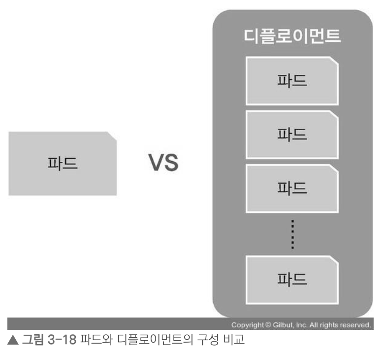
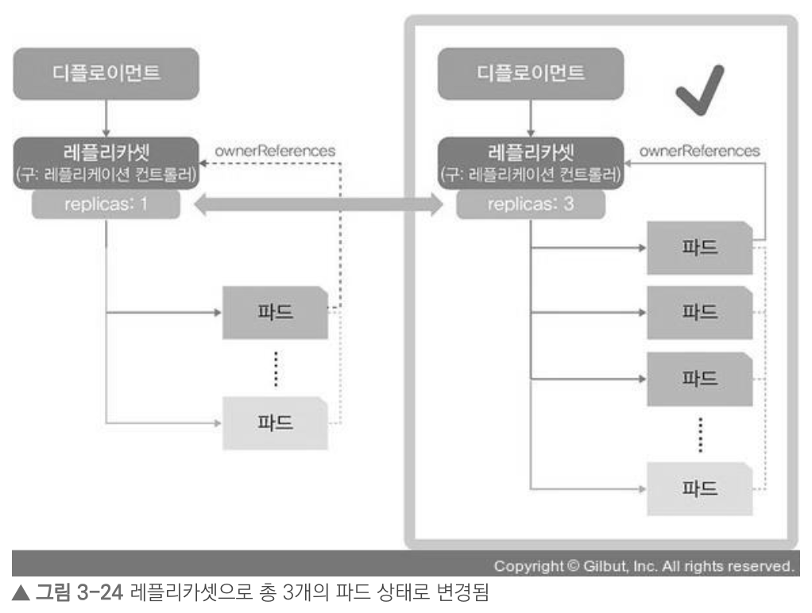
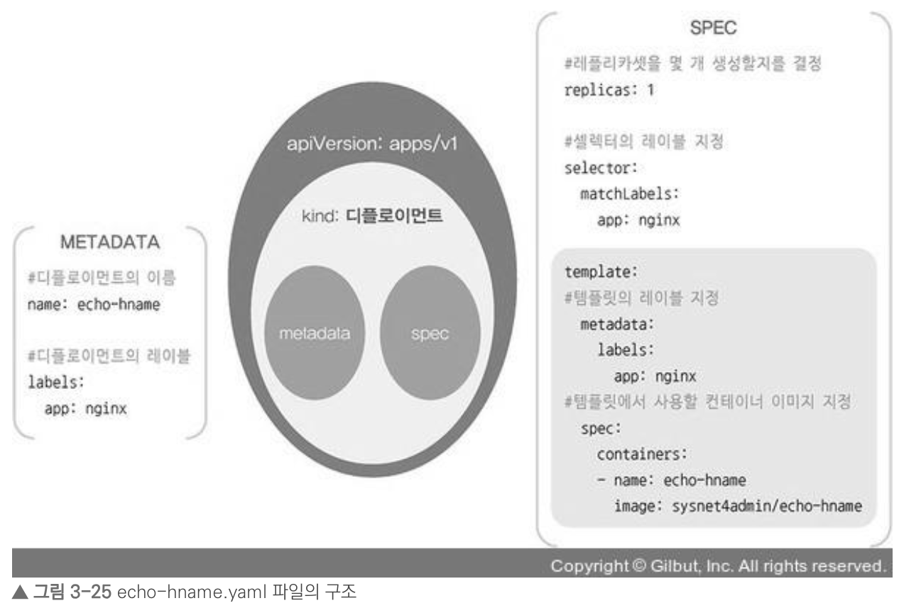

# 쿠버네티스 기본 사용법 배우기

## 1. 파드를 생성하는 방법

### 1) 파드 생성

```zsh
kubectl run [파드 이름] --image=[이미지 이름]
ex) kubectl run nginx-pod --image=nginx # nginx 파드 생성
  
kubectl create deployment [디플로이먼트 이름] --image=[이미지 이름]
ex) kubectl create deployment nginx-pod --image=nginx # nginx 파드 생성
```

**> run과 create 차이**

- create으로 생성하면 파드 이름 뒤에 무작위 값이 붙어 생성됨 ex) nginx-pod-7cd4d79cc9-xmv28
- run으로 생성 시, 단일 파드 1개가 생성되고 관리됨. 간단한 테스트 목적으로 사용되는 방법
- create으로 생성 시, 디플로이먼트(deployment)라는 관리 그룹 내에서 파드가 생성됨. 권장되는 방법

   

ref) https://thebook.io/080241/0123/

### 2) 생성된 파드 확인

```zsh
kubectl get pod
kubectl get pods # 둘다 가능

kubectl get pods -o wide # 생성된 파드의 IP를 확인
```

<br/>

## 2. 오브젝트란

- 쿠버네티스 관점에서 파드와 디플로이먼트는 스펙(spec)과 상태(state) 등의 값을 가짐
- 이러한 값을 포함해 파드와 디플로이먼트를 부르는 단위를 오브젝트(object)라고 함

### 1) 기본 오브젝트

- 파드(pod)
    - 쿠버네티스에서 실행되는 최소 단위, 즉 웹 서비스를 구동하는 데 필요한 최소 단위
    - 독립적인 공간과 사용 가능한 IP를 가짐
    - 하나의 파드는 1개 이상의 컨테이너를 가짐(범용적으로는 하나의 파드에 하나의 컨테이너를 적용)
- 네임스페이스(namespace)
    - 쿠버네티스 클러스에서 사용되는 리소스들을 구분해 관리하는 그룹
    - 기본으로 할당되는 **default**
    - 쿠버네티스 시스템에서 사용되는 **kube-system**
    - 온프레미스에서 쿠버네티스를 사용할 경우, 외부에서 쿠버네티스 클러스터 내부로 접속하게 도와주는 컨테이너들이 속해 있는 **metallb-system**
- 볼륨(volume)
    - 파드 생성 시, 파드에서 사용할 수 있는 디렉토리 제공
    - 파드는 영속된 개념이 아니기에 제공되는 디렉토리도 임시로 사용함
    - 파드가 사라지더라도, 보존이 가능한 디렉토리를 생성할 수도 있음
- 서비스(service)
    - 쿠버네티스 외부에서 내부로 접속할 때, 내부의 상황에 신경쓰지 않아도 논리적으로 연결하도록 해줌
    - 기존 인프라의 로드밸런서, 게이트웨이와 비슷한 역할

   

ref) https://thebook.io/080241/0126/

### 2) 디플로이먼트

- 쿠버네티스에서 가장 많이 쓰이는 오브젝트로, 파드에 기반을 두고 있음
- 레플리카셋 오브젝트를 합쳐 놓은 형태
- 쿠버네티스에서 애플리케이션의 배포, 관리, 업데이트 등을 자동화해주는 필수적인 리소스

```zsh
kubectl create deplyment [디플로이먼트 이름] --image=[이미지 이름] # 디플로이먼트 생성
kubectl delete deplyment [디플로이먼트 이름] # 디플로이먼트 삭제
```

<br/>

## 3. 레플리카셋으로 파드 수 관리하기

- 레플리카셋 오브젝트는 다수의 파드를 효율적으로 생성
- 레플리카셋은 파드 수를 보장하는 기능만 제공하므로, 롤링 업데이트 기능 등이 추가된 디플로이먼트를 사용해 파드 수를 관리하기를 권장
- 롤링 업데이트: 쿠버네티스에서 디플로이먼트 업데이트 시, 애플리케이션의 가용성을 유지하면서 점진적으로 새로운 버전의 파드를 배포하는 방법

```zsh
kubectl scale deployment [디플로이먼트 이름] --replicas=[원하는 파드 수] # 레플리카셋으로 파드 수 관리

kubectl get pods # 원하는 파드 수만큼 맞춰져있는지 확인
```

   

ref) https://thebook.io/080241/0131/

<br/>

## 4. 스펙을 지정해 오브젝트 생성하기

- 오브젝트 스펙을 통해 디플로이먼트 생성 시, 여러 개의 파드를 만들 수 있음
- 오브젝트 스펙은 yaml 문법으로 작성

   

ref) https://thebook.io/080241/0139/

```zsh
kubectl create -f [yaml 파일명].yaml # 오브젝트 스펙 yaml 파일을 통해 디플로이먼트 생성

sed -i 's/replicas: 3/replicas: 6/' [yaml 파일명].yaml # 파드 수를 3개에서 6개로 변경
cat [수정된 yaml 파일명].yaml | grep replicas # yaml 파일의 변경된 replicas 값 확인
kubectl create -f [yaml 파일명].yaml # 변경된 yaml 파일로 디플로이먼트 재생성
```

<br/>

## 5. apply로 오브젝트 생성하고 관리하기

```zsh
kubectl apply -f [yaml 파일명].yaml # yaml의 변경사항을 바로 적용하여 디플로이먼트 생성
```

**일회적 사용을 위해 오브젝트를 생성할 때는 create를, 변경이 생길 가능성이 있다면 처음부터 apply 명령어를 통해 오브젝트를 생성하는 것이 좋음**

<br/>

|   구분   |  Run  | Create |  Apply   |
|:------:|:-----:|:------:|:--------:|
| 명령 실행  | 제한적임  |  가능함   |   안 됨    |
| 파일 실행  |  안 됨  |  가능함   |   가능함    |
| 변경 가능  |  안 됨  |  안 됨   |   가능함    |
| 실행 편의성 | 매우 좋음 | 매우 좋음  |    좋음    |
| 기능 유지  | 제한적임  |  지원됨   | 다양하게 지원됨 |

여기서 apply 명령어가 명령 실행이 안된다는 것은 일반적인 명령어 실행과는 다르다는 것을 뜻함   
일반적인 명령어 실행은 즉각적으로 작업을 수행하고 결과를 반환하지만, apply 명령어는 yaml 파일에 정의된 상태를 쿠버네티스 클러스터에 적용하여 클러스터가 원하는 상태를 유지  
즉, apply 명령어는 즉각적으로 결과를 반환하지 않을 수 있다는 점에서 명령 실행이 안된다고 표현한 것