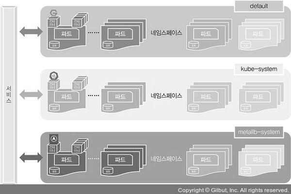
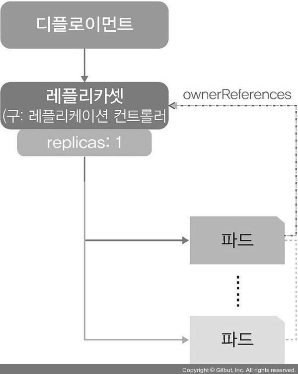
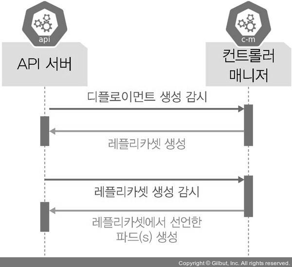
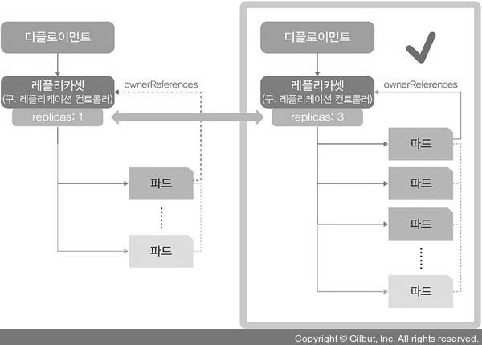
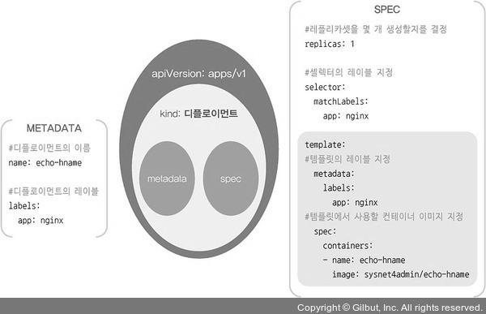
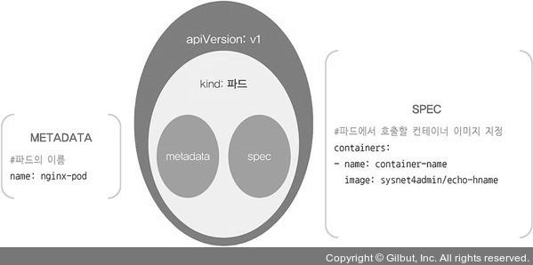

# 쿠버네티스 기본 사용법
</br>

## 1. 파드를 생성하는 방법
파드를 생성하는 명령어에는 run과 create deployment가 있습니다.
</br>
</br>
run으로 파드를 생성하면 단일 파드 1개만 생성되고 관리되며, create deployment로 파드를 생성하면 디플로이먼트라는 관리 그룹 내에서 파드가 생성됩니다.  
쉽게 말해, run으로 생성한 파드는 초코파이 1개이고, create deployment로 생성한 파드는 초코파이 상자에 들어 있는 초코파이 1개인 것입니다.
</br>
</br>

### 1-1. run
#### kubectl run nginx-pod --image=nginx 명령으로 파드를 생성합니다.  
nginx : 파드의 이름  
--image=nginx : 생성할 이미지의 이름
</br>
</br>
이후 kubectl get pod 명령으로 파드가 잘 생성되었는지 확인할 수 있습니다.
</br>
</br>

### 1-2. create deployment
#### kubectl create deployment nginx --image=nginx 명령으로 파드를 생성합니다.
</br>
이후 kubectl get pod 명령으로 파드가 잘 생성되었는지 확인할 수 있습니다.
</br>
</br>
</br>

## 2. 오브젝트
파드와 디플로이먼트는 스펙과 상태 등의 값을 가지고 있으며, 개별 속성을 포함해 부르는 단위를 오브젝트라 합니다.
</br>
</br>

### 2-1. 기본 오브젝트



* #### 파드 (Pod)
  - 쿠버네티스에서 실행되는 최소 단위입니다. 즉, 웹 서비스를 구동하는 데 필요한 최소 단위입니다.
  - 독립적인 공간과 사용 가능한 IP를 가지고 있습니다.
  - 하나의 파드는 1개 이상의 컨테이너를 갖고 있기에, 여러 기능을 묶어 하나의 목적으로 사용할 수 있습니다.
  - 단, 범용으로 사용할 때는 대부분 1개의 파드에 1개의 컨테이너를 적용합니다.
* #### 네임스페이스 (Namespaces)
  - 쿠버네티스 클러스터에서 사용되는 리소스들을 구분해 관리하는 그룹입니다.
  - 기본으로 할당되는 default, 쿠버네티스 시스템에서 사용되는 kube-system, 온프레미스에서 쿠버네티스를 사용할 경우 외부에서 쿠버네티스 클러스터 내부로 접속하게 도와주는 컨테이너들이 속해 있는 metallb-system 등이 있습니다.
* #### 볼륨 (Volume)
  - 파드가 생성될 때 파드에서 사용할 수 있는 디렉터리를 제공합니다.
  - 파드가 사라지더라도 저장과 보존이 가능한 디렉터리를 볼륨 오브젝트를 통해 생성하고 사용할 수 있습니다.
* #### 서비스 (Service)
  - 파드는 클러스터 내에서 유동적이기 때문에 접속 정보가 고정일 수 없으므로, 파드 접속을 안정적으로 유지하도록 서비스를 통해 내/외부로 연결됩니다.
  - 새로 파드가 생성될 때 부여되는 새로운 IP를 기존에 제공하던 기능과 연결해 줍니다.
  - 즉, 쿠버네티스 외부에서 쿠버네티스 내부로 접속할 때 내부가 어떤 구조로 돼 있는지, 파드가 살았는지 죽었는지 신경 쓰지 않아도 이를 논리적으로 연결하는 것입니다. (로드밸런서, 게이트웨이와 비슷한 역할)
</br>

### 2-2. 디플로이먼트
기본 오브젝트만으로도 쿠버네티스를 사용할 수 있으나 좀 더 효율적으로 작동하도록 기능들을 조합하고 추가해 구현한 것이 디플로이먼트입니다.
</br>
</br>
쿠버네티스에서 가장 많이 쓰이는 디플로이먼트 오브젝트는 파드에 기반을 두고 있으며, 레플리카셋 오브젝트를 합쳐 놓은 형태입니다.
</br>
</br>
앞서 생성한 nginx의 디플로이먼트 계층 구조는 아래와 같습니다.



</br>
실제로 API 서버와 컨트롤러 매니저는 단순히 파드가 생성되는 것을 감시하는 것이 아니라 디플로이먼트처럼 레플리카셋을 포함하는 오브젝트의 생성을 감시합니다.



</br>
</br>

## 3. 디플로이먼트 생성, 삭제
#### 3-1. kubectl create deployment dpy-hname --image=sysnet4admin/echo-hname 명령으로 디플로이먼트를 생성합니다.
sysnet4admin : 계정 이름  
echo-hname : 이미지 이름

#### 3-2. kubectl get pods 명령으로 생성된 디플로이먼트를 확인합니다.

#### 3-3. kubectl delete deployment dpy-hname 명령으로 생성된 디플로이먼트를 삭제합니다.

#### 3-4. kubectl get pods 명령으로 디플로이먼트가 삭제되었는지 확인합니다.
</br>
</br>

## 4. 레플리카셋으로 파드 수 관리하기
많은 사용자를 대상으로 웹 서비스를 하려면 다수의 파드가 필요한데, 쿠버네티스에서는 다수의 파드를 만드는 레플리카셋 오브젝트를 제공합니다.
</br>
</br>
파드를 3개 만들겠다고 레플리카셋에 선언하면 컨트롤러 매니저와 스케줄러가 워커 노드에 파드 3개를 만들도록 선언합니다.  
단, 레플리카셋은 파드 수를 보장하는 기능만 제공하므로, 롤링 업데이트 기능 등이 추가된 디플로이먼트를 사용해 파드 수를 관리하기를 권장합니다.
</br>
</br>

### 4-1. 레플리카셋으로 파드 수를 관리하는 과정



위의 그림과 같이 레플리카셋은 파드의 개수를 지정한 대로 3개로 맞춰주는 역할을 합니다.
</br>
</br>

#### 4-1-1. kubectl get pods 명령으로 배포된 파드 상태를 확인합니다.

#### 4-1-2. kubectl scale pod nginx-pod --replicas=3 명령으로 nginx-pod를 3개로 증가시킵니다.
--replicas=3 : 파드의 수를 3개로 맞추는 옵션  
이때 nginx-pod는 파드로 생성되었기 때문에 디플로이먼트 오브젝트에 속하지 않으므로, 리소스를 확인할 수 없다는 에러가 발생합니다.

#### 4-1-3. kubectl scale deployment dpy-nginx --replicas=3 명령으로 디플로이먼트로 생성된 dpy-nginx의 파드를 3개로 증가시킵니다.

#### 4-1-4. kubectl get pods 명령으로 추가된 2개의 nginx 파드를 확인합니다.

#### 4-1-5. kubectl get pods -o wide 명령으로 dpy-nginx의 모든 파드가 정상적으로 워커 노드에 적용되고 IP가 부여되었는지 확인합니다.

#### 4-1-6. kubectl delete deployment dpy-nginx 명령으로 다음 진행을 위해 생성한 디플로이먼트 dpy-nginx를 삭제합니다.

#### 4-1-7. kubectl get pods 명령으로 디플로이먼트의 상태를 확인합니다.
</br>
</br>

## 5. 스펙을 지정해 오브젝트 생성하기
디플로이먼트를 생성하면서 한꺼번에 여러 개의 파드를 만들려면 파일로 설정을 작성해야 합니다.  
이때 작성하는 파일을 오브젝트 스펙이라 하며, 일반적으로 ymal 문법으로 작성합니다.
</br>
</br>

### (echo-hname)
디플로이먼트의 오브젝트 스펙을 만드는 파일입니다.
```
apiVersion: apps/v1 # API 버전
kind: Deployment # 오브젝트 종류
metadata:
  name: echo-hname
  labels:
    app: nginx
spec:
  replicas: 3 # 몇 개의 파드를 생성할 지 결정
  selector:
    matchLabels:
      app: nginx
  template:
    metadata:
      labels:
        app: nginx
    spec:
      containers:
      - name: echo-hname
        image: sysnet4admin/echo-hname # 사용되는 이미지
```
</br>
</br>
파일의 구조는 아래와 같습니다.



</br>

### (nginx-pod)
앞서 생성한 파드의 스펙과 비교하기 위해 이전에 배포한 nginx-pod.yaml 파일을 살펴보면, 디플로이먼트인 echo-hname.yaml의 template 부분과 동일함을 알 수 있습니다.  
즉, template 하위의 metadata와 spec이 nginx-pod.yaml에서 동일하게 사용됩니다.
```
apiVersion: v1
kind: Pod
metadata:
  name: nginx-pod
spec:
  containers:
  - name: container-name
    image: nginx
```

파일의 구조는 아래와 같습니다.



</br>

echo-hname.yaml 파일을 이용해 디플로이먼트를 생성해 보겠습니다.
</br>
</br>

#### 5-1. kubectl create -f ~/_Book_k8sInfra/ch3/3.2.4/echo-hname.yaml 명령으로 디플로이먼트를 생성합니다.

#### 5-2. kubectl get pods 명령으로 새로 생성된 echo-hname 파드가 3개인지 확인합니다.

#### 5-3. sed -i 's/replicas: 3/replicas: 6/' ~/_Book_k8sInfra/ch3/3.2.4/echo-hname.yaml 명령으로 파일을 수정하여 파드를 6개로 늘려봅니다.
sed(streamlined editor) : 파일 replicas 값을 3에서 6으로 변경  
-i : --in-place의 약어이고, 변경한 내용을 현재 파일에 바로 적용하겠다는 의미  
s/ : 주어진 패턴을 원하는 패턴으로 변경하겠다는 의미

#### 5-4. cat ~/_Book_k8sInfra/ch3/3.2.4/echo-hname.yaml | grep replicas 명령으로 replicas 값이 6으로 변경됐는지 확인합니다.

#### 5-5. kubectl create -f ~/_Book_k8sInfra/ch3/3.2.4/echo-hname.yaml 명령으로 변경된 내용을 적용합니다.
echo-hname이 이미 존재한다는 에러 메시지가 나오면서 아무 일도 일어나지 않습니다.
</br>
</br>

## 6. apply로 오브젝트 생성하고 관리하기
run은 파드를 간단하게 생성하는 매우 편리한 방법이지만, 단일 파드만 생성할 수 있습니다.  
그렇다고 create로 디플로이먼트를 생성하면 파일의 변경 사항을 바로 적용할 수 없습니다.  
이런 경우를 위해 쿠버네티스는 apply 명령어를 제공하며, 오브젝트를 관리할 수 있습니다.
</br>
</br>

#### 6-1. kubectl apply -f ~/_Book_k8sInfra/ch3/3.2.4/echo-hname.yaml 명령으로 수정한 파일을 적용합니다.
오브젝트를 처음부터 apply로 생성한 것이 아니어서 경고가 뜨며, 작동에는 문제가 없지만 일관성에서 문제가 생길 수 있습니다. 때문에 변경 사항이 발생할 가능성이 있는 오브젝트는 처음부터 apply로 생성하는 것이 좋습니다.

#### 6-2. kubectl get pods 명령으로 echo-hname이 6개로 늘어났는지 확인합니다.
</br>
</br>

## 7. Run Create Apply 비교
|구분|Run|Create|Apply|
|----|---|------|-----|
|명령 실행|제한적임|가능함|안 됨|
|파일 실행|안 됨|가능함|가능함|
|변경 가능|안 됨|안 됨|가능함|
실행 편의성|매우 좋음|매우 좋음|좋음|
기능 유지|제한적임|지원됨|다양하게 지원됨|
</br>
</br>
</br>
</br>
</br>
</br>
</br>
</br>
</br>
</br>
</br>
출처 : https://thebook.io/080241/
