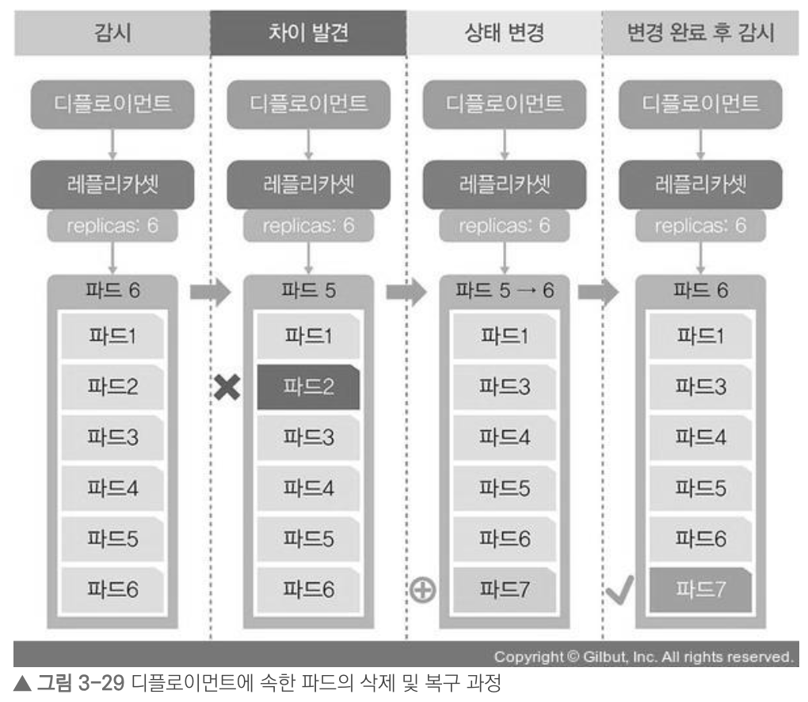
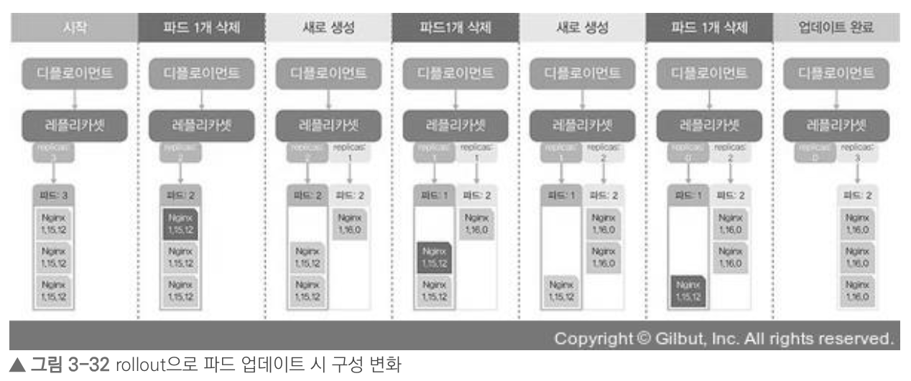
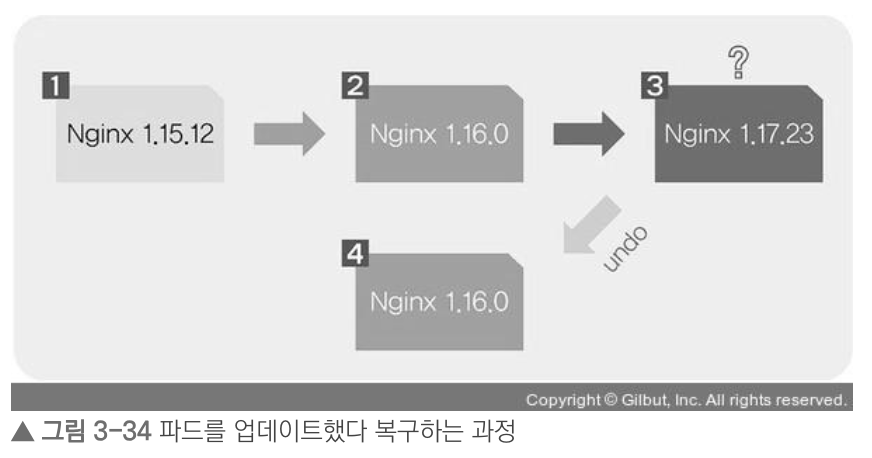

## 1. 파드의 컨테이너 자동 복구 방법
- 쿠버네티스의 거의 모든 부분이 자동 복구되도록 설계되어 있음
- 파드의 자동 복구 기술을 **셀프 힐링(Self-Healing)** 이라고 하는데, 컨테이너를 다시 시작하거나 교체해서 정상적으로 동작하게 함

## 2. 파드의 동작 보증 기능

- 파드가 항상 동작하도록 보증하려면, 디플로이먼트 내에서 생성된 파드여야 한다는 조건이 필요함
- 단일 생성한 파드를 삭제하면 다음과 같이 재생성되지 않음   
   
- 하지만, 디플로이먼트에 속하도록 생성한 파드는 삭제되어도 재생성되어 파드가 항상 동작한다는 보증 가능   
    

ref) https://thebook.io/080241/0152/

## 3. 노드 자원 보호하기
- 노드는 쿠버네티스 스케쥴러에서 파드를 할당하고 처리하는 역할
- 문제가 생길 가능성이 있는 노드를 사용해야 한다면, cordon 기능을 사용하여 관리할 수 있음
- ``cordon`` 명령어를 사용하면 노드가 **SchedulingDisabled 상태**가 됨
- SchedulingDisabled 상태는 해당 노드에 파드가 할당되지 않게 스케줄되지 않는 상태를 뜻함
- ``replicas`` 명령어를 통해 파드 수를 늘리거나 줄여도 ``cordon``이 적용된 노드의 파드 수는 똑같음
- 해제 명령어는 ``uncordon``

## 4. 노드 유지보수하기
- 유지보수를 위해 노드를 꺼야 하는 상황에서는 drain 기능을 사용할 수 있음
- drain 기능은 지정된 노드의 파드를 전부 다른 곳으로 이동시켜 해당 빈 노드를 유지보수할 수 있도록 함
- ``drain`` 명령어를 실행하면, 데몬셋(DaemonSet)을 제외한 모든 파드가 삭제되고 다른 곳에 다시 생성됨
- 데몬셋은 각 노드에 1개만 존재하는 파드이기에 ``ignore-daemonsets`` 옵션을 함께 사용해야 함
- ``drain`` 명령어가 실행된 노드는 SchedulingDisabled 상태로 변경되며, 유지보수가 마무리되면 ``uncordon`` 명령을 실행하여 스케줄을 받을 수 있는 상태로 복귀시킴

## 5. 파드 업데이트하고 복구하기
- 파드를 업데이트하고 복구하기 전에 ``record`` 옵션을 통해 파드 배포 정보의 히스토리를 기록하는 것이 중요함

### 파드 업데이트
- ``rollout history`` 명령어를 실행하여 ``record`` 옵션으로 기록된 히스토리 확인 가능
- ``set image`` 명령어로 파드의 컨테이너를 업데이트하면, 파드들은 하나씩 지워지고 생성되어짐
- 이는 시스템의 영향을 최소화하기 위한 것으로, 파드 수가 많다면 하나씩이 아닌 다수의 파드가 업데이트됨

ref) https://thebook.io/080241/0169/

### 파드 업데이트 실패 시, 복구
- 잘못된 컨테이너 버전으로 업데이트한다면, 파드는 삭제되지 않고 pending(대기중) 상태에서 멈춤
- ``rollout status`` 명령어를 실행하면 디플로이먼트를 배포하는 단계에서 waiting(대기중) 상태인 것을 확인 가능
- ``rollout undo`` 명령어를 통해 이전 단계의 상태로 되돌릴 수 있으며, 최근 상태는 새롭게 변경됨

ref) https://thebook.io/080241/0176/

### 특정 시점으로 파드 복구하기
- ``--to-revision`` 옵션으로 특정 시점으로 파드 복구 가능
- revision은 ``rollout history`` 명령어를 통해 확인