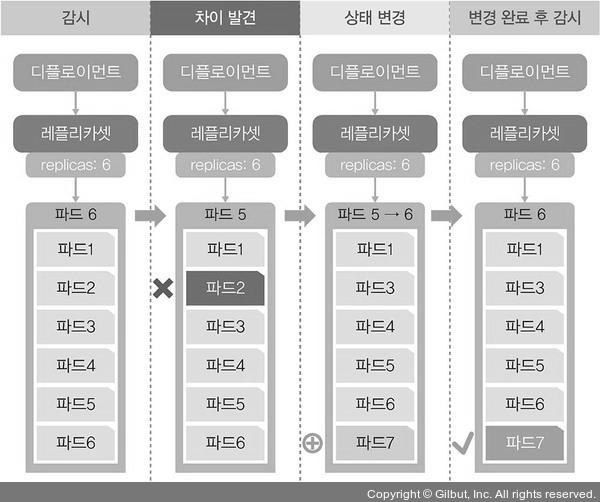
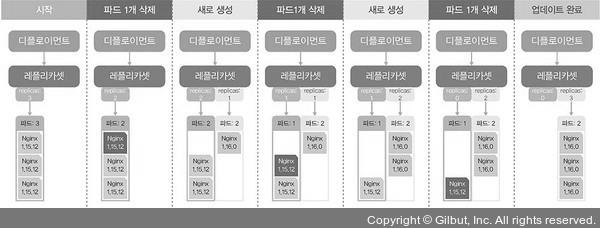
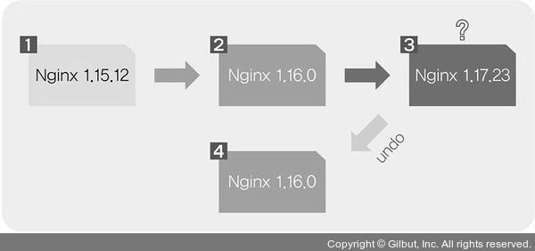

# 쿠버네티스 기본 사용법
</br>

## 8. 파드의 컨테이너 자동 복구 방법
쿠버네티스는 거의 모든 부분이 자동 복구되도록 설계되어있습니다.  
특히 파드의 자동 복구 기술을 셀프 힐링(Self-Healing)이라고 하는데, 제대로 작동하지 않는 컨테이너를 다시 시작하거나 교체해 파드가 정상적으로 작동하게 합니다.
</br>
</br>

<details>
    <summary>컨테이너 자동 복구 테스트</summary>

#### 8-1. kubectl get pods -o wide 명령으로 접속할 파드의 IP를 확인합니다.
</br>

#### 8-2. kubectl exec -it nginx-pod -- /bin/bash 명령으로 파드 컨테이너의 셸에 접속합니다.
i : stdin (standard input, 표준 입력)  
t : tty (teletypewriter)  
it : 표준 입력을 명령줄 인터페이스로 작성  
-- : exec에 대한 인자 값을 나누고 싶을 때 사용
</br>
</br>

#### 8-3. cat /run/nginx.pid 명령으로 컨테이너에서 구동하는 nginx의 PID를 확인합니다.
</br>

#### 8-4. ls -l /run/nginx.pid 명령으로 프로세스가 생성된 시간을 확인합니다.
</br>

#### 8-5. i=1; while true; do sleep 1; echo $((i++)) 'curl --silent 172.16.103.132 | grep title' ; done 명령으로 슈퍼푸티에서 m-k8s의 터미널을 1개 더 띄우고 nginx-pod의 IP에서 돌아가는 웹 페이지를 1초마다 한 번씩 요청하는 스크립트를 실행하고, curl에서 요청한 값만 받도록 --silent 옵션을 추가하고, nginx의 상태도 체크합니다.
</br>

#### 8-6. kill 1 명령으로 nginx 프로세서를 종료합니다.
</br>

#### 8-7. 추가한 터미널에서 1초마다 nginx 웹 페이지를 받아오는 스크립트가 잘 작동하며, 자동으로 다시 복구되는지도 확인할 수 있습니다.
</br>

#### 8-8. kubectl exec -it nginx-pod -- /bin/bash 명령으로 다시 nginx-pod에 접속합니다.
</br>

#### 8-9. ls -l /run/nginx.pid 명령으로 nginx-pod가 생성된 시간으로 새로 생성된 프로세스인지 확인합니다.
</br>

#### 8-10. exit 명령으로 m-k8s의 배시 셸로 빠져나옵니다.

</details>

</br>
</br>

## 9. 파드의 동작 보증 기능
쿠버네티스는 파드 자체에 문제가 발생하면 파드를 자동 복구해서 파드가 항상 동작하도록 보장하는 기능도 있습니다.
</br>
</br>

<details>
    <summary>동작 보증 기능 테스트</summary>

#### 9-1. kubectl get pods 명령으로 파드를 확인합니다.
</br>

#### 9-2. kubectl delete pods nginx-pod 명령으로 nginx-pod를 삭제합니다.
</br>

#### 9-3. 파드의 동작을 보증하려면 어떤 조건이 필요하며, 이 조건이 어떤 것인지 확인하기 위해 kubectl delete pods echo-hname-5d754d565-7bzfs 명령으로 비교할 다른 파드를 삭제합니다.
</br>

#### 9-4. kubectl get pods 명령으로 삭제가 잘 되었는지 확인합니다.
echo-hname-5d754d565-7bzfs 이 삭제되었으나 여전히 6개의 파드가 살아있는 것을 확인할 수 있으며, 이는 nginx-pod는 디플로이먼트에 속한 파드가 아니며 어떤 컨트롤러도 이 파드를 관리하지 않기 때문입니다.
</br>
</br>
replicas는 파드를 선언한 수대로 유지하도록 파드의 수를 항상 확인하고 부족하면 새로운 파드를 만들어냅니다.  
이와 같이 디플로이먼트로 생성하는 것이 파드의 동작을 보장하기 위한 조건입니다.  
이러한 파드가 삭제되고 다시 생성되는 과정은 아래와 같습니다.  



</br>
</br>

#### 9-5. 디플로이먼트에 속한 파드를 삭제하기 위해 먼저 kubectl delete deployment echo-hname 명령으로 디플로이먼트를 삭제합니다.
디플로이먼트에 속한 파드는 상위 디플로이먼트를 삭제해야 파드가 삭제되기 때문입니다.
</br>
</br>

#### 9-6. kubectl get pods 명령으로 배포된 파드가 남아 있는지 확인합니다.

</details>

</br>
</br>

## 10. 노드 자원 보호하기
노드는 쿠버네티스 스케줄러에서 파드를 할당받고 처리하는 역할을 합니다.
</br>
</br>
문제가 생긴 노드를 어쩔 수 없이 사용해야 하는 경우에는 영향도가 적은 파드를 할당해 일정 기간 사용하면서 모니터링하며 파드의 문제를 최소화해야하지만, 쿠버네티스는 모든 노드에 균등하게 파드를 할당하려고 합니다.
</br>
</br>
이런 경우를 대비하여 쿠버네티스에서는 cordon 기능을 사용합니다.  
</br>
</br>

<details>
    <summary>cordon 테스트</summary>

#### 10-1. kubectl apply -f ~/Book_k8Infra/ch3/3.2.8/echo-hname.yaml 명령으로 파드를 생성합니다.
</br>

#### 10-2. kubectl scale deployment echo-hname --replicas=9 명령으로 배포한 파드를 9개로 늘립니다.
</br>

#### 10-3. kubectl get pods -o=custom-columns=NAME:.metadata.name,IP:.status.podIP,STATUS:.status.phase,NODE:.spec.nodeName 명령으로 파드가 제대로 작동하는지, IP 할당이 잘 됐는지, 각 노드로 공평하게 배분됐는지 확인합니다.
-o : output  
custom-columns : 사용자가 임의로 구성할 수 있는 열을 의미  
NAME, IP, STATUS, NODE : 열의 제목  
.metadata.name, .status.podIP, .status.phase, .spec.nodeName : 내용 값
</br>
</br>

#### 10-4. kubectl scale deployment echo-hname --replicas=3 명령으로 파드의 수를 3개로 줄입니다.
</br>

#### 10-5. kubectl get pods -o=custom-columns=NAME:.metadata.name,IP:.status.podIP,STATUS:.status.phase,NODE:.spec.nodeName 명령으로 각 노드에 파드가 1개씩만 남았는지 확인합니다.
</br>

#### 10-6. kubectl cordon w3-k8s 명령으로 현재 상태를 보존하도록 합니다.
</br>

#### 10-7. kubectl get nodes 명령으로 cordon 명령이 제대로 적용되었는지 확인합니다.
w3-k8s가 더 이상 파드가 할당되지 않는 상태로 변경된 것을 확인할 수 있으며, SchedulingDisabled 라는 표시는 해당 노드에 파드가 할당되지 않게 스케줄되지 않는 상태를 의미합니다.
</br>
</br>

#### 10-8. kubectl get pods -o=custom-columns=NAME:.metadata.name,IP:.status.podIP,STATUS:.status.phase,NODE:.spec.nodeName 명령으로 w3-k8s에 추가로 배포된 파드가 있는지 확인합니다.
</br>

#### 10-9. kubectl scale deployment echo-hname --replicas=3 명령으로 파드 수를 3개로 줄입니다.
</br>

#### 10-10. kubectl get pods -o=custom-columns=NAME:.metadata.name,IP:.status.podIP,STATUS:.status.phase,NODE:.spec.nodeName 명령으로 각 노드에 할당된 파드 수가 공평하게 1개씩인지 확인합니다.
</br>

#### 10-11. kubectl uncordon w3-k8s 명령으로 w3-k8s에 파드가 할당되지 않게 설정했던 것을 해제합니다.
</br>

#### 10-12. kubectl get nodes 명령으로 w3-k8s에 uncordon이 적용되었는지 확인합니다.

</details>

</br>
</br>

## 11. 노드 유지보수하기
노드의 커널을 업데이트하거나 노드의 메모리를 증설하는 등의 작업이 필요해 노드를 꺼야하는 상황이 발생하는데, 이를 대비해 쿠버네티스는 drain 기능을 제공합니다.
</br>
</br>
drain은 지정된 노드의 파드를 전부 다른 곳으로 이동시켜 해당 노드를 유지보수할 수 있게 합니다.
</br>
</br>

<details>
    <summary>drain 테스트</summary>

#### 11-1. kubectl drain w3-k8s 명령으로 유지보수할 노드(w3-k8s)를 파드가 없는 상태로 만듭니다.
w3-k8s에서 데몬셋을 지울 수 없어서 명령을 수행할 수 없다는 에러가 표시되는 것을 확인할 수 있습니다.  
drain은 실제로 파드를 옮기는 것이 아니라 노드에서 파드를 삭제하고 다른 곳에서 다시 생성합니다. 그런데 DaemonSet은 각 노드에 1개만 존재하는 파드라서 drain으로는 삭제할 수 없습니다.
</br>
</br>

#### 11-2. kubectl drain w3-k8s --ignore-daemonsets 명령으로 DaemonSet을 무시하고 진행하도록 합니다.
</br>

#### 11-3. kubectl get pods -o=custom-columns=NAME:.metadata.name,IP:.status.podIP,STATUS:.status.phase,NODE:.spec.nodeName audfuddmfh w3-k8s 노드에 파드가 없는지 확인하고, 옮긴 노드에 파드가 새로 생성돼 파드 이름과 IP가 부여된 것도 확인합니다.
</br>

#### 11-4. kubectl get nodes 명령으로 drain 명령이 수행된 w3-k8s 노드의 상태를 확인합니다.
cordon을 실행했을 때처럼 SchedulingDisabled 상태인 것을 확인할 수 있습니다.
</br>
</br>

#### 11-5. kubectl uncordon w3-k8s 명령을 실행해 다시 스케줄을 받을 수 있는 상태로 복귀시킵니다.
</br>

#### 11-6. kubectl get nodes 명령으로 노드 상태를 확인합니다.
</br>

#### 11-7. kubectl delete -f ~/Book_k8sInfra/ch3/3.2.8/echo.hname.yaml 명령으로 다음 진행을 위해 배포한 echo-hname을 삭제합니다.
</br>

#### 11-8. kubectl get pods 명령으로 배포된 파드가 없음을 확인합니다.

</details>

</br>
</br>

## 12. 파드 업데이트하기
<details>
    <summary>업데이트 테스트</summary>

(rollout-nginx.yaml)
```
apiVersion: apps/v1
kind: Deployment
metadata:
    name: rollout-nginx
spec:
    # 레플리카셋 몇 개 생성할지를 결정
    replicas: 3
    # 셀렉터의 레이블 지정
    selector:
        matchLabels:
            app: nginx
    template:
        # 템플릿의 레이블 지정
        metadata:
            labels:
                app: nginx
        # 템플릿에서 사용할 컨테이너 이미지 및 버전 지정
        spec:
            containers:
            - name: nginx
            image: nginx:1.15.12
```
</br>

#### 12-1. kubectl apply -f ~/Book_k8sInfra/ch3/3.2.10/rollout-nginx.yaml --record 명령으로 컨테이너 버전 업데이트를 테스트하기 위한 파드를 배포합니다.
--record : 배포한 정보의 히스토리를 기록합니다.
</br>
</br>

#### 12-2. kubectl rollout hisstory deployment rollout-nginx 명령으로 기록된 히스토리를 확인합니다.
</br>

#### 12-3. kubectl get pods -o=custom-columns=NAME:.metadata.name,IP:.status.podIP,STATUS:.status.phase,NODE:.spec.nodeName 명령으로 배포한 파드의 정보를 확인합니다.
</br>

#### 12-4. curl -I --silent 172.16.103.143 | grep Server 명령으로 배포된 파드에 속해 있는 nginx 컨테이너 버전을 확인합니다.
-I : 헤더 정보만 출력
</br>
</br>

#### 12-5. kubectl set image deployment rollout-nginx nginx=nginx:1.16.0 --record 명령으로 파드의 nginx 컨테이너 버전을 1.16.0으로 업데이트합니다.
</br>

#### 12-6. kubectl get pods -o=custom-columns=NAME:.metadata.name,IP:.status.podIP,STATUS:.status.phase,NODE:.spec.nodeName 명령으로 파드의 상태를 확인합니다.
파드들의 이름과 IP가 변경된 것을 확인할 수 있습니다.
</br>
</br>
rollout으로 파드 업데이트 시 구성 변화는 아래와 같습니다.



</br>
</br>

#### 12-7. kubectl rollout status deployment rollout-nignx 명령으로 디플로이먼트의 상태를 확인합니다.
</br>

#### 12-8. kubectl rollout history deployment rollout-nginx 명령으로 rollout-nginx에 적용된 명령들을 확인합니다.
</br>

#### 12-9. curl -I --silent 172.16.132.10 | grep Server 명령으로 업데이트가 잘 되었는지 확인합니다.

</details>

</br>
</br>

## 13. 업데이트 실패 시 파드 복구하기
파드를 업데이트했다 복구하는 과정은 아래와 같습니다.



</br>
</br>

<details>
    <summary>복구 테스트</summary>

#### 13-1. kubectl set image deployment rollout-nginx nginx=nginx:1.17.23 --record 명령으로 nginx 컨테이너 버전을 의도(1.17.2)와 다르게 입력합니다.
</br>

#### 13-2. kubectl get pods -o=custom-columns=NAME:.metadata.name,IP:.status.podIP,STATUS:.status.phase,NODE:.spec.nodeName 명령으로 확인해보면 파드가 삭제되지 않고 대기 중 상태에서 넘어가지 않는 것을 확인할 수 있습니다.
</br>

#### 13-3. kubectl rollout status deployment rollout-ngnix 명령으로 새로운 replicas는 생성했으나 디플로이먼트를 배포하는 단계에서 대기 중으로 더 이상 진행되지 않은 것을 확인할 수 있습니다.
</br>

#### 13-4. kubectl describe deployment rollout-nginx 명령으로 쿠버네티스의 상태를 자세히 살펴보면 replicas가 새로 생성되는 과정에서 멈춰 있는 것을 확인할 수 있습니다.
이처럼 실제로 배포할 때 실수를 방지하고자 업데이트할 때 rollout을 사용하고 --record로 기록하는 것입니다.
</br>
</br>

#### 13-5. 정상적인 상태로 복구하기 위해 kubectl rollout history deployment rollout-nginx 명령으로 기록을 확인합니다.
</br>

#### 13-6. kubectl rollout undo deployment rollout-nginx 명령으로 마지막 단계에서 전 단계로 실행을 되돌립니다.
</br>

#### 13-7. kubectl get pods -o=custom-columns=NAME:.metadata.name,IP:.status.podIP,STATUS:.status.phase,NODE:.spec.nodeName 명령으로 파드 상태를 확인합니다.
</br>

#### 13-8. kubectl rollout history deployment rollout-nginx 명령으로 revision 4가 추가되고 revision 2가 삭제된 것을 확인할 수 있습니다.
</br>

#### 13-9. curl -I --silent 172.16.132.10 | grep Server 명령으로 nginx의 버전이 1.16.0이 맞는지 확인합니다.
</br>

#### 13-10. kubectl rollout status deployment rollout-nginx 명령으로 변경이 정상적으로 적용되었는지 확인합니다.
</br>

#### 13-11. kubectl describe deployment rollout-nginx 명령으로 현재 디플로이먼트 상태도 확인해봅니다.

</details>

</br>
</br>

## 14. 특정 시점으로 파드 복구하기
<details>
    <summary>특정 시점 복구 테스트</summary>

#### 14-1. 특정 시점으로 복구해보기 위해 kubectl rollout undo deployment rollout-nginx --to-revision=1 명령으로 처음 상태인 revision 1으로 돌아갑니다.
</br>

#### 14-2. kubectl get pods -o=custom-columns=NAME:.metadata.name,IP:.status.podIP,STATUS:.status.phase,NODE:.spec.nodeName 명령으로 새로 생성된 파드들의 IP를 확인합니다.
</br>

#### 14-3. curl -I --silent 172.16.103.150 | grep Server 명령으로 nginx 컨테이너의 버전을 확인합니다.
</br>

#### 14-4. kubectl delete -f ~/_Book_k8sInfra/ch3/3.2.10/rollout-nginx.yaml 명령으로 다음 단계 진행을 위해 배포한 rollout-ngnix 디플로이먼트를 삭제합니다.
</br>

#### 14-5. kubectl get pods 명령으로 배포된 파드가 없는지 확인합니다.

</details>

</br>
